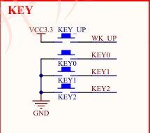
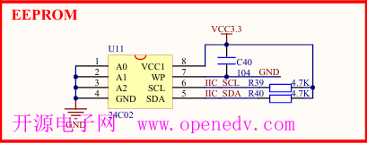
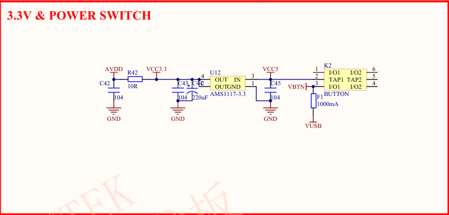
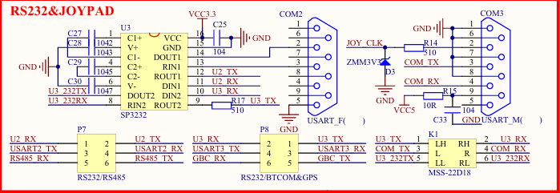

# EmbedLab · 嵌入式系统学习平台

> 基于 **HarmonyOS NEXT 原生 ArkUI / ArkTS** 构建的嵌入式系统体系化学习平台 —— 纯本地离线可用。

[](#技术栈)
[](#技术栈)
[-182431)](#技术栈)
[](#许可证)

---

## 一、项目定位

EmbedLab 的目标**不是**做一个普通的笔记应用，而是构建一条完整的嵌入式学习闭环：

```
知识体系  →  学习路径  →  实践项目  →  能力训练
```

第一阶段（V1）**不接入云端后端、不集成大模型**：全部知识内容以只读 JSON 资产随包发布，
用户收藏与阅读足迹经系统轻量持久化保存在本机，App 全程离线可用。

---

## 二、技术栈

| 项 | 取值 | 来源 |
| :--- | :--- | :--- |
| 运行平台 | **HarmonyOS NEXT**（`runtimeOS: HarmonyOS`） | `build-profile.json5` |
| 兼容 SDK | **6.1.1(24)** | `build-profile.json5` → `compatibleSdkVersion` |
| 目标 SDK | **26.0.0** | `build-profile.json5` → `targetSdkVersion` |
| 开发语言 | **ArkTS**（严格静态类型，全工程零 `any`） | — |
| UI 框架 | **ArkUI 声明式范式**（`@Component` / `@Builder` / 状态管理 V1） | — |
| 构建工具 | DevEco Studio 工具链（`hvigor` + `ohpm`） | — |
| 路由 | 单根 `Navigation` + `NavPathStack` + `NavDestination` | `pages/MainPage.ets` |
| 持久化 | `@ohos.data.preferences`（轻量 KV） | `datasources/PreferenceDataSource.ets` |

---

## 三、架构说明

### 3.1 四层单向数据流（严格分层 + 静态依赖注入）

```
UI Layer（Pages & Components）
      ↓          ↓ 仅通过 Provider 静态工厂获取依赖，严禁层内 new
ViewModel Layer（UI 状态流转 + 用户意图处理）
      ↓
Repository Layer（数据策略中枢：只读资产调度 + 内存只读缓存）
      ↓
DataSource Layer（底层 I/O：RawFile 读取解码校验 / Preferences 存取）
```

### 3.2 五条核心架构原则

1. **数据资产与应用状态绝对分离**
   内容资产（`resources/rawfile/database/`，只读、随包发布）与用户状态
   （Preferences，可写、30 条 FIFO 历史）严格隔离；反序列化必须字段校验，
   严禁 `as` 类型断言强转。
2. **严格单向分层与静态 DI**
   `RepositoryProvider` / `DataSourceProvider` 为唯一依赖获取入口，
   确保未来数据源可无缝替换（如迁移至 SQLite）且便于单元测试。
3. **按需分级加载与受控内存缓存**
   索引（`index.json`）与正文（`details/{id}.json`）分级存储；
   正文仅在打开时按需加载，Repository 持有进程内只读缓存（`detailCache`）。
4. **MVP 绝对优先**
   评判标准：「没有该模块，核心学习闭环（找知识 → 读知识）能否跑通？」
5. **严格类型收窄与标准化错误码**
   底层 I/O 统一返回 `Result<T>` 可辨识联合类型 + 强类型 `ErrorCode`；
   ViewModel 依固定 `ErrorCode → UIStatus` 映射表流转状态。

### 3.3 关键工程约束

- **单一根路由栈**：`NavPathStack` 由 `MainPage` 以**普通私有成员**持有
  （严禁状态装饰器），子页面经 `queryNavigationInfo()?.pathStack` 取栈；
  严禁子组件内 `new NavPathStack()` 或在 `TabContent` 内嵌套 `Navigation`。
- **视觉常量集中化**：颜色 / 尺寸 / 文案统一取自
  `constants/AppColors` · `AppDimens` · `AppStrings`，禁止散落魔法值。
- **跨 Tab 响应式刷新**：`AppStorage` 版本号 + `@StorageLink` + `@Watch` 状态驱动
  （TabContent 切换不触发 `onPageShow`）。
- **统一日志门面**：全工程经 `utils/logger/Logger` 输出（底层 `@ohos.hilog`），
  废弃 `console.log`，Release 模式自动收敛 DEBUG 级别。

---

## 四、目录结构

```text
EmbedLab/
├── AppScope/                     # 应用级配置（bundleName / versionName / 图标）
├── entry/                        # 主 HAP 模块
│   └── src/
│       ├── main/
│       │   ├── ets/
│       │   │   ├── constants/    # AppColors / AppDimens / AppStrings / RouteConstants ...
│       │   │   ├── models/       # 纯类型契约（common / knowledge / user / project）
│       │   │   ├── datasources/  # 底层 I/O（RawFile 资产 / Preferences）
│       │   │   ├── repositories/ # KnowledgeRepository / UserRepository
│       │   │   ├── stores/       # UserStore（内存态响应式单例）
│       │   │   ├── viewmodels/   # 页面级状态管理
│       │   │   ├── components/   # 全局通用组件（RootTabContainer 等）
│       │   │   ├── pages/        # MainPage + learn / home / profile 页面模块
│       │   │   └── utils/        # providers（静态 DI 工厂）/ logger / format
│       │   └── resources/
│       │       └── rawfile/database/   # 只读内容资产（index + details + 图示）
│       ├── test/                 # 本地单元测试
│       └── ohosTest/             # 仪器化测试
├── docs/                         # 工程文档、章节源文与数据流水线
├── build-profile.json5           # 产品 / SDK / 构建模式配置
├── hvigorfile.ts                 # 构建脚本入口
└── oh-package.json5              # 依赖声明
```

### 4.1 页面拓扑（单根路由栈）

```text
MainPage（根骨架，创建唯一 NavPathStack）
└── Navigation（全屏单一根容器，mode = Stack）
    └── RootTabContainer（底部 3 个一级 Tab）
        ├── 首页  HomePage        → 学习概览：最近阅读 / 收藏概览 / 快捷入口
        ├── 学习  LearnPage       → 分类筛选 + 知识卡片列表
        └── 我的  ProfilePage     → 学习概览卡 + 二级入口列表
                                    ├── 我的收藏   FavoritesPage
                                    ├── 阅读历史   HistoryPage
                                    ├── 设置       SettingsPage
                                    └── 关于       AboutPage
    └── NavDestination 承载的二级页
        └── KnowledgeDetailPage   → 教材式正文（分段富文本 + 极客代码块 + 图片全屏预览/缩放）
```

---

## 五、构建方式

### 5.1 前置条件

- 安装 **DevEco Studio**（含 HarmonyOS SDK；工程 `compatibleSdkVersion = 6.1.1(24)`）
- 配置 SDK 路径与签名（`local.properties` 由 DevEco Studio 自动生成）

### 5.2 方式一：DevEco Studio GUI

打开工程 → `Build` → `Build Hap(s)/APP(s)` → `Build Hap(s)`；
产物位于 `entry/build/default/outputs/default/`。

### 5.3 方式二：命令行（devecocli）

```powershell
# 指向本机 DevEco Studio 安装目录（路径按实际调整）
$env:DEVECO_CLI_STUDIO_PATH="E:\app\DevEco Studio"

# 静态检查（Code Linter）
devecocli check lint

# 构建 HAP
devecocli build

# 部署到已连接设备并抓取运行日志
devecocli run
devecocli log --level I
```

> 也可直接使用 DevEco 自带 hvigor 包装器：
> `hvigorw assembleHap --mode module -p product=default -p buildMode=debug`

---

## 六、内容与数据规模

| 项 | 规模 |
| :--- | ---: |
| 知识章节 | **34 章**（覆盖导论 / 数字电路 / MCU / CPU与启动 / C 语言 / GPIO / 中断 / 定时器PWM / UART / I²C / SPI / ADC / DMA / 看门狗 / Flash / RTOS / 并发 / 网络 / MQTT / 嵌入式Linux / Bootloader / 构建链接 / 调试 / 低功耗 / 驱动 / 架构 / 传感器 / 机器人 / TinyML / 工程方法 / 排障 / 学习路径 / 术语表） |
| 架构示意图 | **26 张**（Mermaid 渲染 PNG，随包发布） |
| 索引元数据 | `rawfile/database/knowledge/index.json`（轻量，启动期仅解析此文件） |
| 详情正文 | `rawfile/database/knowledge/details/{id}.json`（按需单篇加载） |
| 用户状态 | Preferences：收藏 / 阅读历史（30 条 FIFO）/ 完成标记 |

---

## 七、项目截图

### 7.1 原理图素材

工程内保留 4 张硬件原理图（`docs/assets/`）：

| GPIO 按键电路 | I²C 上拉电路 |
| :---: | :---: |
|  |  |

| LDO 电源电路 | UART CH340 电路 |
| :---: | :---: |
|  |  |

### 7.2 真机界面截图

<!-- TODO: 真机截图 —— 待补充
建议补充以下界面截图（放置于 docs/assets/screenshots/ 后替换下方占位）：
1. 首页 HomePage：最近阅读 / 收藏概览 / 快捷入口
2. 学习 LearnPage：分类筛选栏 + 知识卡片列表
3. 知识详情 KnowledgeDetailPage：分段正文 + 极客代码块
4. 全屏图片预览：双指缩放 / 单指平移
5. 我的 ProfilePage：学习概览卡 + 二级入口列表
6. 我的收藏 FavoritesPage / 阅读历史 HistoryPage
-->

> 截图待补充：可运行 `devecocli run` 部署至模拟器/真机后自行截取。

---

## 八、开发者文档

| 文档 | 说明 |
| :--- | :--- |
| [`EmbedLab_Project_Architecture.md`](EmbedLab_Project_Architecture.md) | 项目架构说明书（核心原则 / 分层 / 数据设计 / 里程碑验收标准） |
| [`AGENT_WORKFLOW.md`](AGENT_WORKFLOW.md) | AI Agent 协同开发 SOP（微任务步进 / 双轨验证 / 熔断机制 / 交付报告规范） |
| [`docs/BACKLOG.md`](docs/BACKLOG.md) | 技术债清单（P1/P2/P3 分级登记） |
| [`docs/嵌入式系统.md`](docs/嵌入式系统.md) | 知识内容源文（章节 Markdown） |

---

## 九、许可证

本项目采用 **Apache License 2.0** 开源。

许可证全文见仓库根目录 [`LICENSE.txt`](LICENSE.txt) 文件。

---

<p align="center"><sub>EmbedLab · 让嵌入式学习有体系、有路径、有实践</sub></p>
