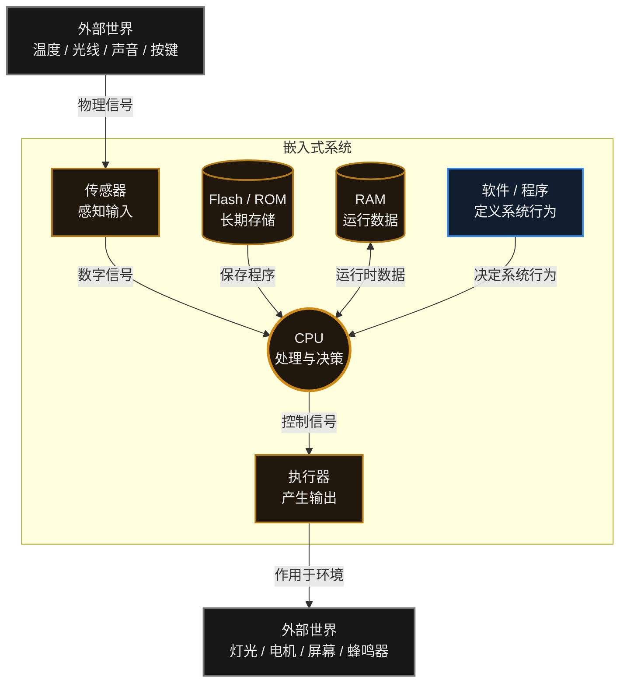

# 1. 什么是嵌入式系统

> [!info] 写在前面
> 当你听到“嵌入式”这三个字时，可能会觉得很高深。但实际上，你每天都在和几十个嵌入式系统打交道。这一章，我们先不写代码，先来弄懂我们要搞的到底是个什么东西。

## 1.1 从生活中的例子说起

我们先来看看你手边最熟悉的设备：**你的笔记本电脑或智能手机**。
它们就像是**“全能型人才”**：你可以用它打游戏、看电影、写文档、写代码。你可以随时给它安装新的软件，让它具备新的功能。这种我们称之为**“通用计算机 (General Purpose Computer)”**。

但是，生活中有更多的机器，它们不需要，也不能这么全能。
- **微波炉**：它里面也有一个微型电脑，但它一辈子只会做一件事——读取按键、控制加热管、倒计时，然后“叮”一声。你不能在微波炉上聊微信。
- **智能手表**：它一辈子只负责测心率、记步数、看时间。
- **汽车的防抱死刹车系统 (ABS)**：它里面的电脑持续计算车轮的转速，一旦发现车轮抱死就立即松开刹车。它不会、也不应该一边执行这项任务一边在后台下载电影。

**这些“隐藏在机器内部，专门为了干好某一件事而设计的微型计算机”，就是嵌入式系统。**

## 1.2 嵌入式系统的正式定义

- **正式定义**：“嵌入式系统（Embedded System）是为了完成特定应用功能而设计的专用计算机系统，通常隐藏在更大的机械或电气系统内部。”
- **一句话理解**：它是一种**围绕特定产品设计的专用计算机**——通常没有通用的鼠标、键盘和显示器，软件在出厂时基本固定（除非提供升级机制），长期只服务于该产品所定义的功能。

> [!note] 边界说明：“专用”不等于“只能运行一个程序”
> “只干一件事”是为了帮你快速建立直觉的**形象说法**，不是严格定义。
> 嵌入式系统的形态跨度很大：既有几毛钱、只承担少量固定功能的裸机小芯片（例如简单的电动牙刷控制器），也有跑着 FreeRTOS、同时管理多个任务的设备（无人机飞控），还有跑完整 Linux、TCP/IP 协议栈、图形界面甚至 AI 推理的设备（扫地机器人、车载中控）。
> 它们的共同点是**软硬件围绕特定产品/场景来设计**，而不是“程序数量只有一个”。

## 1.3 嵌入式电脑 vs 你的个人电脑 (PC)

为了让你有更直观的感受，我们来对比一下这两个世界：

| 比较维度         | 你的电脑 (PC)              | 嵌入式系统（形态差异极大，此表只列典型差异）                                      |
| :----------- | :--------------------- | :---------------------------------------------------------- |
| **人生目标**     | 通用平台（面向大量不同应用）         | 面向特定产品/场景优化                                                 |
| **内存 (RAM)** | 通常较为充裕，容量可从 GB 级到更高    | 资源约束程度差异很大，从 KB 级 MCU 到 GB 级嵌入式 Linux 平台都有                  |
| **存储 (硬盘)**  | 容量通常较大，可使用 SSD / HDD 等 | 存储介质和容量取决于系统，从片上 Flash 到外部 eMMC / UFS / SSD 等都有             |
| **稳定性要求**    | 死机了大不了重启，砸一下键盘的事       | **要求差异极大**：消费类设备死机重启即可；汽车刹车 ECU、心脏起搏器这类**安全关键系统**则不允许崩溃     |
| **实时性要求**    | 通常不强调严格的时间确定性          | 某些嵌入式系统对响应时间和截止时间有严格要求；其中超过截止时间会导致功能失效的，属于**硬实时**系统（比如安全气囊） |
| **功耗**       | 功耗通常不是首要约束             | 功耗约束程度差异很大，从纽扣电池设备到高功耗嵌入式计算平台都有；便携 / 电池供电设备通常特别关注功耗         |

> [!important] 嵌入式工程师的重要意识：关注资源约束
> 与通用 PC 相比，许多嵌入式系统在内存、存储、算力、功耗、成本或实时性等方面面临更明确的约束。
> 不同设备的约束程度差异很大：简单 MCU 可能只有几十 KB RAM，而高性能嵌入式 Linux / AI 平台则可能拥有 GB 级内存。
> 因此，嵌入式开发并不是“资源永远很少”，而是要根据具体平台合理管理和权衡资源。

## 1.4 嵌入式系统的基本构成

如果你把嵌入式系统想象成一个“人”，那么它的结构就非常清晰了：

**图中各组成部分的职责如下**（下面借用一组日常类比帮助建立直觉；类比只用于理解，不构成技术定义）：

1. **传感器 (输入设备 = 人的五官)**

    - 我们人靠眼睛看、耳朵听。单片机是个瞎子聋子，它只能靠传感器感知世界。

    - 比如：按键、温度计（感测温度）、麦克风（听声音）、摄像头（看图像）。

2. **CPU / MCU (大脑的核心)**

    - 它是整个系统的核心处理中心。它不断地问传感器：“现在多少度了？”如果温度太高，它就要做出决定。

3. **存储器 (大脑的记忆)**

    - **Flash (长期记忆)**：你辛辛苦苦敲的代码，断电后不能丢，就保存在这里。

    - **RAM (短期记忆/草稿纸)**：CPU 算数时临时用到的数据保存在这里，一断电就全清空了。

4. **代码 / 软件**

    - 一堆芯片焊在一起只是一组没有行为的电路。是你写的 C 语言代码赋予它行为，告诉 CPU：“如果温度大于 30度，就让风扇转起来。”

5. **执行器 (输出设备 = 人的手脚)**

    - 大脑做出决定后，总得有人去干活。

    - 比如：马达（转动）、LED灯（发光）、蜂鸣器（发声）、屏幕（显示画面）。

## 1.5 常见误区与工程陷阱

**误区 1：把“嵌入式系统”等同于“单片机”。**
单片机（MCU）是嵌入式系统最常见的载体之一，但并不是全部。运行 Linux 的工控板、路由器、车载中控同样属于嵌入式系统。判断标准是“是否为特定产品/场景而设计”，而不是“用了哪一类芯片”。

**误区 2：认为嵌入式系统一定低性能、低功耗。**
这是把入门级的裸机 MCU 场景当成了普遍规律。嵌入式系统的性能与功耗跨度极大：既有几毛钱、只承担少量固定功能的控制器，也有带 GPU / NPU、功耗数十瓦的边缘计算设备。“资源受限”是一个相对概念，具体约束取决于产品定位，需要查阅具体平台的规格书与 Datasheet。

> [!summary] 总结本章
> 嵌入式开发可以概括为**用代码定义系统行为**：把程序写入芯片的长期存储，让 CPU 通过传感器感知世界、通过执行器改变世界。
