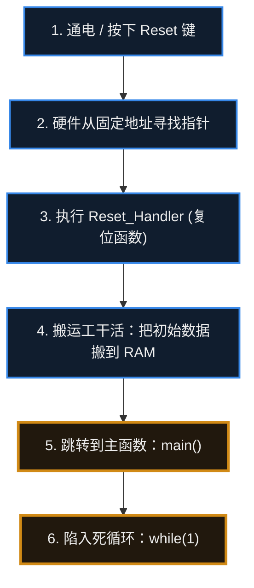

# 5. CPU、内存与启动


> [!info] 写在前面
> 在上一章我们知道了，单片机可以粗略理解为一个高度集成的小型计算机系统。里面有 CPU（大脑）、Flash（长期记忆）和 RAM（短期记忆）。
> 这一章，我们要放大这三个核心部件，看看它们在代码运行的瞬间，到底是怎么分工配合的。可以先把它们想象成**“厨房里的主厨和储物间”**，用来建立直觉。

## 5.1 CPU 到底在干嘛？

CPU 是单片机里负责“思考”和“执行”的核心部件。你可以把它想象成厨房里的**主厨**。

主厨本身不记菜谱（CPU 内部不存代码），它需要不断重复一个固定的三步动作：
1. **取指 (Fetch)**：去菜谱书（Flash）上翻看下一行的指令。
2. **译码 (Decode)**：看懂这句话是什么意思（比如：“把盐加进去”）。
3. **执行 (Execute)**：动手把盐倒进锅里（进行数学计算，或者控制引脚输出高低电平）。

只要单片机通着电，CPU 就会不知疲倦地重复这个循环，一秒钟能重复几百万次甚至上亿次。给它打拍子的，就是所谓的**时钟频率**——比如 72MHz，意思是每秒钟有 7200 万个时钟节拍。

> [!warning] 时钟频率 ≠ 指令执行速度
> **72MHz 指的是“每秒 7200 万个时钟周期”，而不是“每秒执行 7200 万条指令”。**
> 一条指令通常需要**好几个时钟周期**才能走完（这个平均值叫 **CPI**，Cycles Per Instruction）；而且现代 CPU 普遍采用**流水线 (Pipeline)**，让取指、译码、执行尽量重叠进行，实际速度还会受**访存延迟、跳转 (Branch)、Cache 是否命中**等因素影响。
> 另外，上面“取指 → 译码 → 执行”是一个**便于理解的简化模型**，真实 CPU 的执行过程要复杂得多，具体行为由架构决定。

## 5.2 Flash：非易失性存储器

**正式定义**：Flash 是基于浮栅工艺的非易失性半导体存储器，断电后数据不丢失；写入前必须先按块擦除，因此不能像 RAM 那样随意原地改写单个字节。

可以把它理解为厨房保险柜里的**菜谱书**——这是帮助建立直觉的类比，不是定义。

- **特点**：断电后数据**不会丢失**。
- **作用**：你辛辛苦苦在电脑上用 C 语言写好的代码，点击“烧录”后，就被固化到了 Flash 里。
- **里面存了啥？**
  - `.text` 段：你写的程序逻辑（指令）。
  - `.rodata` 段：只读的数据（Read-Only Data），比如代码里那些固定不变的字符串 `printf("Hello World");`，这里的 "Hello World" 就存在 Flash 里。

## 5.3 RAM：易失性存储器

**正式定义**：RAM 是随机存取存储器，读写速度快，但掉电后内容全部丢失。MCU 片内通常使用 **SRAM**，它用双稳态触发器保存每一位数据，只要供电就能保持。

可以把它理解为主厨做菜时用的**料理台**——同样是类比，不是定义。

- **特点**：读写速度很快，但只要一断电，上面的内容就会**全部丢失**。
- **作用**：主厨不能在珍贵的菜谱（Flash）上乱涂乱画，所以他需要把菜谱上提到的原料（变量）拿到料理台上（RAM）来处理。
- **里面存了啥？**
  - 全局变量（比如一个记录设备运行时间的数字，随时在变）。
  - 函数里的临时变量。

> [!note] “Flash ≈ 硬盘、RAM ≈ 内存条”只是类比
> 它们确实是“掉电不丢 vs 掉电清空”的对应关系，但工作机制并不相同：
> - **Flash ≠ 电脑硬盘**：硬盘上的程序要先**加载进内存**才能运行；而不少 MCU 是**直接从 Flash 取指令执行**的（这种方式叫 **XIP**，Execute In Place）。此外还有把代码搬到 RAM 里执行、用 Cache 缓存指令、或用 **TCM**（紧耦合内存，访问延迟确定）等方案，**具体取决于芯片架构**。
> - **SRAM ≠ 电脑内存条**：电脑内存条（DDR）容量大、相对便宜；MCU 片内 SRAM 容量小、速度快、功耗低，且与 CPU 结合得更紧密。

## 5.4 栈 (Stack) 与堆 (Heap)

这是 C 语言面试常问、新手也最容易踩坑的一组重要概念。
虽然它们都在 RAM（料理台）里，但管理方式完全不同。

### 1. 栈区 (Stack)
- **它是怎么工作的？** 就像是在桌子上叠盘子。你叫一个函数，就往上叠一个盘子（分配临时内存）；函数运行结束，就把最上面的盘子拿走（释放内存）。
- **特点**：**全自动管理**。编译器会自动帮你分配和回收，速度极快，一般不会出现管理上的混乱。
- **存什么？** 远不止局部变量。每次函数调用，栈上通常还要保存**返回地址**（函数执行完该回到哪一行）、**调用者的寄存器现场**等，局部变量只是其中一部分。比如：
  ```c
  void calculate_temp() {
      int current_temp = 25; // 这个 current_temp 就被自动分配在“栈”上
  } // 函数一结束，这个变量就自动烟消云散了
  ```
- **典型问题**：**栈溢出 (Stack Overflow)**。单片机的 RAM 本来就极小（比如只有 20KB），如果你在函数里搞了一个巨大的数组 `int data[10000]`，盘子叠得太高“咣当”一声塌了，单片机直接死机。

### 2. 堆区 (Heap)
- **它是怎么工作的？** 就像你去仓库里划一块地。你说一声“给我 10 平方米（`malloc`）”，仓库管理员就给你划一块地。你用完后，**必须手动**归还（`free`）。
- **特点**：**手动管理**。使用灵活，但风险较高。
- **典型问题**：**内存泄漏 (Memory Leak)**。如果你借了空间，用完却忘了写 `free` 还回去，单片机连着运行几天后，仓库全被你占满了，系统直接崩溃死机。
> [!warning] 在嵌入式里，动态内存要格外谨慎
> 在资源受限、强实时或需要长期运行的嵌入式系统里，**要谨慎使用动态内存分配（`malloc` / `free`）**；能用全局变量和静态数组解决时，优先不用堆。常见原因有：
> - **内存碎片**：反复申请释放后，堆里会留下许多零散小块，明明总量够，却再也凑不出一块连续的大内存。
> - **分配时间不确定**：`malloc` 的耗时不可预测，对实时性是隐患。
> - **内存泄漏**：忘了 `free`，程序跑几天后内存被慢慢吃光。
> - **double free / use-after-free**：重复释放、或使用已经释放的内存，行为不可预测，常常表现为莫名其妙的死机。
>
> 不过也要说清楚：**动态内存并不是绝对禁区**。RTOS 中就有不少合理使用它的场景（比如创建任务、队列时做一次性分配），嵌入式 Linux 本身就大量依赖动态内存管理。关键是**想清楚在这个系统里它是否可控**。

## 5.5 单片机通电的一瞬间，发生了什么？

你或许会好奇，手机或电脑开机要等半天，单片机通电为什么立刻就能干活？
它的启动过程相对简单直接，步骤并不多：



**用大白话还原这个过程：**
1. **通电 (Power On)**：电来了，CPU 苏醒。
2. **找路标**：CPU 醒来做的第一件事，是去 Flash 的最开头（通常是地址 `0x00000000` 或 `0x08000000`），那里写着一个“路标”（中断向量表）。
3. **初始化 RAM**：跳转到一个叫 `Reset_Handler` 的小程序，它会把该放到 RAM 里的初始数据（比如你写的 `int a = 10;`）从 Flash 搬运到 RAM 的料理台上。
4. **进入 main 函数**：一切准备就绪，系统大门打开，代码正式跳进你写的 `main()` 函数。
5. **死循环**：进入 `main()` 之后，裸机程序通常不返回，工程上习惯用一个 `while(1)` 循环收尾，反复读取传感器、控制输出，直到下一次断电。（RTOS 中的任务可以主动删除自己，某些架构也允许 `main()` 返回。）

## 5.6 常见误区与工程陷阱

**误区 1：Flash 等于电脑硬盘、RAM 等于内存条**
见 5.2 与 5.3 的说明：两者在“掉电不丢 / 掉电清空”这一点上对应，但工作机制不同。硬盘上的程序要先加载进内存才能运行，而许多 MCU 直接从 Flash 取指执行 (XIP)，也有把代码搬到 RAM、用 Cache 缓存指令或用 TCM 的方案。这类对应关系只是帮助理解的类比，不是定义。

**误区 2：只要容量够大就行**
Flash 与 RAM 是性质不同的资源：Flash 决定固件与只读数据的容量，RAM 决定运行时变量、栈和堆的空间。选型时需要分别评估，不能只看总量。

**误区 3：认为栈和堆互不干涉**
它们共享同一片 RAM。在常见的链接布局中，栈从内存高地址向下生长，堆从低地址向上生长，两者相向而行；如果栈用得太深或堆碎片化严重，最终会撞在一起。具体布局由链接脚本决定（见第 23 章）。

**误区 4：把所有大数组都放在栈上**
局部大数组会瞬间吃掉大量栈空间，导致栈溢出。资源受限时应改用静态分配或全局数组。

**工程提示**：栈溢出与堆溢出往往不表现为“立刻崩溃”，而是随机覆盖其他变量、偶发 HardFault。排查时应当检查链接脚本为栈分配的大小，并利用编译器提供的栈使用量分析（例如 GCC 的 `-fstack-usage`，具体选项因工具链而异）。
