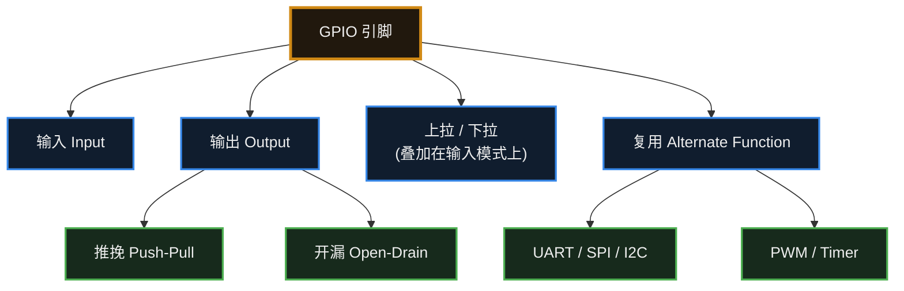

# 7. GPIO

> [!info] 写在前面
> 如果说 CPU 是单片机的大脑，那么可以粗略地把 **GPIO** 理解为单片机的**手和脚**（这是类比，不是定义）。
> 芯片四周有许多金属引脚。除固定用于接电源（VCC）和地（GND）的引脚外，其余多数引脚通常可以较灵活地配置。这一章介绍如何配置与使用这些引脚。

## 7.1 什么是 GPIO？

**GPIO** 全称是 General Purpose Input/Output（通用输入输出引脚）。

> [!note] 正式定义
> GPIO 是微控制器 / 处理器上的一类通用输入输出外设：其引脚可被配置为**输入**、**输出**、**复用功能 (Alternate Function)** 或**模拟模式**等；具体支持哪些模式、复用功能如何映射，以及电气特性如何，都以该芯片的 **Datasheet** 与 **Reference Manual** 为准。

“通用”的意思是：多数通用引脚可以由软件配置为**输入**去感知外部电平，也可以配置为**输出**去驱动外部电路。不过并非每个引脚都能随意使用，部分引脚有固定用途（见 7.5）。

点亮单片机世界的第一盏 LED 灯，读取第一个按键，全都是通过控制 GPIO 来实现的。

## 7.2 输出模式 (Output)

把一个引脚配置为“输出模式”后，软件即可控制该引脚对外的电压。最常见的输出模式有两种：**推挽输出** 和 **开漏输出**，下面分别说明。

### 1. 推挽输出 (Push-Pull)
这是最常用的一种输出模式。
- **推 (Push)**：单片机主动向外“推”出电流，引脚输出高电平（比如 3.3V）。
- **挽 (Pull)**：单片机主动把电流“拉”回来，引脚连通 GND，输出低电平（0V）。
- **特点**：不管输出高还是低，单片机都是**发力**的。它能直接点亮 LED 灯，驱动能力比较强。

### 2. 开漏输出 (Open-Drain)
这种模式容易被误用。
- 在开漏模式下，输出级**不具备主动输出高电平的能力**：它只具备下拉能力，能把引脚拉到低电平 (0V)。
- 当输出级关断（释放引脚）时，引脚呈**高阻态 (High-Z)**，此时的电平由外部电路决定，而不是被芯片强行驱动到某个电平。
- **为什么需要这种模式？** 因为在一些总线拓扑（比如后面要讲的 I2C 总线）上，多个器件共享同一条信号线。如果每个器件都能主动输出高电平，一旦设备 A 输出高、设备 B 输出低，就会形成低阻通路、电流剧增，可能损坏器件。开漏加外部上拉的结构可以避免这种冲突。
- **怎么输出高电平？** 需要在外部接一个**上拉电阻**连到 VCC（部分 MCU 也可开启内部上拉）。当单片机释放引脚时，由上拉电阻把电平拉高。

> [!tip] 工程实践：点灯该选哪种输出？
> 点亮 LED 或驱动简单的数字模块时，通常选用 **推挽输出 (Push-Pull)**：它在高低两个方向都能主动驱动，边沿更陡、驱动能力更明确。
> 开漏输出主要用于需要“线与”或多器件共享总线的场合，此时高电平依赖外部上拉电阻，上升沿速度受上拉阻值和线容影响。

## 7.3 输入模式 (Input)

把引脚配置为“输入模式”后，该引脚不再主动驱动电平，而是通过输入缓冲器读取引脚上的电平是高（1）还是低（0）。

这时，第 3 章讲过的**悬空（Floating）**问题又会出现：悬空引脚的电平可能随干扰而随机波动。为避免这种情况，输入模式通常提供三种子选项：

1. **浮空输入 (Floating)**：芯片内部不接上拉或下拉，电平由外部电路决定。除非外部模块始终给出明确的高低电平，否则通常不建议这样使用。
2. **上拉输入 (Pull-up)**：芯片**内部**接通一个连向 VCC 的上拉电阻。外部未接任何器件时，默认读到 1。常用于连接按键（按键另一端接地，按下时读到 0）。
3. **下拉输入 (Pull-down)**：芯片内部接通一个连向 GND 的下拉电阻。外部未接任何器件时，默认读到 0。

## 7.4 复用功能 (Alternate Function)

单片机上的引脚资源非常宝贵。一个几十个引脚的单片机，不可能给每一个外设都单独分配专门的引脚。
所以，**一个引脚往往身兼数职**。

比如，引脚 `PA9`：
- 在普通情况下，你可以把它当成普通 GPIO，用代码控制它输出 0 还是 1 来点灯。
- 但是，如果想用它来发送串口（UART）数据，由软件逐位控制 0 和 1 的跳变，CPU 开销会非常大。
- 这时候，你可以在代码里把它配置为 **复用功能 (Alternate Function, 简称 AF)**。
- 含义是：**该引脚的控制权被移交给内部的串口硬件模块**。此后由该模块按串口时序精确控制引脚电平的跳变，CPU 只需要读写数据寄存器，从而可以腾出时间处理其他任务。

本章内容的结构可以概括如下：

## 7.5 真实硬件的约束

前面的内容容易让人以为“随便挑个引脚就能用”。但在真实项目中，**GPIO 的使用会受到许多来自芯片设计与硬件电路的约束**，这是设计阶段容易出问题的地方。

### 1. 有些引脚天生“名花有主”

| 引脚类型 | 说明 | 还能当普通 GPIO 用吗 |
| :--- | :--- | :--- |
| **电源 / 地** | VCC、GND、VREF 等 | 不能 |
| **复位引脚 (NRST)** | 拉低会让芯片复位 | 一般不能，乱动会导致随机复位 |
| **晶振引脚 (XTAL)** | 接外部晶体 / 时钟源 | 不用外部晶振时，**部分型号**可以释放出来 |
| **调试引脚 (SWD / JTAG)** | 下载程序、在线调试 | 慎用：被复用后可能无法再连接调试器 |
| **Boot / Strapping 引脚** | 上电瞬间被芯片采样，决定**从哪里启动**（Flash / Bootloader / 下载模式） | 上电时必须保持正确电平，之后**部分**可复用 |

> [!warning] 接线前应先查阅引脚定义表
> 把调试引脚配成普通 GPIO，或者让 Boot 引脚在上电时电平不对，是导致“**板子连不上、程序烧不进去**”的常见原因。这类问题往往并非芯片损坏，而是引脚使用不当。

### 2. 电气上的硬限制

| 约束 | 说明 |
| :--- | :--- |
| **最大输出电流** | 单个引脚通常只能提供十几 mA（具体值查 Datasheet）。**想用它直接驱动电机、继电器、大功率 LED 是不现实的**，通常要经过三极管 / MOS 管 / 驱动芯片。 |
| **输入电压范围** | 引脚电压一般不应超过 VDD。不少芯片允许略高一点，但**并非所有引脚都耐 5V**。 |
| **3.3V / 5V 兼容性** | 5V 器件输出高电平接近 5V，直接接 3.3V 引脚可能损坏芯片；反过来，3.3V 输出能否被 5V 器件认成高电平，也要看对方的 VIH。**必要时加电平转换。** |
| **总电流上限** | 除了单个引脚，芯片还有**所有引脚加总**的电流限制，同样要查手册。 |

> [!important] 权威依据：Datasheet 与 Reference Manual
> 上面这些数字，**没有一条是靠背下来的**，全部以你手上那颗芯片的 **Datasheet**（数据手册，看电气参数）和 **Reference Manual**（参考手册，看寄存器与外设行为）为准。
> 养成“先查手册再接线”的习惯，能省下大量返工和烧板子的钱。

## 7.6 常见误区与工程陷阱

> [!warning] 误区 1：把 GPIO 当成“随便控制的数字引脚”
> GPIO 不是一组抽象的逻辑开关，它背后是真实的 CMOS 输出级与输入缓冲器，有电压范围、驱动能力、翻转速率等电气约束。
> 使用前至少要确认三件事：**这个引脚能否被配置成你要的功能**、**它的电平和对方是否兼容**、**它要驱动的负载有多大**。这些信息来自 Datasheet（电气参数）与 Reference Manual（寄存器与外设行为）——先查手册，再接线。

> [!warning] 误区 2：配置了 GPIO 模式，却忘了复用功能
> 想使用 UART / SPI / I2C / PWM 时，通常需要把对应引脚配置为**复用功能 (AF)**，并选择正确的 AF 编号；部分芯片还需要额外使能该外设的时钟。
> 只把引脚设成“推挽输出”并不会让它自动变成串口引脚。这类问题的典型现象是：代码看起来没错，但用逻辑分析仪 / 示波器测量时引脚上什么波形都没有。

> [!warning] 误区 3：忽略最大输出电流与电平兼容
> 单个引脚的拉电流 / 灌电流有上限（常见量级为十几 mA，具体值查 Datasheet），并且芯片还有**所有引脚合计**的电流上限。
> 驱动电机、继电器、大功率 LED 等负载时，通常要经过三极管 / MOS 管 / 专用驱动芯片，不宜由 GPIO 直接驱动。
> 电平方面：3.3V 与 5V 器件互连时，需要检查对方的高电平输入门限 (VIH) 以及自己引脚是否耐 5V，必要时加电平转换电路。

> [!danger] 误区 4：把调试引脚 / 启动引脚当普通 IO 用
> - **调试引脚 (SWD / JTAG)**：一旦被复用为普通 GPIO，可能无法再次连接调试器，出现“程序烧不进去、也连不上”的局面。部分芯片提供了保持调试端口使能的选项，但更稳妥的做法是优先避开这些引脚。
> - **Boot / Strapping 引脚**：芯片在上电复位瞬间采样这些引脚的电平来决定启动介质（Flash / Bootloader / 下载模式）。如果外部电路在上电时把它们拉到错误的电平，芯片可能进入非预期的启动模式。
> - 因此，分配引脚和接线之前，先看芯片的**引脚定义表 (Pinout)** 与 Datasheet 中的引脚说明。

> [!important] 引脚能力必须以 Datasheet 与 Reference Manual 为准
> 本章出现的所有数字都只是常见量级，用于建立直觉。实际设计时，**以你手上那颗芯片的 Datasheet（电气特性、绝对最大额定值）和 Reference Manual（GPIO 寄存器、复用功能映射表）为准**。不同厂商、甚至同厂商不同系列的引脚能力都可能不同。

> [!summary] 总结本章
> 1. **GPIO** 是通用输入输出引脚，多数通用引脚可由软件配置为输入或输出，但部分引脚有固定用途（见 7.5）。
> 2. **推挽输出**：能在高低两个方向主动驱动，适合点灯。
> 3. **开漏输出**：输出级只具备下拉能力，高电平依赖外部“上拉电阻”，适合挂接多个设备的通信总线。
> 4. **输入模式**：作为数字输入使用时，通常需要开启上拉或下拉，让引脚有确定的默认电平；应避免让高阻抗节点长期悬空（模拟输入、禁用输入缓冲等特殊场景除外，见 3.3）。
> 5. **复用功能**：把引脚的控制权移交给内部专用硬件模块（如串口、定时器）。
> 6. GPIO 还有**电气限制**（电流、电压、电平兼容性），而且复位、晶振、调试、Boot 等引脚另有用途——**具体能力以 Datasheet 和 Reference Manual 为准**。
