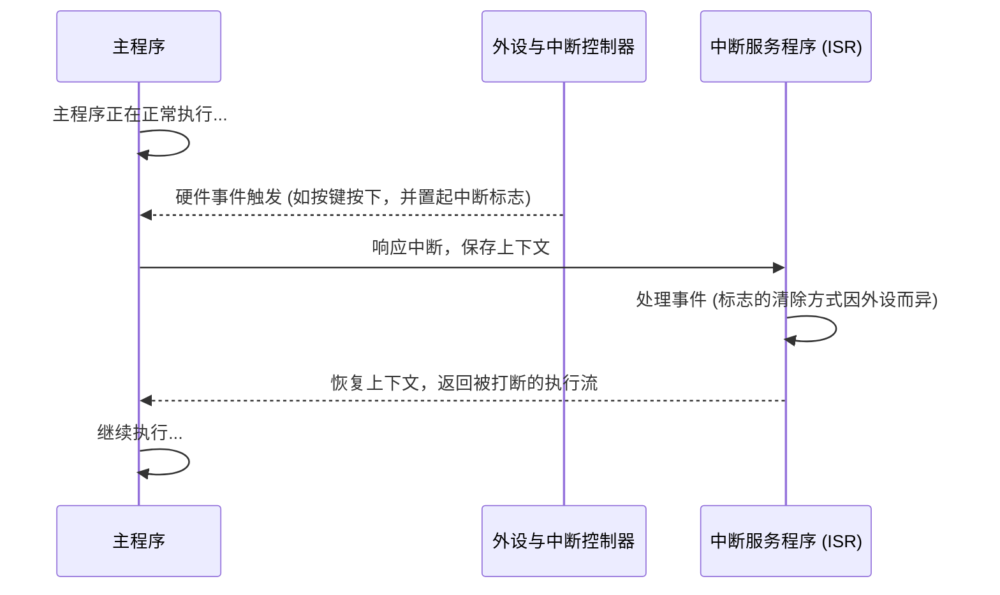

# 8. 中断


> [!info] 写在前面
> 先做一个类比：假设你正在房间里戴着耳机打游戏，这时点的外卖快到了。
> 第一种做法是每隔两秒跑到门口看一眼外卖到了没有；第二种做法是给大门装一个门铃，门铃不响就继续打游戏，门铃一响再暂停游戏去取外卖。
> 前者对应**轮询 (Polling)**，后者对应**中断 (Interrupt)**。
>
> 需要强调的是，门铃只是帮助建立直觉的类比。中断在硬件上的真实流程是：外设事件 → 置起中断标志 → 中断控制器判断是否允许响应 → CPU 响应 → 保存必要上下文 → 进入 ISR。本章将从这条链路出发介绍中断机制。

## 8.1 为什么需要中断？

### 1. 低效的机制：轮询 (Polling)
如果不用中断，我们检测按键按下的代码通常是这样写的：
```c
while(1) {
    if (读取按键 == 按下) {
        开灯();
    }
    // CPU 的时间几乎都花在反复询问“按下了没”
}
```
这种方式会持续占用 CPU 的算力。更值得注意的是，如果 CPU 刚才去做别的事情（比如刷新一块屏幕，花了 0.1 秒），而按键刚好在这 0.1 秒内被按下又松开，这次按键事件就会被**漏掉**。

### 2. 更高效的机制：中断 (Interrupt)
使用中断时，我们先配置好硬件：“当按键引脚的电平从高变成低（这叫下降沿）时，给出一个中断请求。”

之后按键事件不再需要 CPU 反复查询：外设自己检测事件，并通过中断控制器通知 CPU。这相当于给硬件装了一个门铃——**门铃只是类比**，对应到硬件上就是下面这条链路。



**需要注意：CPU 并不是在任意时刻被“打断”的。** 一次中断在硬件上大致要走这样一条链路（不同架构细节不同）：

```text
外设事件发生
  ↓ 置起中断标志
中断控制器判断（是否被屏蔽？优先级如何？）
  ↓ 向 CPU 发出中断请求
CPU 响应中断
  ↓ 保存必要的上下文
进入 ISR
  ↓ 处理事件、清除标志
返回被打断的程序
```

注意这只是**概念模型**：具体保存哪些寄存器、能不能被更高优先级打断、标志由谁清除，都由 MCU 架构和外设设计决定。

## 8.2 中断服务程序 (ISR)

**正式定义**：ISR (Interrupt Service Routine，中断服务程序) 是响应某个中断请求、由硬件跳转执行的一段专门代码。它运行在中断上下文（异常上下文）中，而不是通过普通函数调用语句进入的。

你不需要在代码的某处主动调用这个函数。只要中断条件满足且被允许响应，硬件就会把 CPU 的执行流切换到对应的 ISR。

> [!note] 类比与定义的边界
> 用“门铃响了去开门”来类比中断是可以的，但要清楚它的局限：人听到门铃可以立刻放下手里的事，CPU 则通常要等到当前指令执行结束（指令边界）才会响应，并且要先保存必要的上下文，再把执行流交给 ISR。

## 8.3 常见误区与工程陷阱

带中断的程序出现异常时，**常见原因包括**：

- 中断标志未被正确清除（下面详述）
- 中断向量配置错误，跳到了错误的处理函数
- 栈溢出（中断嵌套 + ISR 中的大局部数组）
- 在 ISR 中访问了非法地址 / 空指针
- 主程序和 ISR 共享数据时发生**数据竞争**
- 优先级配置错误，或中断嵌套层次过深
- 外设初始化不完整（时钟没使能、引脚没配对）
- 清标志的**时序**不对（清早了或清晚了）

下面挑两个最典型的展开说明。

### 陷阱 1：中断标志的清除方式
- **现象**：按键只按了一下，程序却像卡住一样，其他事情长时间得不到响应。
- **原因**：硬件触发中断时，通常会在外设的中断状态寄存器里把对应标志位置 1。如果 CPU 处理完事件、退出 ISR 时该标志仍然为 1，中断控制器就可能认为同一个事件依然有效（或被再次触发），于是 CPU 刚退出 ISR 又马上重新进入。
- **结果**：CPU 反复重入 ISR，主程序长时间得不到执行，表现为系统卡死。

> [!warning] 中断标志的清除方式取决于具体 MCU 与外设设计
> 上面讲的是“标志未被清除会反复重入”这个**道理**。至于**具体怎么清、什么时候清，并没有统一规则**，常见的机制包括：
> - **写 1 清除**：向标志位写 1 才清除（很多 Cortex-M 外设采用这种方式）
> - **写 0 清除**：向标志位写 0 才清除
> - **先读状态寄存器**，再做相应操作才能清除
> - **读数据寄存器时自动清除**（例如 UART 读出接收数据后）
> - 由**硬件自动清除**，软件不需要干预
> - **独立的 pending bit**：中断标志与使能位分离，需要分别处理
>
> 所以不要背“ISR 第一件事必须清标志”这类口诀，而应在使用某个外设时查阅该芯片的 **Reference Manual**：这个外设的标志位叫什么、怎么清、应该在处理事件之前清还是之后清。

### 陷阱 2：在 ISR 中执行耗时操作
- **现象**：系统响应变慢，其他外设的反应明显迟钝，甚至出现事件丢失。
- **原因**：ISR 占用 CPU 的时间越长，中断延迟越大。同级或更低优先级的中断只能排队等待，系统的响应时间会变得不确定（jitter 增大）。用门铃类比（注意这只是类比）：取外卖时在门口长时间闲聊，别的事情就都被耽误了。
- **结果**：通常不应在 ISR 中调用 `delay` 这类阻塞函数，也应避免在 ISR 中直接 `printf` 打印大量字符。
> [!tip] ISR 的原则
> **ISR 应尽可能短、确定、非阻塞**（也可以通俗地理解为“快进快出”）。常见做法是：在 ISR 中只把数据读出来存进缓冲区，或者把一个全局变量 `flag` 置 1；随后尽快退出 ISR，由主程序在 `while(1)` 中检查 `flag` 并完成后续处理。
>
> 需要说明的是，这并不是一条绝对禁令：**是否允许某个操作取决于具体平台与执行环境**。例如在某些 RTOS 中，ISR 可以调用专门的中断安全 API（发送信号量、写消息队列等）；部分平台也提供了可重入的日志实现。判断的依据是：该操作是否会阻塞、是否可重入、是否会与中断上下文产生锁竞争，以及是否会显著拉长中断延迟。

**为什么在 ISR 中使用 `delay` 和 `printf` 通常会带来问题？** 原因值得说清楚：

| 操作 | 会带来什么问题 |
| :--- | :--- |
| **在 ISR 中 `delay()` 长时间等待** | 中断被拖长 → 其他中断只能排队（**中断延迟**变大）→ 系统响应时间变得不确定（**jitter** 增大）。有些 `delay` 还依赖系统 tick 中断，在 ISR 中使用可能导致卡死。 |
| **在 ISR 中 `printf` 打印一大串** | 串口发送本身较慢；`printf` 底层可能**阻塞等待**、可能**加锁**、也可能**不是 ISR-safe 的实现**（不可重入）。在 ISR 中调用时，轻则拖慢系统，重则死锁或输出错乱。 |

所以原则是：**ISR 应该尽可能短、确定、非阻塞。** 需要打印调试信息时，先在 ISR 中把数据存进缓冲区，回到主程序再打印。

## 8.4 中断优先级

为便于说明，这里继续沿用前面的门铃与电话类比（再次强调：这只是帮助建立直觉的类比，不等同于硬件定义）。假设单片机既接了按键（对应“门铃”），又接了串口通信（对应“电话”）。
- **场景 1**：门铃和电话同时响了，CPU 先处理谁？
- **场景 2**：CPU 正在处理按键 ISR（相当于在门口拿外卖），这时候电话响了，CPU 要不要暂停当前处理去接电话？

这就引出了**中断优先级 (Interrupt Priority)** 的概念：给每个中断分配一个优先级，由硬件决定谁先谁后。

以 **ARM Cortex-M 系列 + NVIC（Nested Vectored Interrupt Controller，嵌套向量中断控制器）** 为例，每个中断的优先级通常可以拆成两部分：
- **抢占优先级 (Preemption Priority)**：决定“能不能打断别人”。沿用上面的类比：如果串口的抢占优先级高于按键，那么 CPU 正在执行按键 ISR 时，会被更高优先级的中断打断，先去执行串口 ISR，执行完再回到按键 ISR 继续。这叫**中断嵌套**。
- **响应优先级 (Sub Priority)**：当两个中断**同时**挂起时，决定 CPU 先响应哪一个。如果 CPU 已经在处理其中一个，另一个即使响应优先级更高，也要等当前 ISR 结束（或按规则被打断）之后才能得到处理。

> [!note] “抢占优先级 / 响应优先级”是 Cortex-M 的规则，不是所有 MCU 的通用规则
> 这一套说法来自 **ARM Cortex-M 系列 + NVIC**，很多 STM32 教程讲的就是它。
> 但不同架构和厂商的中断模型差别很大：RISC-V、Xtensa、ARM A 系列各有各的做法——有的只有单一优先级数值，有的分组方式不同，有的甚至不支持嵌套。
> 所以换一颗芯片，就要**重新看它的中断控制器文档**，不要直接套用。

> [!summary] 总结本章
> 1. **中断** 让 CPU 不必在轮询中空转等待外设事件，通常能显著提高 CPU 的利用率。
> 2. 由硬件在中断响应链路中切换执行流、用来处理该中断的代码称为 **ISR**。
> 3. 忘了清除中断标志位，会让 CPU 反复重入 ISR；但**怎么清、何时清因芯片和外设而异**，要查 Reference Manual。
> 4. ISR 要**短、确定、非阻塞**：长延时和 `printf` 都会拖长中断延迟、增加系统 jitter，甚至死锁。
> 5. 重要的中断设为**高优先级**；优先级机制的具体规则**取决于芯片架构**（如 Cortex-M 的 NVIC）。
