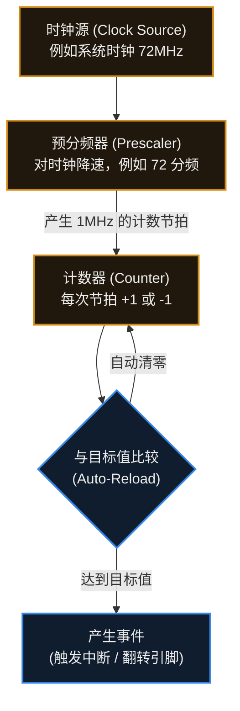

# 9. 定时器与 PWM


> [!info] 写在前面
> 如果你想让单片机“每隔 1 毫秒精准采样一次数据”，或者“让马达平滑地改变转速”，靠 CPU 空等（`delay`）是无法完成的。
> 这一章，我们将介绍单片机内部用于处理时间维度的两个核心外设：**硬件定时器 (Timer)** 和 **脉宽调制 (PWM)**。理解它们，是实现精确控制和模拟输出的基础。

## 9.1 为什么需要硬件定时器？

在初学阶段，让 LED 闪烁最直观的做法是使用软件延时（如 `delay(1000)`）。

**软件延时的本质与问题：**
软件延时通常是通过让 CPU 执行大量无意义的空循环（如 `for` 循环）来消耗时间。
这会带来两个典型的工程问题：
1. **阻塞系统**：CPU 在空转时，无法处理其他计算或响应低优先级事件。
2. **精度极差**：如果在 `delay` 期间发生了一次中断，CPU 会去执行 ISR，回来后继续 `delay`，导致实际延时时间被严重拉长（这被称为 Jitter / 抖动）。

**解决方案：硬件定时器**
单片机内部通常配备了多个独立的硬件定时器。你可以把它粗略地类比为一个**“独立工作的闹钟”**。
在正式的工程定义中：**定时器是一个由时钟信号驱动的硬件计数器 (Counter)。**
它独立于 CPU 运行，CPU 只需要花几微秒把它配置好，它就会自己在后台精准地“数数”，当满足特定时间条件时，再通过**中断**或**硬件事件**通知 CPU。

## 9.2 定时器的工作原理与核心参数

不论是 STM32、ESP32 还是其他架构的 MCU，一个典型的基础定时器通常由以下几个核心部分组成：



**核心参数解析：**
1. **时钟源频率 ($f_{clk}$)**：定时器的心跳节拍，通常来自系统总线时钟。
2. **预分频器 (Prescaler / PSC)**：可以类比为一个“减速齿轮”——它实际是一个对输入时钟做整数分频的硬件计数器。如果时钟源是 72MHz，直接数数太快了。以 STM32 为例，PSC 寄存器写 71 才得到 72 分频（分频值 = PSC + 1），此时定时器每秒数 1,000,000 下（即 1MHz，每数一下耗时 1 微秒）。不同芯片的分频计算方式、PSC 取值范围、以及时钟源是否取自系统主频都可能不同，需要参考 Reference Manual。
3. **自动重装载值 / 周期值 (Auto-Reload / Period)**：这是计数的“目标线”。在**向上计数**模式下，当计数器数到这个值时，通常会触发一次更新事件（STM32 中称为 Update Interrupt，其他厂商的命名与细节可能不同），并把计数器重新装载。需要注意计数模式并不只有向上计数：**向下计数**模式下计数器递减到 0 再重载，**中央对齐**模式下先向上数到重载值、再向下数到 0；这些模式的行为都不是简单的“到点自动归零”，具体以芯片的定时器章节为准。

> [!note] 定时器不仅仅能用来产生中断
> 高级定时器除了基础的计时功能，还具备：
> - **输入捕获 (Input Capture)**：当外部引脚发生电平跳变时，硬件自动把当前计数器的值“抓”下来，常用于测量外部方波的频率或脉宽。
> - **输出比较 (Output Compare)**：当计数器数到某个特定值时，硬件自动改变某个引脚的电平，这就是接下来要讲的 PWM 的底层实现方式。

## 9.3 什么是 PWM？

通用 GPIO 的输出是数字逻辑：它一般只能输出高电平（接近 VCC）或低电平（接近 GND）两种状态，无法直接输出 1.5V 这样的中间电压。
**那么，单片机该如何输出 1.5V 的电压，或者让 LED 表现出“一半的亮度”？**

在不使用专门的 DAC（数模转换器）的情况下，工程中最主流的方案是 **PWM (Pulse Width Modulation，脉冲宽度调制)**。

**一句话理解 PWM：**
通过极快地在“全开”和“全关”之间切换，利用物理系统的**惯性**（如人眼的视觉暂留、电机的机械惯性、电容的充放电特性），让系统感受到一个“平均”的模拟能量。这里的“平均”是一种帮助理解的类比式说法，严格的表述见下面的正式定义。

**正式定义**：
PWM 是通过调制脉冲宽度（即占空比）来等效调节输出平均电压 / 平均功率的数字控制手段。它并不改变输出电平的高、低两种取值，而是在固定周期内改变高电平所占的时间比例；被控对象（LED、电机、RC 网络等）自身的惯性或低通特性会把方波“积分”成等效的平均效果。需要说明的是，这种等效成立的前提是被控对象的响应速度远慢于 PWM 周期。

## 9.4 PWM 的核心参数

理解 PWM，需要掌握以下三个参数：

```text
高电平 3.3V  ┌──────┐            ┌──────┐      
低电平   0V  ┘      └────────────┘      └────────────
             |<--   1个周期   -->|
             |<-高电平->|
```

1. **频率 (Frequency, Hz)**：
   - 决定了 PWM “开/关”循环的速度。
   - **工程取舍**：频率太低，LED 会肉眼可见地闪烁，电机运转会产生剧烈震动；频率太高，开关元器件（如 MOS 管）的开关损耗会剧增，且可能受到 MCU 硬件时钟频率的限制。
2. **占空比 (Duty Cycle, %)**：
   - 指在一个周期内，**高电平持续时间占总周期时间的比例**。
   - 它是决定输出能量大小的**决定性参数**。占空比 100% 相当于完全开启，0% 相当于完全关闭，50% 相当于输出一半的平均能量。
3. **分辨率 (Resolution)**：
   - 指占空比可以被调节的精细程度，通常用位数（Bit）表示。
   - 比如 8-bit 的 PWM，占空比只能分成 $2^8 = 256$ 个档位（0~255）；而 16-bit 的 PWM 可以分成 65536 档，控制效果会平滑得多。分辨率与频率往往是相互制约的（频率越高，在固定时钟下能分的档位就越少）。

## 9.5 常见误区与工程实践

### 误区：PWM 降低了输出电压
初学者常用万用表测 PWM 引脚，看到电压是 1.65V，就以为“PWM 把 3.3V 降到了 1.65V”。
**实际上，PWM 引脚在任何瞬间的电压只有 3.3V 或 0V。** 1.65V 是万用表内部积分电路得出的**平均电压（均值）**。这里需要区分两个容易混淆的量：均值不等于 RMS 有效值——0–3.3V、50% 占空比方波的均值是 1.65V，而 RMS 有效值约为 2.33V（$3.3/\sqrt{2}$）。如果用示波器观察，看到的仍然是方波。

### 工程实践 1：硬件 PWM vs 软件 PWM
- **软件 PWM**：配置一个高频的定时器中断，在 ISR 中用代码手动翻转 GPIO 电平。
  *缺点*：持续占用 CPU 算力；如果期间发生了其他高优先级中断，电平翻转会被延后，导致 PWM 出现明显抖动。
- **硬件 PWM (Output Compare)**：配置好定时器寄存器后，引脚电平的翻转由底层硬件逻辑自动完成，不需要 CPU 在每个周期介入。
  *优点*：抖动远小于软件 PWM，也不占用 CPU 的循环算力。需要注意的是，硬件通路本身仍然存在门延迟与传播延迟，因此并不是“0 延迟”。
> **工程规范**：控制电机或要求平滑调光的场景，**多数情况下应优先选用硬件 PWM**。软件 PWM 通常只用于引脚不支持硬件复用、且对精度要求较低的少数妥协场景。

### 工程实践 2：PWM 频率如何选择？
- **驱动 LED 调光**：通常选择 **1kHz - 5kHz**。远高于人眼能识别的闪烁频率（>100Hz），也不会太高导致驱动电路失真。
- **驱动直流电机**：人耳的听觉范围是 20Hz - 20kHz。如果电机 PWM 频率落在几 kHz，电机线圈会像扬声器一样产生人耳可闻的啸叫声。因此，电机驱动通常将 PWM 频率设定在 **20kHz 以上**（超声频段），以避开人耳可闻的频段，同时配合电机的电感特性获得较平滑的电流。
- **控制舵机 (Servo)**：模型舵机是一种特殊的设备，它**不看重占空比的平均能量**，而是依赖特定的协议：通常要求 **50Hz** (周期 20ms) 的固定频率，通过改变高电平的绝对脉宽（通常在 1.0ms - 2.0ms 之间）来指定转动的角度。

> [!summary] 总结本章
> 1. **硬件定时器** 是独立于 CPU 的外设，解决了软件 `delay` 阻塞系统且精度低的问题。
> 2. 定时器主要由**时钟源、预分频器、计数器**和比较寄存器组成。
> 3. **PWM (脉宽调制)** 通过高频切换数字电平，利用物理系统的惯性来模拟出连续的模拟能量。
> 4. 改变 PWM 的**频率**影响物理系统的响应平滑度/噪音；改变 **占空比** 决定了实际输出的平均能量大小。
> 5. 真实的工程开发中，应优先采用**硬件 PWM**，并根据被控对象（LED、直流电机、舵机）的物理特性合理选择频率。
