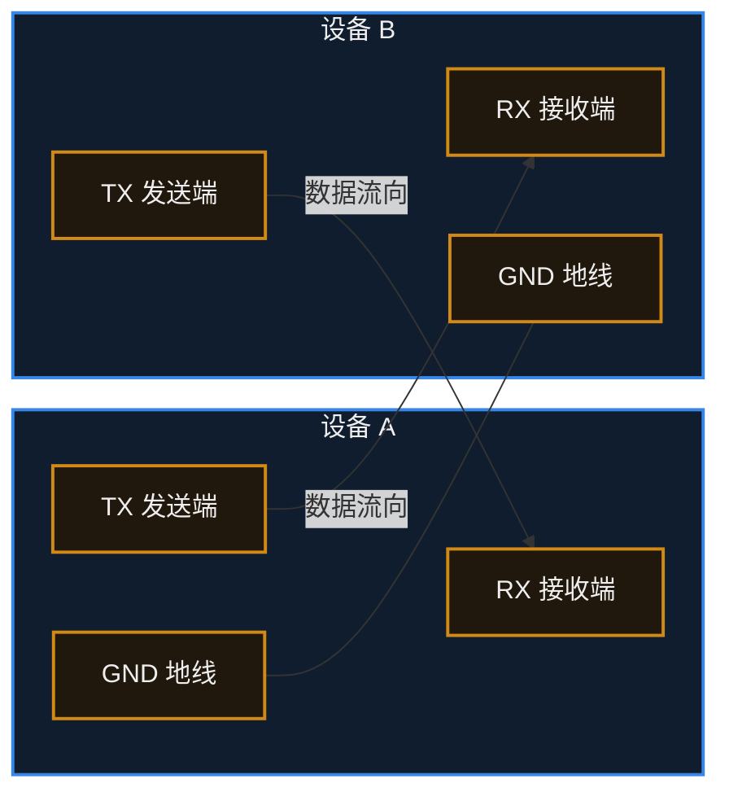

# 10. UART


> [!info] 写在前面
> 当你的代码在单片机内部运行时，它就像处于一个黑盒子里。你无法直接看到变量的值，也无法知道程序运行到了哪一步。
> 为了打破这个黑盒，我们迫切需要一条能让单片机向电脑发送文字信息的“数据通道”。**UART** 就是嵌入式开发中最古老、最简单、也最不可或缺的通信接口。这一章，我们将了解它是如何用一根线发送、一根线接收来完成数据传输的。

## 10.1 一句话理解与正式定义

**一句话理解**：
UART 就像是单片机和外界聊天的“打字机”，它把内部并行的数据拆成一个个独立的 0 和 1，排着队通过一根导线发送出去。

**正式定义**：
**UART (Universal Asynchronous Receiver/Transmitter，通用异步收发传输器)** 是一种硬件外设模块。它负责将内存中的并行数据（如一个 8-bit 的 Byte）转换为串行数据发送，或者将接收到的串行数据重组为并行数据。

**为什么叫“异步”？**
在数字通信中，“同步（Synchronous）”通常意味着通信双方共享一根**时钟线 (Clock Line)** 来统一节奏。
UART 是**异步 (Asynchronous)** 的，**它没有时钟线**。发送方和接收方完全依靠**事先约定好的通信速度**来猜测每个 0 和 1 的边界。

## 10.2 硬件连接模型

一个典型的 UART 通信只需要三根线。
注意信号流向是交叉的：一方的“嘴巴”必须对准另一方的“耳朵”。



> [!important] 工程要点：必须共地 (GND)
> 很多新手在连接两个模块时，只接 TX 和 RX 两根线，结果无法正常通信。
> 所有的电压（高低电平）都必须有一个共同的参考零点。**如果没有连接 GND，设备 A 认为的 3.3V 在设备 B 看来可能是 0V 甚至是负电压。** 通信的第一步，通常都是先确认 GND 已相连。

## 10.3 工作原理：数据帧与波特率

既然没有时钟线，设备 B 怎么知道设备 A 什么时候开始发数据？又怎么知道这一连串的电平代表几个 Bit？

这依赖于两个核心机制：**数据帧格式** 和 **波特率**。

### 1. 波特率 (Baud Rate)
波特率是双方**事先约定好的通信速度**，代表每秒钟传输的码元数量（在基础 UART 中，通常就等于每秒传输的 Bit 数，即 bps）。
- 常见的波特率有：`9600`、`115200` 等。
- **强制规则**：通信双方的波特率必须配置为**相同的值**（允许极小误差，通常 < 2%），否则接收方会在错误的时间去采样电平，收到一堆乱码。

### 2. 数据帧 (Data Frame)
UART 在空闲时，导线上的电平**默认保持为高电平 (High)**。
当需要发送一个字节（Byte）时，UART 硬件会自动把这个字节包装成一个“数据帧”：

```text
       空闲  | 起始位 |      数据位 (通常 8-bit, 从最低位开始发)       | 校验 | 停止位 | 空闲
电平 ──────┐ |      |   |   |   |   |   |   |   |   |      | ┌──────
           └─┴──────┴───┴───┴───┴───┴───┴───┴───┴───┴──────┴─┘
```

- **起始位 (Start Bit)**：强制拉低电平（0）。接收方一旦检测到下降沿，就知道“数据要来了”，立刻启动内部的定时器开始按波特率采样。
- **数据位 (Data Bits)**：实际要发送的数据，典型配置为 8 位。
- **奇偶校验位 (Parity Bit)**：可选。用于检查数据在传输中是否发生错误。
- **停止位 (Stop Bit)**：强制拉高电平（1），标志着当前这一帧传输结束，并为下一个起始位的下降沿做准备。

> [!note] 经常看到的 `115200 8N1` 是什么意思？
> 这是 UART 最经典的默认配置，意思是：
> - 波特率 **115200**
> - **8** 个数据位
> - **N**one（无）奇偶校验
> - **1** 个停止位

## 10.4 工程实践：UART 的真实用途

在嵌入式开发中，UART 主要扮演两种角色：

### 1. 调试日志 (printf 重定向)
你在 PC 上写 C 语言时，`printf` 会把文字打印到屏幕上。
在单片机上，屏幕往往不存在。工程上的标准做法是：通过修改底层的库函数，把 `printf` 产生的字符，一个接一个地送到 UART 硬件去发送。
你需要用一根 **USB 转 TTL 模块 (如 CH340, CP2102)**，一头插在电脑 USB 上，另一头的 RX 接到单片机的 TX 上。电脑上打开“串口助手”软件，就能看到单片机发出的调试信息。

### 2. 与外部模块通信
很多相对低速、不需要高并发的外围模块，为了简化接口，都采用 UART 与主控 MCU 通信。
- **GPS 模块**：不断通过 UART 发送解析好的经纬度字符串（NMEA 协议）。
- **蓝牙模块 (如 HC-05)**：单片机通过 UART 发送 `AT+NAME` 等指令来配置蓝牙。
- **GSM/4G 模组**：同样广泛使用标准的 AT 指令集通过串口控制。

## 10.5 常见误区与故障排查

UART 虽然简单，但在调试阶段依然问题高发。遇到 UART 不通，请按以下顺序排查：

### 排查 1：收到了数据，但是全是不认识的“乱码”
**原因分析：**
1. **波特率不匹配**：单片机代码里配的是 115200，但电脑上的串口助手选了 9600。
2. **时钟配置错误**：如果单片机的系统时钟频率配置错了（比如外部晶振明明是 8MHz，代码里却写了 25MHz），硬件分频出来的真实波特率就会是错的。

### 排查 2：什么数据都收不到
**原因分析：**
1. **TX 和 RX 没交叉**：再次确认单片机的 TX 是不是接到了转换模块的 RX。
2. **未共地 (GND)**：检查 GND 有没有牢固连接。
3. **GPIO 复用功能没打开**：有些单片机必须显式开启 GPIO 的 Alternate Function (复用功能)，否则引脚依然是普通 IO，不会受内部 UART 外设控制。

### 工程陷阱 3：电平不匹配与 RS-232 接口风险
这是一个容易损坏硬件的工程误区：
- 单片机出来的 UART 信号通常是 **TTL / CMOS 电平**（高电平为 3.3V 或 5V，低电平为 0V）。
- 在工业界，还有一种较早的接口叫 **RS-232**（以前老电脑上的 9 针 D 型接口）。它的逻辑电平是负逻辑，而且电压摆幅很大（-15V 到 +15V）。
- **不要把单片机的 UART 引脚直接连接到工业 RS-232 接口上**：高达十几伏的电压可能损坏甚至击穿单片机。如果需要连接，中间应当增加一个电平转换芯片（如 MAX3232）。

### 软件陷阱 4：轮询等待发送造成的阻塞
在早期学习时，发送数据的代码通常是这样的：
```c
// 阻塞式发送一个字符（轮询方式）
void uart_send_char(char c) {
    // 傻等：直到发送数据寄存器 (TDR) 为空
    while ( UART_FLAG_TX_EMPTY == 0 ) {
        // CPU 在这里空转
    }
    UART_DATA_REG = c; // 硬件开始发送
}
```
**工程隐患**：UART 是一种相对低速的通信方式。在 9600 波特率下，发送一个字节大约需要 1 毫秒。如果你用这种“轮询阻塞”的方式调用 `printf` 打印 100 个字符，CPU 会被占用 100 毫秒，期间无法处理其他任务。
**进阶做法**：在正式的工程项目中，UART 发送通常会配合 **中断 (Interrupt)** 或 **DMA (直接内存访问)**。CPU 只需把要把发送的数据放进内存缓冲区，然后立刻去执行其他任务，底层的硬件搬运工会在后台自动完成耗时的发送过程。
