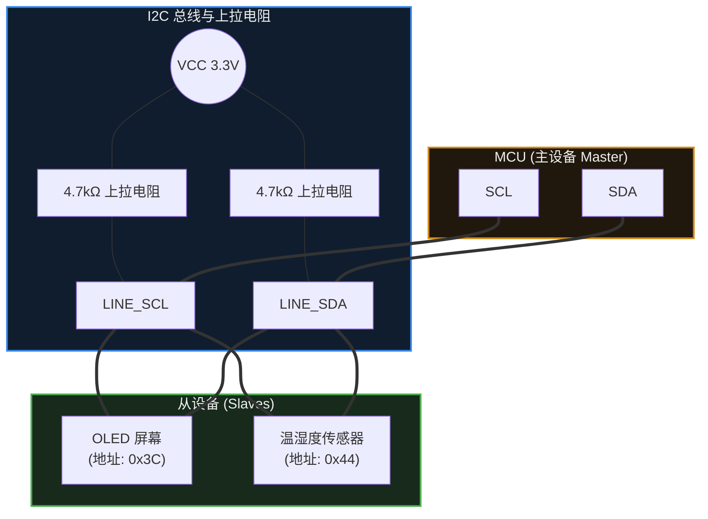

# 11. I2C

> [!info] 写在前面
> 在上一章，我们学习了 UART。UART 简单易用，但它有一个明显的局限：它是“点对点”的通信（一对一）。如果单片机需要连接十几个不同的传感器，难道要引出十几对 TX/RX 引脚吗？
> 这在硬件资源上是很大的浪费。为了解决这个问题，我们需要一种**总线 (Bus)** 技术。**I2C** 是嵌入式系统中最常用的低速传感器总线之一，它只用两根导线，就能把单片机和几十个不同的外设串联在一起。

## 11.1 一句话理解与正式定义

**一句话理解**：
I2C 就像是一条通信“公交线路”，只需要两根导线，单片机就能通过“叫号（寻址）”的方式，在这条线路上与多个不同的设备分别进行对话。

**正式定义**：
**I2C (Inter-Integrated Circuit)** 是一种**同步、半双工、支持多主多从**架构的串行总线。
- **同步**：它有一根专门的时钟线（SCL）来统一通信双方的节拍，因此不需要像 UART 那样严格约定波特率。
- **半双工**：数据在一根导线（SDA）上传输，意味着同一时刻数据只能单向流动（要么主发从收，要么从发主收）。
- **寻址机制**：总线上的每一个从设备（Slave）都有一个固定的设备地址。主设备（Master）发起通信时必须先发送目标地址。

## 11.2 物理拓扑与开漏架构

I2C 总线在物理连接上极具特色，这也是新手最容易接错线的地方。它由两根信号线组成：
- **SCL (Serial Clock)**：串行时钟线。通常由主设备（如 MCU）产生，用来控制数据传输的节奏。
- **SDA (Serial Data)**：串行数据线。用于传输实际的 0 和 1。

### 为什么必须接上拉电阻？(开漏设计的工程意义)
在第 7 章（GPIO）中我们提到过**开漏输出 (Open-Drain)**。I2C 总线要求所有挂在它上面的设备引脚，**必须配置为开漏模式**。

如果 I2C 采用普通的推挽输出，当 MCU 想输出高电平 (3.3V)，而传感器想输出低电平 (0V) 时，两者的电流会直接短路，可能损坏芯片。
**开漏模式 + 外部上拉电阻** 巧妙地解决了这个问题：
1. 总线上没有设备拉低时，上拉电阻把电压拉到 3.3V，这就是**逻辑 1**。
2. 总线上任意一个设备想要发信号时，就把 SDA 连通到 GND，把电压拉低到 0V，这就是**逻辑 0**。
3. 这在电子工程上叫 **“线与” (Wired-AND)** 逻辑：只要有一个设备拉低了总线，总线就是低的；只有所有设备都松手，总线才是高的。这避免了多个设备同时驱动总线而造成的短路。

## 11.3 寻址与 ACK 应答机制

当几十个设备都挂在同一根 SDA 线上时，I2C 是如何做到井然有序的？

### 1. 设备地址 (Device Address)
每个 I2C 从设备在出厂时（或通过引脚配置）都有一个通常为 **7 位 (7-bit)** 的硬件地址。
当 MCU 要和某个设备说话时，它会先发送一个 **START (起始信号)**，紧接着发送 7 位的设备地址，以及第 8 位的 **读/写方向位 (R/W bit)**（0 表示 MCU 想写，1 表示 MCU 想读）。

### 2. 应答机制 (ACK / NACK)
这是 I2C 最核心的可靠性保障机制。
当 MCU 发送完 8 个 bit（地址+读写位）后，它会释放 SDA 线。此时如果对应的传感器真实存在且正常工作，它**必须在第 9 个时钟节拍，主动把 SDA 线拉低**。
这个“拉低”动作，就叫 **ACK (Acknowledge，应答)**。
如果 MCU 读到的是高电平，说明该字节没有被应答，这叫 **NACK (Not Acknowledge)**。收到 NACK 并不代表通信必然失败——从机常用 NACK 表示“本轮读取结束”；至于重试、重新发起始条件还是终止本次传输，由驱动软件决定，硬件通常不会自动替你终止。

> [!tip] 硬件调试利器：I2C 扫描器 (I2C Scanner)
> 验证 I2C 硬件是否正常的第一步，不必急着去读传感器的复杂寄存器。
> 绝大多数嵌入式 SDK 中都能写出一个简短的“I2C Scanner”程序：让 MCU 遍历从 `0x01` 到 `0x7F` 的所有地址，只要收到 ACK，就通过串口打印出该地址。这能瞬间排查出接线和硬件是否正常。

## 11.4 常见误区与工程排错陷阱

I2C 的理论很简单，但在实际工程调试中，它属于问题高发的环节。遇到 I2C 读不到数据，请重点排查以下三个问题：

### 陷阱 1：未外接上拉电阻
**现象**：程序卡死在等待 I2C 响应的地方，用逻辑分析仪抓不到任何波形，或者波形极其微弱。
**原因**：有些开发板自带了上拉电阻，但有些廉价的裸模块没有。如果总线上没有任何上拉电阻，开漏架构就失去了将电平拉高的能力。
**对策**：查阅模块原理图。如果没有，手动在 SDA 和 SCL 上分别接一个 4.7kΩ 或 10kΩ 的电阻到 VCC。虽然有些 MCU 内部有微弱的上拉电阻，但在连线较长或速度较快时，内部上拉通常不足以保证信号的完整性。

### 陷阱 2：“7 位地址”的左移问题
这是软件开发中新手容易混淆的问题之一。
假设传感器 Datasheet 上写着：`Device Address = 0x50`（这是 7 位地址）。
在发送时，这 7 位地址后面需要拼接 1 位的读/写标志位，组成 8 位数据发出去。
- **某些库函数 (如 Arduino Wire 库)**：你直接传入 `0x50`，底层函数会自动帮你把地址左移 1 位，并拼接读写位。
- **某些底层库 (如 STM32 HAL 库的某些 API)**：它要求你传入的地址是**已经包含读写位占位符的 8 位格式**。也就是说，你需要手动把 `0x50` 左移 1 位，传入 `0xA0` 才行。如果此时你依然传入 `0x50`，MCU 就会去寻址 `0x28` 这个不存在的设备，必然得到 NACK。
**对策**：务必查阅你所使用的 SDK 或 HAL 库的文档，明确其期望的地址格式是“原汁原味的 7-bit”还是“左移后的 8-bit”。

### 陷阱 3：I2C 总线死锁 (Bus Lockup)
**现象**：MCU 突然复位重启后，I2C 总线陷入瘫痪，读不到传感器。若不干预，总线可能一直停留在 Busy 状态。
**机制与原因**：
如果在 MCU 重启的瞬间，传感器恰好正在向 MCU 发送一个逻辑 `0`（此时它正把 SDA 线拉低）。
MCU 重启后，丢失了之前的通信状态，以为总线是空闲的，但由于 SDA 被拉低了，MCU 认为总线一直被别人占用（Bus Busy），于是拒绝发起新的通信。而传感器则持续把 SDA 拉低，等待 MCU 给出下一个 SCL 时钟节拍让它把数据发完。两者僵持，总线锁死。
**工程对策**：在高度可靠的工业产品中，如果发现总线锁死，MCU 通常会在初始化阶段，手动将 SCL 引脚配置为普通 GPIO，连续翻转产生 9 个时钟脉冲，使传感器把未发完的数据发完并释放 SDA，然后再将引脚重新交还给内部 I2C 硬件。

> [!summary] 总结本章
> 1. **I2C** 是两线制（SCL, SDA）、带寻址功能的多设备共享总线。
> 2. 物理层必须配置为**开漏输出**并外接**上拉电阻**，利用“线与”逻辑防止短路。
> 3. 通信的可靠性依赖于**设备地址**与第 9 个时钟周期的 **ACK 应答机制**。
> 4. 调试时优先警惕**上拉电阻缺失**、API 对 **7位地址是否需要左移**的要求，以及复位引起的**总线死锁**问题。
