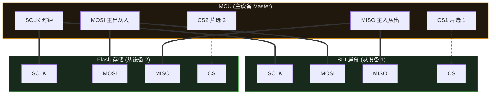

# 12. SPI

> [!info] 写在前面
> 上一章提到的 I2C 虽然只需两根线就能连接无数设备，但受限于开漏架构和复杂的应答机制，它的速度通常很慢（常见为 100kbps ~ 400kbps）。
> 当你需要以极快的速度刷新一块彩色 LCD 屏幕，或者从一块 Flash 芯片中每秒读取几兆字节的数据时，I2C 就会成为严重的瓶颈。这时候，我们需要另一条高速公路——**SPI**。

## 12.1 一句话理解与正式定义

**一句话理解**：
SPI 是一条**高速、全双工**的“数据交换”通道。它不需要像 I2C 那样在总线上大声喊地址，而是通过一根专属的物理连线（片选线），直接拍一拍目标设备的肩膀来进行通信。

**正式定义**：
**SPI (Serial Peripheral Interface，串行外设接口)** 是一种同步、全双工、主从架构的串行通信总线。
- **全双工**：有独立的发送线和接收线，数据可以在同一时刻双向流动。
- **同步**：依然由主设备（Master）提供一根专门的时钟线（SCLK）来同步收发节奏。
- **片选机制**：主设备通过专门的硬件引脚（CS / SS）来选中特定的从设备（Slave），被选中的设备才允许在总线上发送和接收数据。

## 12.2 物理拓扑与推挽架构

一个标准的 SPI 通信通常需要 4 根线（对于主设备来说，每多加一个从设备，只需要多分配一根片选线即可）：

**SPI 的 4 根线（不同芯片的缩写可能略有不同）：**
1. **SCLK / SCK (Serial Clock)**：时钟线，由主设备产生。
2. **MOSI (Master Out Slave In)**：主设备发，从设备收。
3. **MISO (Master In Slave Out)**：主设备收，从设备发。
4. **CS / SS (Chip Select / Slave Select)**：片选线。通常是**低电平有效 (Active-Low)**，即主设备把这根线拉低到 0V 时，对应的从设备才被激活。

> [!tip] 为什么 SPI 比 I2C 快得多？(工程底层逻辑)
> I2C 使用的是开漏输出，从 0 变回 1 依靠的是外部上拉电阻缓慢给寄生电容充电，这个过程像是在“爬坡”，波形很容易失真，所以快不起来。
> 而 SPI 除了 MISO 外，通常配置为**推挽输出 (Push-Pull)**，由单片机主动驱动高低电平，信号边缘比较陡峭，因此通常可以跑到 10MHz、甚至 50MHz 以上。

## 12.3 核心机制：强制“数据交换” (移位寄存器)

这是初学者转入 SPI 时最难扭转的思维定势。
在 UART 和 I2C 中，“发送”和“接收”是相互独立的动作。但在标准 SPI 中，**根本没有单纯的“只读”或“只写”，SPI 的本质是数据交换 (Data Exchange)。**

SPI 的底层硬件是两个连接在一起的移位寄存器（一个在 Master 里，一个在 Slave 里），形成了一个闭环。

**工作原理：**
每产生一个时钟脉冲（SCLK）：
- 主设备从 MOSI 线上把自己的最高位挤出去，进入从设备。
- 从设备从 MISO 线上把自己的最高位挤出去，进入主设备。

当 8 个时钟脉冲走完，主设备里的 8 个 bit 完整地转移到了从设备里，而从设备里原本的 8 个 bit 也完整地转移到了主设备里。两者完成了互换。

> [!important] 常见的 Dummy Byte (哑字节)
> 因为 SPI 必须交换，**如果你只想从传感器读一个数据怎么办？**
> 单片机通常需要“无话找话”——主动发送一个没有实际含义的字节（比如 `0xFF` 或 `0x00`，这被称为 **Dummy Byte**）。
> 目的仅仅是为了产生 8 个时钟脉冲，迫使传感器顺着 MISO 线把真实数据“挤”回给单片机。不发东西，时钟就不走，你也永远读不到数据。

## 12.4 容易配错的四种模式：SPI 的 CPOL 与 CPHA

如果你把线接对了，程序也跑起来了，但读出来的数据全是乱码（或者发生了 1 个 bit 的错位），往往是 **SPI 模式** 配错导致的。

早期各家厂商在设计 SPI 外设时没有统一标准：有的规定时钟线平时应该是高电平，有的规定应该是低电平；有的规定在时钟刚跳变时读取数据，有的规定在跳变回来时读取数据。组合起来，就有了 4 种模式：

1. **CPOL (Clock Polarity，时钟极性)**：决定 SCLK 在空闲时（没有通信时）的电平状态。
   - `CPOL = 0`：空闲时 SCLK 为低电平。
   - `CPOL = 1`：空闲时 SCLK 为高电平。
2. **CPHA (Clock Phase，时钟相位)**：决定数据在哪个时钟跳变沿被采样（被读取）。
   - `CPHA = 0`：在第 1 个跳变沿采样。
   - `CPHA = 1`：在第 2 个跳变沿采样。

> [!tip] 工程习惯：不必死记，去查时序图
> 不用死背这 4 种模式。拿到一个新的传感器时，打开它的 **Datasheet（数据手册）**，找到 SPI Timing (时序图)。
> 看看图上的时钟线在 CS 拉低之前是处于上方（高电平）还是下方（低电平），就能确定 CPOL；看看数据是在时钟的上升沿还是下降沿对齐，就能确定 CPHA。
> 实际工程中，大多数 SPI 设备采用的是 **Mode 0** (CPOL=0, CPHA=0) 或者 **Mode 3** (CPOL=1, CPHA=1)。

## 12.5 常见误区与工程排错陷阱

### 陷阱 1：硬件 CS 自动控制的局限
在配置单片机的外设时，通常你会看到可以将 CS 配置为“硬件自动控制 (Hardware NSS / CS)”。
**工程实践**：在很多 MCU 架构（特别是某些早期的 STM32 型号）中，硬件自动控制片选的行为逻辑有时并不符合预期（例如每发送一个字节就会拉高一次 CS，而不是等整个数据包发完才拉高）。
**对策**：在绝大多数工程中，我们推荐把 CS 引脚配置为**普通的 GPIO 推挽输出**。在发送数据前，用软件代码手动将其拉低 `gpio_write(CS, 0)`；整包数据收发完成后，再手动将其拉高 `gpio_write(CS, 1)`。这种做法的稳定性更好，而且可以方便地用软件管理多个从设备。

### 陷阱 2：MISO 线的电平冲突
SPI 是一主多从结构。所有从设备的 MOSI 都可以直接并联，但所有从设备的 MISO 也是并联在一起的。
**机制与要求**：如果同一时刻有两个从设备都在向 MISO 线上输出不同的电平，总线就会短路。因此，SPI 规范要求：**未被选中（CS 为高电平）的从设备，必须将其 MISO 引脚强行置为高阻态 (High-Z)**，彻底与总线断开，把舞台留给当前被选中的设备。
**排错**：如果某些廉价的传感器模块在设计时存在缺陷，导致 CS 为高时依然强力驱动 MISO 线，就会导致总线瘫痪。排查时可以拔掉其他模块，只留一个测试。

### 陷阱 3：连线过长导致的高速信号失真
UART 可以在 9600 波特率下拖几米长的电缆。但 SPI 通常运行在几兆甚至几十兆赫兹。
**工程常识**：在如此高的频率下，哪怕二三十厘米的杜邦线，由于寄生电容和电感的存在，也会让方波出现明显畸变（还会产生信号反射和串扰），可能导致通信失败。
**对策**：SPI 设计主要是用来**板级通信**的（即同一个电路板上几厘米内的芯片互联）。如果必须跨板连接，尽量让导线极短，或者降低 SPI 时钟频率，必要时增加串联端接电阻以匹配阻抗。

> [!summary] 总结本章
> 1. **SPI** 是一种 4 线制、全双工、同步的高速通信总线。
> 2. 它的本质是一个**移位寄存器**，主从设备在时钟的驱动下强制进行 0 和 1 的**数据互换**。要想读取从设备，主设备必须发送 Dummy Byte 产生时钟。
> 3. 必须通过查阅 Datasheet 的时序图来确定从设备支持的 **SPI 模式 (CPOL 和 CPHA)**，配错模式是导致乱码的常见原因。
> 4. 推荐将 CS（片选线）配置为普通 GPIO，用**软件代码手动控制拉低拉高**。
> 5. SPI 是板级高速总线，不适合使用过长的导线连接。
