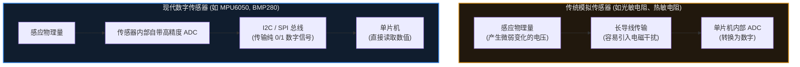

# 13. ADC、DAC 与传感器

> [!info] 写在前面
> 前面的章节中，我们讨论的所有电信号都是 0 和 1（3.3V 和 0V）。
> 然而，现实世界是连续的：温度是缓慢升高的，声音是起伏波动的，光线是渐明渐暗的。单片机该如何去感知这些“连续变化”的物理量？
> 这一章，我们将引入连接物理世界与数字世界的桥梁：**ADC（模数转换器）** 和 **DAC（数模转换器）**，并探讨现代嵌入式系统中传感器的工程形态。

## 13.1 一句话理解与正式定义

**一句话理解**：
ADC 是一个“电压测量仪”，负责把外面真实的电压值翻译成单片机能懂的整数；DAC 则反过来，负责根据单片机给出的整数，向外输出真实的连续电压。

**正式定义**：
- **ADC (Analog-to-Digital Converter)**：模数转换器。将连续的模拟信号（如连续变化的电压）转换为离散的数字信号。
- **DAC (Digital-to-Analog Converter)**：数模转换器。将离散的数字信号转换为连续的模拟信号。

## 13.2 ADC 的核心工作机制与关键参数

ADC 的工作过程本质上是“拍照”和“归类”：每隔一段时间记录一次瞬时电压，然后把这个电压值丢进最接近的数字“刻度桶”里。

要用好 ADC，需要理解以下三个核心参数：

### 1. 参考电压 ($V_{ref}$) —— 测量的天花板
单片机不知道什么是“绝对的 3.3V”，它只认自己的“参考尺子”。
ADC 模块通常有一个参考电压引脚（$V_{ref}$，很多廉价板子上它直接和单片机供电 VCC 连在一起，比如 3.3V）。
- 当引脚电压 $= V_{ref}$ 时，ADC 读出最大数字。
- 当引脚电压 $= 0V$ 时，ADC 读出数字 0。
- 如果引脚输入的电压超过了 $V_{ref}$，不仅读出来依然是最大值，还可能烧毁引脚。

### 2. 分辨率 (Resolution) —— 刻度的精细度
ADC 的读数是一个整数，这个整数的范围由**分辨率（通常用 bit 表示）**决定。
- 如果是 **10-bit** ADC：数字范围是 $0$ 到 $2^{10}-1$，也就是 $0 \sim 1023$。它把 $0 \sim V_{ref}$ 的电压分成了 1024 份。
- 如果是 **12-bit** ADC（STM32 等常见配置）：数字范围是 $0 \sim 4095$。

**最常用的工程换算公式：**
假设你用的是 12-bit ADC，参考电压是 3.3V，你通过代码读到了数字 `2048`。那真实的引脚电压是多少？
$$ 真实电压 = \frac{ADC读数}{最大数字范围} \times V_{ref} $$
$$ 真实电压 = \frac{2048}{4095} \times 3.3V \approx 1.65V $$

### 3. 采样率 (Sample Rate) —— 抓拍的速度
表示 ADC 每秒钟能完成多少次转换。
如果是测室温，1 秒钟采样 1 次就足够了；但如果单片机要录制声音，至少需要每秒 8000 次甚至 44100 次（44.1kHz）的高速采样，否则声音会严重失真。

## 13.3 DAC 与 PWM 的本质区别

我们在第 9 章学过，**PWM** 可以通过改变占空比来模拟出不同的能量输出，为什么还需要专用的 **DAC**？

- **PWM 的本质**：引脚电压依然在 0V 和 3.3V 之间极速跳变，只是靠外部的物理惯性（或者外接的 RC 滤波电容）来“平均”成 1.65V。
- **DAC 的本质**：引脚上输出的是**平稳的直流电压（例如 1.65V）**，不存在 PWM 那样的开关跳变。

> **工程选型**：
> 控制电机速度、调节 LED 亮度，通常用 **PWM**（效率高、发热小）。
> 播放高质量音频、控制精密的工业模拟仪表，通常使用 **DAC**（信号平滑，无高频开关噪声）。

## 13.4 传感器的进化：模拟 vs 数字

现代嵌入式项目中的传感器，按接口分类主要有两种形态：

**工程趋势**：
以前，单片机大量依赖自带的 ADC 去读取外部的模拟电压。
现在，大多数高精度传感器（温度计、加速度计、气压计）已经**把 ADC 做进了传感器芯片内部**。单片机不再需要自己测电压，只需要通过 **I2C 或 SPI** 总线，直接把传感器测好的数字读回来即可。这类数字传感器抗干扰能力较强，是当前较为主流的方案。

## 13.5 常见误区与工程排错陷阱

如果你在项目里使用了 MCU 自带的 ADC 去测量电压，通常会遇到以下几个典型问题：

### 陷阱 1：迷信 3.3V 导致测量不准
**现象**：ADC 测出来的电压与万用表读数总是对不上，而且会随时间漂移。
**原因**：新手常把换算公式里的 $V_{ref}$ 写死成 `3.3`。但实际上，开发板上的 LDO 稳压器受温度和负载影响，真实电压可能是 3.25V，也可能是 3.32V。如果 $V_{ref}$ 本身在波动，ADC 换算出来的结果也会随之产生偏差。
**工程对策**：对精度要求极高的模拟电路，通常需要使用**专用的高精度基准电压芯片（Voltage Reference IC）**为 $V_{ref}$ 引脚供电；或者利用单片机内部出厂校准过的“内部基准电压（Internal Bandgap）”进行反向校准。

### 陷阱 2：ADC 读数跳动 (噪声问题)
**现象**：引脚明明接在一个固定的电池上，ADC 读出来的数字却一直在 `2041`、`2050`、`2038` 之间小幅跳动。
**原因**：真实世界的模拟电平充满了电磁干扰，MCU 内部的数字电路也会对 ADC 产生串扰。
**工程对策**：在工程中，ADC 读数通常不宜直接使用，一般需要经过滤波处理。
- **硬件滤波**：在 ADC 引脚和地之间并联一个极小的电容（如 0.1μF），滤除高频噪声。
- **软件滤波**：最常用的是**滑动平均滤波**（连续读 10 次去掉最大最小值，剩下的求平均），或者 **IIR 滤波**（一阶低通滤波）。

### 陷阱 3：被测信号源“带不动” ADC
**现象**：用万用表测某处电压是 2.0V，但用单片机 ADC 引脚接上去一测，万用表电压瞬间掉到了 1.5V，ADC 读出的也是错误的值。
**原因**：ADC 内部在采样瞬间，会打开一个开关，给一个微小的“采样电容”充电。如果被测电路的输出阻抗非常大（比如极高阻值的电阻分压），它提供电流的能力极弱，连这个微小的采样电容都喂不饱，瞬间就把原本的电压拉低了。
**工程对策**：对于高阻抗信号，通常不宜直接接入 ADC，需要在中间加一个**运算放大器 (Op-Amp)** 构成的“电压跟随器”来增强驱动能力，或者在软件里大幅拉长 ADC 的**采样时间 (Sampling Time)** 给电容慢慢充电。

> [!summary] 总结本章
> 1. **ADC** 将连续的模拟电压转换为离散的数字值；**DAC** 则负责将数字输出为真实平稳的电压。
> 2. ADC 换算真实电压在很大程度上取决于 **参考电压 ($V_{ref}$)** 和 **分辨率**。
> 3. 现代嵌入式系统广泛使用内部集成了高精度 ADC 的 **数字传感器（I2C/SPI）**，大幅降低了主控 MCU 处理模拟信号的压力。
> 4. 使用 MCU 自带 ADC 时，需要在硬件和软件层面考虑 **基准电压波动、噪声滤波** 以及 **输入阻抗匹配** 的问题。
