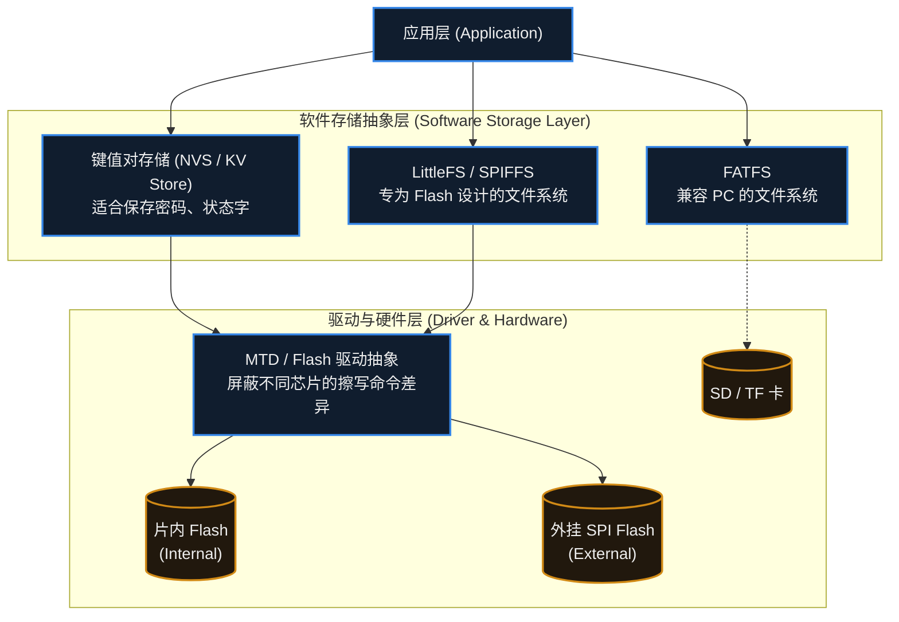

# 16. Flash、EEPROM 与文件系统

> [!info] 写在前面
> 当设备断电时，RAM 中的所有变量（如运行状态、传感器缓存）都会瞬间丢失。
> 但在实际工程中，我们需要永久保存 Wi-Fi 密码、设备的唯一 ID、用户设置的偏好，甚至长达一个月的温湿度历史记录。
> 这一章，我们将探讨嵌入式系统中的非易失性存储（NVM, Non-Volatile Memory）介质，重点讲解底层硬件的物理特性，以及现代软件架构是如何科学、安全地将数据持久化保存下来的。

## 16.1 核心概念：EEPROM 与 Flash

**正式定义**：

- **EEPROM (Electrically Erasable Programmable ROM，带电可擦可编程只读存储器)**：可电擦写的非易失存储器，支持按字节读写与擦除，擦写寿命较高、容量小、单位成本高。
- **Flash (闪存)**：同样基于浮栅工艺的非易失存储器，擦除以扇区/块为单位、写入以页或字为单位，容量大、单位成本低。MCU 片内通常指 **NOR Flash**——可字节寻址、支持直接从 Flash 取指执行 (XIP)。

在嵌入式系统中，它们是最常用的非易失性存储介质。虽然断电后都能保存数据，但物理特性和工程使用场景截然不同。

| 对比维度 | EEPROM (带电可擦可编程只读存储器) | Flash (闪存，单片机主要指 NOR Flash) |
| :--- | :--- | :--- |
| **读写粒度** | **按字节 (Byte) 操作**。想改哪个字节就改哪个，非常灵活。 | **按扇区 (Sector/Block) 擦除，按页 (Page) 或字写入**。 |
| **擦写寿命** | 较高。通常每个存储单元可承受 $10^5$ 到 $10^6$ 次擦写。 | 较低。通常每个扇区承受 $10^4$ 到 $10^5$ 次擦写。 |
| **容量与成本** | 容量极小（几 KB 到几十 KB），单字节成本极高。 | 容量大（几百 KB 到百 MB 级），单字节成本极低。 |
| **典型应用场景**| 保存少量且频繁变动的系统状态、校准数据。 | 存放代码（固件）、庞大的传感器日志、文件系统。 |

> [!note] EEPROM 的“软替代”
> 为了降低芯片成本和减小面积，很多现代 MCU 内部只集成了 Flash，不再提供物理 EEPROM。如果需要保存少量参数，通常有两种做法：
> 1. 在电路上外挂一颗廉价的 I2C 接口 EEPROM 芯片。
> 2. 使用 Flash 配合软件算法来**模拟 EEPROM (EEPROM Emulation)**。

## 16.2 Flash 存储的核心物理机制：擦除而后写

这是 Flash 存储最核心的硬件约束，也是构建所有上层文件系统和参数存储算法的底层原因。

在物理层面，Flash 依靠浮栅晶体管中“是否捕获了电子”来表示 0 和 1。这导致了一个不可逆的单向特性：
**写入（Program）操作只能将二进制的 `1` 变成 `0`，无法将 `0` 变成 `1`。**

要把 `0` 变回 `1`，必须先执行**擦除 (Erase)** 操作。由于底层电路的连线结构，擦除动作通常不能针对单个字节进行，而是以**扇区 (Sector) 或块 (Block)** 为单位。**这个粒度因芯片而异**——常见的从 4KB 子扇区到 128KB 大扇区都有，具体以 Datasheet 与 Reference Manual 为准。

**工作机制示例（以 4KB 扇区为例）：**
假设扇区内有一个变量，原值为 `0x00`（该字节所有位都是 `0`）。现在想把它改成 `0x05`（二进制 `0000 0101`）。
由于目标值里出现了 `1`，而写入只能把 `1` 变成 `0`，直接发起写入命令是无效的。底层通常的处理流程是：
1. **读出**：把整个 4KB 扇区的数据先完整读到 RAM 的缓冲区里。
2. **修改**：在 RAM 里把对应的那个变量修改为 `0x05`。
3. **擦除**：向硬件发送命令，**擦除整个 4KB 扇区**（此时该扇区所有位变成 `1`，即全是 `0xFF`）。
4. **写回**：把 RAM 里修改好的 4KB 数据，重新写入到 Flash 扇区中（把不需要的 `1` 变成 `0`）。

理解了这个机制，就能明白为什么 Flash 的写入耗时远高于 RAM（通常慢若干个数量级，具体取决于器件），并且非常不适合频繁修改同一个变量。

## 16.3 存储抽象层：从裸操作到文件系统

在实际的工程项目中，直接用底层寄存器去计算扇区地址、管理擦除逻辑是低效且容易出错的。现代嵌入式软件栈通常会提供清晰的存储抽象层：

### 1. 键值对存储 (NVS / KV Store)
当只需要保存诸如 `wifi_ssid`、`volume_level` 等散碎参数时，使用完整的文件系统过于笨重。
很多现代 SDK（如 ESP-IDF 的 NVS，Zephyr 的 Settings 子系统）提供了键值对存储。应用层只需调用简单的 `set("key", value)`，底层的 NVS 算法会自动寻找干净的扇区写入，并废弃旧数据，从而对上层掩盖了“擦除而后写”的复杂性。

### 2. FATFS (兼容 PC 的文件系统)
如果你把数据存在 SD 卡或 U 盘里，并希望用户拔下来插在 Windows 电脑上能直接读取，就必须使用 FAT32/exFAT 格式。在嵌入式端，通常移植开源的 **FATFS** 库。
- **缺点**：FAT 系统诞生于磁盘时代，它并没有针对断电保护进行设计。如果在更新文件分配表（FAT 表）的瞬间拔掉电源，整个分区可能彻底损坏。

### 3. LittleFS (专为 Flash 设计的文件系统)
当需要在芯片内部的 Flash 或外挂的 SPI Flash 上存储配置文件、海量传感器日志时，业界常见的选择之一是 **LittleFS**。它从底层设计上解决了 Flash 的两大痛点：
- **磨损均衡 (Wear Leveling)**：它通过树状数据结构动态分配存储块，让 Flash 上的扇区被相对均匀地擦写，避免某几个扇区因为频繁更新而提前损坏，从而延长整片 Flash 的寿命。
- **掉电安全 (Power-loss Resilience)**：它采用了类似写时复制（Copy-on-Write）的机制。在修改文件时，新数据会被写入到一个新的空闲块中；只有当新数据完全写完并校验通过后，才会把文件指针指向新块。因此，即使在写入过程中断电，重启后系统依然能找回原本的旧数据，文件结构通常不会损坏。

## 16.4 工程开发中的存储约束

理解了底层机制后，在实际写代码操作 Flash 时，需要时刻考虑以下系统级约束：

### 约束 1：写入频率需要受控
新手常犯的错误是把 Flash 当作 RAM 使用（例如在主循环中每秒记录一次运行时间）。
如果 Flash 扇区寿命是 10 万次，1 秒写 1 次，**不到 28 个小时**该扇区就会彻底写废。
**工程对策**：高频变化的状态数据应当**缓存在 RAM 中**。仅在状态发生实质改变、用户触发保存，或系统检测到即将掉电（配合硬件掉电检测电路）时，才一次性刷入 Flash。

### 约束 2：片内 Flash 擦写时的总线阻塞
在很多 MCU 架构中，代码是直接在片内 Flash 上运行的（XIP, Execute In Place）。
擦除一个 Flash 扇区是非常耗时的物理过程（通常需要几毫秒到几十毫秒）。当 MCU 向片内 Flash 发出擦除或写入指令时，**Flash 硬件控制器通常会进入“忙碌”状态**。
此时，如果 CPU 想要去 Flash 取下一条指令，总线就会被挂起，导致 CPU 假死（Stall）。如果恰好此时发生了需要极速响应的外部中断，中断也无法执行。
**工程对策**：在硬实时系统中执行片内 Flash 擦写前，如果芯片架构不支持双区（Dual Bank）读写，通常需要暂停一些时间敏感的业务，或者确保关键的中断服务程序（ISR）被预先加载并运行在 **RAM** 中。

### 约束 3：裸写数据的原子性保障
如果不使用 LittleFS，而是直接在应用层裸写 Flash 扇区来保存参数，需要考虑“写到一半掉电”可能造成的严重后果。
**工程对策**：通常采用 **A/B 双区备份策略 (Double Banking)**。准备 A、B 两个扇区存放数据。写入新配置时，总是写入当前未被使用的那个空闲扇区，写完并加上校验和（Checksum）后，再标记该扇区为最新。这样无论何时掉电，系统总能依靠校验和找回最近一次完整有效的数据。

> [!summary] 总结本章
> 1. **EEPROM** 适合小数据字节级读写；**Flash** 容量大，但必须遵循 **“按扇区擦除，按页/字写入”** 的物理限制。
> 2. Flash 的物理特性导致其寿命有限，且不能频繁原地修改数据，这就需要软件算法介入。
> 3. 现代软件栈通过 **NVS (键值对)** 和 **LittleFS 等文件系统** 屏蔽了底层硬件的复杂性，并提供了磨损均衡和掉电安全保障。
> 4. 工程师在操作存储时，需要评估**擦写寿命、总线阻塞时间**以及**断电原子性**，避免将 RAM 的编程思维直接套用在 NVM 上。

## 16.5 常见误区与工程陷阱

**误区 1：把 Flash 当 RAM 用**
在主循环里每秒写一次 Flash 是最典型的错误。扇区寿命通常在 $10^4 \sim 10^5$ 次量级（以 Datasheet 为准），按秒级写入会在几天内写废该扇区。高频变化的数据应当先缓存在 RAM 中。

**误区 2：以为 memcpy 就能改写 Flash 内容**
Flash 的写入受“擦除而后写”约束：只能把 `1` 写成 `0`。要向同一地址写入新值，通常必须先擦除整个扇区，而擦除会连带清掉该扇区里的其他数据。裸写时要走“读出 → 在 RAM 中修改 → 擦除 → 写回”的完整流程。

**误区 3：忽略擦写粒度与芯片差异**
擦除粒度因芯片而异（常见从 4KB 子扇区到 128KB 大扇区），写入粒度可能是页或字而不是字节。换芯片时必须重新确认，不能照搬上一颗芯片的擦写参数。

**误区 4：写到一半掉电**
裸写 Flash 时若中途掉电，可能留下内容不完整的扇区。保存关键参数应当采用 A/B 双区加校验和的策略，或直接使用 LittleFS 这类具备掉电安全的文件系统。

**误区 5：认为文件系统可以随便用**
FATFS 并非为断电保护设计，更新 FAT 表时掉电可能损坏整个分区；LittleFS 通过磨损均衡与写时复制缓解了这些问题，但也有自己的开销与限制。选型取决于数据的性质与掉电风险。
