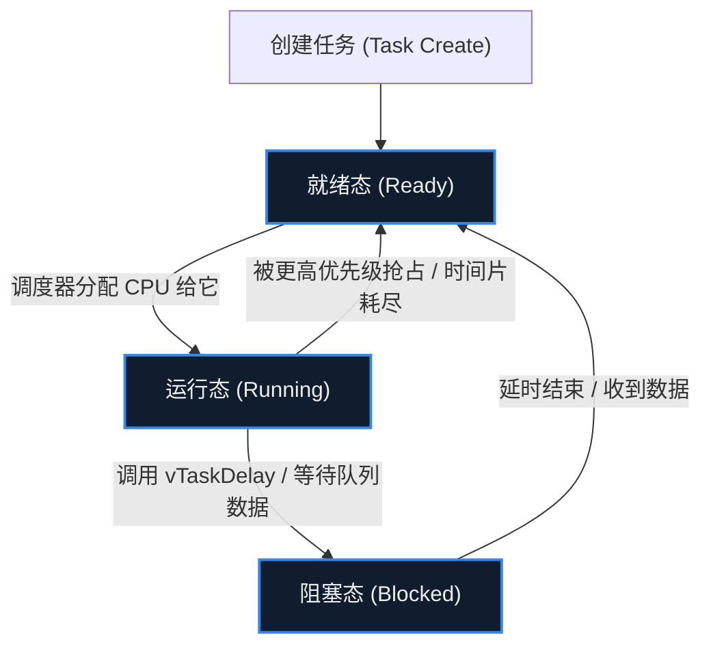

# 17. RTOS 与 FreeRTOS

> [!info] 写在前面
> 当一个项目只有“按键开灯”和“读取温度”两个功能时，一个简单的 `while(1)` 循环加上几个中断就能胜任。
> 但当你的系统需要同时处理 Wi-Fi 通信、刷新屏幕 UI、采集多个传感器，并且要求某个控制指令必须在 1 毫秒内得到响应时，传统的裸机代码会迅速膨胀成一团乱麻。
> 这一章，我们将引入嵌入式系统走向复杂化的分水岭技术：**实时操作系统 (RTOS)**。

## 17.1 一句话理解与正式定义

**一句话理解**：
RTOS 是一套软件框架，它通过极快速地切换 CPU 的执行权，让单片机看起来像是在“同时”执行多个独立的任务，并让紧急任务能够优先获得 CPU。

**正式定义**：
**实时操作系统 (Real-Time Operating System, RTOS)** 是一种专为实时应用设计的操作系统软件。
它的核心特征在于**确定性 (Determinism)**：即系统需要在规定的时间限制内响应外部事件。与通用的分时操作系统（如 Windows、Linux，更注重整体吞吐量与公平性）不同，RTOS 通常优先让最高优先级的就绪任务获得 CPU；同等优先级的任务之间常采用时间片轮转，共享资源时还可能出现优先级反转。
**FreeRTOS** 是目前嵌入式领域市场占有率最高、也是众多芯片原厂首选的开源 RTOS 之一（其他常见的还有 RT-Thread、Zephyr、μC/OS 等）。

## 17.2 为什么需要 RTOS？(裸机架构的痛点)

在没有 RTOS 的“裸机 (Bare-metal)”开发中，最经典的架构是**前后台系统 (Super Loop + Interrupts)**：
- **前台 (中断)**：处理紧急的硬件事件。
- **后台 (主循环)**：一个巨大的 `while(1)` 包含一系列函数，轮流执行。

**工程痛点**：
假设主循环里有三个函数：`刷新屏幕()`、`处理网络()`、`控制电机()`。
如果在 `处理网络()` 时由于网络卡顿，函数在内部阻塞等待了 50 毫秒；那么后续的 `控制电机()` 就会被迫延迟 50 毫秒才能执行。
这意味着：**系统不同模块之间产生了严重的相互耦合和时序干扰**。为了解决这个问题，工程师通常要手写复杂的状态机（State Machine）来切碎任务，导致代码极难维护。

引入 RTOS 后，系统被拆分为多个相互独立的 **任务 (Task)**，由 RTOS 的内核接管 CPU 的调度权，从根本上解耦了业务逻辑。

## 17.3 核心机制：任务 (Task) 与状态机

在 RTOS 中，每个业务模块（比如网络、UI、传感器控制）都被封装成一个独立的函数，并交给 RTOS 创建为一个**任务 (Task)**。
在开发者的视角里，每个任务都是一个独立的无限循环，仿佛独占了整个 CPU。

但实际上，任务在 RTOS 内部受到调度器的严格管控，并在几种状态之间流转：

1. **运行态 (Running)**：当前这一瞬间，CPU 真正正在执行的任务（单核 MCU 同一时刻只能有一个任务处于运行态）。
2. **就绪态 (Ready)**：任务已经准备好干活了，但 CPU 正在执行其他优先级更高（或同等）的任务，只能排队等待。
3. **阻塞态 (Blocked)**：任务遇到了需要等待的事件（比如写了延时 10 毫秒、等待用户按键、等待网络回包）。此时，任务会**主动交出 CPU 的使用权**，RTOS 会立刻把 CPU 安排给其他 Ready 的任务去执行，从而充分利用算力。

## 17.4 上下文切换 (Context Switch)

单核 CPU 只有一个，它是如何做到让任务 A 跑到一半，突然去执行任务 B，然后又无缝回到任务 A 继续跑的？
这依赖于 RTOS 最底层的核心技术：**上下文切换**。

在前面讲 RAM 的章节中我们提到过栈（Stack）。在裸机程序中，整个系统通常只有一个大堆栈。
**而在 RTOS 中，创建每一个任务时，RTOS 都会在 RAM 中为该任务分配一块属于它自己的独立内存，称为“任务栈 (Task Stack)”。**

**工作原理：**
当调度器决定暂停任务 A 去执行任务 B 时：
1. **保存现场**：由 RTOS 所用的定时器中断或软件异常触发（在 Cortex-M 上通常是 SysTick 与 PendSV，其他架构使用各自的机制），把当前任务的运行现场保存到**任务 A 的独立栈**中。注意**不同架构自动保存的范围不同**：在 Cortex-M 上，异常进入时硬件只自动压入部分上下文（xPSR、PC、LR、R12、R3–R0），其余通用寄存器由 RTOS 在 PendSV 处理函数中用软件保存；若启用了 FPU，浮点寄存器还涉及延迟压栈 (lazy stacking)。
2. **切换指针**：RTOS 调度器把 CPU 的栈指针 (SP) 强行修改为**任务 B 的独立栈**的地址。
3. **恢复现场**：从任务 B 的栈中弹出上一次保存的寄存器值，恢复到 CPU 中。
4. 退出中断，CPU 继续取指令。由于寄存器（尤其是程序计数器 PC）变成了 B 的，CPU 就浑然不觉地接着上次任务 B 暂停的地方继续运行了。

## 17.5 抢占式调度 (Preemptive Scheduling)

大多数现代 RTOS 默认采用的是**基于优先级的抢占式调度**。
所谓“抢占”，意味着**高优先级的任务一旦进入就绪态（Ready），它不需要等待当前低优先级任务主动让出 CPU，调度器会立刻触发上下文切换，强行剥夺低优先级任务的执行权。**

*工程意义*：如果电机控制任务的优先级高于网络任务，那么无论网络代码正在进行多么复杂的加密计算，只要电机定时器一到，CPU 通常会在微秒量级内切换去执行电机控制（具体延迟取决于主频与内核实现）。这是 RTOS 能够提供**“确定性”**的根本保证。

## 17.6 工程实践中的资源权衡

引入 RTOS 带来了更清晰的代码架构和更好的实时响应能力，但代价是**系统资源的开销显著增加**。在工程项目中需要注意以下两点：

### 实践 1：系统延时的本质改变
在裸机中，我们通常用 `delay()` 忙等，这叫**阻塞 (Spinning)**。
在 RTOS 中，通常应当使用 RTOS 提供的系统延时函数（如 FreeRTOS 的 `vTaskDelay()`；其他 RTOS 有各自对应的 API）。
- 当调用 `vTaskDelay(10)` 时，当前任务会被调度器打上“睡眠 10 毫秒”的标签，并立刻进入**阻塞态 (Blocked)**。
- 这 10 毫秒内，CPU 可以被安排去执行其他任务。直到延时到达，调度器才会将该任务重新放回**就绪态 (Ready)**。

### 实践 2：任务栈大小评估 (Stack Sizing)
因为每个任务都有自己的独立堆栈，**RAM 的消耗会急剧上升**。
如果某个任务内定义了一个极大的局部数组（例如 `char buf[2048];`），或者函数调用层级极深，而创建任务时只分配了 1024 字节的栈，就会在运行时引发 **栈溢出 (Stack Overflow)**，进而触发 HardFault。
因此，在 RTOS 项目开发后期，工程师通常需要开启 RTOS 的栈水位检测功能（如 FreeRTOS 的 `uxTaskGetStackHighWaterMark`），动态微调每个任务的栈大小，在保证不溢出的前提下尽可能释放出多余的 RAM 供系统使用。

## 17.7 常见误区与工程陷阱

**陷阱 1：把任务优先级当成性能旋钮**
把所有任务都设成高优先级，就失去了优先级的意义。抢占式调度的价值来自优先级之间的差异；滥用高优先级会让低优先级任务长期得不到 CPU（饥饿）。

**陷阱 2：优先级反转 (Priority Inversion)**
高优先级任务等待一把被低优先级任务持有的锁时，如果中间优先级的任务抢占了低优先级任务，高优先级任务就会被间接阻塞很长时间。常见解法是让互斥锁支持**优先级继承 (Priority Inheritance)**（FreeRTOS 的 Mutex 支持，二值信号量不支持）；是否支持、如何配置取决于具体 RTOS。

**陷阱 3：在任务里"忙等"而不是阻塞**
用 `while(!flag);` 这类空转代替信号量或任务通知，会把 CPU 占满，让同级或更低优先级的任务得不到执行。任务暂时不需要 CPU 时，应当主动进入阻塞态。

**陷阱 4：低估栈的消耗**
每个任务都有独立的栈，RAM 开销随任务数增长。栈给小了会溢出并触发 HardFault，给大了则挤占其他任务与堆的空间。应当用栈水位检测（如 FreeRTOS 的 `uxTaskGetStackHighWaterMark`）实测后再定。

**陷阱 5：在中断里调用任务级 API**
在 ISR 中调用 FreeRTOS 的 `xSemaphoreGive()`、`vTaskDelay()` 这类任务级接口会导致断言失败或系统崩溃。中断上下文必须使用该 RTOS 提供的 ISR 安全版本（如 FreeRTOS 的 `FromISR` 系列），并注意在退出前处理 `pxHigherPriorityTaskWoken`，以决定是否需要触发一次上下文切换。

> [!summary] 总结本章
> 1. **RTOS** 通过系统调度，将复杂的业务逻辑解耦为多个独立的 **任务 (Task)**，解决了裸机前后台系统中响应时间不确定的痛点。
> 2. 每个任务在生命周期中会在 **运行、就绪、阻塞** 等状态间流转；优秀的任务设计应当在不需要 CPU 时主动进入阻塞态。
> 3. **上下文切换** 是 RTOS 的底层基础，每个任务拥有独立的**任务栈 (Task Stack)** 来保存运行现场。
> 4. **基于优先级的抢占** 使得紧急任务能够优先获得 CPU，提供了系统的实时确定性。
> 5. 使用 RTOS 的代价是 RAM 开销大幅增加，工程师需要谨慎规划和调优任务的数量及每个任务的堆栈大小。
