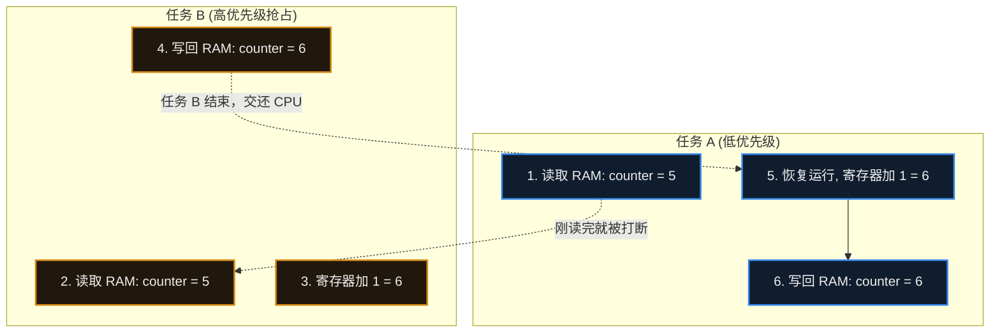

# 18. 并发、同步与互斥


> [!info] 写在前面
> 上一章我们引入了 RTOS，让多个任务能够“并发”执行。这看似完美，但当多个任务（或任务与中断）试图在同一时刻访问同一个全局变量、同一个传感器或同一个通信接口时，就可能引发难以复现的故障。
> 这一章，我们将探讨嵌入式系统中最容易引发偶发性死机的核心难题——并发冲突，以及如何利用操作系统提供的机制来保卫数据的安全。

## 18.1 核心概念与正式定义

在多任务或中断驱动的系统中，首先需要理清三个强相关的核心概念：

- **并发 (Concurrency)**：系统中有多个执行流（任务或中断）在宏观时间段内同时推进。
- **互斥 (Mutual Exclusion, Mutex)**：一种保护机制。当一个任务正在访问某个共享资源（如 I2C 总线、全局结构体）时，其他任何任务都**不能同时访问**该资源，必须排队等待。
- **同步 (Synchronization)**：一种协同机制。协调多个任务或中断的执行先后顺序。比如“任务 B 必须等待中断 A 采集完数据后，才能开始处理”。

## 18.2 问题的根源：数据竞争与 R-M-W 效应

为什么两个任务操作同一个变量会引发系统崩溃？
问题的本质在于：**大多数高级语言的语句，在底层硬件上并不是“原子（Atomic）”的。** 所谓原子操作，是指不可被中断打断的一个整体动作。

以最简单的 C 语言自增语句为例：
```c
counter++;
```
在 CPU 的汇编指令层面，这通常会被拆分为典型的 **读-改-写 (Read-Modify-Write, R-M-W)** 三个步骤：
1. **Load (读)**：把 `counter` 的值从 RAM 读入 CPU 内部寄存器。
2. **Add (改)**：在 CPU 寄存器中将数值加 1。
3. **Store (写)**：将寄存器中的新值写回 RAM 中的 `counter`。

如果在步骤 1 和步骤 3 之间，发生了一次**中断**或者**任务抢占**，数据竞争（Race Condition）就会产生：



**工程后果**：任务 A 和任务 B 各自执行了一次加 1 操作，预期结果应该是 7，但最终 RAM 中保存的却是 6。一次操作被“吞掉”了。如果这个变量是缓冲区的指针，系统就可能越界崩溃。

## 18.3 解决数据竞争的武器库

为了防止上述惨剧，嵌入式系统中通常提供以下几种工具来保护**临界区 (Critical Section)**（即访问共享资源的那段代码）。

### 1. 关中断 (Disable Interrupts)
最直接的保护方式：在进入临界区前，直接通过硬件指令关闭全局中断；操作完后再打开。
- **优点**：简单、执行极快，能屏蔽任务抢占与可屏蔽中断的干扰。
- **缺点**：会影响系统的实时性。如果关中断的时间过长，系统将无法响应紧急的外部硬件事件。
- **适用场景**：只适用于极短的、微秒级别的变量读写保护。

### 2. 互斥锁 (Mutex)
如果需要保护的资源是一个耗时较长的操作（比如通过 I2C 读写几个传感器的寄存器），关中断就不合适了，此时应使用 RTOS 提供的互斥锁。
- **机制**：互斥锁是一个包含**所有权 (Ownership)** 概念的内核对象。任务 A 必须先“获取（Take）”锁，才能访问 I2C。如果此时任务 B 也想访问 I2C，尝试获取锁时会被调度器**阻塞 (Block)**，进入休眠，直到任务 A 操作完毕并“释放（Give）”锁。
- **工程特性**：互斥锁通常内置了**优先级继承 (Priority Inheritance)** 机制。如果低优先级任务拿了锁，高优先级任务在等锁，RTOS 会临时把低优先级任务的优先级提升，催促它尽快干完活把锁还回来，以此缓解“优先级反转”带来的问题。

## 18.4 同步机制：信号量与消息队列

如果说互斥锁是为了“防止互相打架”，那么同步机制则是为了“协调大家合作”。

### 1. 信号量 (Semaphore)
信号量在概念上类似一个计数器，它主要用于**事件通知**。
- **二值信号量 (Binary Semaphore)**：计数最大为 1。典型用法是：中断服务程序 (ISR) 接收到外部信号后，调用 **ISR 安全版本**的释放接口（例如 FreeRTOS 的 `xSemaphoreGiveFromISR()`，其他 RTOS 有各自的对应 API）；后台任务则用 `Take` 阻塞等待。这样就实现了硬件中断与软件任务的同步。
- **计数信号量 (Counting Semaphore)**：计数可以大于 1。常用于管理多个相同的资源（例如系统里有 3 个可用的网络连接块）。

### 2. 消息队列 (Message Queue)
信号量只能传递“事件发生了”这个信号，无法安全地传递具体的数据（如果你用全局变量传数据，又会绕回数据竞争的老问题）。
**消息队列 (Queue)** 允许任务与任务、中断与任务之间，通过“先进先出 (FIFO)”的方式安全地传递真实的数据块。它是构建松耦合“生产者 - 消费者”模型的标准工程手段。

## 18.5 常见误区与工程陷阱

在多任务并发编程中，新手常常难以分辨各种机制的适用边界。以下是工程实践中最容易引发严重故障的三个陷阱：

### 陷阱 1：混淆互斥锁与二值信号量
由于互斥锁和二值信号量在代码 API 层面看起来非常相似（都是 Take 和 Give），新手经常混用，这会导致极难排查的系统异常。
**工程原则**：
- **互斥锁 (Mutex) = 保护资源**。规则是：**谁获取，必须由谁释放**。你不能任务 A 拿了锁，让任务 B 去解锁。
- **信号量 (Semaphore) = 同步事件**。规则是：**A 发送，B 接收**。典型的设计是让一个任务（或中断）只负责 Give，另一个任务只负责 Take。

### 陷阱 2：死锁 (Deadlock) 的产生
死锁是并发系统中较难排查的一类问题。
假设系统中有两把锁：锁 X 和锁 Y。
- 任务 A 获取了锁 X，准备去获取锁 Y。
- 恰巧在这一瞬间，任务 B 获取了锁 Y，准备去获取锁 X。
此时，任务 A 在等 B 释放 Y，任务 B 在等 A 释放 X。两者互相等待，谁也无法继续执行。
**工程对策**：如果一个任务需要同时获取多把锁，整个软件架构中应当规定**统一的获取顺序**（例如所有人必须先拿 X，再拿 Y），不允许反向申请。

### 陷阱 3：在中断 (ISR) 中使用互斥锁
很多新手为了保护被中断访问的全局变量，习惯性地在 ISR 函数里调用了 Mutex 的 API。系统通常会立刻崩溃或报出底层硬件异常。
**原因分析**：
回顾第 17 章，互斥锁的核心特性是：如果锁被别人占了，当前任务会被调度器挂起并进入**阻塞态 (Blocked)**。
然而，**中断 (ISR) 不是一个可被调度的任务**。ISR 当然有自己的栈（在 Cortex-M 上通常使用 MSP），但它不在 RTOS 的任务调度体系内——如果 ISR 尝试获取一个已被占用的 Mutex，内核没有任何地方可以“停放”这个上下文去等待，所以这类会阻塞的 API 不能在中断上下文中使用。
**工程对策**：
在中断与任务之间共享数据时，不应使用互斥锁这类会阻塞的内核对象。应当根据情况采用：
1. 关中断（极短操作）。
2. RTOS 提供的专用于中断的无阻塞 API（如 FreeRTOS 的 `FromISR` 系列函数配合信号量或队列）。
3. 无锁数据结构（如设计良好的环形缓冲区 Ring Buffer）。

> [!summary] 总结本章
> 1. **并发编程的核心难题** 是由于语句在底层非原子性（R-M-W 过程）导致的**数据竞争**。
> 2. **互斥锁 (Mutex)** 用于保护临界区，防止多个任务同时访问共享资源；具有**优先级继承**机制，且必须“谁获取谁释放”。
> 3. **信号量 (Semaphore)** 用于任务间或中端与任务间的**事件同步**，通常是一方发一方收。
> 4. **消息队列 (Queue)** 用于在并发流之间安全地传递**实际数据块**。
> 5. 中断服务程序 (ISR) 中不应使用具备阻塞特性的互斥锁，通常改用该 RTOS 提供的 ISR 安全机制（如 FreeRTOS 的 FromISR 系列）或无锁设计。
