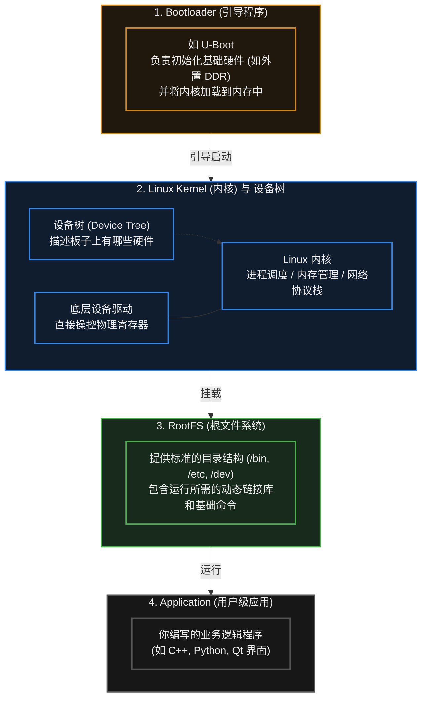

# 21. 嵌入式 Linux

> [!info] 写在前面
> 在之前的章节中，我们一直在一颗资源受限的单片机（MCU）上打磨代码。无论是裸机还是 RTOS，我们的目标都是“精准控制底层的每一微秒和每一个字节”。
> 但如果你的项目需要一个带触摸屏的复杂图形界面、需要处理多个高清摄像头的数据、需要跑深度学习模型，或者需要运行复杂的 Web 服务器，MCU 的算力和内存就会彻底捉襟见肘。
> 这时，我们就需要跨入嵌入式开发的一个庞大分支：**嵌入式 Linux**。这一章，我们将探讨从“控制硬件”走向“管理系统”的思维跃迁。

## 21.1 一句话理解与正式定义

**一句话理解**：
嵌入式 Linux 不再是一个你能在 IDE 里点一下“编译并下载”的单一裸机程序。它是一个完整的操作系统生态，它把底层的复杂硬件统统“屏蔽”起来，为你提供了一个标准化、功能极度丰富的运行环境。

**正式定义**：
**嵌入式 Linux (Embedded Linux)** 是指针对特定嵌入式硬件（通常是带有 MMU 的微处理器 MPU 或片上系统 SoC）进行裁剪、定制和优化后的 Linux 操作系统。
它通常包含了底层的引导程序、操作系统内核、设备驱动、文件系统以及专门为该产品定制的上层应用程序。它具备强大的网络协议栈、丰富的文件系统支持和多进程并发管理能力。

## 21.2 工程架构：嵌入式 Linux 的“四大件”

一个能够在 MCU 上跑起来的固件通常只是一个 `.bin` 或 `.hex` 文件。
但一个完整的嵌入式 Linux 系统，在工程构建和物理存储上，通常由四个界限分明的核心部分组成：

在实际工程中，这四个部分往往是**分别编译、分别烧录**的。你可能需要为它们划分不同的 Flash 分区，或者将它们打包成一个系统镜像（Image）烧录到 eMMC 或 SD 卡中。

## 21.3 核心机制：虚拟内存与进程隔离 (MMU)

为什么我们在基础单片机上通常只跑 RTOS，而在树莓派、工控机等高级板卡上跑 Linux？硬件上的核心分水岭通常是一个叫 **MMU (Memory Management Unit，内存管理单元)** 的部件。

### 在 MCU / RTOS 中（无 MMU）
所有的任务（Task）共享同一个物理地址空间。
- **痛点**：如果任务 A 中出现了一个野指针（Wild Pointer），它可能会不小心改写任务 B 的内存，甚至直接把操作系统的核心代码踩烂，导致**整个系统瞬间崩溃（HardFault）**。

### 在 嵌入式 Linux 中（有 MMU）
Linux 采用了**多进程 (Multi-Process)** 架构，MMU 硬件为每个进程制造了一个**“虚拟内存”**的幻觉。
- 每个应用进程都以为自己独占了一整段连续的虚拟地址空间（例如 32 位 Linux 上典型的 3GB 用户空间；用户空间与内核空间如何划分，取决于具体架构与内核配置）。
- MMU 负责在底层将这些虚拟地址悄悄翻译成真实的物理地址。
- **工程意义（进程隔离）**：如果你的业务应用（进程 A）产生了一个野指针，它试图访问不属于自己的内存，MMU 会拦截并上报给 Linux 内核。内核会终止进程 A（报出著名的 `Segmentation Fault` 段错误），但**整个 Linux 系统和其他进程通常仍能继续正常运行**。

这种隔离机制使得 Linux 系统能够承载庞大且复杂的软件生态，这也是它在高级嵌入式设备中不可替代的原因。

## 21.4 权衡：RTOS vs 嵌入式 Linux

在项目架构选型时，工程师必须在 RTOS 和 Linux 之间做出权衡：

| 对比维度 | RTOS (如 FreeRTOS 运行在 MCU) | 嵌入式 Linux (运行在 MPU/SoC) |
| :--- | :--- | :--- |
| **实时性 (Determinism)** | **极高 (硬实时)**。高优先级任务能以微秒级的确定性延迟抢占 CPU。 | **较弱 (软实时)**。标准 Linux 调度器追求吞吐量和公平，响应外部中断可能存在不可预测的毫秒级延迟。 |
| **硬件成本** | 极低。几十 KB RAM 即可运行。 | 较高。通常需要外挂数十兆甚至 GB 级的 DDR 内存和 eMMC/Flash。 |
| **启动时间** | **极快**。上电几毫秒到几十毫秒内即可输出控制信号。 | **较慢**。加载内核、挂载文件系统通常需要数秒到十几秒。 |
| **软件生态** | 较弱。通常需要使用 C 语言从底层堆砌逻辑。 | **生态成熟**。可以直接运行 Python/Node.js、使用现成的音视频编解码库、AI 框架、成熟的网络服务器等。 |

> [!tip] 现代工程解法：异构架构
> 很多现代产品（如自动驾驶域控制器、工业机器人）不再做非黑即白的单项选择，而是在同一颗芯片内同时集成**应用核心（如 Cortex-A）与实时核心（如 Cortex-M）**：前者运行 Linux，负责网络通信、路径规划、画面处理与 GUI；后者运行 RTOS 或裸机程序，负责要求硬实时的电机控制与安全制动。
> 这种架构的动机、分工与通信方式，见 [[#29.2 为什么需要异构架构？(MCU 与 Linux 的分工)]]。

## 21.5 常见误区与工程排错陷阱

对于从单片机刚刚转向 Linux 开发的新手，往往会遭遇巨大的思维撞墙期：

### 陷阱 1：试图在应用层直接读写物理寄存器
**现象**：新手想要点亮一个 LED，写了一段 C 代码，定义了一个指针指向 `0x40021018`（LED 寄存器的物理地址），运行后直接报 `Segmentation Fault` 崩溃。
**原因**：在 Linux 中，物理硬件和寄存器由**内核态 (Kernel Space)** 管理，用户态代码不能直接访问。你写的应用运行在**用户态 (User Space)**，MMU 不允许它直接触碰物理地址。
**工程对策**：
- **正规做法**：必须编写一份**设备驱动程序 (Device Driver)** 加载到内核中，由驱动去操作物理寄存器；驱动再向用户态暴露一个虚拟的文件接口（如 `/dev/my_led`）。用户程序通过标准的 `open()`、`write()` 系统调用来间接控制硬件。
- **妥协做法**：在某些快速验证场景下，可以通过 `mmap()` 系统调用，向内核申请将物理地址映射到当前进程的虚拟地址空间中，但这通常不符合严格的驱动开发规范。

### 陷阱 2：指望标准 Linux 处理微秒级的中断
**现象**：用 Linux 上的 GPIO 读取一个高频编码器的脉冲，发现读出来的波形残缺不全，转速计算结果错误。
**原因**：标准 Linux 内核的设计目标是“整体效率最高”，它在处理磁盘 I/O 或复杂的内核锁时，可能会临时屏蔽外部中断，导致中断延迟高达几百微秒甚至几毫秒。对于需要微秒级响应的硬件时序，Linux 根本抓不住。
**工程对策**：
如果必须在 Linux 侧处理一定的实时任务，可以为内核打上 **PREEMPT_RT**（实时抢占）补丁来大幅降低延迟抖动；但如果涉及到极高频的纳秒/微秒级严格时序（如软解协议、高速电机控制），通常应将这类任务下放给协处理器 (MCU) 或外接的 FPGA 完成，而不是用软件硬抗。

### 陷阱 3：开发与编译环境的巨大差异 (交叉编译)
**现象**：习惯了在 Keil 里点一下“Build”直接烧录的新手，发现 Linux 的代码根本不能在自己的电脑上直接编译后丢到板子上运行。
**原因**：你的电脑是 x86 架构的 CPU，而嵌入式板卡通常是 ARM 或 RISC-V 架构。在 x86 电脑上生成的二进制机器码，ARM CPU 根本看不懂。
**工程常识**：嵌入式 Linux 开发高度依赖**交叉编译 (Cross-Compilation)**。你必须在 PC（宿主机 Host）上安装一套专门针对目标板架构的**交叉编译工具链 (Cross Toolchain)**，用它编译出 ARM 的可执行文件，再通过网络（SSH/SCP）或优盘拷贝到嵌入式板卡（目标机 Target）上去执行。
