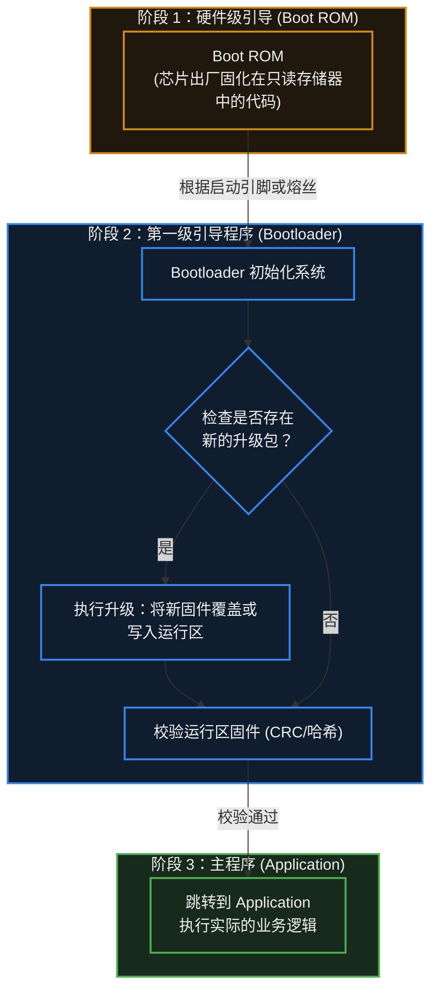

# 22. Bootloader

> [!info] 写在前面
> 当你给单片机插上电源的那一瞬间，系统到底是从哪一行代码开始执行的？
> 在研发阶段，我们习惯了用专用的调试器（如 JTAG / SWD 烧录器）直接把代码写进芯片。但当产品卖到用户手里，你不可能要求用户拆开机器、插上排线去升级固件。
> 这一章，我们将探讨系统启动的“第一道大门”——**Bootloader**，以及它是如何实现产品的远程无感升级（OTA）的。

## 22.1 一句话理解与正式定义

**一句话理解**：
Bootloader 就像是电脑主板上的 BIOS。它在开机时最先运行，主要职责是检查有没有新的固件需要升级；如果有，就负责搬运和更新；如果没有，就把控制权交给真正的业务主程序。

**正式定义**：
**Bootloader (引导程序)** 是系统上电或复位后执行的第一段软件代码。
它的核心功能通常包括：
1. **基础硬件初始化**（如配置系统时钟、初始化外部 RAM 或必要的通信接口）。
2. **固件完整性校验**（检查主程序是否损坏或被篡改）。
3. **固件升级逻辑 (OTA 支持)**。
4. **引导并跳转**至主应用软件（Application）的入口地址执行。

## 22.2 典型的系统启动链路

单片机的启动过程并不是一蹴而就的，它通常呈现多级引导的阶梯结构。具体实现严重依赖于芯片厂商和架构（如 ARM Cortex-M、RISC-V 等），但宏观的工程模型通常如下：

> [!note] Boot ROM 与 Bootloader 的区别
> - **Boot ROM**：由芯片厂商写死在芯片内部的，不可更改。它通常提供最基础的串口/USB下载功能（比如 STM32 的 System Memory 启动，或 ESP32 的出厂下载模式）。
> - **Bootloader**：由开发者自己编写（或使用 SDK 提供的现成框架），固化在 Flash 的起始区域，负责具体产品的升级逻辑。

## 22.3 核心工程实践：OTA 与双区备份 (Dual-Bank)

**OTA (Over-The-Air，空中下载技术)** 在现代物联网设备中十分常见。当单片机通过 Wi-Fi、4G 甚至是蓝牙接收到新固件时，系统是如何安全地“自我更新”的？

如果芯片的 Flash 容量足够大，业界较常见的高可靠性解法是 **A/B 双区备份 (Dual-Bank / A-B Partitioning)**。

**物理内存划分示例：**
- `0x0000 0000`：**Bootloader 分区**
- `0x0001 0000`：**App A 区**（当前正在运行的主程序）
- `0x0005 0000`：**App B 区**（用于下载新固件的备用区）
- `0x0009 0000`：用户数据区

**升级工作流：**
1. **下载阶段**：单片机当前运行在 App A 区中。业务代码从云端下载新固件，并将其悄悄写入到未被使用的 App B 区。此时即使突然断电，也不会影响系统。
2. **标记阶段**：下载完成并校验无误后，App A 在特定的配置扇区写下一个标志：“新固件在 B 区，下次开机请去那里”。
3. **重启跳转**：单片机软复位，**Bootloader 接管系统**。它读到标志，验证 App B 的固件完整性，随后直接跳转到 App B 区运行。
4. **版本回退机制**：如果 App B 的新固件有致命 Bug，导致一直反复死机重启（触发看门狗），Bootloader 在检测到连续启动失败后，会自动把启动目标切回稳妥的 App A 区。这就是所谓的“防变砖 (Anti-Bricking)”机制。

## 22.4 关键技术机制：中断向量表重定向

这是一个非常重要且架构强相关的底层机制（以最常见的 ARM Cortex-M 为例）。

在没有 Bootloader 时，主程序的代码是从 Flash 的最开头开始的。CPU 发生中断时，它会去 Flash 的 `0x00000000` 附近寻找**中断向量表（Interrupt Vector Table，本质上是一堆函数指针的集合）**，从而找到各个 ISR 的入口。

但引入 Bootloader 后，Flash 的开头被 Bootloader 占用了。主程序（App）被向后平移到了（比如）`0x00010000` 的位置。
如果此时 App 里发生了串口中断，硬件仍会按默认映射去 `0x00000000` 处查找中断处理函数，结果找到了 Bootloader 的代码里，系统瞬间跑飞（HardFault）。

**工程解决机制：**
- 主程序被编译时，必须在连接脚本（Linker Script）中修改其 Flash 起始地址。
- 主程序在 `main()` 函数的最开头，**必须首先修改一个底层系统寄存器（如 Cortex-M 的 `VTOR` 寄存器）**，告诉 CPU：“我现在搬家了，以后的中断向量表请去 `0x00010000` 这个新地址找！”

## 22.5 常见误区与工程排错陷阱

在编写或移植 Bootloader 时，因为涉及到底层跳转和硬件状态交接，容易引发难以用仿真器定位的偶发死机。

### 陷阱 1：跳转前未彻底“打扫战场” (中断未清理)
**现象**：Bootloader 运行一切正常，但只要执行了跳转指令进入主应用（App），系统通常在几毫秒内直接崩溃（HardFault）。
**原因分析**：
假设 Bootloader 在运行期间为了计时，开启了一个系统定时器中断（SysTick）。在跳转到 App 时，Bootloader 没有关闭这个定时器，也没有关闭全局中断。
进入 App 后，App 刚开始初始化变量，定时器中断恰好触发。CPU 响应中断，但此时由于某些寄存器状态尚未完全建立，或者 App 还没有来得及重定向 `VTOR` 中断向量表，CPU 找不到正确的处理函数，直接引发异常。
**工程对策**：
在 Bootloader 执行最后一步“跳转（Jump）”之前，**必须恢复芯片的原始状态（De-init）**。这通常包括：
1. 关闭所有使用过的外设（Timer、UART 等）。
2. **关闭全局中断**（Disable Interrupts）。
3. 清除所有挂起（Pending）的中断标志。
4. 将 CPU 的栈指针（SP / MSP）重置为 App 首地址所指示的位置。

### 陷阱 2：固件缺乏校验导致“变砖”
**现象**：设备 OTA 升级到一半网络断开，或者 Flash 写入时部分位翻转。重启后，设备变成一块无法开机、无法操作的“砖头”。
**工程对策**：
不应无条件信任从外部介质（网络、SD 卡、串口）下载进来的固件。
- 在固件打包时，工具链通常会在固件末尾追加一个 **CRC32 校验码**，甚至使用 SHA256 等哈希算法加上数字签名（RSA/ECDSA）。
- Bootloader 在跳转前，**必须对整个 App 分区进行一次完整的校验计算**。只要校验值与末尾存放的预期值不符，Bootloader 必须坚决拒绝跳转，并停留在安全模式等待重传，从而保住系统最后的生命线。

### 陷阱 3：Linker Script（链接脚本）地址重叠
**现象**：编译生成了固件，但烧录后完全不运行；或者 App 运行后某些全局变量的值莫名其妙被破坏。
**原因分析**：
Bootloader 和 App 是两个完全独立的工程，它们分别编译。如果在它们的链接脚本中，分配了重叠的 Flash 地址区域，或者重叠的 RAM 区域（特别是如果在 Bootloader 中遗留了数据在 RAM 中，而 App 未进行彻底清零就使用），就可能发生严重且难以排查的冲突。
**工程对策**：
必须严格在两个工程的链接脚本中划定清晰的界限。例如明确规定 Flash 的 `0~64KB` 归属 Bootloader，`64KB~` 归属 App；RAM 空间的初始化交接必须清晰明确。

> [!summary] 总结本章
> 1. **Bootloader** 是系统复位后第一段接管硬件的代码，负责初始化、固件校验、升级更新以及引导主程序。
> 2. 为了实现安全可靠的 **OTA（空中升级）**，工程上通常采用 **A/B 双区备份 (Dual-Bank)** 机制，以实现无感下载和防变砖回退。
> 3. 从 Bootloader 跳转到 App 时，通常需要处理**中断向量表重定向 (如 Cortex-M 的 VTOR)**，以确保硬件中断能被路由到新地址。
> 4. 跳转前的致命陷阱是**未关闭正在运行的外设和中断**；Bootloader 必须在“彻底打扫战场”后，才能把干净的硬件控制权移交给主程序。
