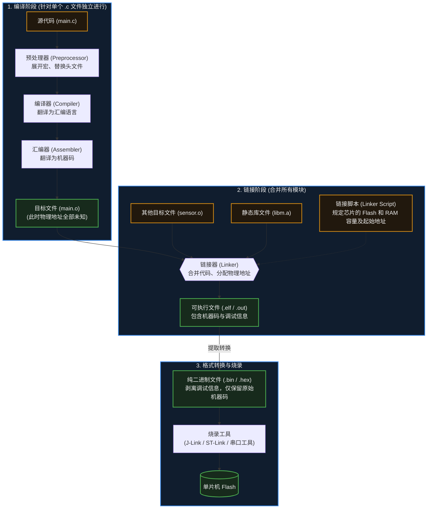

# 23. 编译、链接与烧录

> [!info] 写在前面
> 在初学嵌入式开发时，大部分人习惯了在 IDE（如 Keil、IAR 或 VSCode）中按一下“Build（构建）”按钮，然后点一下“Download（下载）”，程序就神奇地在板子上跑起来了。
> 然而，当系统越来越大，遇到“内存溢出 (RAM Overflow)”、“未定义引用 (Undefined Reference)”或者试图划分 Bootloader 与 App 分区时，不懂底层构建流程的人往往会束手无策。
> 这一章，我们将拆解这个“黑盒”，看看你写的英文 C 代码，究竟是如何被一步步翻译、拼装，并最终安置到芯片物理内存中的。

## 23.1 一句话理解与正式定义

**一句话理解**：
这是一条工业流水线。首先把每份图纸（C 文件）单独翻译成零件（编译），然后把所有零件组装成一个完整的机器并分配好具体的摆放位置（链接），最后用集装箱把机器运送到工厂的车间里（烧录）。

**正式定义**：
在嵌入式工程中，这一整套流程由 **交叉编译工具链 (Cross Toolchain)** 完成。
- **交叉编译 (Cross-Compilation)**：因为单片机的算力极弱且没有操作系统，无法在自己身上运行编译器。因此我们必须在 x86 架构的电脑（宿主机 Host）上运行编译器，去生成针对 ARM 或 RISC-V 架构（目标机 Target）的机器码。
- **构建流水线**：通常严格遵循 `预处理 (Preprocessing) -> 编译 (Compilation) -> 汇编 (Assembly) -> 链接 (Linking)` 四个阶段。

## 23.2 构建流水线：从代码到机器码

无论是使用 GCC 命令行，还是点击 IDE 的编译按钮，底层都会经历以下标准的流水线：

### 关键环节解析：
1. **预处理 (Preprocessing)**：处理所有以 `#` 开头的语句。比如把 `#include <stdio.h>` 里的内容全部复制粘贴过来，把 `#define MAX 100` 里的 `MAX` 全部替换成 `100`。
2. **编译与汇编生成目标文件 (`.o` / `.obj`)**：这是**很重要**的认知。编译器在处理 `main.c` 时，它是“蒙着眼睛”的。如果 `main.c` 里调用了 `sensor_init()` 函数，但这个函数写在 `sensor.c` 里，编译器并不知道这个函数的实际地址。它只会在 `.o` 文件里留下一个“占位符”，等别人来填。
3. **链接 (Linking)**：链接器登场，把所有的 `.o` 文件合并。它负责“填坑”：找到 `sensor_init()` 真正的位置，把对应的物理地址填回到 `main.o` 的占位符里。如果它翻遍了所有 `.o` 文件都没找到这个函数，就会报出著名的**链接错误**。

## 23.3 决定命运的图纸：链接脚本 (Linker Script)

在 Windows 或 Linux 下写应用程序，操作系统会自动在虚拟内存中为你分配地址。
但在嵌入式裸机开发中，芯片的 Flash 从哪个物理地址开始？容量多大？RAM 在哪里？必须由开发者手动告诉链接器。这就是 **链接脚本 (Linker Script，在 GCC 中通常为 `.ld`，在 Keil 中为 `.sct`)** 的作用。

链接脚本不仅划定了物理边界，还负责将程序中的不同数据分类存放到特定的**段 (Section)** 中。理解这些段的分布，是解决内存溢出的前提：

| 段名 (Section) | 存放内容 | 最终物理存放位置 | 占用 Flash 吗？ | 占用 RAM 吗？ |
| :--- | :--- | :--- | :--- | :--- |
| **.text** | 程序的代码逻辑（汇编指令）。 | 通常在 Flash 中（具体由链接脚本与运行方式决定）。 |占用 | 不占用 |
| **.rodata** | 只读数据 (Read-Only)。如 `const int` 和代码里写的字符串 `"Error\n"`。 | 通常在 Flash 中（具体由链接脚本与运行方式决定）。 | 占用 | 不占用 |
| **.data** | 已经初始化，且初值不为 0 的全局变量和静态变量。 | **初始值存在 Flash 中**，系统启动时被复位代码搬运到 **RAM** 中。 | 占用 | 占用 |
| **.bss** | 未初始化，或初始化为 0 的全局变量和静态变量。 | 不需要保存初始值。系统启动时在 **RAM** 中直接清零。 | 不占用 | 占用 |

> [!note] 栈 (Stack) 和堆 (Heap) 在哪里？
> 它们通常不体现为固定的静态段，而是在链接脚本中，利用 `.bss` 段结束后的剩余 RAM 空间，动态划分为堆和栈。

## 23.4 把程序塞进芯片：烧录 (Programming / Flashing)

经过格式转换后生成的 `.bin` (纯二进制) 或 `.hex` (带地址标记的文本) 文件，需要通过特定的硬件接口写入单片机的 Flash 中。常见的工程手段有：

1. **在线调试器接口 (JTAG / SWD)**：
   - 依赖外部硬件工具（如 J-Link、ST-Link、DAPLink）。
   - 它们直接通过芯片底层的调试总线，强行控制 CPU 和内存。不仅能极速烧录固件，还支持在 IDE 中打断点、单步执行、查看寄存器（这是嵌入式开发效率最高的方式）。
2. **Boot ROM 引导 (串口 / USB 下载)**：
   - 如果你手头没有调试器，很多芯片（如 ESP32、部分 STM32）出厂时，在不可擦写的只读存储器（Boot ROM）里固化了一段非常小的程序。
   - 通过将特定的硬件引脚（Boot Pin）拉高或拉低，芯片上电时会优先运行这段 ROM 代码。它能通过普通的串口 (UART) 或 USB 接收电脑发来的数据，并自行烧录到 Flash 中。
3. **用户 Bootloader (OTA)**：
   - 正如第 22 章所述，这是设备量产后，通过 Wi-Fi/4G 从云端下载固件并自行烧录的方式。

## 23.5 常见误区与工程陷阱

在日常开发中，编译与链接报错是新手的最大阻碍。以下是必须理清的工程排错思路：

### 陷阱 1：混淆“编译错误”与“链接错误”
**现象**：新手遇到报错，统称为“编译不过”，然后在网上一顿乱搜，找不到根本原因。
**工程对策**：必须学会分辨报错阶段。
- **编译错误 (Compiler Error)**：通常是语法错误，或者**找不到头文件 (`#include`)**。比如你调用了 `sensor_init()`，但没包含头文件。编译器报错：“隐式声明函数”。
- **链接错误 (Linker Error)**：通常是语法全对，头文件也包含了。但**你没有把 `.c` 文件加入到工程（Makefile / CMakeLists）中**。编译器在编译单个文件时被头文件“骗”过了，但链接器在最后总装时，找不到对应的 `.o` 实现。此时必然报错：**`Undefined reference to 'xxx'` (未定义引用)**。

### 陷阱 2：头文件包含变量定义导致的“多重定义”
**现象**：在 `config.h` 中写了一句 `int device_mode = 0;`。然后有两个 `.c` 文件都 `#include "config.h"`。最后报错：**`Multiple definition of 'device_mode'` (多重定义)**。
**原因机制**：`#include` 的本质是无脑复制粘贴。两个 `.c` 文件各自编译后，生成了两个独立的 `.o` 文件，里面各自拥有一个名为 `device_mode` 的全局变量。链接器合并它们时，发现两个同名的变量，不知道该用哪个，引发冲突。
**工程原则**：头文件 (`.h`) 中只能包含变量的**外部声明 (`extern int device_mode;`)**。真正的定义和初始化必须且只能放在某一个唯一的 `.c` 文件中。

### 陷阱 3：资源溢出却不看 Map 文件
**现象**：报错提示 `region RAM overflowed by 1024 bytes`（RAM 满了），新手只能靠盲猜去删减代码里的数组。
**工程对策**：链接器在工作结束后，除了生成可执行文件，还可以生成一份很重要的“账本”——**`.map` 文件**。
这份文件详细记录了每一个函数、每一个全局变量最终被分配在了哪个物理地址，以及它们究竟占用了多少字节的 Flash 和 RAM。
当遇到内存瓶颈时，**第一件事就是用文本编辑器打开 `.map` 文件（或使用对应的可视化分析工具）**，立刻就能精准定位是哪个庞大的数组或库函数“吃”光了你的单片机资源。
