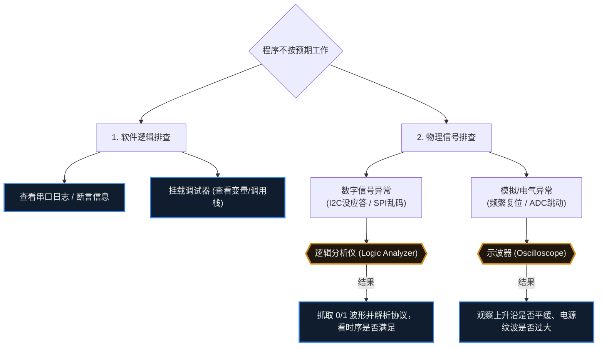

# 24. 调试方法

> [!info] 写在前面
> 在纯软件开发中，如果程序崩溃，通常会弹出一个详细的报错窗口告诉你错在哪一行。
> 但在嵌入式系统中，设备往往是一个没有屏幕的“黑盒”：出现异常时可能只是死机，或者外接电机突然异常转动。更棘手的是，问题的根源可能在 C 代码里，也可能来自外部的电磁干扰，或者是电源线上的电压跌落。
> 这一章，我们将建立从软件逻辑到物理电平的系统级排错思维，并介绍工程师手中的核心调试武器。

## 24.1 一句话理解与正式定义

**一句话理解**：
调试就是在程序行为与预期不符时，一步步缩小“可能出错的范围”，最终定位到根本原因的过程。

**正式定义**：
调试 (Debugging) 是通过观测手段（日志、调试器、逻辑分析仪、示波器）与控制手段（断点、单步执行、变量与寄存器读写），定位程序或硬件行为与预期之间偏差的成因，并验证修复措施是否有效的工程过程。

> [!note] 调试不是“试错”
> 调试的典型方法是：提出假设 → 设计能区分不同假设的观测手段 → 根据观测结果收敛结论。漫无目的地反复修改代码属于试错，通常不是高效的调试方式。

## 24.2 软件观测：日志输出 (Logging) 与断言 (Assertion)

最基础也是最普遍的调试方法，是让单片机“主动汇报”它的内部状态。

### 1. 串口日志 (UART Logging)
通过重定向 `printf` 函数，将变量的值、状态机的流转、错误码通过 UART 发送到电脑终端。
- **优点**：不需要特殊的仿真硬件，随时随地可以查看，是生产环境下最核心的排障手段。
- **工程代价与风险**：在第 10 章中我们提到过，串口传输速度相对较慢。如果频繁打印长字符串，或者底层 API 是阻塞式的，日志输出行为本身会**明显改变系统的时序**。

### 2. 断言 (Assertion)
防御性编程的常用工具。在代码中加入 `assert(指针 != NULL);` 或 `assert(数组索引 < 100);`。
- **机制**：当条件为假时（说明发生了在逻辑上不应发生的事情），`assert` 通常会立即触发一个异常或中断，或者打印出出错的文件名和行号，并让系统停在死循环中等待调试。
- **工程意义**：断言能在错误发生的**现场**立即中止程序，把排查范围收敛到断言所在的调用路径上，而不是等到野指针破坏内存、引发难以定位的崩溃之后才去排查。

## 24.3 硬件入侵：在线仿真调试 (In-Circuit Debugging)

当你无法通过日志定位 Bug 时，就需要直接观察芯片内部状态。通过 **JTAG** 或 **SWD** 调试接口，配合硬件仿真器（如 J-Link、ST-Link），我们可以暂停并控制 CPU 的执行。

**核心功能**：
- **断点 (Breakpoint)**：让 CPU 在执行到某一行代码时停下来。
- **单步执行 (Step Over / Step Into)**：让 CPU 一条一条指令地执行，观察代码走向。
- **查看内存与寄存器**：在 CPU 暂停时，直接读取 RAM 中变量的当前值，或者检查外设寄存器的配置是否生效。

> [!warning] 调试器的系统级副作用
> 认为“CPU 暂停了，整个世界就暂停了”是一种危险的错觉。
> 1. **外设可能还在运行**：在大多数默认配置下，虽然 CPU 不再取指令，但外部的电机可能还在依靠惯性转动，**硬件 PWM 也可能还在继续输出高电平**，这在电源或电机控制开发中可能导致硬件损坏。
> 2. **网络连接会断开**：CPU 暂停后无法响应底层网络心跳（Keep-Alive），一段时间后，云端服务器会认为该设备已经掉线。
> 因此，在强实时和涉及大功率输出的场景中，使用断点需要非常谨慎，有时甚至无法使用断点调试。

## 24.4 物理层洞察：逻辑分析仪与示波器

当软件层面的检查没有结果，或者涉及外部传感器通信（I2C / SPI / UART）时，通常应先停止盲目修改代码，转而观察物理引脚上的真实信号。

### 1. 逻辑分析仪 (Logic Analyzer)
用于观察**数字信号**的主要工具。
- **功能**：它判断引脚是高电平（1）还是低电平（0），同时能记录多个通道的长时间波形，并**自动解析常见通信协议**。
- **场景**：当你发送了 I2C 读命令却收到乱码时，接上逻辑分析仪，通常很快就能看出是从机回了 NACK、地址发错，还是时钟频率配置不对。相比在代码中反复猜测，这种方式效率更高。

### 2. 示波器 (Oscilloscope)
用于观察**真实物理电平（模拟量）**的主要工具。
- **功能**：记录电压随时间变化的真实波形。
- **场景**：逻辑分析仪告诉你引脚是“1”，但在示波器上看，这个“1”可能只有 2.0V（电平不匹配）；或者它本该是较陡的方波，却因为连接线过长、分布电容过大，呈现出上升沿很缓的波形；又或者是电源线上存在较大的电压毛刺，导致单片机频繁复位。这类问题通常需要示波器才能观察到。

## 24.5 终极排错：HardFault 与异常分析

在基于 ARM Cortex-M 的微控制器开发中，比较难排查的一类故障是程序进入了 **HardFault_Handler（硬件错误异常）** 并停在死循环里。
（注：在 RISC-V 等其他架构中，也有类似的 Trap 或 Exception 机制。）

**触发原因**：
CPU 遇到了无法继续执行指令的情况。常见的包括：访问了不存在的内存地址（野指针）、除以零、数组越界破坏了内存、向只读的 Flash 写入数据，以及栈溢出（Stack Overflow）。

**工程化排障链路**：
遇到 HardFault 时不宜直接重启，现场保留了关键的定位线索：
1. **连接调试器**：让程序停在 HardFault 的死循环里。
2. **查看 Call Stack（调用栈）**：现代 IDE 能够回溯 CPU 发生崩溃前经历的函数调用链。这能让你大致定位崩溃发生在哪一个业务模块。
3. **查看特定寄存器**：
   - **PC (Program Counter)**：通常指向引发崩溃的指令，或者崩溃瞬间正在执行的代码。
   - **LR (Link Register)**：记录了当前函数执行完原本应该返回的地址，是追溯现场的关键。
   - **系统故障状态寄存器 (如 Cortex-M 的 CFSR / HFSR)**：硬件会在这些特殊寄存器里打上标记，告诉你具体是因为“总线错误 (Bus Fault)”、“内存管理错误 (MemManage Fault)” 还是 “用法错误 (Usage Fault)” 引起的崩溃。

> [!warning] 崩溃地点不一定是错误源头
> 这是复杂系统中排查内存问题的难点。
> 假设任务 A 因为数组越界改写了任务 B 的指针变量（此时并没有崩溃）；一段时间后，调度器切换到任务 B，任务 B 使用这个已被破坏的指针访问内存，触发了 HardFault。
> 此时 PC 和 Call Stack 都会指向任务 B，但问题的源头在任务 A。定位这类问题通常需要结合代码审查、硬件数据观察点 (Watchpoint) 以及 RTOS 的栈溢出检测功能。

## 24.6 常见误区与工程陷阱

### 陷阱 1：海森堡 Bug (Heisenbug)
**现象**：程序偶尔会出错，但插上调试器，或者加上一句 `printf` 观察变量时，Bug 就不再出现；一旦去掉打印，Bug 又重新出现。
**原因机制**：加入调试动作（如 `printf` 带来的延时）**改变了系统原本的并发时序**。原本两个任务在同一时间窗口内产生的数据竞争，可能因为 `printf` 造成的毫秒级延迟而被错开。
**工程对策**：遇到此类 Bug，可以优先怀疑**未加保护的共享全局变量（数据竞争）**、**中断嵌套时序问题** 或 **栈空间处于临界溢出状态**。

### 陷阱 2：过度怀疑底层编译器或硬件
**现象**：代码行为异常，排查很久没有结果，于是开始怀疑“这颗单片机坏了”或者“GCC 编译器有 Bug”。
**工程常识**：在绝大多数情况下，编译器与 MCU 硬件的行为是符合规范的：编译器经过大规模测试，MCU 的底层逻辑也经过了大量验证。如果怀疑芯片算错了 `1+1`，更常见的原因是变量溢出、指针破坏内存，或者硬件外围环境（电源、接线、信号干扰）存在问题。
**排查顺序建议**：**先检查自己的代码逻辑，再检查硬件接线与供电，最后再考虑工具链或芯片本身的问题。**
