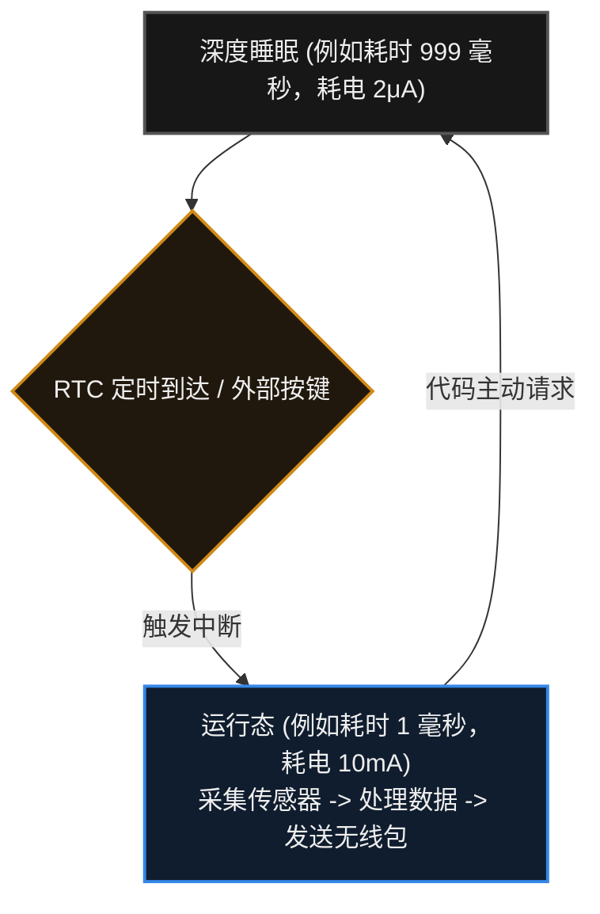

# 25. 低功耗

> [!info] 写在前面
> 如果你的嵌入式设备是插在 220V 插座上工作的，通常不需要关心低功耗。
> 但如果你的设备（如智能手表、无线传感器、防丢器）由一颗纽扣电池或者小容量锂电池供电，并且要求连续运行一年以上，那么“如何省电”就会成为整个系统软硬件架构设计的核心问题。
> 这一章，我们将探讨 MCU 如何通过电源与时钟管理，把每一微安（μA）量级的功耗都利用起来。

## 25.1 核心机制：MCU 为什么会耗电？

**一句话理解**：
低功耗设计就是在“设备要能及时干活”和“设备要尽量省电”之间做取舍，让有限的电池电量撑得更久。

**正式定义**：
低功耗设计 (Low-Power Design) 是在满足功能需求与实时性约束的前提下，通过硬件选型、电源域划分、时钟管理、工作模式调度与软件策略，降低系统平均功耗的软硬件协同优化过程。这里关注的核心指标通常是**平均功耗**（即一段时间内消耗的能量除以时间），而不是某个瞬间的电流值。

> [!note] “省电”不是单一指标
> 评价一个低功耗方案时，通常需要同时考虑：工作时的动态功耗、休眠时的静态功耗（漏电流）、唤醒所需的时间与能量，以及唤醒频率（占空比）。只看休眠电流的数值往往不够。

在数字电路底层，MCU 绝大部分面积由 CMOS（互补金属氧化物半导体）晶体管构成。它的功耗主要来自两个部分：

1. **动态功耗 (Dynamic Power)**：
   - **原理**：每次数字信号发生 `0` 和 `1` 的翻转时，内部的微小电容就需要充放电，这会消耗能量。
   - **决定因素**：翻转频率和电压。简单来说：**时钟跑得越快（频率越高），动态功耗越大**。
   - **工程对策**：降低工作频率（降频），或者在不需要计算时直接关闭某部分电路的时钟（时钟门控，Clock Gating）。

2. **静态功耗 (Static Power / Leakage)**：
   - **原理**：即使时钟完全停止，晶体管不发生任何翻转，只要芯片通着电，就会有极其微弱的电流“漏”过去，这被称为漏电流（Leakage Current）。
   - **工程对策**：彻底切断某一部分电路的供电（电源门控，Power Gating）。

## 25.2 低功耗模式的通用层级

为了在“响应速度”和“省电”之间取得平衡，MCU 厂商通常会设计多个级别的低功耗模式。
> [!note] 术语预警：各家叫法不一
> 不同的芯片原厂对低功耗模式的命名千差万别（比如有的叫 Stop，有的叫 Deep Sleep，有的叫 Hibernate）。但从宏观架构来看，它们通常遵循以下由浅入深的梯度规律：

| 模式层级 | 典型行为 (具体以 Datasheet 为准) | 内存 (RAM) 数据 | 唤醒时间 | 典型功耗 | 适用场景 |
| :--- | :--- | :--- | :--- | :--- | :--- |
| **正常运行 (Active)** | CPU 全速执行指令，所有外设时钟开启。 | 保持 | 无延迟 | 毫安级 (mA) | 正常处理数据、复杂计算。 |
| **空闲/睡眠 (Idle / Sleep)** | **CPU 停止工作**，但总线和大部分外设（UART、Timer、DMA）继续运行。 | 保持 | 极快（几个时钟周期）| 较低 (mA ~百 μA) | CPU 在两次中断之间短暂休息，随时准备恢复干活。 |
| **深度睡眠 (Deep Sleep / Stop)** | 高速时钟发生器（PLL / 外部高速晶振）关闭。保留低速时钟（RTC）。大部分外设停止。 | 保持（或部分保持）| 中等（微秒级，需等待高速时钟重新起振）| 微安级 (μA) | 智能手表的日常待机，按键或定时器唤醒。 |
| **关机/待机 (Hibernate / Standby)** | 芯片内部的供电域几乎全部切断，仅保留唤醒引脚和极简电路。 | **全部丢失** (相当于重启) | 极慢（毫秒级，等同于冷启动）| 极低（纳安级 nA，具体值以 Datasheet 为准） | 电视遥控器，按一次键发一次信号，其余时间长期处于睡眠状态。 |

## 25.3 唤醒机制与周期性任务

当 MCU 进入低功耗模式（尤其是深度睡眠）后，CPU 已经停止取指令。要让它醒过来，必须依赖**硬件触发**。典型的唤醒源有：

1. **外部中断（在 STM32 中为 EXTI，其他厂商的命名与配置方式不同）**：例如用户按下物理按键，引脚电平跳变触发唤醒。
2. **实时时钟 (RTC)**：即使在深度睡眠中，MCU 内部通常会保留一个由 32.768kHz 低速晶振驱动的 RTC 电路。它可以在指定时间触发唤醒（相当于内部闹钟）。
3. **低功耗通信外设**：某些 MCU 允许在深度睡眠时保持特定的低功耗 UART 或 I2C 监听，当收到特定的“唤醒包（Wake-up Frame）”时才唤醒系统。

**工程上的经典架构（占空比运行）：**
电池设备通常采用低占空比（Duty Cycle）的工作模式：**绝大部分时间处于睡眠状态，短时间唤醒完成工作，然后尽快回到睡眠**。

## 25.4 软硬协同：不只是调一个 API

一个常见的误解是：低功耗开发就是调用一个 `HAL_PWR_EnterSLEEPMode()`（STM32 HAL 示例）函数，然后功耗就能降到 Datasheet 宣称的 1μA。但实测结果往往高达几 mA。
在真实的工程中，**低功耗是系统级工程，需要软硬件配合**。

### 硬件设计的底线约束
如果电路板上有一颗始终常亮的电源指示灯（耗电约 2mA），或者使用了一个静态功耗较高的 LDO（稳压器自身耗电几百 μA），那么 MCU 无论进入多深的睡眠模式，整个设备的功耗也难以降下来。低功耗硬件设计通常会加入电源开关电路（如负载开关、MOS 管），让 MCU 能够切断高功耗外围传感器或通信模组的供电。

### 软件层的清理工作 (De-init)
在进入深度睡眠前，软件通常需要完成这些清理工作：
- 关闭不需要的外设时钟。
- 切断外部模组供电。
- **其中很重要的一步：妥善配置各个 GPIO 的状态。**

## 25.5 常见误区与工程陷阱

在低功耗项目的调试中，下面三类问题比较常见：

### 陷阱 1：GPIO 漏电流 (Leakage Current)
**现象**：MCU 已经进入最深的 Standby 模式，但依然存在几百微安的异常功耗。
**原因与机制**：
我们在第 3 章和第 7 章提到过引脚的**悬空（Floating）**状态。在进入睡眠模式时，如果某些没有外部连接的 GPIO 被配置为数字输入且悬空，外部微小的干扰会使 CMOS 输入缓冲器内部的门电路处于中间状态，产生“贯通电流（Shoot-through current）”。
如果有外部设备与 MCU 连接，而 MCU 进入睡眠后外部设备未断电，电流还可能通过 GPIO 引脚“倒灌”进 MCU。
**工程对策**：
进入深度睡眠前，通常需要逐一配置 GPIO：
1. 没有使用的引脚，通常配置为**模拟输入 (Analog Input)**（关闭数字输入缓冲器），或者配置为带上/下拉的输入。
2. 连接了外部设备的引脚，需要根据外部设备的电平状态进行匹配配置，避免产生电位差导致电流经引脚流入或流出。

### 陷阱 2：调试器 (Debugger) 阻碍了休眠
**现象**：插着 J-Link / ST-Link 仿真器测量功耗，会发现无论怎么改代码，功耗都降不下去。
**工程常识**：
调试接口（SWD / JTAG）通常属于一个独立的硬件电源域。只要调试器插着，甚至只在软件里开启了调试功能，MCU 内部的调试模块时钟就可能保持开启，阻止芯片进入真正的深度休眠。
**工程对策**：
测量最终功耗时，通常需要**拔掉调试器与串口线**，改用电池或独立直流电源供电后再测量。

### 陷阱 3：用普通万用表测量动态电流导致的复位
**现象**：为了测量几十微安的睡眠电流，把万用表打到微安（μA）档串联进电路。结果 MCU 一醒来准备发送无线数据，设备就复位重启了。
**机制原因**：
万用表测量电流的原理是串联一个采样电阻（Burden Voltage）。当你打到微安档时，内部串联的电阻较大。
当 MCU 睡眠时电流极小，分压不明显；但当 MCU 醒来瞬间需要 50mA 的大电流时，万用表的内阻上会产生明显的电压降。MCU 供电端实际得到的电压可能跌落到工作电压以下，触发硬件的掉电复位（Brown-out Reset, BOR）。
此外，普通万用表的采样频率较低，难以捕捉仅持续几毫秒的大电流脉冲，测出来的平均功耗参考价值有限。
**工程对策**：
在严格的低功耗工程中，普通万用表通常不适合做这类测量，需要使用专用的 **功耗分析仪 (Power Profiler)**，或者使用带宽与分辨率足够的示波器配合专用微小电流探头，来观察瞬态电流的波形和积分平均值。
