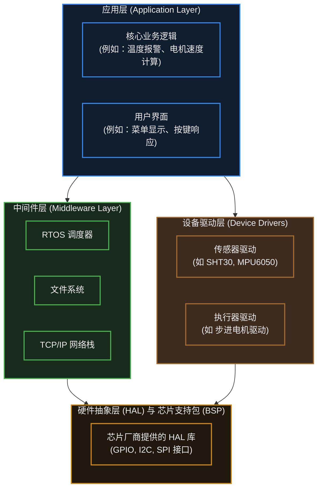

# 27. 嵌入式软件架构


> [!info] 写在前面
> 在学习阶段，我们习惯将点灯、读传感器、打印串口的代码全塞进 `main()` 函数的 `while(1)` 里。
> 但当你的代码从几百行膨胀到几万行，当你需要多人协作开发，或者当底层芯片因为缺货需要临时替换时，这种“面条式代码”的维护成本会急剧上升。
> 这一章，我们将探讨如何从宏观上组织代码，介绍几种嵌入式行业中被反复验证的经典软件架构模型。

## 27.1 一句话理解与正式定义

**一句话理解**：
软件架构就是给整个系统的代码“划定部门”和“修筑马路”。它决定了哪些代码负责底层通信，哪些代码负责业务逻辑，以及它们之间如何安全地传递数据，而不至于互相干扰。

**正式定义**：
**嵌入式软件架构 (Embedded Software Architecture)** 是对软件系统高层结构的抽象描述。
它定义了系统由哪些软件组件（Components）构成、各个组件的职责边界，以及组件之间交互（通信与同步）的机制与原则。良好的架构能够显著提升代码的**可移植性、可测试性、可维护性**以及系统运行的**时间确定性**。

## 27.2 分层架构 (Layered Architecture)

无论是裸机还是 RTOS，现代正规嵌入式工程几乎都会采用**分层架构**。其核心理念是：**上层依赖下层，下层不感知上层的存在；通常不允许反向或跨层直接调用。**



**工程意义**：
当由于成本原因需要将主控芯片从 STM32 换成国产单片机时，**应用层和中间件层往往不需要修改**，通常只需替换底层的 HAL 库，并适当调整设备驱动层即可。这就是分层架构带来的巨大商业价值。

## 27.3 常见的执行架构模型

在划定了层级之后，代码在 CPU 上具体是按照什么顺序和逻辑执行的？工程中常见的有以下三种执行架构：

### 1. 轮询架构 (Super Loop / 前后台系统)
- **机制**：后台是一个死循环 `while(1)`，轮流调用各个业务函数；前台是中断（ISR），负责处理紧急硬件事件。
- **优点**：最简单，没有上下文切换的开销，不需要复杂的堆栈管理。
- **缺点**：任何一个函数的阻塞（如等待 I2C 应答），都会导致整个循环停滞，其他任务无法得到及时响应。
- **适用场景**：逻辑简单、无严格并发要求的小型设备（如简单的电动牙刷）。

### 2. 时间触发架构 (Time-Triggered Architecture, TTA)
- **机制**：依赖一个核心的硬件定时器（通常是 SysTick），产生固定的系统节拍（如 1 毫秒）。系统维护一个任务列表，严格规定“任务 A 每 10ms 执行一次，任务 B 每 50ms 执行一次”。
- **优点**：**可预测性高、时间确定性强**。在执行时间评估准确的前提下，系统行为完全可控，调试极其方便。
- **缺点**：难以应对突发的大量异步事件，且要求所有任务的单次执行时间必须极短，严禁阻塞。
- **适用场景**：汽车 ECU、航空航天、硬实时电机控制等安全关键（Safety-critical）系统。

### 3. 多任务抢占式架构 (RTOS 架构)
- **机制**：依赖 RTOS 调度器，将系统拆分为多个拥有独立堆栈的 Task。高优先级任务可以随时打断低优先级任务。
- **优点**：较好地解耦了时间相关的阻塞逻辑，网络通信、UI 刷新和后台计算可以“并行”开发。
- **缺点**：引入了数据竞争、死锁等并发难题，且 RAM 开销显著增加。
- **适用场景**：包含复杂协议栈（TCP/IP、Bluetooth）、GUI 界面或物联网 IoT 网关设备。

## 27.4 解决非阻塞的核心：有限状态机 (FSM)

在轮询架构或时间触发架构中，**不应使用忙等延时**。那么，如果我们需要“让电机转动 2 秒后再停止”，该怎么写代码？
这就必须引入嵌入式工程师的必修课：**有限状态机 (Finite State Machine, FSM)**。

**工作原理**：
把一个长耗时的动作，拆解成多个离散的“状态”。每次主循环执行到这里时，只检查时间或条件是否满足；满足则切换到下一个状态，不满足则立刻退出（`return`），把 CPU 交给别人。

**工程实践示例（非阻塞延时机制）：**
```c
// 定义电机的各种状态
typedef enum {
    MOTOR_IDLE,
    MOTOR_START,
    MOTOR_WAITING,
    MOTOR_STOP
} MotorState_t;

void motor_task_process(void) {
    static MotorState_t state = MOTOR_IDLE; // 静态变量，保存当前状态
    static uint32_t start_time = 0;         // 记录起始时间

    switch (state) {
        case MOTOR_IDLE:
            if (get_button_pressed()) {
                state = MOTOR_START;
            }
            break;
            
        case MOTOR_START:
            turn_on_motor();
            start_time = get_system_tick(); // 获取当前系统毫秒数
            state = MOTOR_WAITING;
            break;
            
        case MOTOR_WAITING:
            // 非阻塞检查：当前时间 - 起始时间 >= 2000ms
            if (get_system_tick() - start_time >= 2000) {
                state = MOTOR_STOP;
            }
            // 如果没到 2 秒，立刻退出 switch，不阻塞 CPU！
            break;
            
        case MOTOR_STOP:
            turn_off_motor();
            state = MOTOR_IDLE;
            break;
    }
}
```
> **工程意义**：状态机是替代 `delay()` 的终极解法。它不仅用于时序控制，在解析串口协议帧、处理复杂 UI 菜单时，状态机也是标准的代码组织范式。

## 27.5 常见误区与工程陷阱

在系统级架构设计中，以下几个陷阱通常会导致项目在后期彻底失控：

### 陷阱 1：全局变量满天飞 (Spaghetti Code)
**现象**：为了让网络任务拿到传感器任务的数据，直接定义了一个全局变量 `float global_temp;`，并且在代码的各个文件里随意使用 `extern float global_temp;` 进行读写。
**工程隐患**：
1. 引发极难排查的数据竞争（参考第 18 章）。
2. 模块间的耦合度极高，修改一个模块可能导致其他模块崩溃。
**工程对策**：
遵守“数据隐藏”原则。数据应该被封装在对应的模块内部，通过提供标准的接口（如 `float Sensor_GetTemp(void)`）供外部读取。如果在 RTOS 环境下，应优先使用**消息队列 (Message Queue)** 进行模块间的数据传递。

### 陷阱 2：过度使用 RTOS (Over-engineering)
**现象**：无论做什么项目，哪怕只是读一个 I2C 温度传感器并每秒通过串口打印一次，也要强行跑一个 FreeRTOS，并创建三四个任务。
**工程隐患**：RTOS 本身需要消耗数 KB 的 Flash 和 RAM，并带来几十微秒的调度开销。在资源非常受限（如仅有 8KB RAM）的 MCU 上强上 RTOS，会导致 RAM 瞬间捉襟见肘，后续连定义稍微大一点的数组都会栈溢出。
**工程对策**：架构没有优劣，只有合适与否。在业务逻辑线性、没有复杂阻塞需求的场景下，一个带有良好状态机设计的“超级循环（Super Loop）”往往是最稳定、开销最小的最优解。

### 陷阱 3：RTOS 任务划分不合理
**现象**：在 RTOS 中，按照“硬件设备”来划分任务。比如写一个 `Task_LED`，一个 `Task_ADC`，一个 `Task_Key`。
**工程隐患**：这种划分方式往往会导致任务数量爆炸，且大量任务其实处于空闲状态，白白浪费堆栈内存；更糟糕的是，如果某个控制流程需要按键触发 ADC 再亮灯，逻辑会被打碎在三个任务中，互相通过队列发消息，导致通信开销大于实际业务执行的开销。
**工程对策**：
任务的划分应当基于**阻塞特性和执行周期**，而不是外设。
通常的做法是：将所有极快速的轮询逻辑放在一个公共的控制任务中，将需要阻塞等待外设响应的操作（如网络通信、慢速 I2C 存储）独立为单独的任务。

> [!summary] 总结本章
> 1. **分层架构** 将代码划分为应用、中间件、驱动和 HAL 层，是实现代码可复用和硬件易移植的核心前提。
> 2. 执行架构的选择取决于业务复杂度：简单逻辑用**前后台轮询**，高可靠性控制用**时间触发 (TTA)**，复杂网络与 UI 交互引入 **RTOS 多任务**。
> 3. **有限状态机 (FSM)** 是非阻塞编程的核心手段，通过拆解动作状态并利用系统时间戳，通常可以替代裸机中的忙等 `delay`。
> 4. 优秀的架构应当**拒绝滥用全局变量**，通过提供 API 或使用 RTOS 的消息机制来管理模块间的数据流转。
> 5. 架构设计应避免**过度设计**；在 RTOS 中，应基于阻塞特性而非外设种类来合理划分任务。
