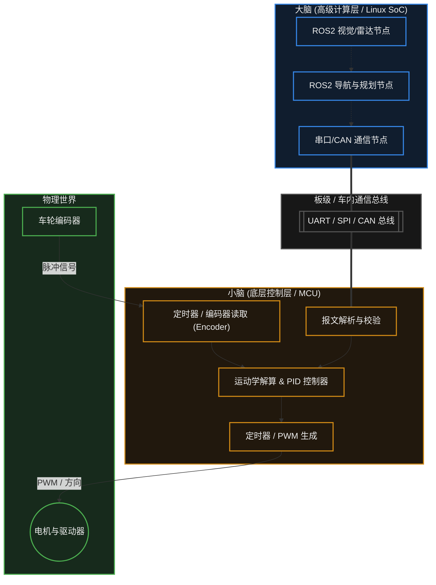

# 29. 机器人与嵌入式


> [!info] 写在前面
> 到目前为止，我们学习的都还是单一维度的技术：如何读取传感器、如何输出 PWM 控制电机、如何通过操作系统调度任务。
> 当我们把这些技术组合起来，加上复杂的环境感知和决策算法，这就演变成了一个现代机器人系统。
> 这一章，我们将跨出单片机的范畴，探讨在工业和商用机器人中，MCU（单片机）与 MPU/SoC（微处理器/系统芯片）是如何通过异构计算架构分工协作的。

## 29.1 一句话理解与正式定义

**一句话理解**：
现代机器人通常是一个“双脑系统”：高级处理器（大脑）负责思考“去哪里”，微控制器（小脑）负责精确控制肌肉（电机）“怎么走”。

**正式定义**：
**机器人控制架构**通常采用分层与异构计算（Heterogeneous Computing）模型。
它结合了运行通用操作系统（如 Linux + ROS）的高性能 SoC/MPU 以处理环境感知、SLAM（同步定位与建图）和全局路径规划，以及运行 RTOS 或裸机的 MCU 以执行严格硬实时的闭环电机控制和底层传感器高频采集。两者通过高速局部总线（如 CAN、SPI、UART）进行协同通信。

## 29.2 为什么需要异构架构？(MCU 与 Linux 的分工)

初学者常问：既然树莓派或 Jetson Nano（跑 Linux）算力这么强，为什么还要在板子上外挂一个 STM32 这种算力极弱的单片机来控制电机？为什么不直接让 Linux 输出 PWM？

这是由于 **软实时 (Soft Real-Time)** 与 **硬实时 (Hard Real-Time)** 的根本冲突决定的：

### 1. 为什么 Linux 不能直接控电机？
控制电机（尤其是闭环 PID 或 FOC 算法）需要严格的时间确定性。假设要求每隔恰好 1.00 毫秒（误差不能超过几微秒）读取一次编码器并更新一次 PWM 占空比。
- 无论 Linux 处理器的频率高达几 GHz，标准 Linux 的内核调度器可能会因为突然到来的一阵高吞吐网络数据包，或者一次系统页表切换，将电机控制进程挂起 2 毫秒。
- 这种毫秒级的调度抖动（Jitter），在电机高速运转时会导致严重的电流波动、震动异响，甚至烧毁驱动电路。

### 2. 为什么 MCU 不能做全套？
- MCU 没有足够的 RAM 和算力来运行激光雷达点云处理、机器视觉神经网络，以及庞大繁荣的 **ROS / ROS2 (机器人操作系统)** 软件生态。

### 3. 工程解法：主从异构架构
工程界较常见的解法是**各司其职**：

| 角色 | 硬件载体 | 软件环境 | 核心职责 | 典型周期要求 |
| :--- | :--- | :--- | :--- | :--- |
| **“大脑”** | MPU / SoC<br>(如 Jetson, i.MX8) | Ubuntu Linux + ROS2 | 视觉识别、SLAM 激光建图、全局路径规划、发送宏观指令（如“以 1.5m/s 前进”）。 | 百毫秒级 (10Hz) |
| **“小脑”** | MCU (单片机)<br>(如 STM32, ESP32) | FreeRTOS 或裸机状态机 | 接收宏观指令，进行运动学逆解，运行 PID 算法闭环控制各个车轮的精确转速；高频采集 IMU 姿态。 | 微秒/毫秒级 (1kHz+) |

## 29.3 机器人的系统级通信图景

这套主从架构在物理和软件上通常是这样联结的：



## 29.4 底层控制核心：PID 算法

如果说通信协议是连接两个大脑的神经，那么 **PID (Proportional-Integral-Derivative)** 算法就是底层闭环控制的核心。

在实际物理世界中，如果你直接给电机输出 50% 占空比的 PWM，它并不会刚好以一半的最高速度运行。摩擦力、地面坡度、电池电压的下降都会改变电机的真实转速。
为了让车轮严格按照主板下发的“1.5m/s”运行，MCU 必须引入**闭环控制 (Closed-Loop Control)**。

**PID 算法的基本原理：**
算法的核心驱动力是 **误差 (Error)**：`误差 = 目标速度 - 当前真实速度`。
MCU 通过读取车轮上的编码器计算出当前真实速度，然后计算出三个调整量，最后加在一起修改 PWM 占空比：

1. **P (比例, Proportional)**：当前误差有多大，就施加多大比例的推力。误差大，推力猛；误差小，推力弱。
2. **I (积分, Integral)**：过去一段时间内误差的累积。如果遇到上坡，P 推力不够导致一直达不到目标速度，I 就会随着时间逐渐累加变大，最终爆发出足够的力量冲上坡。它负责消除**静态误差**。
3. **D (微分, Derivative)**：误差变化的速度。如果速度增加得太快即将超过目标值，D 会产生一个反向的阻力，防止“刹不住车（超调，Overshoot）”。它起的是**阻尼和预测**作用。

**工程上的经典代码实现框架：**
```c
// 伪代码示例：在定时器中断 (如 1ms 触发一次) 中被严格周期性调用
float calculate_pid(float target, float current) {
    static float integral = 0.0f;
    static float prev_error = 0.0f;
    
    // 1. 计算当前误差
    float error = target - current;
    
    // 2. 积分项累加 (通常需要做积分限幅，防止 Windup)
    integral += error;
    
    // 3. 微分项 (当前误差与上次误差的差值)
    float derivative = error - prev_error;
    prev_error = error; // 更新历史值
    
    // 4. 计算最终输出的控制量 (Kp, Ki, Kd 为需要调试的工程参数)
    float output = (Kp * error) + (Ki * integral) + (Kd * derivative);
    
    return output;
}
```

## 29.5 常见误区与工程陷阱

在构建这种复杂的“异构机器人系统”时，系统的脆弱性往往不体现在单一节点上，而是出在节点间的通信与调度上。

### 陷阱 1：缺少心跳机制导致“失控疯跑”
**现象**：高级 Linux 上的导航程序突然崩溃卡死，结果机器人并没有停下来，而是以崩溃前最后的指令速度，撞上了墙壁甚至伤到人。
**原因与机制**：如果 MCU（小脑）只在收到指令时更新目标速度，那么当 Linux（大脑）宕机不再下发新指令时，MCU 的 PID 闭环控制器会非常忠诚地将电机维持在最后一次收到的速度上运行。
**工程对策**：在异构架构中，主从机之间必须引入严格的**双向看门狗 / 心跳包机制 (Heartbeat)**。MCU 必须监控通信总线，如果超过设定时间（例如 500 毫秒）没有收到来自 Linux 的有效控制指令，MCU 必须立即主动将目标速度设为 0，甚至断开电机驱动器的使能信号触发安全急停。

### 陷阱 2：PID 控制周期抖动 (Jitter)
**现象**：将 PID 算法代码写在主循环 `while(1)` 里，发现电机运转非常粗糙，甚至参数根本调不出来（一会震荡一会没力气）。
**原因机制**：PID 算法的积分（I）和微分（D）项，在数学上高度依赖于**严格固定且均匀的时间间隔 ($\Delta t$)**。如果放在主循环中，系统处理其他任务（如解析串口数据）耗时的长短变化，会导致两次计算 PID 的时间间隔一会是 1ms，一会是 5ms。时间 $\Delta t$ 变了，累加出来的积分值就失去了真实的物理意义。
**工程对策**：闭环控制算法**通常必须放在硬件定时器中断 (ISR)** 或者 RTOS 中**极高优先级的周期性 Task** 中执行，以保证极低的执行时间抖动（Jitter控制在微秒级）。

### 陷阱 3：通信带宽与实时性错配
**现象**：Linux 尝试以 100Hz 的频率向 MCU 发送 6 个电机的控制指令，并要求回传 6 个编码器数据，结果发现通信出现严重的延迟和丢包。
**原因分析**：工程师在两者之间随便选了一个波特率为 115200 的 UART 串口。算一笔账：115200 bps 大约每秒能传 11.5 KB 数据。如果协议包含了包头、校验和数据载荷，一帧可能长达 30 字节；双向通信在 100Hz 下的吞吐量可能接近甚至超出了 UART 的物理极限，且 UART 缺乏硬件级的防冲突机制。
**工程对策**：在机器人系统内部，如果涉及多节点或高频实时控制数据交互，**CAN 总线 (Controller Area Network)** 往往是首选（其具备硬件级仲裁与校验，可靠性较高）；如果只是板对板的点对点高频大量数据传输，则应选择 **SPI** 或 USB，而不是传统的低速 UART。

> [!summary] 总结本章
> 1. 现代机器人普遍采用 **MPU(Linux) + MCU(RTOS/裸机)** 的异构双脑架构。
> 2. MPU 提供强大生态负责**高层感知与规划 (软实时)**；MCU 负责精确控制底层的电机执行与传感采集** (硬实时)**。
> 3. **PID 算法** 是基于误差消除的闭环控制核心，它的工程实现高度依赖于执行周期的严格固定。
> 4. 在异构通信中，必须引入**心跳检测与断联急停机制**以保障物理安全。
> 5. 控制算法不能随意放置在主循环中，必须依靠**硬件定时器中断或 RTOS 严格周期调度**，消除执行抖动 (Jitter)。
