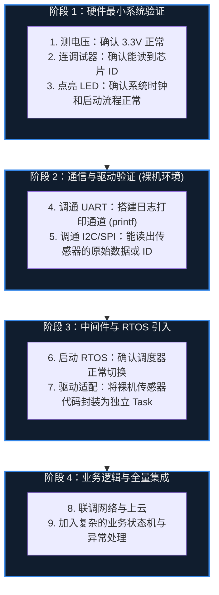

# 31. 项目开发方法


> [!info] 写在前面
> 当你学习完了前面的三十个章节，你已经掌握了点灯、总线、中断、RTOS、网络甚至轻量级 AI 的核心机制。
> 但真正的商业项目开发，并不是把这些代码随意拼凑在一起。不少新手在独立做项目时，单个模块都能跑通，一上电却直接“变砖”，面对几千行代码和复杂的电路板，不知道从何查起。
> 这一章不讲具体的硬件技术，而是探讨软件工程的通用思维：如何通过科学的**开发流**，将复杂问题拆解，并稳扎稳打地构建出一个高可靠性的嵌入式系统。

## 31.1 一句话理解与正式定义

**一句话理解**：
嵌入式项目开发中风险较高的一种做法，是把所有代码一次性写完，再一次性烧录到新打样的板子上电调试——一旦系统没有反应，就同时面对电源、时钟、驱动、RTOS、网络等多个未知变量，排查范围很宽。

**正式定义**：
嵌入式项目开发方法指在软硬件高度耦合、难以回退的约束下，用增量、可验证的工程流程，把系统从原型推进到可维护产品的实践集合。

在纯软件开发中，你写完一千行代码点击运行，如果报错了，通常只是逻辑问题。
但在嵌入式开发中，系统通常由**物理硬件、底层驱动、操作系统内核、网络栈和业务逻辑**紧密耦合而成。

如果一次性把所有代码写完，然后烧录进一块新打样的电路板中，上电后发现系统毫无反应，就会面临排查范围过宽的局面（工程上把这种一次性集成方式称为**“大爆炸集成，Big Bang Integration”**）：
- 是电源芯片虚焊了？
- 是晶振没有起振？
- 是 I2C 的上拉电阻忘了贴？
- 是 RTOS 的任务堆栈溢出了？
- 还是 MQTT 的初始化死锁了？

变量太多，很难快速定位问题。因此，嵌入式工程中常见的开发方法是：**自底向上的增量验证 (Bottom-Up Validation)**。

## 31.2 最小可行程序 (MVP) 与增量迭代

面对复杂的软硬件系统时，一种较为稳妥的策略是：**每次只引入一个未知变量**。
我们将整个项目拆分为多个具有明确里程碑意义的**最小可行程序 (Minimum Viable Program, MVP)**，逐步向上构建：



**工程实践说明**：
在“阶段 2”测试传感器时，**先不要引入 RTOS**，只写一个最简单的 `while(1)` 轮询。如果读不出数据，就可以把问题范围基本锁定在 I2C 硬件接线或底层驱动寄存器上，而不必怀疑是不是 RTOS 任务优先级配置错了。
只有当底层的每一个基石都被证明是坚固的，才能在上面砌下一块砖。

## 31.3 工程化目录结构与解耦

为了配合增量开发以及第 27 章提到的“分层架构”，我们必须在物理文件层面对项目进行严格的模块化组织。
一个良好的、适合团队协作的 C 语言嵌入式项目目录通常如下所示：

```text
my_project/
├── CMakeLists.txt        # 构建脚本 (或 Makefile)
├── README.md             # 项目说明与编译指南
├── src/                  # 源代码目录
│   ├── main.c            # 程序入口，仅负责调用各模块初始化并启动调度器
│   ├── app/              # 应用层业务逻辑 (如 task_ui.c, task_motor.c)
│   ├── bsp/              # 板级支持包 (Board Support Package)，包含电路板特定外设驱动
│   │   ├── sensor_sht30.c
│   │   └── motor_driver.c
│   └── hal/              # 硬件抽象层接口的适配实现
├── inc/                  # 供外部调用的公共头文件目录 (.h)
├── third_party/          # 第三方库 (如 FreeRTOS, LwIP, FatFS)
│   └── FreeRTOS/
└── build/                # 编译生成的中间文件和最终固件 (应被 git 忽略)
```

**工程规则**：
- `main.c` 通常不应长达几千行。它可以被理解为一个“总装车间”（类比）：只负责组装，不负责生产细节。
- `app/` 里的业务逻辑文件，如果要获取温度，应调用 `bsp/` 暴露出来的接口，**不应在 `app/` 中直接操作寄存器**。
- `third_party/` 里的外部库代码，**原则上不建议直接修改**。如果需要定制，应通过外部的 `Config.h` 调整宏定义。这样可以确保将来底层库升级时，代码的迁移成本较低。

## 31.4 版本控制：Git 的工程意义

当项目从阶段 1 推进到阶段 4 时，不可避免会发生“改了网络功能，结果导致本来正常的显示屏不亮了”的情况。
如果没有版本控制系统，就只能靠 `Ctrl+Z` 或注释代码反复试探，排查代价很高。

在正式的嵌入式工程中，通常使用 **Git** 这类版本控制系统：
1. **原子性提交 (Atomic Commit)**：每调通一个传感器、每完成一个功能块，就进行一次 Commit。确保代码仓库里的每一个节点，都是一个“可编译、可运行、可验证”的健康状态。
2. **分支开发 (Branching)**：当要引入一个风险较大的变更（比如引入文件系统或大规模重构）时，拉出一个独立的 `feature` 分支进行开发。如果方案失败，可以直接删除该分支，主分支（`main` / `master`）仍然保持稳定。
3. **二分查找定位 Bug**：如果发现一个隐藏了很久的 Bug，可以利用 Git 的历史记录，通过二分法（如 `git bisect` 功能）快速锁定是哪一次改动引入了这个致命问题。

## 31.5 常见误区与工程陷阱

### 陷阱 1：无视编译器的警告 (Warnings)
**现象**：点击编译后，IDE 输出了 0 个 Error，但带有大量 Warnings。新手觉得“反正能生成固件”，直接烧录，结果运行中系统崩溃。
**工程常识**：在 C/C++ 嵌入式开发中，**相当一部分 Warning 背后是严重的隐患**。
例如“隐式声明函数（Implicit declaration of function）”或“指针类型不匹配（Incompatible pointer type）”，这往往意味着函数参数传递的栈结构已经被破坏，或者数据被截断。
**工程对策**：在构建系统（如 CMake 或 Makefile）中，开启 `-Wall`（启用常用的警告集），必要时再开启 `-Werror`（将警告视为错误）。**工程上通常把 “0 Error、0 Warning” 作为构建门禁**，而不是等看到警告后再逐个判断是否要紧。

### 陷阱 2：面向“偶然正确”编程
**现象**：某个 I2C 传感器读不到数据，新手在代码里随便加了一句 `delay(10)`，发现居然读到数据了。于是认为问题解决，继续开发后续功能。
**危害机制**：这种被称为“迷信式编程（Voodoo Programming）”。为什么加 10 毫秒能好？是不是因为前面的硬件复位时序没满足？或者是总线上有干扰需要时间稳定？如果不查清根本原因，这个 10 毫秒在不同的温度下、或者 RTOS 加入更高优先级任务后，可能就会变成 20 毫秒，Bug 很可能再次出现。
**工程对策**：嵌入式系统建立在物理约束和确定性逻辑之上。**对大多数 Bug 而言，如果不能从代码机制或 Datasheet 的时序图中找到根本原因，通常只能算暂时掩盖了现象，而不能算真正修复。**

### 陷阱 3：盲目重构与过早优化
**现象**：为了让代码看起来更“高级”，项目刚开始就设计了过度复杂的函数指针回调、层层嵌套的抽象结构体，甚至为了省几十个字节的内存，写出晦涩难懂的指针位操作。
**工程对策**：
遵循 **“Make it work, Make it right, Make it fast” (先让它跑起来，再让它结构合理，最后再优化性能)** 的原则。
在资源没有成为瓶颈之前，代码的**可读性和可维护性**通常优先于幅度很小的性能优化。过度抽象会导致在调试时，通过 Call Stack 很难追踪底层实际发生的物理事件。

> [!summary] 总结本章
> 1. 嵌入式项目开发通常应避免“大爆炸集成”，遵循 **MVP（最小可行程序）与自底向上的增量验证**。
> 2. 使用清晰的 **目录结构和分层架构**，尽量解耦业务逻辑与底层硬件操作。
> 3. 利用 **Git 版本控制系统** 保障每一次增量功能的稳定性，隔离试错风险。
> 4. 严谨的工程态度要求：**把编译警告纳入构建门禁**、**拒绝只看表象不查根因的“偶然正确”**，以及**避免过早的底层优化**。
