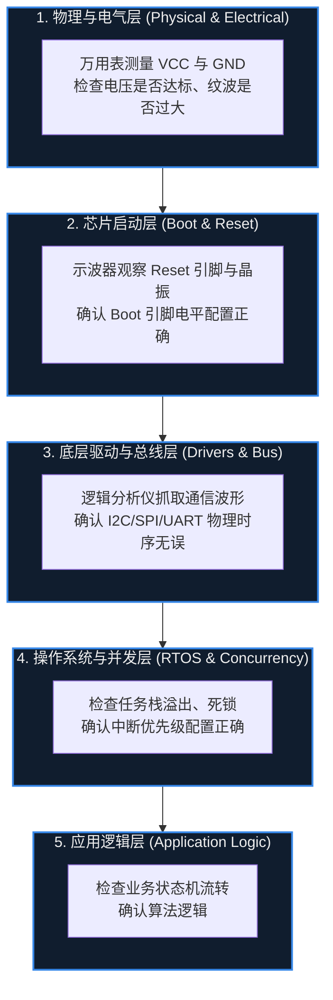

# 32. 常见问题排查

> [!info] 写在前面
> 嵌入式开发中最令人挫败的环节，莫过于代码编译通过、烧录成功，但板子却毫无反应，或者在运行几小时后莫名其妙地死机。
> 由于嵌入式系统是软硬件高度耦合的实体，排错（Debugging）不能仅仅停留在阅读 C 代码的层面。
> 本章将梳理嵌入式工程中最常见的几种故障场景，并提供一套从物理层到软件层的系统化排查方法论。

## 32.1 排查方法论：自底向上的漏斗模型

**一句话理解**：排查嵌入式故障，通常先确认最底层的“电”，再一层层往上找代码，而不是一上来就盯着 `main.c`。

**正式定义**：嵌入式问题排查，指在软硬件耦合、无法仅靠阅读源码定位的前提下，按“物理与电气层 → 硬件启动层 → 总线与外设层 → 软件逻辑层”的依赖顺序逐层排除故障的系统化方法。

面对一个未知的故障，很多新手习惯直接打开 `main.c` 开始盯着代码看。在工程实践中，这种做法效率极低。
专业的排查逻辑通常是一个**“自底向上的漏斗模型”**：一般需要先确认底层基石稳固，再向上排查软件逻辑。

## 32.2 场景 1：系统完全不运行或无限复位

**现象**：板子上电后没有任何预期反应（LED 不亮，串口无输出），或者能看到现象在以固定频率不断重启。

**工程排查链路**：
1. **电源系统检查**：单片机引脚上实际测量到的电压是多少？如果使用了大功率外设（如 Wi-Fi 模组、电机），瞬态电流是否拉低了 VCC 触发了芯片的**掉电复位 (Brown-out Reset, BOR)**？
2. **Boot 引脚状态**：查阅 Reference Manual。很多 MCU（如 STM32 的 BOOT0/1，ESP32 的 GPIO0）在复位释放的瞬间会采样特定引脚的电平。如果因为外部连线错误导致电平不对，芯片可能进入了专门的“串口下载模式”而根本没有执行你的 Flash 代码。
3. **看门狗 (Watchdog) 误杀**：程序初始化时间过长，或者在初始化阶段使用了忙等循环，导致在进入主循环前看门狗超时复位。
4. **时钟配置死机**：在 `main` 函数的最开头，通常会配置 PLL（锁相环）来提高系统时钟频率。如果外部晶振未起振，或者倍频参数超出该芯片 PLL 的支持范围（需参考 Datasheet 与 Reference Manual），系统可能在切换时钟源的瞬间直接死机。

## 32.3 场景 2：总线与外设通信失败

**现象**：UART 打印出乱码、I2C 读出全 `0xFF`、SPI 读回的数据出现规律性移位。

**工程排查链路**：
1. **共地 (GND)**：两块电路板之间通信，如果没有连接统一的 GND，所有的电平信号都是无意义的。这是排查通信问题时经常遇到的低级错误。
2. **引脚复用映射**：检查代码中是否正确启用了 GPIO 的**复用功能 (Alternate Function)**，以及是否使能了对应外设和 GPIO 端口的硬件时钟。
3. **逻辑分析仪介入**：
   - 对于 **UART**：观察单个位的宽度，计算真实波特率，检查是否与预期匹配。
   - 对于 **I2C**：观察 SCL 时钟是否产生？SDA 是否被拉低产生了 ACK？如果没有波形，大概率是**缺失上拉电阻**。
   - 对于 **SPI**：对比 Datasheet，检查时钟的空闲电平与采样边沿（CPOL / CPHA 模式配置）是否与从机手册描述的一致。

## 32.4 场景 3：随机崩溃与偶发性 HardFault

**现象**：程序运行大部分时间正常，但每隔几小时或在特定密集操作时，系统突然挂起，或者陷入了硬件错误异常（如 Cortex-M 的 HardFault）。这是嵌入式开发中较棘手的一类问题。

**工程排查链路**：
1. **栈溢出 (Stack Overflow)**：
   - 检查 ISR 或 RTOS 任务内部，是否定义了占用内存极大的局部数组。
   - 检查是否存在没有终止条件的递归函数调用。
   - 调试手段：填充栈内存为特定魔数（如 `0xDEADBEEF`），运行一段时间后通过调试器检查这些标识是否被覆盖（高水位标记法）。
2. **野指针与数组越界 (Memory Corruption)**：
   - 使用未初始化的指针，或者向数组写入了超过其容量的数据，默默覆盖了相邻的全局变量甚至覆盖了返回地址。
   - 这种破坏往往潜伏很深，直到系统尝试使用被破坏的数据时才触发崩溃。这类问题通常需要借助代码审查（Code Review）和静态分析工具排查。
3. **并发导致的数据竞争 (Race Condition)**：
   - 回顾第 18 章。主程序与中断（或两个 RTOS 任务）之间共享了同一个全局结构体，却没有使用关中断或互斥锁进行保护。由于中断触发的时机是随机的，数据的部分修改可能导致逻辑状态混乱。
4. **中断配置异常**：
   - 在高优先级中断中调用了阻塞型 API（如某些 RTOS 的 `TakeSemaphore`），或者未按该外设规定的方式清除中断标志位，导致中断被反复触发。中断标志的清除方式（例如写 1 清除、写 0 清除、读寄存器后清除、硬件自动清除）取决于具体外设设计，需参考 Reference Manual。

## 32.5 常见误区与工程陷阱

在排查上述问题时，新手往往容易陷入以下不科学的调试习惯：

### 陷阱 1：盲目修改代码碰运气 (Shotgun Debugging)
**现象**：遇到程序崩溃，不借助任何调试器或日志，随意在代码中加 `delay()`、去掉某些函数调用、或者反复调换语句的执行顺序，直到程序“碰巧”不崩溃了，就认为 Bug 修好了。
**工程危害**：这种被称为“霰弹枪调试法”。如果在未找到根本原因（Root Cause）的情况下掩盖了现象，这个 Bug 很可能在系统负载升高或代码轻微改动时再次爆发。
**工程规范**：工程实践中，修改通常应当建立在通过数据（寄存器状态、波形、调用栈）准确定位问题的基础上。

### 陷阱 2：过度依赖软件调试，忽略电气现象
**现象**：单片机 ADC 读数剧烈跳动，工程师花了几天时间在代码里编写过于复杂的卡尔曼滤波算法试图平滑数据，却无济于事。
**技术真相**：最终发现是模拟电源（VDDA）走线过细，且旁边紧挨着高频开关电源，物理电平本身的噪声高达几百毫伏。
**工程规范**：软硬件是一个整体。如果底层输入的物理信号本质上是垃圾（Garbage In），上层软件再怎么处理，输出的也只能是垃圾（Garbage Out）。遇到数据异常，通常应当先用示波器或逻辑分析仪观察物理引脚的真实状态。

### 陷阱 3：把编译器警告当作噪声
**说明**：编译警告常常直接指向故障根因。例如 `Warning: implicit declaration of function` 可能意味着参数传递方式与声明不一致，`Warning: passing argument from incompatible pointer type` 则可能意味着读写了错误的内存地址。排查时忽略这些提示，等于主动放弃了编译器免费提供的线索。
**工程规范**：构建阶段如何用 `-Wall` / `-Werror` 把警告纳入工程约束，见 [[#31.5 常见误区与工程陷阱]] 的陷阱 1；在排查阶段同样不应把它们当作噪声略过。

> [!summary] 总结本章
> 1. 故障排查通常遵循**从物理层、硬件启动层，逐步向上追溯至软件逻辑层**的漏斗模型。
> 2. 系统不启动通常是因为**供电不稳定、Boot 引脚配置错误**或**时钟配置死机**。
> 3. 总线无数据优先排查**共地 (GND)、上拉电阻**和**时序配置 (CPOL/CPHA)**。
> 4. 偶发性死机与 HardFault 的元凶通常是 **栈溢出、数组越界** 或 **未受保护的并发数据竞争**。
> 5. 优秀的嵌入式工程师拒绝盲目试错，应当善用逻辑分析仪、示波器与硬件调试器，从根本上定位并解决问题。
