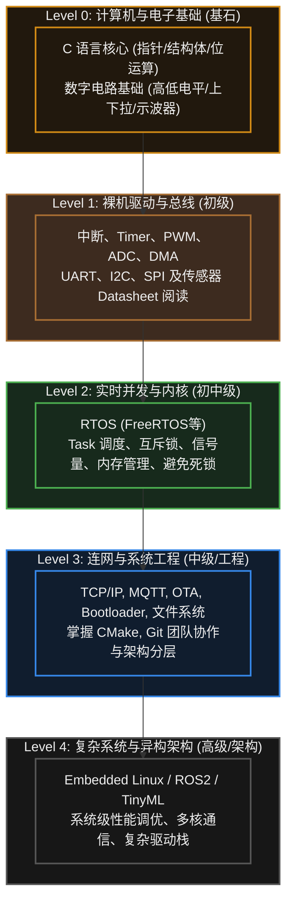

# 33. 学习路线

> [!info] 写在前面
> 当你读到这里时，我们已经共同走过了从最底层的二进制电平，到中间层的芯片外设与 RTOS 调度，再到最上层的网络通信与边缘 AI 的完整技术栈。
> 面对如此庞杂的知识体系，初学者往往会感到迷茫：“我到底应该先学什么？学到什么程度才算可以去找工作或独立做项目？”
> 本章将为你梳理一份结构化的嵌入式系统学习路线图，帮助你从“跟着教程敲代码的初学者”成长为“具备系统级架构思维的嵌入式工程师”。

## 33.1 一句话理解与正式定义

**一句话理解**：嵌入式知识是**螺旋式上升**的——先建立最小闭环，再在被具体问题卡住时回头深挖底层。

**正式定义**：嵌入式学习路线，指按知识依赖关系排序、每个阶段都有可自验证产出的学习路径。其排序依据是“抽象层次”与“依赖关系”，而不是话题热度。

在通用软件开发（如 Web 前端）中，知识往往是线性的：学完 HTML，再学 CSS，最后学 JavaScript。
但在嵌入式开发中，知识是**高度交叉且螺旋式上升**的。通常不会先花三年把 C 语言学到非常透彻，再去学单片机。

**真实的工程学习规律是：**
1. 掌握一点基础 C 语言 $\rightarrow$ 尝试点亮一个 LED。
2. 为了让 LED 闪烁 $\rightarrow$ 学习硬件定时器和中断机制。
3. 为了在中断里传递数据 $\rightarrow$ 重新深入学习 C 语言的 `volatile` 和指针。
4. 为了解耦复杂的闪烁逻辑 $\rightarrow$ 引入 RTOS 任务和信号量。

因此，**通常不建议在某一个阶段停留太久以追求“完美掌握”**。先建立最小可行闭环（MVP），在实践中遇到问题，再回过头来深挖底层原理，通常是效率较高的学习方式。

## 33.2 阶段划分：从底层基石到系统架构

为了便于规划，我们将嵌入式工程师的成长路径划分为五个递进的典型层级。请注意，这并非绝对的硬性标准，具体技术栈取决于你的行业方向（如偏向底层硬件驱动，或偏向应用层物联网算法）。

> [!note] 与开篇目录的关系
> 本节的 Level 0–4 描述的是**能力层级**（你应当具备什么能力）；本文档开篇目录的 Stage 1–9 描述的是**知识模块分组**（内容按主题编排，便于查阅）。两者视角与粒度都不同，因此并不一一对应，也不存在包含关系：例如 Flash 与文件系统在目录中属于 Stage 6，在本节则归入 Level 3 的工程实践。阅读时按需选择即可。

### Level 0：基石构建 (计算机与电子基础)
- **目标**：能够看懂基础电路原理图，并熟练使用 C 语言操作内存。
- **核心知识**：
  - **C 语言**：熟练掌握宏定义、位运算（置1、清0、翻转）、指针、结构体对齐、函数指针。
  - **电子基础**：理解 VCC/GND、高阻态、上/下拉电阻、开漏/推挽输出的概念。能使用万用表测量基本的电压和通断。

### Level 1：裸机与外设驱动 (MCU 基础)
- **目标**：能够独立控制 MCU 的主流片上外设，并能看懂外围传感器的手册。
- **核心知识**：
  - **基础外设**：GPIO（输入输出）、NVIC（中断优先级配置）、Timer（定时与 PWM）、ADC。
  - **通信总线**：熟练使用 UART、I2C、SPI。了解波特率、设备地址、时钟极性（CPOL/CPHA）的物理意义。
  - **高级搬运**：学会配置 DMA 来解放 CPU 算力。
- **工程检验**：不要只停留在厂商封装好的易用模块。尝试查阅一款陌生传感器的 Datasheet，手动通过 I2C 读取它的内部寄存器并进行数据解析。

### Level 2：实时系统与并发 (RTOS 引入)
- **目标**：从单线思维跃迁到多任务并发思维，解决复杂系统的时间耦合问题。
- **核心知识**：
  - **任务管理**：Task 的创建、删除、挂起与恢复；合理分配 Task 栈大小。
  - **并发保护**：深刻理解并在代码中正确使用临界区（Critical Section）、互斥锁（Mutex）。
  - **任务同步**：使用二值信号量（Semaphore）实现中断与任务的同步，使用消息队列（Queue）在任务间安全传递数据。

### Level 3：物联网与系统级工程
- **目标**：让设备接入互联网，并掌握正规的商业项目构建与维护方法。
- **核心知识**：
  - **网络栈**：理解 TCP/UDP 差异，掌握 MQTT 协议的核心（Pub/Sub、QoS、Keep-Alive）。
  - **存储与安全**：掌握 Flash 擦写机制、键值对存储（NVS）、LittleFS 文件系统原理。
  - **OTA 与启动**：理解 Bootloader 的工作机制、中断向量表重定向与双区备份。
  - **现代构建**：不必局限于单一 IDE，学习使用 Git 进行版本控制，了解 CMake 构建系统的基本逻辑。

### Level 4：复杂系统与异构计算
- **目标**：迈向资深工程师，能够主导复杂机器人、智能中控或边缘 AI 产品的架构设计。
- **发展分支**：
  - **分支 A（嵌入式 Linux）**：学习 U-Boot、Device Tree、Linux 内核裁剪与设备驱动（Character Device）开发。
  - **分支 B（边缘 AI / 信号处理）**：学习 DSP 数字滤波算法，使用 TensorFlow Lite for Microcontrollers 部署 TinyML 模型。
  - **分支 C（工业/汽车电子）**：深入学习 CAN/CAN FD 总线、EtherCAT 协议、AUTOSAR 架构以及 ISO 26262 功能安全标准。

## 33.3 常见误区与学习陷阱

在沿着上述路线前行的过程中，很多学习者容易陷入以下几个影响职业发展的瓶颈：

### 陷阱 1：“API 包装工”的错觉
**现象**：能够熟练调用 STM32 HAL 的 `HAL_I2C_Master_Transmit()` 读取数据，就认为自己已经“精通 I2C 通信”。然而一旦换了一款没有 HAL 库的芯片，或者遇到总线死锁，往往就束手无策。
**工程对策**：库函数（如 STM32 的 HAL/LL 库，或其他原厂的同类驱动库）是为了提高开发效率，而不是为了掩盖底层机制。学习外设时，**应当结合 Reference Manual（参考手册）**去对照 API 的源码，看看它底层操作了哪些寄存器、等待了哪些标志位。理解底层机制，是跨平台移植与排查偶发故障的基础。

### 陷阱 2：企图用软件解决硬件问题
**现象**：发现 ADC 采样数据剧烈跳动，第一反应是去网上抄各种复杂的卡尔曼滤波代码，而不是拿示波器去看看是不是电源线上引入了 500mV 的开关噪声。
**工程对策**：嵌入式工程师通常需要具备**“软硬协同”**的排查思维。遇到反常的数字逻辑，通常应当先用万用表、逻辑分析仪或示波器确认物理信号的完整性（Signal Integrity）。

### 陷阱 3：沉溺于“看视频”而拒绝“看文档”
**现象**：遇到报错或新芯片，习惯性地去 B 站搜视频教程；如果搜不到视频，就认为这个技术无法学习。对几百页的英文 Datasheet 感到恐惧并本能地排斥。
**工程对策**：视频教程适合入门和构建第一印象，但**第一手的技术资料通常存在于官方数据手册、参考手册和 Errata（勘误表）中**。在实际工作中，你经常会面对刚流片出来、连搜索引擎都搜不到资料的全新国产芯片。克服阅读英文技术文档的恐惧，是走向资深工程师的必经之路。

> [!summary] 总结本章
> 1. 嵌入式学习是一个**螺旋式上升**的过程，通常不应在单一知识点上过度停留，而应以实现“最小可行程序（MVP）”为阶段性目标。
> 2. 学习路径通常遵循：**C语言与电路基础 $\rightarrow$ 裸机外设驱动 $\rightarrow$ RTOS 并发管理 $\rightarrow$ 物联网与系统工程 $\rightarrow$ 嵌入式 Linux 或边缘算法**。
> 3. 避免成为只会调包的“API 包装工”，必须建立**结合 Reference Manual 剖析底层寄存器**的习惯。
> 4. 优秀的嵌入式工程师应当具备跨越软硬件边界的排障能力，并拥有独立阅读原厂英文文档的专业素养。
