> [!info] 使用说明
> 本文档面向**没有嵌入式开发经验、没有学过微机原理、刚刚接触编程**的读者。
> 嵌入式开发可以这样理解：**把程序固化进专用硬件，让设备按预定逻辑运行，感知并作用于物理世界。** 这只是一个便于建立直觉的说法，严格定义见 [[#1. 什么是嵌入式系统]]。
>
> 三点使用建议：
> 1. **当作手册查阅**：不必一次读完。遇到陌生术语时，通过下方目录跳转到对应章节。
> 2. **动手实践优先于只读文档**：理解概念后，建议用一块开发板（例如 ESP32 或 STM32）实际编写代码验证。
> 3. **记录问题与排查过程**：把接线错误、配置遗漏这类问题连同排查过程记下来，这些记录比结论更有价值。

---

# 目录

全文共 34 章，按学习深度分为 9 个阶段，另设 2 个附录。点击下方目录中的链接即可跳转到对应章节。

### Stage 1：认识嵌入式世界
*建立基本概念，理解嵌入式系统与通用计算机的区别。*
- [[#1. 什么是嵌入式系统]] —— 嵌入式系统的定义、形态边界与实时性
- [[#2. 计算机基础]] —— 二进制、字节、十六进制与位运算
- [[#3. 数字电路基础]] —— 逻辑电平、上下拉电阻与高阻态
- [[#4. MCU 与 SoC：认识嵌入式世界的大脑]] —— MCU、MPU、SoC 的边界与差异

### Stage 2：计算机 / CPU / Memory / C
*理解芯片内部结构，以及如何用代码操作硬件。*
- [[#5. CPU、内存与启动]] —— 代码存放在哪里、断电为何不丢失、上电后发生了什么
- [[#6. C 语言与嵌入式 C]] —— 指针、volatile、结构体对齐

### Stage 3：GPIO / 中断 / 定时器
*让系统与物理世界交互：数字输入输出与精确定时。*
- [[#7. GPIO]] —— 引脚模式、推挽与开漏、复用功能与电气约束
- [[#8. 中断]] —— 从轮询到中断、中断服务程序与优先级
- [[#9. 定时器与 PWM]] —— 硬件计数、占空比与频率选择

### Stage 4：UART / I2C / SPI
*芯片与芯片之间如何通信。*
- [[#10. UART]] —— 异步串行通信：数据帧、波特率与电平匹配
- [[#11. I2C]] —— 两线制总线、开漏拓扑与寻址应答
- [[#12. SPI]] —— 四线同步通信与 CPOL / CPHA 模式

### Stage 5：ADC / DMA
*把模拟世界转换为数字量，并高效搬运数据。*
- [[#13. ADC、DAC 与传感器]] —— 采样、量化、分辨率与传感器接口
- [[#14. DMA]] —— 绕过 CPU 的数据搬运与双缓冲机制

### Stage 6：看门狗 / Flash / RTOS / 并发
*系统可靠性与多任务管理。*
- [[#15. 看门狗与系统可靠性]] —— 死机检测、复位与喂狗策略
- [[#16. Flash、EEPROM 与文件系统]] —— 非易失存储、擦写机制与掉电安全
- [[#17. RTOS 与 FreeRTOS]] —— 任务、调度与上下文切换
- [[#18. 并发、同步与互斥]] —— 数据竞争、临界区与同步原语

### Stage 7：网络 / MQTT / 嵌入式 Linux / Bootloader
*联网通信与系统级软件。*
- [[#19. 网络通信]] —— 分层模型、寻址与 TCP / UDP 取舍
- [[#20. MQTT]] —— 发布 / 订阅模型、QoS 与保活机制
- [[#21. 嵌入式 Linux]] —— MMU、虚拟内存与进程隔离
- [[#22. Bootloader]] —— 启动链路、OTA 与双区备份

### Stage 8：构建 / 调试 / 驱动 / 架构
*从会写代码到会做工程。*
- [[#23. 编译、链接与烧录]] —— 工具链、链接脚本与烧录流程
- [[#24. 调试方法]] —— 日志、断言、在线仿真与仪器观测
- [[#25. 低功耗]] —— 功耗来源、低功耗模式与唤醒机制
- [[#26. 设备驱动]] —— 驱动分层、BSP 与 HAL
- [[#27. 嵌入式软件架构]] —— 分层设计、执行模型与状态机

### Stage 9：传感器 / 机器人 / AI / 项目
*综合应用：把前面各章组合成一个系统。*
- [[#28. 常见传感器]] —— MEMS 工艺、IMU、光学传感器与滤波
- [[#29. 机器人与嵌入式]] —— 异构架构与 PID 控制
- [[#30. AI + 嵌入式 / TinyML]] —— 模型量化、剪枝与推理部署
- [[#31. 项目开发方法]] —— MVP、增量迭代与目录结构
- [[#32. 常见问题排查]] —— 从物理层到应用层的排查方法

### 附录
- [[#33. 学习路线]] —— 分阶段的学习路径与常见学习陷阱
- [[#34. 常用术语表]] —— 缩写与术语速查

---
# 1. 什么是嵌入式系统

> [!info] 写在前面
> 当你听到“嵌入式”这三个字时，可能会觉得很高深。但实际上，你每天都在和几十个嵌入式系统打交道。这一章，我们先不写代码，先来弄懂我们要搞的到底是个什么东西。

## 1.1 从生活中的例子说起

我们先来看看你手边最熟悉的设备：**你的笔记本电脑或智能手机**。
它们就像是**“全能型人才”**：你可以用它打游戏、看电影、写文档、写代码。你可以随时给它安装新的软件，让它具备新的功能。这种我们称之为**“通用计算机 (General Purpose Computer)”**。

但是，生活中有更多的机器，它们不需要，也不能这么全能。
- **微波炉**：它里面也有一个微型电脑，但它一辈子只会做一件事——读取按键、控制加热管、倒计时，然后“叮”一声。你不能在微波炉上聊微信。
- **智能手表**：它一辈子只负责测心率、记步数、看时间。
- **汽车的防抱死刹车系统 (ABS)**：它里面的电脑持续计算车轮的转速，一旦发现车轮抱死就立即松开刹车。它不会、也不应该一边执行这项任务一边在后台下载电影。

**这些“隐藏在机器内部，专门为了干好某一件事而设计的微型计算机”，就是嵌入式系统。**

## 1.2 嵌入式系统的正式定义

- **正式定义**：“嵌入式系统（Embedded System）是为了完成特定应用功能而设计的专用计算机系统，通常隐藏在更大的机械或电气系统内部。”
- **一句话理解**：它是一种**围绕特定产品设计的专用计算机**——通常没有通用的鼠标、键盘和显示器，软件在出厂时基本固定（除非提供升级机制），长期只服务于该产品所定义的功能。

> [!note] 边界说明：“专用”不等于“只能运行一个程序”
> “只干一件事”是为了帮你快速建立直觉的**形象说法**，不是严格定义。
> 嵌入式系统的形态跨度很大：既有几毛钱、只承担少量固定功能的裸机小芯片（例如简单的电动牙刷控制器），也有跑着 FreeRTOS、同时管理多个任务的设备（无人机飞控），还有跑完整 Linux、TCP/IP 协议栈、图形界面甚至 AI 推理的设备（扫地机器人、车载中控）。
> 它们的共同点是**软硬件围绕特定产品/场景来设计**，而不是“程序数量只有一个”。

## 1.3 嵌入式电脑 vs 你的个人电脑 (PC)

为了让你有更直观的感受，我们来对比一下这两个世界：

| 比较维度         | 你的电脑 (PC)              | 嵌入式系统（形态差异极大，此表只列典型差异）                                      |
| :----------- | :--------------------- | :---------------------------------------------------------- |
| **人生目标**     | 通用平台（面向大量不同应用）         | 面向特定产品/场景优化                                                 |
| **内存 (RAM)** | 通常较为充裕，容量可从 GB 级到更高    | 资源约束程度差异很大，从 KB 级 MCU 到 GB 级嵌入式 Linux 平台都有                  |
| **存储 (硬盘)**  | 容量通常较大，可使用 SSD / HDD 等 | 存储介质和容量取决于系统，从片上 Flash 到外部 eMMC / UFS / SSD 等都有             |
| **稳定性要求**    | 死机了大不了重启，砸一下键盘的事       | **要求差异极大**：消费类设备死机重启即可；汽车刹车 ECU、心脏起搏器这类**安全关键系统**则不允许崩溃     |
| **实时性要求**    | 通常不强调严格的时间确定性          | 某些嵌入式系统对响应时间和截止时间有严格要求；其中超过截止时间会导致功能失效的，属于**硬实时**系统（比如安全气囊） |
| **功耗**       | 功耗通常不是首要约束             | 功耗约束程度差异很大，从纽扣电池设备到高功耗嵌入式计算平台都有；便携 / 电池供电设备通常特别关注功耗         |

> [!important] 嵌入式工程师的重要意识：关注资源约束
> 与通用 PC 相比，许多嵌入式系统在内存、存储、算力、功耗、成本或实时性等方面面临更明确的约束。
> 不同设备的约束程度差异很大：简单 MCU 可能只有几十 KB RAM，而高性能嵌入式 Linux / AI 平台则可能拥有 GB 级内存。
> 因此，嵌入式开发并不是“资源永远很少”，而是要根据具体平台合理管理和权衡资源。

## 1.4 嵌入式系统的基本构成

如果你把嵌入式系统想象成一个“人”，那么它的结构就非常清晰了：
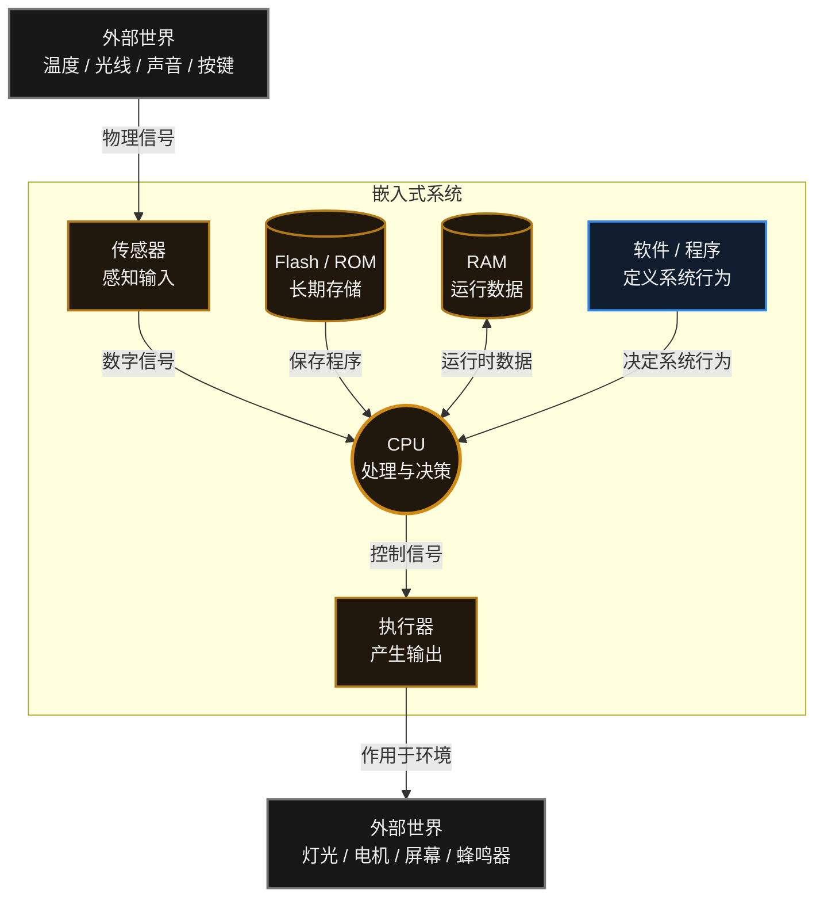
**图中各组成部分的职责如下**（下面借用一组日常类比帮助建立直觉；类比只用于理解，不构成技术定义）：

1. **传感器 (输入设备 = 人的五官)**

    - 我们人靠眼睛看、耳朵听。单片机是个瞎子聋子，它只能靠传感器感知世界。

    - 比如：按键、温度计（感测温度）、麦克风（听声音）、摄像头（看图像）。

2. **CPU / MCU (大脑的核心)**

    - 它是整个系统的核心处理中心。它不断地问传感器：“现在多少度了？”如果温度太高，它就要做出决定。

3. **存储器 (大脑的记忆)**

    - **Flash (长期记忆)**：你辛辛苦苦敲的代码，断电后不能丢，就保存在这里。

    - **RAM (短期记忆/草稿纸)**：CPU 算数时临时用到的数据保存在这里，一断电就全清空了。

4. **代码 / 软件**

    - 一堆芯片焊在一起只是一组没有行为的电路。是你写的 C 语言代码赋予它行为，告诉 CPU：“如果温度大于 30度，就让风扇转起来。”

5. **执行器 (输出设备 = 人的手脚)**

    - 大脑做出决定后，总得有人去干活。

    - 比如：马达（转动）、LED灯（发光）、蜂鸣器（发声）、屏幕（显示画面）。


## 1.5 常见误区与工程陷阱

**误区 1：把“嵌入式系统”等同于“单片机”。**
单片机（MCU）是嵌入式系统最常见的载体之一，但并不是全部。运行 Linux 的工控板、路由器、车载中控同样属于嵌入式系统。判断标准是“是否为特定产品/场景而设计”，而不是“用了哪一类芯片”。

**误区 2：认为嵌入式系统一定低性能、低功耗。**
这是把入门级的裸机 MCU 场景当成了普遍规律。嵌入式系统的性能与功耗跨度极大：既有几毛钱、只承担少量固定功能的控制器，也有带 GPU / NPU、功耗数十瓦的边缘计算设备。“资源受限”是一个相对概念，具体约束取决于产品定位，需要查阅具体平台的规格书与 Datasheet。

> [!summary] 总结本章
> 嵌入式开发可以概括为**用代码定义系统行为**：把程序写入芯片的长期存储，让 CPU 通过传感器感知世界、通过执行器改变世界。

---

# 2. 计算机基础

> [!info] 写在前面
> 现实世界是彩色的，有声音的大小、温度的高低。但芯片内部是由极小的“开关（晶体管）”组成的，它只能表示两种状态：“开”和“关”。
> 这一章我们要弄懂，单片机是怎么用“开关”来理解世界的，以及我们该怎么用代码去拨动这些开关。

## 2.1 数字信号的表示：0 与 1

在单片机内部，没有数字 2、3、4，更没有字母 A、B、C。它唯一认识的只有电信号：
- **有电 (高电压/高电平)**，代表数字 **1**
- **没电 (低电压/低电平)**，代表数字 **0**

你可以把单片机里面的存储单元，想象成一排排微型的**电灯开关**。
向上拨就是 1，向下拨就是 0。计算机科学家把这一个“开关”，称为一个 **Bit（比特/位）**。这是计算机里最小的单位。

> [!note] 正式定义
> **位 (Bit)** 是二进制数字系统中的最小信息单位，只有 0 与 1 两种取值。数字电路用两个可区分的电压区间来表示它们：接近 VCC 的区间记为 1（高电平），接近 GND 的区间记为 0（低电平），具体门限以芯片 Datasheet 的电气特性表为准。
> 上文“电灯开关”的说法只是帮助建立直觉的类比，实际电路里并不存在机械开关。

## 2.2 字节 (Byte)：8 位一组的处理单位

如果每次只控制一个开关 (1 bit)，能表达的信息太少了（只能表示 0 或 1）。
所以，计算机科学家决定把 **8 个开关绑在一起**，作为一个基础的操作单位。这 8 个开关排成一排，就叫作一个 **Byte（字节）**。

- **1 Byte = 8 bits**

**正式定义**：**字节 (Byte)** 是 8 个二进制位组成的一组，是大多数处理器与存储体系中最基本的可寻址单位。

想象有一排 8 个开关：`[关] [关] [关] [关] [关] [关] [关] [开]`
用数字写出来就是：`00000001` (代表数字 1)
如果是全部打开：`11111111` (代表数字 255)

> [!tip] 术语小贴士
> 我们平时说的手机内存 8GB，这个大写字母 B 就是 Byte（字节）。
> 1 KB = 1024 Byte（大约一千排开关）
> 1 MB = 1024 KB（大约一百万排开关）
> 1 GB = 1024 MB（大约十亿排开关）

## 2.3 十六进制 (Hexadecimal)：二进制的紧凑写法

在嵌入式开发中，你会看到代码里满天飞的都是 `0x00`、`0xFF`、`0x2A` 这样的文字。为什么要搞这么奇怪的表示方法？

**因为二进制太长了，人眼很难快速分辨。**
想象一下你要控制 32 个开关，代码如果写成二进制：
`10101111000011111010111100001111`
看久了很容易眼花，而且极容易写错。

为了让人类看着舒服，我们把二进制**每 4 个一组**，缩写成一个符号：
- `0000` = 0
- `1001` = 9
- 因为阿拉伯数字只有 0~9，不够表示 10~15，所以用字母代劳：
- `1010` = A (代表10)
- `1111` = F (代表15)

于是，上面那一长串，就被缩写成了 8 个字母/数字。
在 C 语言中，为了告诉编译器“我下面写的不是普通的十进制数字，是十六进制数字”，我们会在前面加一个前缀 **`0x`**。

- 二进制的 `1111 1111`，写成十六进制就是 **`0xFF`**。
- 二进制的 `0000 1111`，写成十六进制就是 **`0x0F`**。

> [!important] 核心结论
> **1 个十六进制数字 = 恰好控制 4 个开关（4 bit）。**
> `0x` 只是一个暗号，代表十六进制。在嵌入式配置寄存器（硬件开关）时，十六进制是最直观的武器。

## 2.4 位运算 (Bitwise)：面向位的寄存器操作

在写 PC 软件时，我们很少用位运算；但在嵌入式里，位运算是使用频率极高的基本操作，因为寄存器常常是“一位一个功能”。

**为什么要用位运算？**
假设芯片里有一个寄存器（一排 8 个开关），这 8 个开关分别控制着 8 盏不同的灯。
现在，开关的状态是：`0110 0011`。
需求是：**“把第 3 个开关打开，同时不要影响其他开关。”**

如果你直接给它赋值：`寄存器 = 00001000`（或者写成 8），那么第 3 个开关确实打开了，但其余的开关都被一并改掉了，这通常不是想要的结果。

这时候，我们就需要 **位运算**。它能只修改指定的位，而让其他位保持不变。

### 1. 移位 `<<`
`1 << 3`，意思是把数字 1（`0000 0001`），向左推 3 格，变成 `0000 1000`。
它用来生成一个“只瞄准第3位”的瞄准镜（掩码）。

### 2. 按位或 `|` (用于：把某一位强行变 1，即“打开开关”)
规则：只要有一个是 1，结果就是 1。

```c
// 原状态: 0110 0011
// 目标是把第 3 位 (从右往左数, 0起始) 打开
REG = REG | (1 << 3);
// 也就是： 0110 0011 | 0000 1000
// 结果为： 0110 1011  (只改变了第 3 位，其余位保持不变)
```

### 3. 按位与 `&` 和 按位取反 `~` (用于：把某一位强行变 0，即“关闭开关”)

规则：`&` 必须两个都是 1 才是 1；`~` 是把 0 变 1，1 变 0。

```c
// 原状态: 0110 1011
// 目标是把第 3 位关闭，其他不变
REG = REG & ~(1 << 3);
// ~(1 << 3) 会把 0000 1000 变成 1111 0111
// 然后按位与: 0110 1011 & 1111 0111
// 结果为：    0110 0011 (第 3 位被单独关闭)
```

### 4. 按位异或 `^` (用于：翻转某一位)

规则：相同为 0，不同为 1。（相当于按一下开关，原来开的变关，原来关的变开）

```c
// 原状态: 0110 0011
// 目标是翻转第 3 位，实现 LED 闪烁效果
REG = REG ^ (1 << 3);
// 结果为： 0110 1011
```

> [!summary] 位运算口诀（建议记熟）
> - **置 1 (开灯)**：`REG |= (1u << n);`
> - **清 0 (关灯)**：`REG &= ~(1u << n);`
> - **翻转 (闪烁)**：`REG ^= (1u << n);`
>
> 注意：这里的 `n` 是位序号，从 0 开始数，最右边第一位叫第 0 位。

## 2.5 常见误区与工程陷阱

> [!warning] 误区 1：`1 << n` 里的 `n` 可以随便写
> 在 C 语言中，如果移位数 `n` 大于或等于该类型的位宽，`1 << n` 属于**未定义行为 (Undefined Behavior, UB)**。例如在 32 位 `int` 的平台上写 `1 << 32`，结果取决于编译器和目标架构，不能依赖。
> 因此写寄存器位操作时，建议使用 `1u << n`（无符号字面量）或显式的 `uint32_t` / `uint16_t` 掩码常量。这样做有两个好处：一是避免有符号数左移溢出带来的 UB，二是让“这个寄存器有多少位”这个假设在代码里一目了然。
>
> ```c
> REG |= (1u << n);   // 推荐写法
> uint32_t mask = 1u << 31;   // 高位操作时尤其要注意符号问题
> ```

> [!warning] 误区 2：`REG |= (1 << n)` 是“读-改-写”，不是原子操作
> `REG |= (1u << n);` 在硬件层面展开为三步：**读出 REG → 按位或 → 写回 REG**，这类序列称为**读-改-写 (Read-Modify-Write)**。
> 如果在这三步之间响应了中断，而 ISR 也修改了同一个寄存器，那么 ISR 写入的值可能在随后被覆盖丢失。多核 / 多任务场景下，两个执行流同时做读-改-写同样存在竞争。
> 需要原子性时，通常要依靠硬件机制（例如部分 MCU 提供的位带 Bit-Banding、原子置位 / 清零寄存器如 BSRR、或原子操作指令）或软件临界区；具体提供哪些机制，取决于芯片实现。这一点会在第 8 章（中断）与第 18 章（并发、同步与互斥）继续展开。

---

# 3. 数字电路基础

> [!info] 写在前面
> 作为写代码的人，你可能很排斥看电路图。但嵌入式开发是“软硬结合”的，代码最终要变成真实的电流去控制硬件。
> 这一章不推导复杂公式，只建立必要的直观认识，把硬件工程师常用的那些基础词汇讲清楚。这些概念是后面排查电源、电平与引脚问题的前提。

## 3.1 供电与参考地：VCC 与 GND

在单片机的世界里，电就像水一样。水必须从高处流向低处，才能让水车（芯片）转起来。

- **VCC（电源正极）**：可以类比成高高的**水塔**。它提供电压，通常是 3.3V 或者 5V。
- **GND（地线/电源负极）**：可以类比成地上的**下水道**。在电路分析中，通常以它作为 0V 参考点。

> [!danger] 常见的硬件损坏原因
> 如果你不小心用一根导线，把 VCC 和 GND 直接连在一起，实际电流会远大于正常工作电流（上限主要由电源能力和线路电阻决定），器件可能迅速过热甚至损坏。这叫**短路**。
> 另外，把两块不同的板子连在一起通信（比如单片机连传感器）时，如果使用的是单端信号且没有做隔离，收发双方就需要有公共参考地（共地），否则它们对 0V 的基准不一致，信号电平就失去了意义。注意这并非绝对要求：光耦隔离链路、RS-485 / RS-422 这类差分链路并不依赖共地，而是靠差分信号或隔离来传递信息。

## 3.2 逻辑电平：0 与 1 的物理表示

上一章我们说了，芯片只认识 0 和 1。那在真实的电路里，0 和 1 长什么样？

- **高电平 (High)**：引脚上的电压接近 VCC（比如 3.3V）。
- **低电平 (Low)**：引脚上的电压接近 GND（比如 0V）。

> [!note] 正式定义
> **逻辑电平 (Logic Level)** 是用两个电压区间表示逻辑 0 与逻辑 1 的约定。芯片并不要求电压精确等于 VCC 或 GND，而是规定门限范围：例如某款 3.3V 器件可能规定输入高电平门限为 0.7×VCC、输入低电平门限为 0.3×VCC，落在两者之间的电压属于不确定区，此时器件的行为无法保证。
> **具体的门限值必须以该芯片 Datasheet 的电气特性表 (Electrical Characteristics) 为准**，不同器件、不同电源电压下的门限并不相同。

> [!warning] 高电平不一定就是“生效” (Active-Low)
> 初学者常以为“高电平 = 1 = 亮/开，低电平 = 0 = 灭/关”。但实际工程中大量使用**低电平有效 (Active-Low)** 设计。
> 比如单片机上的复位引脚（NRST）通常是拉低才复位；很多 LED 也是接在 VCC 和引脚之间，引脚输出 0 (低电平) 时，电流才能流过并点亮 LED。
> 到底高电平有效还是低电平有效，取决于具体的硬件电路设计。

## 3.3 悬空、高阻态与上下拉电阻

这是初学者最容易踩坑的地方之一。

### 1. 悬空与高阻态 (High-Z)
假设单片机上有一个引脚被配置为数字输入，但你**什么导线都没给它接**。
此时引脚处于一种叫**高阻态 (High Impedance, High-Z)** 的状态。引脚就像一根天线，空气中的电磁波、静电会让它读出来的电平在 0 和 1 之间随机乱跳。
> [!note] 什么情况下引脚可以处于高阻态？
> 作为**数字输入**去读按键或电平时，确实不能悬空。但如果你把引脚配置为**模拟输入 (ADC)** 去测电压，或者为了极低功耗而禁用数字输入缓冲器时，引脚就可以（也应该）处于类似的高阻态。

### 2. 引入“弹簧”：上拉/下拉电阻
为了不让数字输入引脚乱跳，我们需要给它一个确定的“默认状态”。
- **上拉电阻 (Pull-up Resistor)**：用一个电阻把引脚和 VCC 连起来。平时外面没信号时，引脚被拉到高电平。当外部开关闭合连通 GND 时，引脚变成低电平。
- **下拉电阻 (Pull-down Resistor)**：用电阻把引脚和 GND 连起来。平时默认低电平，外部连通 VCC 时变成高电平。

> [!tip] 现代 MCU 的便利
> 现代单片机内部通常自带了可通过代码开启的上拉/下拉电阻。比如配置接按键的引脚时，只需在代码里开启内部上拉，就不需要在外部额外焊接一个电阻了。

## 3.4 电源相关器件：LDO、Buck 与去耦电容

在开发板上，你会看到除了主芯片外，还有很多电源相关的元器件。它们的任务是保证单片机能吃到“纯净、稳定的电”。

| 电源器件                               | 核心机制与工程特征                                                                     | 类比（仅帮助理解）                                           |
| :--------------------------------- | :---------------------------------------------------------------------------- | :---------------------------------------------- |
| **LDO<br>(低压差线性稳压器)**              | 通过线性晶体管降压。**特点：** 电路极简、输出纹波（噪声）极小；**缺点：** 压差和电流会全部转化为热量，效率较低，压差太大时会发烫。        | 像水管减压阀，多余的压力变成热量耗散掉。适合降压幅度小、对噪声敏感的场景。           |
| **Buck<br>(降压型开关稳压器)**             | 通过内部开关极速开闭，配合电感电容降压。**特点：** 转换效率极高（通常 80%~95%），不怎么发热，适合大电流；**缺点：** 会产生高频开关噪声。 | 像智能水泵，一开一关控制总水量。适合降压幅度大、功耗要求严的场景。               |
| **去耦电容<br>(Decoupling Capacitor)** | 通常是 0.1μF 左右的小电容，**通常需要紧挨着**单片机的电源引脚放置。用于吸收电源线上的高频噪声，并在芯片瞬间需要大电流时提供瞬态电荷。        | 像紧挨着水龙头的小水缸，防止由于水管太长导致瞬间开闸时水压暴跌（电压跌落导致 MCU 复位）。 |

## 3.5 常见误区与工程陷阱

**误区 1：认为“高电平”就等于“功能生效”。**
哪个电平代表有效，取决于电路设计。复位引脚、片选引脚、按键输入都可能采用**低电平有效 (Active-Low)**。阅读原理图与 Datasheet 时，应先确认有效电平，再写代码。

**误区 2：认为所有通信链路都必须共地。**
单端信号（如 UART、I2C、SPI）在未做隔离时，收发双方需要公共参考地，否则电平基准不一致、信号失去意义。但光耦隔离链路以及 RS-485 / RS-422 这类差分链路依靠差分信号或电气隔离传递信息，并不依赖共地。是否需要共地，取决于链路类型。

**误区 3：把“未接线的输入引脚”当作稳定输入。**
悬空的数字输入引脚处于高阻态，读到的电平会随机跳动。一般情况下需要用外部或内部上拉/下拉电阻给它一个确定的默认状态；模拟输入、关闭输入缓冲等场景属于例外。

> [!summary] 总结本章
> - **VCC** 是供电，**GND** 是参考地；使用单端信号且未做隔离时，收发双方需要有公共参考地（差分链路与隔离链路除外）。
> - 在**正逻辑**约定下，**高电平**记作 1，**低电平**记作 0；具体含义取决于电路设计（见 3.2 关于 Active-Low 的说明）。
> - **数字输入**引脚通常不应**悬空**，一般需要用**上拉/下拉电阻**给它一个确定的默认状态；模拟输入、禁用输入缓冲等特殊场景除外（见 3.3）。
> - 电路板上那么多小元件，很多是为了让电源变得纯净稳定。

---


# 4. MCU 与 SoC：认识嵌入式世界的大脑

> [!info] 写在前面
> 当你准备买一块开发板开始学嵌入式时，可能会遇到不少容易混淆的缩写：MCU、SoC、MPU、ARM、单片机……
> 这一章把这些名词梳理清楚，帮助你看懂开发板上那颗芯片到底是什么。

## 4.1 什么是单片机 (MCU)？

**MCU** 的全称是 Microcontroller Unit（微控制单元），在中国，我们通常叫它**“单片机”**。

**正式定义：** MCU 是把 **CPU 核心 + 片上程序存储器（Flash / ROM）+ 片上数据存储器（SRAM）+ 常用外设（GPIO、定时器、串口、ADC 等）** 集成在同一颗芯片中的微控制器，通常面向低成本、低功耗的实时控制场景。

如果把一台普通的台式电脑拆开，你会发现里面有 CPU、内存条、硬盘、显卡、主板，它们是分开的、一块块的零件。可以粗略地类比成：**单片机把电脑的主要部件微缩、集成到了一颗指甲盖大小的芯片里**。（这是帮助建立直觉的类比，不是严格定义。）
“单片”的意思，是**“单单这一片芯片，就构成了一台完整的微型计算机”**。

**单片机的常见特点：**
- **成本低**：从几毛钱到几十块钱人民币不等。
- **低功耗**：许多型号在深度睡眠、低占空比的使用场景下功耗很低，**部分低功耗型号可以用一颗纽扣电池运行数年**（具体续航取决于型号、工作模式和外围电路）。
- **启动快**：上电后通常很快开始执行代码，一般不需要像 Windows 那样等待系统加载。
- **面向控制**：算力跨度很大，从几 MHz 的低端型号到几百 MHz 的高性能型号都有；典型用途是“控制”（比如控制马达转速、读取按键、点灯）。

**常见的单片机明星：**
- **STM32**：工业界和学习者的主流选择之一，法国意法半导体（ST）出产。
- **ESP32**：集成 Wi-Fi 与蓝牙的常见型号，由国内的乐鑫科技 (Espressif) 推出。
- **AVR / ATmega 系列**：经典的 8 位单片机，**Arduino Uno 这类开发板**用的就是它。简单易上手、适合创客入门，但性能较弱。（注意：**Arduino 是开发板与生态，不是芯片本身**。）

## 4.2 解剖单片机：里面到底装了啥？

虽然它只有一个芯片，但麻雀虽小，五脏俱全。我们来看看它的“五脏六腑”：

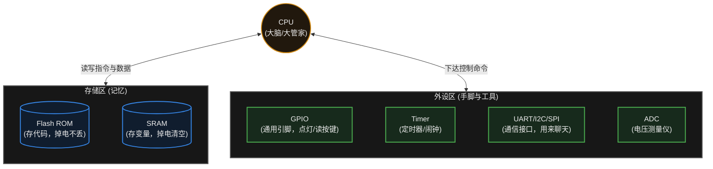

**图中各模块的作用：**
1. **CPU (大脑)**：只负责两件事：做算术题、指挥别人干活。
2. **Flash（可以类比为电脑硬盘，仅用于帮助建立直觉）**：代码在 PC 上编译后，通过“下载 / 烧录”写入这里。断电后代码仍然保留。
3. **SRAM（可以类比为电脑内存条，仅用于帮助建立直觉）**：程序运行时，频繁变化的数据（比如温度值、计算的中间结果）存放在这里。断电后内容丢失。
4. **外设 (Peripherals)**：与外部世界交互的工作如果全部交由 CPU 处理，CPU 将难以兼顾。因此芯片厂商把许多专用硬件模块集成在 MCU 中：**定时器 (Timer)** 负责计数与时基，**串口 (UART)** 负责与其他设备交换数据，**DMA** 负责搬运数据，**中断控制器** 负责管理各路中断请求。这些硬件模块统称为“外设”。

> [!note] 图里画的是“常见配置”，不是“标准配置”
> 并不是每颗 MCU 都带上面这些外设：低端型号可能没有 DMA 或 ADC，高端型号还会集成以太网、CAN、USB、LCD 控制器、硬件加解密等。**具体有哪些，以该型号的 Datasheet 为准。**

## 4.3 什么是 SoC？它和单片机有啥区别？

**SoC** 的全称是 System on Chip（片上系统）。

可以把 MCU（单片机）理解成一个功能齐备、规模适中的系统，把 SoC 理解成一个功能更密集、更复杂的系统（这只是帮助建立直觉的类比，不是定义）。
随着时代发展，人们希望设备既能像单片机一样小，又能像电脑一样播放高清视频、跑人工智能模型。于是，芯片工程师把更多、更复杂的东西塞进了一块芯片里。

**SoC 里面通常包含：**
- 强大的多核 CPU（能跑纯正的 Linux、Android 甚至 Windows）。
- **GPU**（图形处理器，用来打游戏、渲染高清屏幕）。
- **NPU**（神经网络处理器，用来跑 AI 人脸识别）。
- 复杂的无线电模块（5G 基带等）。

> [!note] SoC 的关键是“系统级集成”，而不是某个固定的部件清单
> 上面列的是现代高性能 SoC 的常见构成，但 GPU、NPU 并不是 SoC 的定义性特征——不少 SoC 就没有独立的 NPU。
> 严格来说，**MCU 本身也可以看作一种高度集成的 SoC**（CPU、存储、外设都在一颗芯片上）。只是工程习惯上，大家把“算力小、偏实时控制、通常跑裸机或 RTOS”的那一类单独叫 MCU，把“算力强、通常跑 Linux / Android”的那一类叫 SoC。
> 所以这两个词更多是**工程习惯上的分类**，没有严格的边界。

> [!tip] 生活中的例子
> - 智能手机中常见的 **高通骁龙 (Snapdragon)**、苹果 **A 系列 / M 系列** 等，都属于高性能 SoC。
> - 树莓派 (Raspberry Pi) 上的主控芯片（Broadcom 系列），也是 SoC。

## 4.4 MCU / MPU / SoC 对比总结

除了 MCU 和 SoC，你偶尔还会听到一个词叫 **MPU**（Microprocessor Unit，微处理器）。
它的重点在于**性能较强的通用处理器核心**，通常还会带上几样“高级装备”：**MMU**（内存管理单元，负责虚拟地址到物理地址的翻译，操作系统靠它实现进程隔离）、**Cache**（多级缓存）、**内存控制器**（直接连接外部 DDR 内存）。

> [!note] MPU 不是“没有内存”
> MPU 芯片内部通常也有**少量 SRAM 和 Cache**，只是**系统主内存**一般靠外接 DDR 颗粒。
> 所以准确的说法是“MPU 通常依赖外部系统内存”，而不是“MPU 完全没有内存”。

为了防止你懵圈，我们用一张表把它们三个彻底理清：

| 对比维度 | MCU (单片机) | MPU (微处理器) | SoC (片上系统) |
| :--- | :--- | :--- | :--- |
| **集成度定位** | 在单颗芯片内集成 CPU、片上存储与常用外设，通常可独立构成最小系统 | 以处理器核心为主，通常需外接 DDR 与外围电路才能构成完整系统 | 在单颗芯片内集成更完整的计算子系统，集成范围与复杂度通常更高 |
| **内部有什么？** | CPU 核心 + 片上 Flash/SRAM + 丰富外设，基本自给自足。 | 以**高性能 CPU 核心**为主，通常带 MMU、Cache 和内存控制器；片上只有少量 SRAM/Cache，**系统主内存一般靠外接 DDR**。 | 高度集成的系统级芯片，可能包含 CPU、GPU、NPU、DSP、内存控制器、安全模块、高速接口等。 |
| **算力与功耗** | 通常强调低功耗、实时性、低成本和片上外设丰富。 | 通常强调较强算力、复杂软件栈和操作系统支持。 | 通常强调异构计算、高带宽和完整软件生态。 |
| **运行什么系统？** | 裸机程序或 RTOS（如 FreeRTOS） | 通常运行 Linux 等完整 OS，也可运行其他系统 | 取决于具体 SoC，可运行 Linux、Android、RTOS 等 |
| **典型代表** | STM32、ESP32、AVR、MSP430 | NXP i.MX、TI Sitara 等 | Apple M 系列、高通 Snapdragon、Rockchip RK 系列 |

> [!warning] 别按类别给芯片贴“性能标签”
> 上表写的都是**通常倾向**，不是硬指标。现实中有休眠时只有几 μA 的超低功耗 MCU，也有跑到几百 MHz 的高性能 MCU；有功耗几百 mW 的低功耗 MPU，也有几十瓦的车规 / 服务器级 SoC。
> **功耗、性能和适用场景最终取决于具体型号**，不能只看它被归为 MCU / MPU / SoC 哪一类。

## 4.5 常见误区与工程陷阱

**误区 1：认为 MCU 一定低性能、一定低功耗。**
MCU 这一类别内部的差异相当大：既有主频只有几 MHz、功耗低至数 μA 的低端型号，也有主频几百 MHz、带有 Cache 与浮点单元的型号。低功耗、低成本只是 MCU 常见的定位倾向，并不是类别的定义特征。具体性能与功耗需要查阅具体型号的 Datasheet。

**误区 2：认为 MPU “没有内存”。**
MPU 芯片内部通常也集成少量 SRAM 与 Cache，只是**系统主内存**一般依赖外接 DDR 颗粒。因此准确的说法是“MPU 通常依赖外部系统内存”，而不是“MPU 没有内存”。这里需要区分两件事：

- **CPU Cache / 片上存储**：位于处理器芯片内部，容量较小、访问速度快。
- **外部 DDR / 系统内存**：位于芯片外部，容量较大，通过内存控制器访问。

**误区 3：把 SoC 简单定义为“CPU + GPU”。**
GPU、NPU 等只是部分 SoC 会集成的模块，并不是 SoC 的定义性特征。SoC 的核心含义是“把构成一个完整计算系统所需的大量功能集成到单颗芯片中”，至于具体集成了哪些模块，取决于产品定位，需要查阅该芯片的 Datasheet 与产品简介。

**误区 4：把 MCU、MPU、SoC 当成互斥的严格分类。**
从广义上看，MCU 本身也可以视为一种高度集成的 SoC（CPU、存储与外设都在一颗芯片上）。只是因为工程实践中关注点不同，业界习惯把“算力有限、偏实时控制、通常运行裸机或 RTOS”的一类单独称为 MCU，把“需要较强算力与完整软件栈”的一类称为 SoC / MPU。因此这几个词更多是**工程习惯上的分类**，而不是具有严格边界的定义。

> [!summary] 总结本章
> 1. **MCU（单片机）** 是一颗将 CPU、片上存储器和常用外设高度集成在一起的芯片，通常面向低成本、低功耗和实时控制场景，是学习嵌入式系统的重要基础。
> 2. **单片机的内部** = CPU 大脑 + 存放代码的 Flash + 存放变量的 SRAM + 各种和外界打交道的外设（GPIO、UART、SPI、I²C、定时器、DMA 等）。
> 3. 如果你需要跑 Linux、做复杂的图像识别和界面，通常就要从 MCU 换到 **MPU 或高性能 SoC**。

---

# 5. CPU、内存与启动

> [!info] 写在前面
> 在上一章我们知道了，单片机可以粗略理解为一个高度集成的小型计算机系统。里面有 CPU（大脑）、Flash（长期记忆）和 RAM（短期记忆）。
> 这一章，我们要放大这三个核心部件，看看它们在代码运行的瞬间，到底是怎么分工配合的。可以先把它们想象成**“厨房里的主厨和储物间”**，用来建立直觉。

## 5.1 CPU 到底在干嘛？

CPU 是单片机里负责“思考”和“执行”的核心部件。你可以把它想象成厨房里的**主厨**。

主厨本身不记菜谱（CPU 内部不存代码），它需要不断重复一个固定的三步动作：
1. **取指 (Fetch)**：去菜谱书（Flash）上翻看下一行的指令。
2. **译码 (Decode)**：看懂这句话是什么意思（比如：“把盐加进去”）。
3. **执行 (Execute)**：动手把盐倒进锅里（进行数学计算，或者控制引脚输出高低电平）。

只要单片机通着电，CPU 就会不知疲倦地重复这个循环，一秒钟能重复几百万次甚至上亿次。给它打拍子的，就是所谓的**时钟频率**——比如 72MHz，意思是每秒钟有 7200 万个时钟节拍。

> [!warning] 时钟频率 ≠ 指令执行速度
> **72MHz 指的是“每秒 7200 万个时钟周期”，而不是“每秒执行 7200 万条指令”。**
> 一条指令通常需要**好几个时钟周期**才能走完（这个平均值叫 **CPI**，Cycles Per Instruction）；而且现代 CPU 普遍采用**流水线 (Pipeline)**，让取指、译码、执行尽量重叠进行，实际速度还会受**访存延迟、跳转 (Branch)、Cache 是否命中**等因素影响。
> 另外，上面“取指 → 译码 → 执行”是一个**便于理解的简化模型**，真实 CPU 的执行过程要复杂得多，具体行为由架构决定。

## 5.2 Flash：非易失性存储器

**正式定义**：Flash 是基于浮栅工艺的非易失性半导体存储器，断电后数据不丢失；写入前必须先按块擦除，因此不能像 RAM 那样随意原地改写单个字节。

可以把它理解为厨房保险柜里的**菜谱书**——这是帮助建立直觉的类比，不是定义。

- **特点**：断电后数据**不会丢失**。
- **作用**：你辛辛苦苦在电脑上用 C 语言写好的代码，点击“烧录”后，就被固化到了 Flash 里。
- **里面存了啥？**
  - `.text` 段：你写的程序逻辑（指令）。
  - `.rodata` 段：只读的数据（Read-Only Data），比如代码里那些固定不变的字符串 `printf("Hello World");`，这里的 "Hello World" 就存在 Flash 里。

## 5.3 RAM：易失性存储器

**正式定义**：RAM 是随机存取存储器，读写速度快，但掉电后内容全部丢失。MCU 片内通常使用 **SRAM**，它用双稳态触发器保存每一位数据，只要供电就能保持。

可以把它理解为主厨做菜时用的**料理台**——同样是类比，不是定义。

- **特点**：读写速度很快，但只要一断电，上面的内容就会**全部丢失**。
- **作用**：主厨不能在珍贵的菜谱（Flash）上乱涂乱画，所以他需要把菜谱上提到的原料（变量）拿到料理台上（RAM）来处理。
- **里面存了啥？**
  - 全局变量（比如一个记录设备运行时间的数字，随时在变）。
  - 函数里的临时变量。

> [!note] “Flash ≈ 硬盘、RAM ≈ 内存条”只是类比
> 它们确实是“掉电不丢 vs 掉电清空”的对应关系，但工作机制并不相同：
> - **Flash ≠ 电脑硬盘**：硬盘上的程序要先**加载进内存**才能运行；而不少 MCU 是**直接从 Flash 取指令执行**的（这种方式叫 **XIP**，Execute In Place）。此外还有把代码搬到 RAM 里执行、用 Cache 缓存指令、或用 **TCM**（紧耦合内存，访问延迟确定）等方案，**具体取决于芯片架构**。
> - **SRAM ≠ 电脑内存条**：电脑内存条（DDR）容量大、相对便宜；MCU 片内 SRAM 容量小、速度快、功耗低，且与 CPU 结合得更紧密。

## 5.4 栈 (Stack) 与堆 (Heap)

这是 C 语言面试常问、新手也最容易踩坑的一组重要概念。
虽然它们都在 RAM（料理台）里，但管理方式完全不同。

### 1. 栈区 (Stack)
- **它是怎么工作的？** 就像是在桌子上叠盘子。你叫一个函数，就往上叠一个盘子（分配临时内存）；函数运行结束，就把最上面的盘子拿走（释放内存）。
- **特点**：**全自动管理**。编译器会自动帮你分配和回收，速度极快，一般不会出现管理上的混乱。
- **存什么？** 远不止局部变量。每次函数调用，栈上通常还要保存**返回地址**（函数执行完该回到哪一行）、**调用者的寄存器现场**等，局部变量只是其中一部分。比如：
  ```c
  void calculate_temp() {
      int current_temp = 25; // 这个 current_temp 就被自动分配在“栈”上
  } // 函数一结束，这个变量就自动烟消云散了
  ```
- **典型问题**：**栈溢出 (Stack Overflow)**。单片机的 RAM 本来就极小（比如只有 20KB），如果你在函数里搞了一个巨大的数组 `int data[10000]`，盘子叠得太高“咣当”一声塌了，单片机直接死机。

### 2. 堆区 (Heap)
- **它是怎么工作的？** 就像你去仓库里划一块地。你说一声“给我 10 平方米（`malloc`）”，仓库管理员就给你划一块地。你用完后，**必须手动**归还（`free`）。
- **特点**：**手动管理**。使用灵活，但风险较高。
- **典型问题**：**内存泄漏 (Memory Leak)**。如果你借了空间，用完却忘了写 `free` 还回去，单片机连着运行几天后，仓库全被你占满了，系统直接崩溃死机。
> [!warning] 在嵌入式里，动态内存要格外谨慎
> 在资源受限、强实时或需要长期运行的嵌入式系统里，**要谨慎使用动态内存分配（`malloc` / `free`）**；能用全局变量和静态数组解决时，优先不用堆。常见原因有：
> - **内存碎片**：反复申请释放后，堆里会留下许多零散小块，明明总量够，却再也凑不出一块连续的大内存。
> - **分配时间不确定**：`malloc` 的耗时不可预测，对实时性是隐患。
> - **内存泄漏**：忘了 `free`，程序跑几天后内存被慢慢吃光。
> - **double free / use-after-free**：重复释放、或使用已经释放的内存，行为不可预测，常常表现为莫名其妙的死机。
>
> 不过也要说清楚：**动态内存并不是绝对禁区**。RTOS 中就有不少合理使用它的场景（比如创建任务、队列时做一次性分配），嵌入式 Linux 本身就大量依赖动态内存管理。关键是**想清楚在这个系统里它是否可控**。

## 5.5 单片机通电的一瞬间，发生了什么？

你或许会好奇，手机或电脑开机要等半天，单片机通电为什么立刻就能干活？
它的启动过程相对简单直接，步骤并不多：

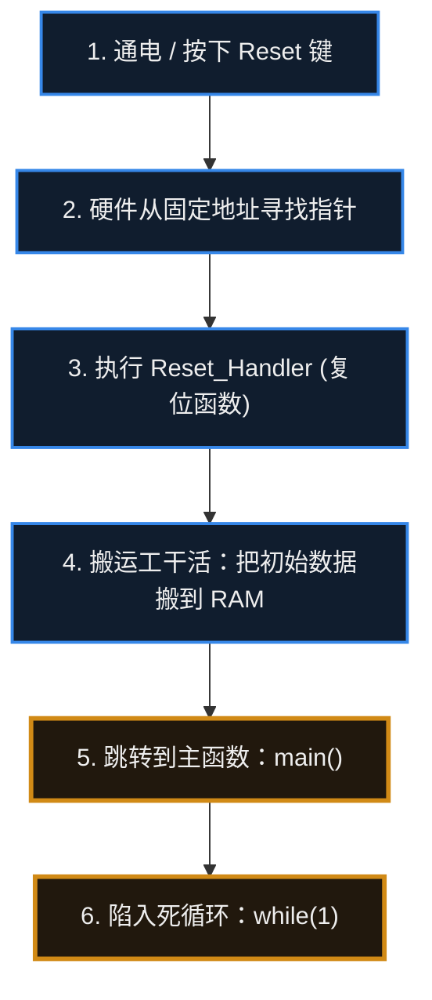

**用大白话还原这个过程：**
1. **通电 (Power On)**：电来了，CPU 苏醒。
2. **找路标**：CPU 醒来做的第一件事，是去 Flash 的最开头（通常是地址 `0x00000000` 或 `0x08000000`），那里写着一个“路标”（中断向量表）。
3. **初始化 RAM**：跳转到一个叫 `Reset_Handler` 的小程序，它会把该放到 RAM 里的初始数据（比如你写的 `int a = 10;`）从 Flash 搬运到 RAM 的料理台上。
4. **进入 main 函数**：一切准备就绪，系统大门打开，代码正式跳进你写的 `main()` 函数。
5. **死循环**：进入 `main()` 之后，裸机程序通常不返回，工程上习惯用一个 `while(1)` 循环收尾，反复读取传感器、控制输出，直到下一次断电。（RTOS 中的任务可以主动删除自己，某些架构也允许 `main()` 返回。）

## 5.6 常见误区与工程陷阱

**误区 1：Flash 等于电脑硬盘、RAM 等于内存条**
见 5.2 与 5.3 的说明：两者在“掉电不丢 / 掉电清空”这一点上对应，但工作机制不同。硬盘上的程序要先加载进内存才能运行，而许多 MCU 直接从 Flash 取指执行 (XIP)，也有把代码搬到 RAM、用 Cache 缓存指令或用 TCM 的方案。这类对应关系只是帮助理解的类比，不是定义。

**误区 2：只要容量够大就行**
Flash 与 RAM 是性质不同的资源：Flash 决定固件与只读数据的容量，RAM 决定运行时变量、栈和堆的空间。选型时需要分别评估，不能只看总量。

**误区 3：认为栈和堆互不干涉**
它们共享同一片 RAM。在常见的链接布局中，栈从内存高地址向下生长，堆从低地址向上生长，两者相向而行；如果栈用得太深或堆碎片化严重，最终会撞在一起。具体布局由链接脚本决定（见第 23 章）。

**误区 4：把所有大数组都放在栈上**
局部大数组会瞬间吃掉大量栈空间，导致栈溢出。资源受限时应改用静态分配或全局数组。

**工程提示**：栈溢出与堆溢出往往不表现为“立刻崩溃”，而是随机覆盖其他变量、偶发 HardFault。排查时应当检查链接脚本为栈分配的大小，并利用编译器提供的栈使用量分析（例如 GCC 的 `-fstack-usage`，具体选项因工具链而异）。

---

# 6. C 语言与嵌入式 C

> [!info] 写在前面
> 如果你学过一点编程，可能会问：“现在 Python、Java 这么火，为什么搞单片机非要用古老又难学的 C 语言？”
> 这一章就来回答这个问题，并梳理 C 语言中三个容易被忽视、也容易引发 Bug 的主题：**指针**、**volatile 关键字** 和 **结构体内存对齐**。理解了它们，才能可靠地用 C 语言操作硬件。

## 6.1 为什么偏偏是 C 语言？

嵌入式世界的资源往往很紧张（典型的单片机可能只有几十 KB RAM，当然也有内存宽裕得多的平台），语言的选择因此非常苛刻：
- **Python / Java**：运行时开销较大，通常需要虚拟机 / 解释器这类运行环境，许多资源受限的单片机难以容纳。此外它们的执行速度通常也较难满足毫秒级的实时要求。（补充：MicroPython / CircuitPython 这类精简实现可以运行在部分 MCU 上，但开销与实时性通常仍不如 C。）
- **汇编语言**：通常可以获得最小的运行时开销，但可读性与可维护性较差，一个简单的点灯程序往往也要写几十行，复杂项目的开发与维护成本很高。

**C 语言** 通常被认为处在两者之间一个比较合适的位置：**它既有易于阅读的逻辑结构（if / while），又能直接访问底层硬件地址。**
所以，所谓的“嵌入式 C 语言”并不是一门新语言，它就是标准的 C 语言，只不过我们用它来直接读写单片机里的寄存器而已。

## 6.2 指针 (Pointer)

指针是 C 语言中最重要的概念之一，也是新手最容易困惑的地方。

**正式定义：** 指针是一个**保存地址的变量，并且带有类型**。类型决定了它指向对象的访问宽度，也决定了指针运算的步长——例如 `int *p` 执行 `p + 1` 时，地址通常前进 `sizeof(int)` 个字节，而不是 1 个字节。

可以把它理解为内存的“门牌号”：门牌号本身不是房间里的内容，但能告诉你房间在哪里。

想象单片机的 RAM（内存）是一家有一万个房间的**超级大酒店**（这是一个帮助理解的类比）。
- **变量**：住在房间里的**客人**（比如 `int temperature = 25;`，客人叫 temperature，值是 25）。
- **地址 (`&`)**：这个房间的**门牌号**（比如 `0x20001000`）。
- **指针变量 (`*`)**：可以理解成一张**写着门牌号的小纸条**；严格地说，它是一个专门用来存放地址的变量。

### 为什么嵌入式离不开指针？
在 PC 上写代码，你不在乎数据存在哪个房间，操作系统会帮你管。
但在单片机里，外设的行为由硬件固定：**某个外设的功能，就绑定在某个固定地址之上**。例如在 STM32F1 中，要使能某个 GPIO 端口的时钟，就要写 RCC_APB2ENR 寄存器，它的地址是 `0x40021018`。

你想开灯，通常就需要直接往这个固定地址写数据。在 C 语言里，这类固定地址的访问通常通过指针完成：

```c
// 以 STM32F1 为例：0x40021018 是 RCC_APB2ENR 寄存器的地址
// （不同芯片、不同外设的地址完全不同，需要查阅对应芯片的 Reference Manual）
int *led_room = (int *)0x40021018;   // 把该地址解释为指向 int 的指针

*led_room = 1;   // 解引用：访问该地址对应的存储单元，写入 1
```
这就是嵌入式里访问硬件寄存器的常见方式：**用指针保存并访问固定地址，直接读写该地址对应的存储单元。**

## 6.3 volatile：阻止编译器优化掉必要的访问

在嵌入式开发中，少写一个 `volatile` 关键字，可能会让 Bug 的排查变得非常困难。

**正式定义：** `volatile` 是一种类型限定符 (qualifier)，它告诉编译器：这个对象的值可能在正常代码流之外发生变化（例如被硬件、中断服务程序或另一个执行流修改），因此不能随意优化掉对它的访问。

**一个典型例子（编译器的优化）：**
假设你写了一段代码，一直在等按键按下（按键按下时，硬件会自动把 `button_flag` 变成 1）：
```c
int button_flag = 0;
while (button_flag == 0) {
    // 轮询等待按键按下
}
// 按下后，去开灯
```

编译器（翻译代码的软件）是个追求效率的“工作狂”。它在检查代码时会想：“这个 `button_flag` 在循环里没有任何代码去修改它，那每次重新读它就没有必要。我只读第一次，如果第一次是 0，就假定它一直是 0，让程序直接死循环吧。”
**结果：** 你明明按下了按键，硬件也确实把房间里的数字改成了 1，但 CPU 根本不去房间里看，程序卡死。

**解决方法：加上 `volatile`**
```c
volatile int button_flag = 0;
```
`volatile` 的意思是“易变的”。加上它，相当于明确告知编译器：**“这个变量的值可能会被硬件或中断改变，不要把它缓存到寄存器里，每次访问都要真正去读内存。”**

> [!important] 什么时候需要用 volatile？
> 1. 代表**硬件寄存器**的变量。
> 2. 在**中断 (ISR)** 里修改，在主程序里读取的全局变量。

### volatile ≠ 原子操作 ≠ 线程安全

`volatile` 只解决**“编译器优化导致的可见性”**问题——它保证每次都老老实实去内存里读。但它**不保证**下面这些事：

```text
volatile
  ≠ 原子操作 (atomic)
  ≠ 互斥锁 (mutex)
  ≠ 内存屏障 (memory barrier)
  ≠ 线程 / 任务同步
```

看一个经典反例：

```c
volatile int flag = 0;

flag++;   // 这一行依然不安全
```

`flag++` 在硬件层面其实是三步：**读出来 → 加 1 → 写回去**。如果在这三步之间来了一个中断（或另一个任务）也改了 `flag`，两次修改就会互相覆盖，结果少加了一次。`volatile` 管不了这件事——它只保证“每次都真的去读”，不保证“这一串操作不被打断”。

所以记住这句话：**`volatile` 是用来对付编译器的，不是用来对付并发的。** 中断、RTOS、多任务之间的同步，该用原子操作、临界区、互斥锁，这些会在第 8 章（中断）和第 18 章（并发、同步与互斥）展开。

## 6.4 结构体 (Struct) 与内存对齐

结构体（Struct）的作用是把不同类型的数据组合成一个整体（可以类比为一份“套餐”，仅用于帮助建立直觉）；解析网络数据包或传感器数据时经常用到。

**正式定义：** 结构体是把若干成员按声明顺序组合成的复合数据类型。各成员在内存中的实际偏移由目标架构、ABI 与对齐规则共同决定——通常按声明顺序排列，但成员之间可能被插入填充字节。

```c
struct SensorData {
    char  id;       // 编号，占 1 个字节
    int   temp;     // 温度，占 4 个字节
};
```
你以为这个套餐总共占 **5 个字节**？实际上往往不是。
如果你去测一下，在许多平台上会发现它占了 **8 个字节**——编译器在 `id` 后面插入了 3 个填充字节。

**为什么会这样？（内存对齐）**
对齐要求由目标架构、ABI 与编译器共同决定。许多架构（例如许多 ARM ABI）要求数据按其自然边界存放：4 字节的 `int` 通常要落在 4 的倍数地址上，未对齐的访问在某些架构上只是变慢，在某些架构上会直接触发异常。为了满足对齐要求，编译器会在成员之间插入无用的字节（这叫 **Padding**）来凑齐。

但要记住：**结构体实际占多大、成员怎么排布，是由编译器、ABI（应用二进制接口）、目标架构和对齐规则共同决定的**，并不是一条“永远是 4 字节”的固定规则。换个编译器、换个架构，甚至换个编译选项，结果都可能不一样。所以别靠猜——**用 `sizeof()` 量大小、用 `offsetof()` 查成员偏移**，才最可靠：

```c
#include <stddef.h>

sizeof(struct SensorData);            // 这个结构体到底占多少字节？
offsetof(struct SensorData, temp);    // temp 这个成员从第几个字节开始？
```

**对齐规则带来的问题**
如果你把这个带有填充字节的结构体直接通过串口发给另一个设备，而对方按 5 个字节来解析，**各字段就会发生错位**。

**怎么解决？**
可以用编译器提供的**打包扩展 (packing extension)** 来减少填充，让结构体按 1 字节紧凑排布。不同工具链的写法不同：

```c
// GCC / Clang：使用 __attribute__((packed))
struct __attribute__((packed)) SensorData {
    char  id;       
    int   temp;     
}; 
// Windows 上的 MSVC 则使用 #pragma pack(1) 达到类似效果
// 打包后通常只占 5 个字节（仍建议用 sizeof() 实测确认）
```

> [!warning] 换工具链必须重新验证
> `__attribute__((packed))` 是 GCC / Clang 的扩展，`#pragma pack` 是另一套写法，两者的语义细节并不完全一致。更换编译器、编译选项或目标架构后，结构体布局可能变化，**建议始终用 `sizeof()` / `offsetof()` 实测，而不是假定布局不变**。

> [!warning] `packed` 不是免费的，更不是“序列化万能药”
> - **可能造成非对齐访问**：成员被挤到非对齐地址上，在某些架构上只是**性能下降**，在某些架构上会直接触发**硬件异常**。
> - **它没有解决序列化问题**：`packed` 只管“别塞空字节”，并没有规定**字节序**（大端 / 小端），也没有规定**字段宽度**（`int` 在不同平台上可能是 2 / 4 / 8 字节）。只要两边编译环境不同，照样对不上。
>
> 真正做网络协议、文件格式或设备间通信时，工程上的做法通常是**显式序列化**：按协议规定把每个字段写成固定宽度（比如 `uint16_t`、`uint32_t`），明确约定字节序，再逐字段打包成字节流。`packed` 顶多算个方便的小工具，替不了这件事。

## 6.5 回调函数 (Callback)

在不少单片机代码中会用到**函数指针（即把函数地址当作数据来保存和传递）**，它最典型的应用之一就是**回调 (Callback)**。

**一个类比（仅用于帮助建立直觉，不是定义）：**
- **普通调用**：你去披萨店点餐，然后坐在店里一直等到披萨烤好才离开（对应阻塞式等待 / 轮询）。这段时间 CPU 无法处理其他工作。
- **回调机制**：你去披萨店点餐，**留下手机号码（把处理函数的地址注册给底层硬件）**，然后就可以先去处理别的事情。披萨烤好后（硬件事件或中断触发），店员按你留的号码通知你（调用你注册的回调函数）。

```c
// 你的处理动作（回调被调用时执行）
void my_pizza_ready_action() {
    printf("去拿披萨！");
}

// 注册回调：把函数地址交给底层的定时器
timer_set_callback(my_pizza_ready_action);
```

## 6.6 常见误区与工程陷阱

**误区 1：以为加了 `volatile` 就解决了并发问题。**
`volatile` 只保证编译器不会优化掉对该对象的访问，它不提供原子性、互斥和内存序保证（见 6.3）。像 `flag++` 这样的读-改-写操作，即使变量被声明为 `volatile`，在与中断或其他任务共享时仍然可能出错。中断场景与 RTOS 场景下应当使用的同步手段，会在第 8 章和第 18 章展开。

**误区 2：把 `packed` 结构体直接当成通信协议格式。**
`packed` 只改变编译器插入填充字节的方式，它既没有约定字节序，也没有固定字段宽度。跨设备通信时，工程上的做法通常是**显式序列化**：使用固定宽度类型（如 `uint16_t`、`uint32_t`）、明确约定字节序，再逐字段写入字节流（见 6.4）。

**误区 3：凭经验手算结构体大小与成员偏移。**
结构体布局由目标架构、ABI、编译器和编译选项共同决定，手算容易出错。工程上通常用 `sizeof()` 与 `offsetof()` 实测，并在更换工具链或编译选项后重新验证。

**误区 4：假定 `int` 等基本类型的宽度是固定的。**
C 标准只规定了各类型的最小宽度与相对大小关系，`int` 的宽度会随平台变化。凡是要写入通信协议、文件格式，或与硬件寄存器直接交互的字段，通常应当使用 `<stdint.h>` 中的固定宽度类型。

**误区 5：把“嵌入式不能用动态内存”当作绝对规则。**
在资源受限、强实时或需要长期运行的系统中，动态内存分配需要谨慎评估：它可能带来内存碎片、分配时间不确定、内存泄漏、double free、use-after-free 等问题。但这并不意味着动态内存在嵌入式系统中一律不可用——RTOS 与嵌入式 Linux 中都存在合理使用动态内存的场景（详见后续相关章节）。

> [!summary] 总结本章
> 1. **C 语言** 既能写逻辑，又能直接访问底层地址，是嵌入式开发的主流选择。
> 2. **指针** 是保存地址并带有类型的变量；可以把它理解为内存的“门牌号”，通过它可以直接读写固定地址。
> 3. **`volatile`** 用来告诉编译器：这个对象的值可能在正常代码流之外变化，不能优化掉对它的访问。
> 4. **结构体对齐** 会在数据里偷偷塞空字节，布局由编译器和 ABI 决定；跨设备通信时不要依赖 `packed`，而要做**显式序列化**（固定字段宽度 + 约定字节序）。
> 5. **回调函数** 通过函数指针把处理逻辑注册给底层模块，硬件事件发生时再被调用，从而避免 CPU 阻塞等待。


---

# 7. GPIO

> [!info] 写在前面
> 如果说 CPU 是单片机的大脑，那么可以粗略地把 **GPIO** 理解为单片机的**手和脚**（这是类比，不是定义）。
> 芯片四周有许多金属引脚。除固定用于接电源（VCC）和地（GND）的引脚外，其余多数引脚通常可以较灵活地配置。这一章介绍如何配置与使用这些引脚。

## 7.1 什么是 GPIO？

**GPIO** 全称是 General Purpose Input/Output（通用输入输出引脚）。

> [!note] 正式定义
> GPIO 是微控制器 / 处理器上的一类通用输入输出外设：其引脚可被配置为**输入**、**输出**、**复用功能 (Alternate Function)** 或**模拟模式**等；具体支持哪些模式、复用功能如何映射，以及电气特性如何，都以该芯片的 **Datasheet** 与 **Reference Manual** 为准。

“通用”的意思是：多数通用引脚可以由软件配置为**输入**去感知外部电平，也可以配置为**输出**去驱动外部电路。不过并非每个引脚都能随意使用，部分引脚有固定用途（见 7.5）。

点亮单片机世界的第一盏 LED 灯，读取第一个按键，全都是通过控制 GPIO 来实现的。

## 7.2 输出模式 (Output)

把一个引脚配置为“输出模式”后，软件即可控制该引脚对外的电压。最常见的输出模式有两种：**推挽输出** 和 **开漏输出**，下面分别说明。

### 1. 推挽输出 (Push-Pull)
这是最常用的一种输出模式。
- **推 (Push)**：单片机主动向外“推”出电流，引脚输出高电平（比如 3.3V）。
- **挽 (Pull)**：单片机主动把电流“拉”回来，引脚连通 GND，输出低电平（0V）。
- **特点**：不管输出高还是低，单片机都是**发力**的。它能直接点亮 LED 灯，驱动能力比较强。

### 2. 开漏输出 (Open-Drain)
这种模式容易被误用。
- 在开漏模式下，输出级**不具备主动输出高电平的能力**：它只具备下拉能力，能把引脚拉到低电平 (0V)。
- 当输出级关断（释放引脚）时，引脚呈**高阻态 (High-Z)**，此时的电平由外部电路决定，而不是被芯片强行驱动到某个电平。
- **为什么需要这种模式？** 因为在一些总线拓扑（比如后面要讲的 I2C 总线）上，多个器件共享同一条信号线。如果每个器件都能主动输出高电平，一旦设备 A 输出高、设备 B 输出低，就会形成低阻通路、电流剧增，可能损坏器件。开漏加外部上拉的结构可以避免这种冲突。
- **怎么输出高电平？** 需要在外部接一个**上拉电阻**连到 VCC（部分 MCU 也可开启内部上拉）。当单片机释放引脚时，由上拉电阻把电平拉高。

> [!tip] 工程实践：点灯该选哪种输出？
> 点亮 LED 或驱动简单的数字模块时，通常选用 **推挽输出 (Push-Pull)**：它在高低两个方向都能主动驱动，边沿更陡、驱动能力更明确。
> 开漏输出主要用于需要“线与”或多器件共享总线的场合，此时高电平依赖外部上拉电阻，上升沿速度受上拉阻值和线容影响。

## 7.3 输入模式 (Input)

把引脚配置为“输入模式”后，该引脚不再主动驱动电平，而是通过输入缓冲器读取引脚上的电平是高（1）还是低（0）。

这时，第 3 章讲过的**悬空（Floating）**问题又会出现：悬空引脚的电平可能随干扰而随机波动。为避免这种情况，输入模式通常提供三种子选项：

1. **浮空输入 (Floating)**：芯片内部不接上拉或下拉，电平由外部电路决定。除非外部模块始终给出明确的高低电平，否则通常不建议这样使用。
2. **上拉输入 (Pull-up)**：芯片**内部**接通一个连向 VCC 的上拉电阻。外部未接任何器件时，默认读到 1。常用于连接按键（按键另一端接地，按下时读到 0）。
3. **下拉输入 (Pull-down)**：芯片内部接通一个连向 GND 的下拉电阻。外部未接任何器件时，默认读到 0。

## 7.4 复用功能 (Alternate Function)

单片机上的引脚资源非常宝贵。一个几十个引脚的单片机，不可能给每一个外设都单独分配专门的引脚。
所以，**一个引脚往往身兼数职**。

比如，引脚 `PA9`：
- 在普通情况下，你可以把它当成普通 GPIO，用代码控制它输出 0 还是 1 来点灯。
- 但是，如果想用它来发送串口（UART）数据，由软件逐位控制 0 和 1 的跳变，CPU 开销会非常大。
- 这时候，你可以在代码里把它配置为 **复用功能 (Alternate Function, 简称 AF)**。
- 含义是：**该引脚的控制权被移交给内部的串口硬件模块**。此后由该模块按串口时序精确控制引脚电平的跳变，CPU 只需要读写数据寄存器，从而可以腾出时间处理其他任务。

本章内容的结构可以概括如下：

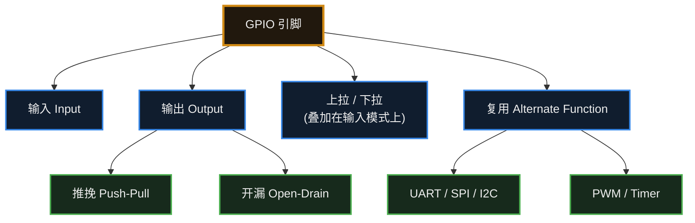

## 7.5 真实硬件的约束

前面的内容容易让人以为“随便挑个引脚就能用”。但在真实项目中，**GPIO 的使用会受到许多来自芯片设计与硬件电路的约束**，这是设计阶段容易出问题的地方。

### 1. 有些引脚天生“名花有主”

| 引脚类型 | 说明 | 还能当普通 GPIO 用吗 |
| :--- | :--- | :--- |
| **电源 / 地** | VCC、GND、VREF 等 | 不能 |
| **复位引脚 (NRST)** | 拉低会让芯片复位 | 一般不能，乱动会导致随机复位 |
| **晶振引脚 (XTAL)** | 接外部晶体 / 时钟源 | 不用外部晶振时，**部分型号**可以释放出来 |
| **调试引脚 (SWD / JTAG)** | 下载程序、在线调试 | 慎用：被复用后可能无法再连接调试器 |
| **Boot / Strapping 引脚** | 上电瞬间被芯片采样，决定**从哪里启动**（Flash / Bootloader / 下载模式） | 上电时必须保持正确电平，之后**部分**可复用 |

> [!warning] 接线前应先查阅引脚定义表
> 把调试引脚配成普通 GPIO，或者让 Boot 引脚在上电时电平不对，是导致“**板子连不上、程序烧不进去**”的常见原因。这类问题往往并非芯片损坏，而是引脚使用不当。

### 2. 电气上的硬限制

| 约束 | 说明 |
| :--- | :--- |
| **最大输出电流** | 单个引脚通常只能提供十几 mA（具体值查 Datasheet）。**想用它直接驱动电机、继电器、大功率 LED 是不现实的**，通常要经过三极管 / MOS 管 / 驱动芯片。 |
| **输入电压范围** | 引脚电压一般不应超过 VDD。不少芯片允许略高一点，但**并非所有引脚都耐 5V**。 |
| **3.3V / 5V 兼容性** | 5V 器件输出高电平接近 5V，直接接 3.3V 引脚可能损坏芯片；反过来，3.3V 输出能否被 5V 器件认成高电平，也要看对方的 VIH。**必要时加电平转换。** |
| **总电流上限** | 除了单个引脚，芯片还有**所有引脚加总**的电流限制，同样要查手册。 |

> [!important] 权威依据：Datasheet 与 Reference Manual
> 上面这些数字，**没有一条是靠背下来的**，全部以你手上那颗芯片的 **Datasheet**（数据手册，看电气参数）和 **Reference Manual**（参考手册，看寄存器与外设行为）为准。
> 养成“先查手册再接线”的习惯，能省下大量返工和烧板子的钱。

## 7.6 常见误区与工程陷阱

> [!warning] 误区 1：把 GPIO 当成“随便控制的数字引脚”
> GPIO 不是一组抽象的逻辑开关，它背后是真实的 CMOS 输出级与输入缓冲器，有电压范围、驱动能力、翻转速率等电气约束。
> 使用前至少要确认三件事：**这个引脚能否被配置成你要的功能**、**它的电平和对方是否兼容**、**它要驱动的负载有多大**。这些信息来自 Datasheet（电气参数）与 Reference Manual（寄存器与外设行为）——先查手册，再接线。

> [!warning] 误区 2：配置了 GPIO 模式，却忘了复用功能
> 想使用 UART / SPI / I2C / PWM 时，通常需要把对应引脚配置为**复用功能 (AF)**，并选择正确的 AF 编号；部分芯片还需要额外使能该外设的时钟。
> 只把引脚设成“推挽输出”并不会让它自动变成串口引脚。这类问题的典型现象是：代码看起来没错，但用逻辑分析仪 / 示波器测量时引脚上什么波形都没有。

> [!warning] 误区 3：忽略最大输出电流与电平兼容
> 单个引脚的拉电流 / 灌电流有上限（常见量级为十几 mA，具体值查 Datasheet），并且芯片还有**所有引脚合计**的电流上限。
> 驱动电机、继电器、大功率 LED 等负载时，通常要经过三极管 / MOS 管 / 专用驱动芯片，不宜由 GPIO 直接驱动。
> 电平方面：3.3V 与 5V 器件互连时，需要检查对方的高电平输入门限 (VIH) 以及自己引脚是否耐 5V，必要时加电平转换电路。

> [!danger] 误区 4：把调试引脚 / 启动引脚当普通 IO 用
> - **调试引脚 (SWD / JTAG)**：一旦被复用为普通 GPIO，可能无法再次连接调试器，出现“程序烧不进去、也连不上”的局面。部分芯片提供了保持调试端口使能的选项，但更稳妥的做法是优先避开这些引脚。
> - **Boot / Strapping 引脚**：芯片在上电复位瞬间采样这些引脚的电平来决定启动介质（Flash / Bootloader / 下载模式）。如果外部电路在上电时把它们拉到错误的电平，芯片可能进入非预期的启动模式。
> - 因此，分配引脚和接线之前，先看芯片的**引脚定义表 (Pinout)** 与 Datasheet 中的引脚说明。

> [!important] 引脚能力必须以 Datasheet 与 Reference Manual 为准
> 本章出现的所有数字都只是常见量级，用于建立直觉。实际设计时，**以你手上那颗芯片的 Datasheet（电气特性、绝对最大额定值）和 Reference Manual（GPIO 寄存器、复用功能映射表）为准**。不同厂商、甚至同厂商不同系列的引脚能力都可能不同。

> [!summary] 总结本章
> 1. **GPIO** 是通用输入输出引脚，多数通用引脚可由软件配置为输入或输出，但部分引脚有固定用途（见 7.5）。
> 2. **推挽输出**：能在高低两个方向主动驱动，适合点灯。
> 3. **开漏输出**：输出级只具备下拉能力，高电平依赖外部“上拉电阻”，适合挂接多个设备的通信总线。
> 4. **输入模式**：作为数字输入使用时，通常需要开启上拉或下拉，让引脚有确定的默认电平；应避免让高阻抗节点长期悬空（模拟输入、禁用输入缓冲等特殊场景除外，见 3.3）。
> 5. **复用功能**：把引脚的控制权移交给内部专用硬件模块（如串口、定时器）。
> 6. GPIO 还有**电气限制**（电流、电压、电平兼容性），而且复位、晶振、调试、Boot 等引脚另有用途——**具体能力以 Datasheet 和 Reference Manual 为准**。


---

# 8. 中断

> [!info] 写在前面
> 先做一个类比：假设你正在房间里戴着耳机打游戏，这时点的外卖快到了。
> 第一种做法是每隔两秒跑到门口看一眼外卖到了没有；第二种做法是给大门装一个门铃，门铃不响就继续打游戏，门铃一响再暂停游戏去取外卖。
> 前者对应**轮询 (Polling)**，后者对应**中断 (Interrupt)**。
>
> 需要强调的是，门铃只是帮助建立直觉的类比。中断在硬件上的真实流程是：外设事件 → 置起中断标志 → 中断控制器判断是否允许响应 → CPU 响应 → 保存必要上下文 → 进入 ISR。本章将从这条链路出发介绍中断机制。

## 8.1 为什么需要中断？

### 1. 低效的机制：轮询 (Polling)
如果不用中断，我们检测按键按下的代码通常是这样写的：
```c
while(1) {
    if (读取按键 == 按下) {
        开灯();
    }
    // CPU 的时间几乎都花在反复询问“按下了没”
}
```
这种方式会持续占用 CPU 的算力。更值得注意的是，如果 CPU 刚才去做别的事情（比如刷新一块屏幕，花了 0.1 秒），而按键刚好在这 0.1 秒内被按下又松开，这次按键事件就会被**漏掉**。

### 2. 更高效的机制：中断 (Interrupt)
使用中断时，我们先配置好硬件：“当按键引脚的电平从高变成低（这叫下降沿）时，给出一个中断请求。”

之后按键事件不再需要 CPU 反复查询：外设自己检测事件，并通过中断控制器通知 CPU。这相当于给硬件装了一个门铃——**门铃只是类比**，对应到硬件上就是下面这条链路。

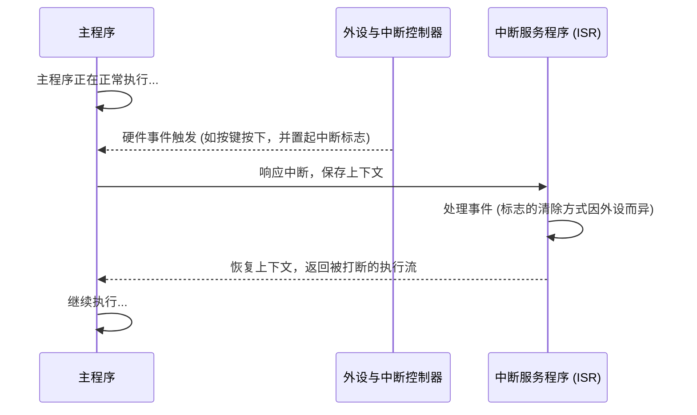

**需要注意：CPU 并不是在任意时刻被“打断”的。** 一次中断在硬件上大致要走这样一条链路（不同架构细节不同）：

```text
外设事件发生
  ↓ 置起中断标志
中断控制器判断（是否被屏蔽？优先级如何？）
  ↓ 向 CPU 发出中断请求
CPU 响应中断
  ↓ 保存必要的上下文
进入 ISR
  ↓ 处理事件、清除标志
返回被打断的程序
```

注意这只是**概念模型**：具体保存哪些寄存器、能不能被更高优先级打断、标志由谁清除，都由 MCU 架构和外设设计决定。

## 8.2 中断服务程序 (ISR)

**正式定义**：ISR (Interrupt Service Routine，中断服务程序) 是响应某个中断请求、由硬件跳转执行的一段专门代码。它运行在中断上下文（异常上下文）中，而不是通过普通函数调用语句进入的。

你不需要在代码的某处主动调用这个函数。只要中断条件满足且被允许响应，硬件就会把 CPU 的执行流切换到对应的 ISR。

> [!note] 类比与定义的边界
> 用“门铃响了去开门”来类比中断是可以的，但要清楚它的局限：人听到门铃可以立刻放下手里的事，CPU 则通常要等到当前指令执行结束（指令边界）才会响应，并且要先保存必要的上下文，再把执行流交给 ISR。

## 8.3 常见误区与工程陷阱

带中断的程序出现异常时，**常见原因包括**：

- 中断标志未被正确清除（下面详述）
- 中断向量配置错误，跳到了错误的处理函数
- 栈溢出（中断嵌套 + ISR 中的大局部数组）
- 在 ISR 中访问了非法地址 / 空指针
- 主程序和 ISR 共享数据时发生**数据竞争**
- 优先级配置错误，或中断嵌套层次过深
- 外设初始化不完整（时钟没使能、引脚没配对）
- 清标志的**时序**不对（清早了或清晚了）

下面挑两个最典型的展开说明。

### 陷阱 1：中断标志的清除方式
- **现象**：按键只按了一下，程序却像卡住一样，其他事情长时间得不到响应。
- **原因**：硬件触发中断时，通常会在外设的中断状态寄存器里把对应标志位置 1。如果 CPU 处理完事件、退出 ISR 时该标志仍然为 1，中断控制器就可能认为同一个事件依然有效（或被再次触发），于是 CPU 刚退出 ISR 又马上重新进入。
- **结果**：CPU 反复重入 ISR，主程序长时间得不到执行，表现为系统卡死。

> [!warning] 中断标志的清除方式取决于具体 MCU 与外设设计
> 上面讲的是“标志未被清除会反复重入”这个**道理**。至于**具体怎么清、什么时候清，并没有统一规则**，常见的机制包括：
> - **写 1 清除**：向标志位写 1 才清除（很多 Cortex-M 外设采用这种方式）
> - **写 0 清除**：向标志位写 0 才清除
> - **先读状态寄存器**，再做相应操作才能清除
> - **读数据寄存器时自动清除**（例如 UART 读出接收数据后）
> - 由**硬件自动清除**，软件不需要干预
> - **独立的 pending bit**：中断标志与使能位分离，需要分别处理
>
> 所以不要背“ISR 第一件事必须清标志”这类口诀，而应在使用某个外设时查阅该芯片的 **Reference Manual**：这个外设的标志位叫什么、怎么清、应该在处理事件之前清还是之后清。

### 陷阱 2：在 ISR 中执行耗时操作
- **现象**：系统响应变慢，其他外设的反应明显迟钝，甚至出现事件丢失。
- **原因**：ISR 占用 CPU 的时间越长，中断延迟越大。同级或更低优先级的中断只能排队等待，系统的响应时间会变得不确定（jitter 增大）。用门铃类比（注意这只是类比）：取外卖时在门口长时间闲聊，别的事情就都被耽误了。
- **结果**：通常不应在 ISR 中调用 `delay` 这类阻塞函数，也应避免在 ISR 中直接 `printf` 打印大量字符。
> [!tip] ISR 的原则
> **ISR 应尽可能短、确定、非阻塞**（也可以通俗地理解为“快进快出”）。常见做法是：在 ISR 中只把数据读出来存进缓冲区，或者把一个全局变量 `flag` 置 1；随后尽快退出 ISR，由主程序在 `while(1)` 中检查 `flag` 并完成后续处理。
>
> 需要说明的是，这并不是一条绝对禁令：**是否允许某个操作取决于具体平台与执行环境**。例如在某些 RTOS 中，ISR 可以调用专门的中断安全 API（发送信号量、写消息队列等）；部分平台也提供了可重入的日志实现。判断的依据是：该操作是否会阻塞、是否可重入、是否会与中断上下文产生锁竞争，以及是否会显著拉长中断延迟。

**为什么在 ISR 中使用 `delay` 和 `printf` 通常会带来问题？** 原因值得说清楚：

| 操作 | 会带来什么问题 |
| :--- | :--- |
| **在 ISR 中 `delay()` 长时间等待** | 中断被拖长 → 其他中断只能排队（**中断延迟**变大）→ 系统响应时间变得不确定（**jitter** 增大）。有些 `delay` 还依赖系统 tick 中断，在 ISR 中使用可能导致卡死。 |
| **在 ISR 中 `printf` 打印一大串** | 串口发送本身较慢；`printf` 底层可能**阻塞等待**、可能**加锁**、也可能**不是 ISR-safe 的实现**（不可重入）。在 ISR 中调用时，轻则拖慢系统，重则死锁或输出错乱。 |

所以原则是：**ISR 应该尽可能短、确定、非阻塞。** 需要打印调试信息时，先在 ISR 中把数据存进缓冲区，回到主程序再打印。

## 8.4 中断优先级

为便于说明，这里继续沿用前面的门铃与电话类比（再次强调：这只是帮助建立直觉的类比，不等同于硬件定义）。假设单片机既接了按键（对应“门铃”），又接了串口通信（对应“电话”）。
- **场景 1**：门铃和电话同时响了，CPU 先处理谁？
- **场景 2**：CPU 正在处理按键 ISR（相当于在门口拿外卖），这时候电话响了，CPU 要不要暂停当前处理去接电话？

这就引出了**中断优先级 (Interrupt Priority)** 的概念：给每个中断分配一个优先级，由硬件决定谁先谁后。

以 **ARM Cortex-M 系列 + NVIC（Nested Vectored Interrupt Controller，嵌套向量中断控制器）** 为例，每个中断的优先级通常可以拆成两部分：
- **抢占优先级 (Preemption Priority)**：决定“能不能打断别人”。沿用上面的类比：如果串口的抢占优先级高于按键，那么 CPU 正在执行按键 ISR 时，会被更高优先级的中断打断，先去执行串口 ISR，执行完再回到按键 ISR 继续。这叫**中断嵌套**。
- **响应优先级 (Sub Priority)**：当两个中断**同时**挂起时，决定 CPU 先响应哪一个。如果 CPU 已经在处理其中一个，另一个即使响应优先级更高，也要等当前 ISR 结束（或按规则被打断）之后才能得到处理。

> [!note] “抢占优先级 / 响应优先级”是 Cortex-M 的规则，不是所有 MCU 的通用规则
> 这一套说法来自 **ARM Cortex-M 系列 + NVIC**，很多 STM32 教程讲的就是它。
> 但不同架构和厂商的中断模型差别很大：RISC-V、Xtensa、ARM A 系列各有各的做法——有的只有单一优先级数值，有的分组方式不同，有的甚至不支持嵌套。
> 所以换一颗芯片，就要**重新看它的中断控制器文档**，不要直接套用。

> [!summary] 总结本章
> 1. **中断** 让 CPU 不必在轮询中空转等待外设事件，通常能显著提高 CPU 的利用率。
> 2. 由硬件在中断响应链路中切换执行流、用来处理该中断的代码称为 **ISR**。
> 3. 忘了清除中断标志位，会让 CPU 反复重入 ISR；但**怎么清、何时清因芯片和外设而异**，要查 Reference Manual。
> 4. ISR 要**短、确定、非阻塞**：长延时和 `printf` 都会拖长中断延迟、增加系统 jitter，甚至死锁。
> 5. 重要的中断设为**高优先级**；优先级机制的具体规则**取决于芯片架构**（如 Cortex-M 的 NVIC）。

---

# 9. 定时器与 PWM

> [!info] 写在前面
> 如果你想让单片机“每隔 1 毫秒精准采样一次数据”，或者“让马达平滑地改变转速”，靠 CPU 空等（`delay`）是无法完成的。
> 这一章，我们将介绍单片机内部用于处理时间维度的两个核心外设：**硬件定时器 (Timer)** 和 **脉宽调制 (PWM)**。理解它们，是实现精确控制和模拟输出的基础。

## 9.1 为什么需要硬件定时器？

在初学阶段，让 LED 闪烁最直观的做法是使用软件延时（如 `delay(1000)`）。

**软件延时的本质与问题：**
软件延时通常是通过让 CPU 执行大量无意义的空循环（如 `for` 循环）来消耗时间。
这会带来两个典型的工程问题：
1. **阻塞系统**：CPU 在空转时，无法处理其他计算或响应低优先级事件。
2. **精度极差**：如果在 `delay` 期间发生了一次中断，CPU 会去执行 ISR，回来后继续 `delay`，导致实际延时时间被严重拉长（这被称为 Jitter / 抖动）。

**解决方案：硬件定时器**
单片机内部通常配备了多个独立的硬件定时器。你可以把它粗略地类比为一个**“独立工作的闹钟”**。
在正式的工程定义中：**定时器是一个由时钟信号驱动的硬件计数器 (Counter)。**
它独立于 CPU 运行，CPU 只需要花几微秒把它配置好，它就会自己在后台精准地“数数”，当满足特定时间条件时，再通过**中断**或**硬件事件**通知 CPU。

## 9.2 定时器的工作原理与核心参数

不论是 STM32、ESP32 还是其他架构的 MCU，一个典型的基础定时器通常由以下几个核心部分组成：

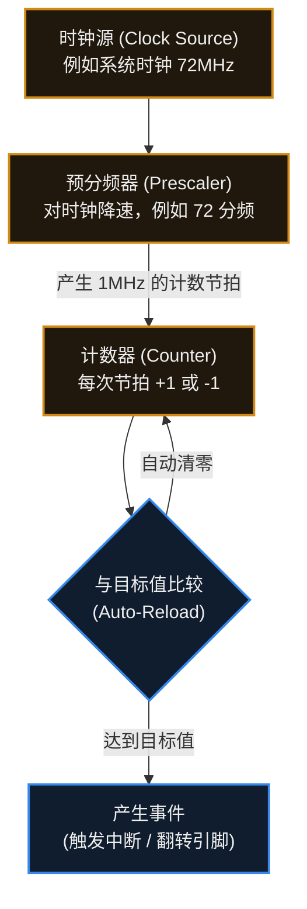

**核心参数解析：**
1. **时钟源频率 ($f_{clk}$)**：定时器的心跳节拍，通常来自系统总线时钟。
2. **预分频器 (Prescaler / PSC)**：可以类比为一个“减速齿轮”——它实际是一个对输入时钟做整数分频的硬件计数器。如果时钟源是 72MHz，直接数数太快了。以 STM32 为例，PSC 寄存器写 71 才得到 72 分频（分频值 = PSC + 1），此时定时器每秒数 1,000,000 下（即 1MHz，每数一下耗时 1 微秒）。不同芯片的分频计算方式、PSC 取值范围、以及时钟源是否取自系统主频都可能不同，需要参考 Reference Manual。
3. **自动重装载值 / 周期值 (Auto-Reload / Period)**：这是计数的“目标线”。在**向上计数**模式下，当计数器数到这个值时，通常会触发一次更新事件（STM32 中称为 Update Interrupt，其他厂商的命名与细节可能不同），并把计数器重新装载。需要注意计数模式并不只有向上计数：**向下计数**模式下计数器递减到 0 再重载，**中央对齐**模式下先向上数到重载值、再向下数到 0；这些模式的行为都不是简单的“到点自动归零”，具体以芯片的定时器章节为准。

> [!note] 定时器不仅仅能用来产生中断
> 高级定时器除了基础的计时功能，还具备：
> - **输入捕获 (Input Capture)**：当外部引脚发生电平跳变时，硬件自动把当前计数器的值“抓”下来，常用于测量外部方波的频率或脉宽。
> - **输出比较 (Output Compare)**：当计数器数到某个特定值时，硬件自动改变某个引脚的电平，这就是接下来要讲的 PWM 的底层实现方式。

## 9.3 什么是 PWM？

通用 GPIO 的输出是数字逻辑：它一般只能输出高电平（接近 VCC）或低电平（接近 GND）两种状态，无法直接输出 1.5V 这样的中间电压。
**那么，单片机该如何输出 1.5V 的电压，或者让 LED 表现出“一半的亮度”？**

在不使用专门的 DAC（数模转换器）的情况下，工程中最主流的方案是 **PWM (Pulse Width Modulation，脉冲宽度调制)**。

**一句话理解 PWM：**
通过极快地在“全开”和“全关”之间切换，利用物理系统的**惯性**（如人眼的视觉暂留、电机的机械惯性、电容的充放电特性），让系统感受到一个“平均”的模拟能量。这里的“平均”是一种帮助理解的类比式说法，严格的表述见下面的正式定义。

**正式定义**：
PWM 是通过调制脉冲宽度（即占空比）来等效调节输出平均电压 / 平均功率的数字控制手段。它并不改变输出电平的高、低两种取值，而是在固定周期内改变高电平所占的时间比例；被控对象（LED、电机、RC 网络等）自身的惯性或低通特性会把方波“积分”成等效的平均效果。需要说明的是，这种等效成立的前提是被控对象的响应速度远慢于 PWM 周期。

## 9.4 PWM 的核心参数

理解 PWM，需要掌握以下三个参数：

```text
高电平 3.3V  ┌──────┐            ┌──────┐      
低电平   0V  ┘      └────────────┘      └────────────
             |<--   1个周期   -->|
             |<-高电平->|
```

1. **频率 (Frequency, Hz)**：
   - 决定了 PWM “开/关”循环的速度。
   - **工程取舍**：频率太低，LED 会肉眼可见地闪烁，电机运转会产生剧烈震动；频率太高，开关元器件（如 MOS 管）的开关损耗会剧增，且可能受到 MCU 硬件时钟频率的限制。
2. **占空比 (Duty Cycle, %)**：
   - 指在一个周期内，**高电平持续时间占总周期时间的比例**。
   - 它是决定输出能量大小的**决定性参数**。占空比 100% 相当于完全开启，0% 相当于完全关闭，50% 相当于输出一半的平均能量。
3. **分辨率 (Resolution)**：
   - 指占空比可以被调节的精细程度，通常用位数（Bit）表示。
   - 比如 8-bit 的 PWM，占空比只能分成 $2^8 = 256$ 个档位（0~255）；而 16-bit 的 PWM 可以分成 65536 档，控制效果会平滑得多。分辨率与频率往往是相互制约的（频率越高，在固定时钟下能分的档位就越少）。

## 9.5 常见误区与工程实践

### 误区：PWM 降低了输出电压
初学者常用万用表测 PWM 引脚，看到电压是 1.65V，就以为“PWM 把 3.3V 降到了 1.65V”。
**实际上，PWM 引脚在任何瞬间的电压只有 3.3V 或 0V。** 1.65V 是万用表内部积分电路得出的**平均电压（均值）**。这里需要区分两个容易混淆的量：均值不等于 RMS 有效值——0–3.3V、50% 占空比方波的均值是 1.65V，而 RMS 有效值约为 2.33V（$3.3/\sqrt{2}$）。如果用示波器观察，看到的仍然是方波。

### 工程实践 1：硬件 PWM vs 软件 PWM
- **软件 PWM**：配置一个高频的定时器中断，在 ISR 中用代码手动翻转 GPIO 电平。
  *缺点*：持续占用 CPU 算力；如果期间发生了其他高优先级中断，电平翻转会被延后，导致 PWM 出现明显抖动。
- **硬件 PWM (Output Compare)**：配置好定时器寄存器后，引脚电平的翻转由底层硬件逻辑自动完成，不需要 CPU 在每个周期介入。
  *优点*：抖动远小于软件 PWM，也不占用 CPU 的循环算力。需要注意的是，硬件通路本身仍然存在门延迟与传播延迟，因此并不是“0 延迟”。
> **工程规范**：控制电机或要求平滑调光的场景，**多数情况下应优先选用硬件 PWM**。软件 PWM 通常只用于引脚不支持硬件复用、且对精度要求较低的少数妥协场景。

### 工程实践 2：PWM 频率如何选择？
- **驱动 LED 调光**：通常选择 **1kHz - 5kHz**。远高于人眼能识别的闪烁频率（>100Hz），也不会太高导致驱动电路失真。
- **驱动直流电机**：人耳的听觉范围是 20Hz - 20kHz。如果电机 PWM 频率落在几 kHz，电机线圈会像扬声器一样产生人耳可闻的啸叫声。因此，电机驱动通常将 PWM 频率设定在 **20kHz 以上**（超声频段），以避开人耳可闻的频段，同时配合电机的电感特性获得较平滑的电流。
- **控制舵机 (Servo)**：模型舵机是一种特殊的设备，它**不看重占空比的平均能量**，而是依赖特定的协议：通常要求 **50Hz** (周期 20ms) 的固定频率，通过改变高电平的绝对脉宽（通常在 1.0ms - 2.0ms 之间）来指定转动的角度。

> [!summary] 总结本章
> 1. **硬件定时器** 是独立于 CPU 的外设，解决了软件 `delay` 阻塞系统且精度低的问题。
> 2. 定时器主要由**时钟源、预分频器、计数器**和比较寄存器组成。
> 3. **PWM (脉宽调制)** 通过高频切换数字电平，利用物理系统的惯性来模拟出连续的模拟能量。
> 4. 改变 PWM 的**频率**影响物理系统的响应平滑度/噪音；改变 **占空比** 决定了实际输出的平均能量大小。
> 5. 真实的工程开发中，应优先采用**硬件 PWM**，并根据被控对象（LED、直流电机、舵机）的物理特性合理选择频率。

---

# 10. UART

> [!info] 写在前面
> 当你的代码在单片机内部运行时，它就像处于一个黑盒子里。你无法直接看到变量的值，也无法知道程序运行到了哪一步。
> 为了打破这个黑盒，我们迫切需要一条能让单片机向电脑发送文字信息的“数据通道”。**UART** 就是嵌入式开发中最古老、最简单、也最不可或缺的通信接口。这一章，我们将了解它是如何用一根线发送、一根线接收来完成数据传输的。

## 10.1 一句话理解与正式定义

**一句话理解**：
UART 就像是单片机和外界聊天的“打字机”，它把内部并行的数据拆成一个个独立的 0 和 1，排着队通过一根导线发送出去。

**正式定义**：
**UART (Universal Asynchronous Receiver/Transmitter，通用异步收发传输器)** 是一种硬件外设模块。它负责将内存中的并行数据（如一个 8-bit 的 Byte）转换为串行数据发送，或者将接收到的串行数据重组为并行数据。

**为什么叫“异步”？**
在数字通信中，“同步（Synchronous）”通常意味着通信双方共享一根**时钟线 (Clock Line)** 来统一节奏。
UART 是**异步 (Asynchronous)** 的，**它没有时钟线**。发送方和接收方完全依靠**事先约定好的通信速度**来猜测每个 0 和 1 的边界。

## 10.2 硬件连接模型

一个典型的 UART 通信只需要三根线。
注意信号流向是交叉的：一方的“嘴巴”必须对准另一方的“耳朵”。

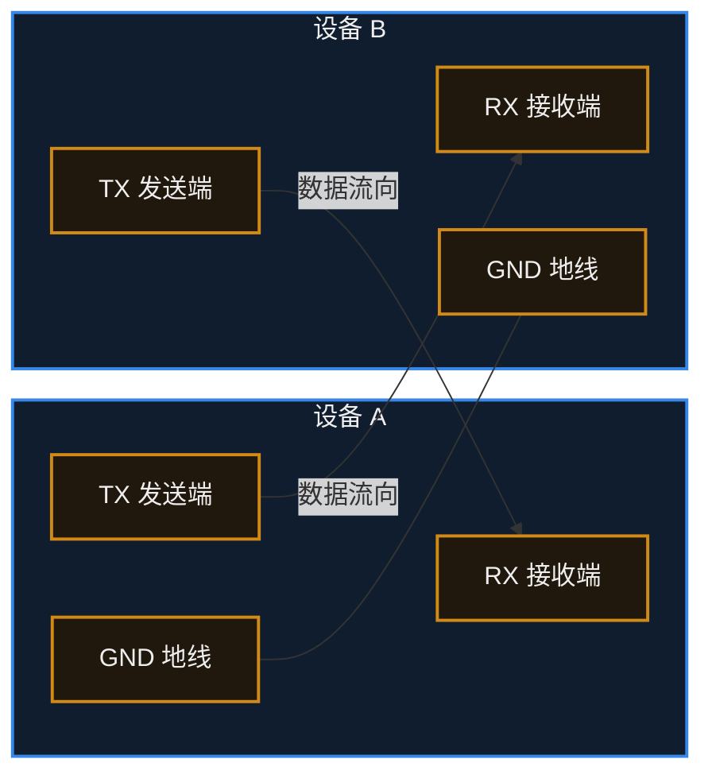

> [!important] 工程要点：必须共地 (GND)
> 很多新手在连接两个模块时，只接 TX 和 RX 两根线，结果无法正常通信。
> 所有的电压（高低电平）都必须有一个共同的参考零点。**如果没有连接 GND，设备 A 认为的 3.3V 在设备 B 看来可能是 0V 甚至是负电压。** 通信的第一步，通常都是先确认 GND 已相连。

## 10.3 工作原理：数据帧与波特率

既然没有时钟线，设备 B 怎么知道设备 A 什么时候开始发数据？又怎么知道这一连串的电平代表几个 Bit？

这依赖于两个核心机制：**数据帧格式** 和 **波特率**。

### 1. 波特率 (Baud Rate)
波特率是双方**事先约定好的通信速度**，代表每秒钟传输的码元数量（在基础 UART 中，通常就等于每秒传输的 Bit 数，即 bps）。
- 常见的波特率有：`9600`、`115200` 等。
- **强制规则**：通信双方的波特率必须配置为**相同的值**（允许极小误差，通常 < 2%），否则接收方会在错误的时间去采样电平，收到一堆乱码。

### 2. 数据帧 (Data Frame)
UART 在空闲时，导线上的电平**默认保持为高电平 (High)**。
当需要发送一个字节（Byte）时，UART 硬件会自动把这个字节包装成一个“数据帧”：

```text
       空闲  | 起始位 |      数据位 (通常 8-bit, 从最低位开始发)       | 校验 | 停止位 | 空闲
电平 ──────┐ |      |   |   |   |   |   |   |   |   |      | ┌──────
           └─┴──────┴───┴───┴───┴───┴───┴───┴───┴───┴──────┴─┘
```

- **起始位 (Start Bit)**：强制拉低电平（0）。接收方一旦检测到下降沿，就知道“数据要来了”，立刻启动内部的定时器开始按波特率采样。
- **数据位 (Data Bits)**：实际要发送的数据，典型配置为 8 位。
- **奇偶校验位 (Parity Bit)**：可选。用于检查数据在传输中是否发生错误。
- **停止位 (Stop Bit)**：强制拉高电平（1），标志着当前这一帧传输结束，并为下一个起始位的下降沿做准备。

> [!note] 经常看到的 `115200 8N1` 是什么意思？
> 这是 UART 最经典的默认配置，意思是：
> - 波特率 **115200**
> - **8** 个数据位
> - **N**one（无）奇偶校验
> - **1** 个停止位

## 10.4 工程实践：UART 的真实用途

在嵌入式开发中，UART 主要扮演两种角色：

### 1. 调试日志 (printf 重定向)
你在 PC 上写 C 语言时，`printf` 会把文字打印到屏幕上。
在单片机上，屏幕往往不存在。工程上的标准做法是：通过修改底层的库函数，把 `printf` 产生的字符，一个接一个地送到 UART 硬件去发送。
你需要用一根 **USB 转 TTL 模块 (如 CH340, CP2102)**，一头插在电脑 USB 上，另一头的 RX 接到单片机的 TX 上。电脑上打开“串口助手”软件，就能看到单片机发出的调试信息。

### 2. 与外部模块通信
很多相对低速、不需要高并发的外围模块，为了简化接口，都采用 UART 与主控 MCU 通信。
- **GPS 模块**：不断通过 UART 发送解析好的经纬度字符串（NMEA 协议）。
- **蓝牙模块 (如 HC-05)**：单片机通过 UART 发送 `AT+NAME` 等指令来配置蓝牙。
- **GSM/4G 模组**：同样广泛使用标准的 AT 指令集通过串口控制。

## 10.5 常见误区与故障排查

UART 虽然简单，但在调试阶段依然问题高发。遇到 UART 不通，请按以下顺序排查：

### 排查 1：收到了数据，但是全是不认识的“乱码”
**原因分析：**
1. **波特率不匹配**：单片机代码里配的是 115200，但电脑上的串口助手选了 9600。
2. **时钟配置错误**：如果单片机的系统时钟频率配置错了（比如外部晶振明明是 8MHz，代码里却写了 25MHz），硬件分频出来的真实波特率就会是错的。

### 排查 2：什么数据都收不到
**原因分析：**
1. **TX 和 RX 没交叉**：再次确认单片机的 TX 是不是接到了转换模块的 RX。
2. **未共地 (GND)**：检查 GND 有没有牢固连接。
3. **GPIO 复用功能没打开**：有些单片机必须显式开启 GPIO 的 Alternate Function (复用功能)，否则引脚依然是普通 IO，不会受内部 UART 外设控制。

### 工程陷阱 3：电平不匹配与 RS-232 接口风险
这是一个容易损坏硬件的工程误区：
- 单片机出来的 UART 信号通常是 **TTL / CMOS 电平**（高电平为 3.3V 或 5V，低电平为 0V）。
- 在工业界，还有一种较早的接口叫 **RS-232**（以前老电脑上的 9 针 D 型接口）。它的逻辑电平是负逻辑，而且电压摆幅很大（-15V 到 +15V）。
- **不要把单片机的 UART 引脚直接连接到工业 RS-232 接口上**：高达十几伏的电压可能损坏甚至击穿单片机。如果需要连接，中间应当增加一个电平转换芯片（如 MAX3232）。

### 软件陷阱 4：轮询等待发送造成的阻塞
在早期学习时，发送数据的代码通常是这样的：
```c
// 阻塞式发送一个字符（轮询方式）
void uart_send_char(char c) {
    // 傻等：直到发送数据寄存器 (TDR) 为空
    while ( UART_FLAG_TX_EMPTY == 0 ) {
        // CPU 在这里空转
    }
    UART_DATA_REG = c; // 硬件开始发送
}
```
**工程隐患**：UART 是一种相对低速的通信方式。在 9600 波特率下，发送一个字节大约需要 1 毫秒。如果你用这种“轮询阻塞”的方式调用 `printf` 打印 100 个字符，CPU 会被占用 100 毫秒，期间无法处理其他任务。
**进阶做法**：在正式的工程项目中，UART 发送通常会配合 **中断 (Interrupt)** 或 **DMA (直接内存访问)**。CPU 只需把要把发送的数据放进内存缓冲区，然后立刻去执行其他任务，底层的硬件搬运工会在后台自动完成耗时的发送过程。

---

# 11. I2C

> [!info] 写在前面
> 在上一章，我们学习了 UART。UART 简单易用，但它有一个明显的局限：它是“点对点”的通信（一对一）。如果单片机需要连接十几个不同的传感器，难道要引出十几对 TX/RX 引脚吗？
> 这在硬件资源上是很大的浪费。为了解决这个问题，我们需要一种**总线 (Bus)** 技术。**I2C** 是嵌入式系统中最常用的低速传感器总线之一，它只用两根导线，就能把单片机和几十个不同的外设串联在一起。

## 11.1 一句话理解与正式定义

**一句话理解**：
I2C 就像是一条通信“公交线路”，只需要两根导线，单片机就能通过“叫号（寻址）”的方式，在这条线路上与多个不同的设备分别进行对话。

**正式定义**：
**I2C (Inter-Integrated Circuit)** 是一种**同步、半双工、支持多主多从**架构的串行总线。
- **同步**：它有一根专门的时钟线（SCL）来统一通信双方的节拍，因此不需要像 UART 那样严格约定波特率。
- **半双工**：数据在一根导线（SDA）上传输，意味着同一时刻数据只能单向流动（要么主发从收，要么从发主收）。
- **寻址机制**：总线上的每一个从设备（Slave）都有一个固定的设备地址。主设备（Master）发起通信时必须先发送目标地址。

## 11.2 物理拓扑与开漏架构

I2C 总线在物理连接上极具特色，这也是新手最容易接错线的地方。它由两根信号线组成：
- **SCL (Serial Clock)**：串行时钟线。通常由主设备（如 MCU）产生，用来控制数据传输的节奏。
- **SDA (Serial Data)**：串行数据线。用于传输实际的 0 和 1。

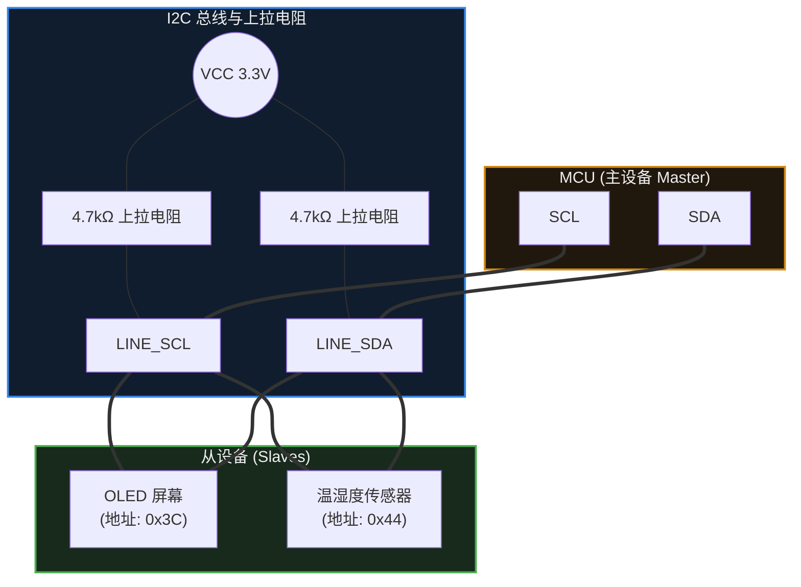

### 为什么必须接上拉电阻？(开漏设计的工程意义)
在第 7 章（GPIO）中我们提到过**开漏输出 (Open-Drain)**。I2C 总线要求所有挂在它上面的设备引脚，**必须配置为开漏模式**。

如果 I2C 采用普通的推挽输出，当 MCU 想输出高电平 (3.3V)，而传感器想输出低电平 (0V) 时，两者的电流会直接短路，可能损坏芯片。
**开漏模式 + 外部上拉电阻** 巧妙地解决了这个问题：
1. 总线上没有设备拉低时，上拉电阻把电压拉到 3.3V，这就是**逻辑 1**。
2. 总线上任意一个设备想要发信号时，就把 SDA 连通到 GND，把电压拉低到 0V，这就是**逻辑 0**。
3. 这在电子工程上叫 **“线与” (Wired-AND)** 逻辑：只要有一个设备拉低了总线，总线就是低的；只有所有设备都松手，总线才是高的。这避免了多个设备同时驱动总线而造成的短路。

## 11.3 寻址与 ACK 应答机制

当几十个设备都挂在同一根 SDA 线上时，I2C 是如何做到井然有序的？

### 1. 设备地址 (Device Address)
每个 I2C 从设备在出厂时（或通过引脚配置）都有一个通常为 **7 位 (7-bit)** 的硬件地址。
当 MCU 要和某个设备说话时，它会先发送一个 **START (起始信号)**，紧接着发送 7 位的设备地址，以及第 8 位的 **读/写方向位 (R/W bit)**（0 表示 MCU 想写，1 表示 MCU 想读）。

### 2. 应答机制 (ACK / NACK)
这是 I2C 最核心的可靠性保障机制。
当 MCU 发送完 8 个 bit（地址+读写位）后，它会释放 SDA 线。此时如果对应的传感器真实存在且正常工作，它**必须在第 9 个时钟节拍，主动把 SDA 线拉低**。
这个“拉低”动作，就叫 **ACK (Acknowledge，应答)**。
如果 MCU 读到的是高电平，说明该字节没有被应答，这叫 **NACK (Not Acknowledge)**。收到 NACK 并不代表通信必然失败——从机常用 NACK 表示“本轮读取结束”；至于重试、重新发起始条件还是终止本次传输，由驱动软件决定，硬件通常不会自动替你终止。

> [!tip] 硬件调试利器：I2C 扫描器 (I2C Scanner)
> 验证 I2C 硬件是否正常的第一步，不必急着去读传感器的复杂寄存器。
> 绝大多数嵌入式 SDK 中都能写出一个简短的“I2C Scanner”程序：让 MCU 遍历从 `0x01` 到 `0x7F` 的所有地址，只要收到 ACK，就通过串口打印出该地址。这能瞬间排查出接线和硬件是否正常。

## 11.4 常见误区与工程排错陷阱

I2C 的理论很简单，但在实际工程调试中，它属于问题高发的环节。遇到 I2C 读不到数据，请重点排查以下三个问题：

### 陷阱 1：未外接上拉电阻
**现象**：程序卡死在等待 I2C 响应的地方，用逻辑分析仪抓不到任何波形，或者波形极其微弱。
**原因**：有些开发板自带了上拉电阻，但有些廉价的裸模块没有。如果总线上没有任何上拉电阻，开漏架构就失去了将电平拉高的能力。
**对策**：查阅模块原理图。如果没有，手动在 SDA 和 SCL 上分别接一个 4.7kΩ 或 10kΩ 的电阻到 VCC。虽然有些 MCU 内部有微弱的上拉电阻，但在连线较长或速度较快时，内部上拉通常不足以保证信号的完整性。

### 陷阱 2：“7 位地址”的左移问题
这是软件开发中新手容易混淆的问题之一。
假设传感器 Datasheet 上写着：`Device Address = 0x50`（这是 7 位地址）。
在发送时，这 7 位地址后面需要拼接 1 位的读/写标志位，组成 8 位数据发出去。
- **某些库函数 (如 Arduino Wire 库)**：你直接传入 `0x50`，底层函数会自动帮你把地址左移 1 位，并拼接读写位。
- **某些底层库 (如 STM32 HAL 库的某些 API)**：它要求你传入的地址是**已经包含读写位占位符的 8 位格式**。也就是说，你需要手动把 `0x50` 左移 1 位，传入 `0xA0` 才行。如果此时你依然传入 `0x50`，MCU 就会去寻址 `0x28` 这个不存在的设备，必然得到 NACK。
**对策**：务必查阅你所使用的 SDK 或 HAL 库的文档，明确其期望的地址格式是“原汁原味的 7-bit”还是“左移后的 8-bit”。

### 陷阱 3：I2C 总线死锁 (Bus Lockup)
**现象**：MCU 突然复位重启后，I2C 总线陷入瘫痪，读不到传感器。若不干预，总线可能一直停留在 Busy 状态。
**机制与原因**：
如果在 MCU 重启的瞬间，传感器恰好正在向 MCU 发送一个逻辑 `0`（此时它正把 SDA 线拉低）。
MCU 重启后，丢失了之前的通信状态，以为总线是空闲的，但由于 SDA 被拉低了，MCU 认为总线一直被别人占用（Bus Busy），于是拒绝发起新的通信。而传感器则持续把 SDA 拉低，等待 MCU 给出下一个 SCL 时钟节拍让它把数据发完。两者僵持，总线锁死。
**工程对策**：在高度可靠的工业产品中，如果发现总线锁死，MCU 通常会在初始化阶段，手动将 SCL 引脚配置为普通 GPIO，连续翻转产生 9 个时钟脉冲，使传感器把未发完的数据发完并释放 SDA，然后再将引脚重新交还给内部 I2C 硬件。

> [!summary] 总结本章
> 1. **I2C** 是两线制（SCL, SDA）、带寻址功能的多设备共享总线。
> 2. 物理层必须配置为**开漏输出**并外接**上拉电阻**，利用“线与”逻辑防止短路。
> 3. 通信的可靠性依赖于**设备地址**与第 9 个时钟周期的 **ACK 应答机制**。
> 4. 调试时优先警惕**上拉电阻缺失**、API 对 **7位地址是否需要左移**的要求，以及复位引起的**总线死锁**问题。

---

# 12. SPI

> [!info] 写在前面
> 上一章提到的 I2C 虽然只需两根线就能连接无数设备，但受限于开漏架构和复杂的应答机制，它的速度通常很慢（常见为 100kbps ~ 400kbps）。
> 当你需要以极快的速度刷新一块彩色 LCD 屏幕，或者从一块 Flash 芯片中每秒读取几兆字节的数据时，I2C 就会成为严重的瓶颈。这时候，我们需要另一条高速公路——**SPI**。

## 12.1 一句话理解与正式定义

**一句话理解**：
SPI 是一条**高速、全双工**的“数据交换”通道。它不需要像 I2C 那样在总线上大声喊地址，而是通过一根专属的物理连线（片选线），直接拍一拍目标设备的肩膀来进行通信。

**正式定义**：
**SPI (Serial Peripheral Interface，串行外设接口)** 是一种同步、全双工、主从架构的串行通信总线。
- **全双工**：有独立的发送线和接收线，数据可以在同一时刻双向流动。
- **同步**：依然由主设备（Master）提供一根专门的时钟线（SCLK）来同步收发节奏。
- **片选机制**：主设备通过专门的硬件引脚（CS / SS）来选中特定的从设备（Slave），被选中的设备才允许在总线上发送和接收数据。

## 12.2 物理拓扑与推挽架构

一个标准的 SPI 通信通常需要 4 根线（对于主设备来说，每多加一个从设备，只需要多分配一根片选线即可）：

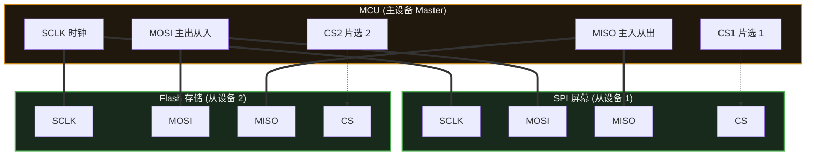

**SPI 的 4 根线（不同芯片的缩写可能略有不同）：**
1. **SCLK / SCK (Serial Clock)**：时钟线，由主设备产生。
2. **MOSI (Master Out Slave In)**：主设备发，从设备收。
3. **MISO (Master In Slave Out)**：主设备收，从设备发。
4. **CS / SS (Chip Select / Slave Select)**：片选线。通常是**低电平有效 (Active-Low)**，即主设备把这根线拉低到 0V 时，对应的从设备才被激活。

> [!tip] 为什么 SPI 比 I2C 快得多？(工程底层逻辑)
> I2C 使用的是开漏输出，从 0 变回 1 依靠的是外部上拉电阻缓慢给寄生电容充电，这个过程像是在“爬坡”，波形很容易失真，所以快不起来。
> 而 SPI 除了 MISO 外，通常配置为**推挽输出 (Push-Pull)**，由单片机主动驱动高低电平，信号边缘比较陡峭，因此通常可以跑到 10MHz、甚至 50MHz 以上。

## 12.3 核心机制：强制“数据交换” (移位寄存器)

这是初学者转入 SPI 时最难扭转的思维定势。
在 UART 和 I2C 中，“发送”和“接收”是相互独立的动作。但在标准 SPI 中，**根本没有单纯的“只读”或“只写”，SPI 的本质是数据交换 (Data Exchange)。**

SPI 的底层硬件是两个连接在一起的移位寄存器（一个在 Master 里，一个在 Slave 里），形成了一个闭环。

**工作原理：**
每产生一个时钟脉冲（SCLK）：
- 主设备从 MOSI 线上把自己的最高位挤出去，进入从设备。
- 从设备从 MISO 线上把自己的最高位挤出去，进入主设备。

当 8 个时钟脉冲走完，主设备里的 8 个 bit 完整地转移到了从设备里，而从设备里原本的 8 个 bit 也完整地转移到了主设备里。两者完成了互换。

> [!important] 常见的 Dummy Byte (哑字节)
> 因为 SPI 必须交换，**如果你只想从传感器读一个数据怎么办？**
> 单片机通常需要“无话找话”——主动发送一个没有实际含义的字节（比如 `0xFF` 或 `0x00`，这被称为 **Dummy Byte**）。
> 目的仅仅是为了产生 8 个时钟脉冲，迫使传感器顺着 MISO 线把真实数据“挤”回给单片机。不发东西，时钟就不走，你也永远读不到数据。

## 12.4 容易配错的四种模式：SPI 的 CPOL 与 CPHA

如果你把线接对了，程序也跑起来了，但读出来的数据全是乱码（或者发生了 1 个 bit 的错位），往往是 **SPI 模式** 配错导致的。

早期各家厂商在设计 SPI 外设时没有统一标准：有的规定时钟线平时应该是高电平，有的规定应该是低电平；有的规定在时钟刚跳变时读取数据，有的规定在跳变回来时读取数据。组合起来，就有了 4 种模式：

1. **CPOL (Clock Polarity，时钟极性)**：决定 SCLK 在空闲时（没有通信时）的电平状态。
   - `CPOL = 0`：空闲时 SCLK 为低电平。
   - `CPOL = 1`：空闲时 SCLK 为高电平。
2. **CPHA (Clock Phase，时钟相位)**：决定数据在哪个时钟跳变沿被采样（被读取）。
   - `CPHA = 0`：在第 1 个跳变沿采样。
   - `CPHA = 1`：在第 2 个跳变沿采样。

> [!tip] 工程习惯：不必死记，去查时序图
> 不用死背这 4 种模式。拿到一个新的传感器时，打开它的 **Datasheet（数据手册）**，找到 SPI Timing (时序图)。
> 看看图上的时钟线在 CS 拉低之前是处于上方（高电平）还是下方（低电平），就能确定 CPOL；看看数据是在时钟的上升沿还是下降沿对齐，就能确定 CPHA。
> 实际工程中，大多数 SPI 设备采用的是 **Mode 0** (CPOL=0, CPHA=0) 或者 **Mode 3** (CPOL=1, CPHA=1)。

## 12.5 常见误区与工程排错陷阱

### 陷阱 1：硬件 CS 自动控制的局限
在配置单片机的外设时，通常你会看到可以将 CS 配置为“硬件自动控制 (Hardware NSS / CS)”。
**工程实践**：在很多 MCU 架构（特别是某些早期的 STM32 型号）中，硬件自动控制片选的行为逻辑有时并不符合预期（例如每发送一个字节就会拉高一次 CS，而不是等整个数据包发完才拉高）。
**对策**：在绝大多数工程中，我们推荐把 CS 引脚配置为**普通的 GPIO 推挽输出**。在发送数据前，用软件代码手动将其拉低 `gpio_write(CS, 0)`；整包数据收发完成后，再手动将其拉高 `gpio_write(CS, 1)`。这种做法的稳定性更好，而且可以方便地用软件管理多个从设备。

### 陷阱 2：MISO 线的电平冲突
SPI 是一主多从结构。所有从设备的 MOSI 都可以直接并联，但所有从设备的 MISO 也是并联在一起的。
**机制与要求**：如果同一时刻有两个从设备都在向 MISO 线上输出不同的电平，总线就会短路。因此，SPI 规范要求：**未被选中（CS 为高电平）的从设备，必须将其 MISO 引脚强行置为高阻态 (High-Z)**，彻底与总线断开，把舞台留给当前被选中的设备。
**排错**：如果某些廉价的传感器模块在设计时存在缺陷，导致 CS 为高时依然强力驱动 MISO 线，就会导致总线瘫痪。排查时可以拔掉其他模块，只留一个测试。

### 陷阱 3：连线过长导致的高速信号失真
UART 可以在 9600 波特率下拖几米长的电缆。但 SPI 通常运行在几兆甚至几十兆赫兹。
**工程常识**：在如此高的频率下，哪怕二三十厘米的杜邦线，由于寄生电容和电感的存在，也会让方波出现明显畸变（还会产生信号反射和串扰），可能导致通信失败。
**对策**：SPI 设计主要是用来**板级通信**的（即同一个电路板上几厘米内的芯片互联）。如果必须跨板连接，尽量让导线极短，或者降低 SPI 时钟频率，必要时增加串联端接电阻以匹配阻抗。

> [!summary] 总结本章
> 1. **SPI** 是一种 4 线制、全双工、同步的高速通信总线。
> 2. 它的本质是一个**移位寄存器**，主从设备在时钟的驱动下强制进行 0 和 1 的**数据互换**。要想读取从设备，主设备必须发送 Dummy Byte 产生时钟。
> 3. 必须通过查阅 Datasheet 的时序图来确定从设备支持的 **SPI 模式 (CPOL 和 CPHA)**，配错模式是导致乱码的常见原因。
> 4. 推荐将 CS（片选线）配置为普通 GPIO，用**软件代码手动控制拉低拉高**。
> 5. SPI 是板级高速总线，不适合使用过长的导线连接。

---

# 13. ADC、DAC 与传感器

> [!info] 写在前面
> 前面的章节中，我们讨论的所有电信号都是 0 和 1（3.3V 和 0V）。
> 然而，现实世界是连续的：温度是缓慢升高的，声音是起伏波动的，光线是渐明渐暗的。单片机该如何去感知这些“连续变化”的物理量？
> 这一章，我们将引入连接物理世界与数字世界的桥梁：**ADC（模数转换器）** 和 **DAC（数模转换器）**，并探讨现代嵌入式系统中传感器的工程形态。

## 13.1 一句话理解与正式定义

**一句话理解**：
ADC 是一个“电压测量仪”，负责把外面真实的电压值翻译成单片机能懂的整数；DAC 则反过来，负责根据单片机给出的整数，向外输出真实的连续电压。

**正式定义**：
- **ADC (Analog-to-Digital Converter)**：模数转换器。将连续的模拟信号（如连续变化的电压）转换为离散的数字信号。
- **DAC (Digital-to-Analog Converter)**：数模转换器。将离散的数字信号转换为连续的模拟信号。

## 13.2 ADC 的核心工作机制与关键参数

ADC 的工作过程本质上是“拍照”和“归类”：每隔一段时间记录一次瞬时电压，然后把这个电压值丢进最接近的数字“刻度桶”里。

要用好 ADC，需要理解以下三个核心参数：

### 1. 参考电压 ($V_{ref}$) —— 测量的天花板
单片机不知道什么是“绝对的 3.3V”，它只认自己的“参考尺子”。
ADC 模块通常有一个参考电压引脚（$V_{ref}$，很多廉价板子上它直接和单片机供电 VCC 连在一起，比如 3.3V）。
- 当引脚电压 $= V_{ref}$ 时，ADC 读出最大数字。
- 当引脚电压 $= 0V$ 时，ADC 读出数字 0。
- 如果引脚输入的电压超过了 $V_{ref}$，不仅读出来依然是最大值，还可能烧毁引脚。

### 2. 分辨率 (Resolution) —— 刻度的精细度
ADC 的读数是一个整数，这个整数的范围由**分辨率（通常用 bit 表示）**决定。
- 如果是 **10-bit** ADC：数字范围是 $0$ 到 $2^{10}-1$，也就是 $0 \sim 1023$。它把 $0 \sim V_{ref}$ 的电压分成了 1024 份。
- 如果是 **12-bit** ADC（STM32 等常见配置）：数字范围是 $0 \sim 4095$。

**最常用的工程换算公式：**
假设你用的是 12-bit ADC，参考电压是 3.3V，你通过代码读到了数字 `2048`。那真实的引脚电压是多少？
$$ 真实电压 = \frac{ADC读数}{最大数字范围} \times V_{ref} $$
$$ 真实电压 = \frac{2048}{4095} \times 3.3V \approx 1.65V $$

### 3. 采样率 (Sample Rate) —— 抓拍的速度
表示 ADC 每秒钟能完成多少次转换。
如果是测室温，1 秒钟采样 1 次就足够了；但如果单片机要录制声音，至少需要每秒 8000 次甚至 44100 次（44.1kHz）的高速采样，否则声音会严重失真。

## 13.3 DAC 与 PWM 的本质区别

我们在第 9 章学过，**PWM** 可以通过改变占空比来模拟出不同的能量输出，为什么还需要专用的 **DAC**？

- **PWM 的本质**：引脚电压依然在 0V 和 3.3V 之间极速跳变，只是靠外部的物理惯性（或者外接的 RC 滤波电容）来“平均”成 1.65V。
- **DAC 的本质**：引脚上输出的是**平稳的直流电压（例如 1.65V）**，不存在 PWM 那样的开关跳变。

> **工程选型**：
> 控制电机速度、调节 LED 亮度，通常用 **PWM**（效率高、发热小）。
> 播放高质量音频、控制精密的工业模拟仪表，通常使用 **DAC**（信号平滑，无高频开关噪声）。

## 13.4 传感器的进化：模拟 vs 数字

现代嵌入式项目中的传感器，按接口分类主要有两种形态：


**工程趋势**：
以前，单片机大量依赖自带的 ADC 去读取外部的模拟电压。
现在，大多数高精度传感器（温度计、加速度计、气压计）已经**把 ADC 做进了传感器芯片内部**。单片机不再需要自己测电压，只需要通过 **I2C 或 SPI** 总线，直接把传感器测好的数字读回来即可。这类数字传感器抗干扰能力较强，是当前较为主流的方案。

## 13.5 常见误区与工程排错陷阱

如果你在项目里使用了 MCU 自带的 ADC 去测量电压，通常会遇到以下几个典型问题：

### 陷阱 1：迷信 3.3V 导致测量不准
**现象**：ADC 测出来的电压与万用表读数总是对不上，而且会随时间漂移。
**原因**：新手常把换算公式里的 $V_{ref}$ 写死成 `3.3`。但实际上，开发板上的 LDO 稳压器受温度和负载影响，真实电压可能是 3.25V，也可能是 3.32V。如果 $V_{ref}$ 本身在波动，ADC 换算出来的结果也会随之产生偏差。
**工程对策**：对精度要求极高的模拟电路，通常需要使用**专用的高精度基准电压芯片（Voltage Reference IC）**为 $V_{ref}$ 引脚供电；或者利用单片机内部出厂校准过的“内部基准电压（Internal Bandgap）”进行反向校准。

### 陷阱 2：ADC 读数跳动 (噪声问题)
**现象**：引脚明明接在一个固定的电池上，ADC 读出来的数字却一直在 `2041`、`2050`、`2038` 之间小幅跳动。
**原因**：真实世界的模拟电平充满了电磁干扰，MCU 内部的数字电路也会对 ADC 产生串扰。
**工程对策**：在工程中，ADC 读数通常不宜直接使用，一般需要经过滤波处理。
- **硬件滤波**：在 ADC 引脚和地之间并联一个极小的电容（如 0.1μF），滤除高频噪声。
- **软件滤波**：最常用的是**滑动平均滤波**（连续读 10 次去掉最大最小值，剩下的求平均），或者 **IIR 滤波**（一阶低通滤波）。

### 陷阱 3：被测信号源“带不动” ADC
**现象**：用万用表测某处电压是 2.0V，但用单片机 ADC 引脚接上去一测，万用表电压瞬间掉到了 1.5V，ADC 读出的也是错误的值。
**原因**：ADC 内部在采样瞬间，会打开一个开关，给一个微小的“采样电容”充电。如果被测电路的输出阻抗非常大（比如极高阻值的电阻分压），它提供电流的能力极弱，连这个微小的采样电容都喂不饱，瞬间就把原本的电压拉低了。
**工程对策**：对于高阻抗信号，通常不宜直接接入 ADC，需要在中间加一个**运算放大器 (Op-Amp)** 构成的“电压跟随器”来增强驱动能力，或者在软件里大幅拉长 ADC 的**采样时间 (Sampling Time)** 给电容慢慢充电。

> [!summary] 总结本章
> 1. **ADC** 将连续的模拟电压转换为离散的数字值；**DAC** 则负责将数字输出为真实平稳的电压。
> 2. ADC 换算真实电压在很大程度上取决于 **参考电压 ($V_{ref}$)** 和 **分辨率**。
> 3. 现代嵌入式系统广泛使用内部集成了高精度 ADC 的 **数字传感器（I2C/SPI）**，大幅降低了主控 MCU 处理模拟信号的压力。
> 4. 使用 MCU 自带 ADC 时，需要在硬件和软件层面考虑 **基准电压波动、噪声滤波** 以及 **输入阻抗匹配** 的问题。

---

# 14. DMA

> [!info] 写在前面
> 在之前的章节中，无论是读取 UART 接收到的数据，还是读取 ADC 转换后的电压，往往都需要 CPU 亲自去寄存器里把数据拿出来，再存放到 RAM（内存）里。
> 如果数据量很小，这没有太大问题。但如果数据像潮水一样涌来（比如每秒 44100 次的音频采样），CPU 就会疲于应付，无暇处理其他业务逻辑。这一章，我们要引入单片机里专门用来解放 CPU 的硬件单元——**DMA**。

## 14.1 一句话理解与正式定义

**一句话理解**：
DMA 是一套独立的硬件搬运系统，它可以绕过 CPU，直接在外设（如 ADC、SPI）和内存（RAM）之间，或者内存与内存之间高速搬运数据。

**正式定义**：
**DMA (Direct Memory Access，直接内存访问)** 是一种硬件特性。它允许系统中的某些硬件子系统（DMA 控制器）独立地直接访问主系统内存，而不需要 CPU 全程干预。
在搬运期间，CPU 可以去执行其他指令；CPU 的参与点通常集中在**配置阶段**和**完成阶段**。完成通知既可以用中断实现，也可以在允许阻塞时轮询状态标志——具体事件（如半完成 HT / 完成 TC / FIFO 阈值）取决于 DMA 控制器的设计。

## 14.2 DMA 解决什么问题：轮询与中断的开销

为了理解 DMA 的工程价值，我们来看看如果没有 DMA，单片机面对高速数据流时会遭遇什么。

假设我们要通过 SPI 发送 1000 个字节到屏幕：
- **方案 A：轮询发送 (Polling)**
  CPU 把第 1 个字节放进 SPI 寄存器，然后原地忙等（`while` 循环），直到硬件把这个字节发完，再发第 2 个……这段时间 CPU 100% 被阻塞，什么都干不了。
- **方案 B：中断发送 (Interrupt)**
  CPU 发送第 1 个字节，然后去干别的事。SPI 发完后触发中断，CPU 暂停手头工作进入 ISR，把第 2 个字节塞进 SPI，再退出 ISR。
  *痛点*：如果要发 1000 个字节，CPU 就会被频繁打断 1000 次。**频繁进出中断（压栈、出栈）本身会消耗大量的时钟周期（系统开销极大）**。

- **方案 C：DMA 发送**
  CPU 对 DMA 控制器说：“我有一组数据，从 RAM 的 `0x20001000` 开始，一共 1000 个字节，你帮我按顺序丢给 SPI 发送寄存器，发完了按门铃（触发中断）叫我。”
  配置完这一句话（耗时几微秒），CPU 就可以去执行其他任务了。接下来，**DMA 会接管总线，自行把这 1000 个字节搬运完毕**。

## 14.3 硬件模型与核心配置

在单片机内部，CPU 和 DMA 就像是共用一条走廊（系统总线）的两个主管。

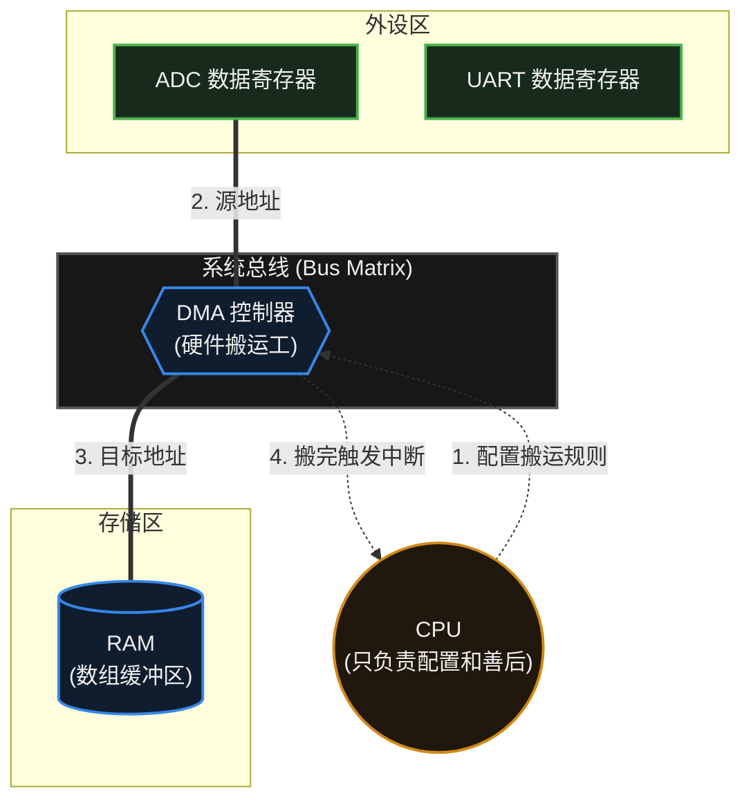

要在代码中驱使 DMA 干活，通常需要配置以下几个核心参数：
1. **源地址与目标地址 (Source & Destination)**：从哪里搬到哪里。比如从 ADC 数据寄存器搬到 RAM 中的一个数组。
2. **传输数据宽度 (Data Width)**：每次搬运是一个字节（8-bit）、半字（16-bit）还是全字（32-bit）。
3. **地址自增模式 (Address Increment)**：
   - 比如把 ADC 读数存进数组。ADC 硬件寄存器的地址是**固定不变**的，但 RAM 里数组的地址需要每次**自动加一**（存完第一个数，存在数组下一个位置），这就需要配置“源地址不自增，目标地址自增”。
4. **传输数量 (Transfer Size)**：一共要搬运多少次。

## 14.4 典型工程应用：双缓冲 / 乒乓操作

这是 DMA 在嵌入式工程中最经典、最常用的一种高级用法。

**问题场景**：
假设单片机在录音，ADC 连续采样数据通过 DMA 往 RAM 的一个 `buffer[100]` 里塞数据。当 100 个数据塞满后，DMA 触发“传输完成中断 (TC)”。此时 CPU 开始处理这 100 个数据。
但 CPU 处理是需要时间的，在 CPU 处理的这段时间里，新的 ADC 声音数据来了往哪放？是不是就丢失了？

**工程解法：双缓冲 (Double Buffering) / 乒乓缓冲 (Ping-Pong Buffer)**
我们往往会在内存里开辟两个缓冲区（或者一个大缓冲区分为前一半和后一半），配合 DMA 的两个特殊中断标志：
- **半传输完成中断 (HT, Half Transfer)**：当 DMA 搬运到一半时触发。
- **传输完成中断 (TC, Transfer Complete)**：当 DMA 全部搬运完时触发。

**工作流**：
1. DMA 开始往**前半段**存数据。
2. 存到一半（HT 中断触发），DMA 不停，继续往**后半段**存。与此同时，CPU 在中断里收到信号，立刻开始处理已经存好的**前半段**数据。
3. 等 DMA 把后半段也存满了（TC 中断触发），它会自动绕回开头（循环模式），覆盖前半段。与此同时，CPU 开始处理刚刚存好的**后半段**数据。

通过这种“你在前面放，我在后面追”的机制，CPU 和 DMA 得以并行工作，从而避免数据丢失。

## 14.5 常见误区与工程陷阱

引入 DMA 提升了性能，但也引入了较复杂的并发和内存同步问题。以下是排错时需要检查的要点：

### 陷阱 1：Cache 一致性问题 (Cache Coherence)
这是**高性能 MCU（如 Cortex-M7、Cortex-M33、部分 MPU 平台）**上常见的典型问题。
- **背景**：为了提速，高级 CPU 内部有数据缓存（D-Cache）。CPU 读取变量时，其实是读的 Cache 里的旧副本，而不是物理 RAM。
- **问题发生**：DMA 绕过 CPU，直接把外设的新数据写进了物理 RAM。此时 CPU 再次读取该变量，可能仍然读到 Cache 里的旧数据，造成“硬件搬运已经完成，代码里打印出来却全是 0”的现象。
- **工程对策**：在有 Cache 的芯片上，通常需要在正确时机做 Cache 维护，而且**两个方向的维护动作是相反的**：
  - **接收方向（外设 → 内存）**：DMA 完成后、CPU 读取数据前，通常需要让 Cache **失效 (Invalidate)**，迫使 CPU 丢弃旧副本、去物理 RAM 取新数据。缓冲区最好按 Cache line 对齐，否则失效操作可能连带丢弃相邻的脏数据。
  - **发送方向（内存 → 外设）**：启动 DMA 之前，通常需要把缓冲区**写回 (Clean)** 到物理 RAM，否则 DMA 可能搬走 Cache 里尚未落盘的旧内容。
  - 另一种思路是把 DMA 缓冲区放在**不可缓存 (Uncacheable)** 的内存区域，或通过 MPU 将该区域配置为非缓存。
  - 是否需要维护、调用哪个 API、对齐有何要求，**取决于芯片的 Cache 实现**（典型如带 D-Cache 的 Cortex-M7 / M33），需要参考 Reference Manual。

### 陷阱 2：对局部变量使用 DMA
- **现象**：DMA 搬运的数据不仅错乱，系统甚至直接崩溃，引发 HardFault。
- **原因**：新手喜欢在函数内部定义一个局部数组（存放在**栈 Stack** 上），然后把它的地址交给 DMA 作为接收地址，随后函数执行结束返回了。栈内存被立刻回收并分配给了其他函数。而 DMA 还在后台继续往那个物理地址写数据，覆盖了系统的其他内存甚至函数返回地址（内存越界覆写）。
- **工程对策**：交由 DMA 搬运的缓冲区，通常应定义为全局变量 (Global) 或静态变量 (Static)，确保其物理地址在整个传输期间保持有效、不被回收。

### 陷阱 3：总线竞争导致 CPU “卡顿”
- **误区**：以为引入 DMA 后，CPU 就几乎不受影响了。
- **真相**：DMA 和 CPU 实际上共享着同一套系统总线架构（Bus Matrix）。当 DMA 进行极高频的搬运（例如每次时钟周期都在搬大量数据）时，它会频繁占用总线。CPU 如果此时想去内存里取指令或读数据，就会遇到“堵车”，不得不原地等待一两个周期，这在底层被称为**周期窃取 (Cycle Stealing)**。
- **工程对策**：对于极端苛刻的硬实时系统，需要查阅芯片总线矩阵手册，将 CPU 的代码和 DMA 的缓冲区分配到不同的物理 RAM 块（比如 SRAM1 和 SRAM2）上，或者利用 TCM（紧耦合内存）来避免总线冲突。

> [!summary] 总结本章
> 1. **DMA** 是一种独立的硬件控制器，它能绕过 CPU 直接在外设与内存之间高速搬运数据。
> 2. DMA 解决了高速外设数据吞吐造成的 **CPU 轮询阻塞** 和 **中断频繁打断** 的问题。
> 3. 在工程开发中，流式数据（音频、连续 ADC、大屏刷图）通常利用 DMA 的 **HT（半完成）** 和 **TC（完成）** 中断实现**双缓冲 (乒乓操作)**，做到不丢帧的数据处理。
> 4. 使用 DMA 时需要警惕两类约束：**Cache 一致性**（仅限带 D-Cache 的高性能 MCU）与**缓冲区生命周期**（不能使用已经失效的栈上局部变量）。

---

# 15. 看门狗与系统可靠性

> [!info] 写在前面
> 讲到目前为止，我们都在假设：代码逻辑是完美的，系统总能按照预期一行行执行下去。
> 但现实并不总是如此：外太空的宇宙射线、工厂里电机的电磁干扰，或者是你代码里隐藏极深的一个“死锁（Deadlock）”，都可能导致单片机“死机”。对于工业设备、汽车或医疗器械来说，死机后如果没有人去按重启键，后果可能很严重。
> 这一章，我们将引入嵌入式系统可靠性的最后一道防线：**看门狗 (Watchdog)**。

## 15.1 一句话理解与正式定义

**一句话理解**：
看门狗就像是一个设定了爆炸时间的“定时炸弹”，你的代码必须在它爆炸前不断去“重置时间”；如果你的程序死机了，没能及时重置，它就会引爆，强制系统重启。

**正式定义**：
**看门狗定时器 (Watchdog Timer, WDT)** 是一种硬件定时器，用于检测和恢复计算机系统的故障。
在正常运行期间，系统软件会定期向看门狗寄存器写入一个特定的值（这个动作俗称**“喂狗 / Kicking the dog / Feeding the dog”**），以清零内部计数器。如果软件由于异常进入死循环或崩溃，未能及时清零，计数器将溢出，硬件会自动产生一个**复位信号 (Reset)** 使系统重新启动。

## 15.2 硬件机制：看门狗是怎么工作的？

虽然我们用“喂狗”来打比方，但在硬件底层，它其实就是一个做减法（或做加法）的定时器。

```mermaid
graph TD
    START["系统启动，使能看门狗"] --> CNT["看门狗计数器开始递减<br/>(例如从 1000 减到 0)"]
    
    subgraph CPU ["CPU 正常运行"]
        CODE["执行业务逻辑代码"] --> FEED{"是否及时写入<br/>清零寄存器(喂狗)?"}
    end

    CNT -.-> FEED
    
    FEED -->|是 (正常)| RELOAD["硬件将计数器重置回 1000"]
    RELOAD --> CNT
    
    FEED -->|否 (死机卡住)| TIMEOUT["倒计时到 0"]
    
    subgraph HW ["硬件强制动作"]
        TIMEOUT --> RESET(("触发硬件复位信号<br/>(System Reset)"))
        RESET --> START
    end

    classDef core fill:#21180d,stroke:#d18a16,stroke-width:2px,color:#eeeeee
    classDef logic fill:#101d2e,stroke:#3687e8,stroke-width:2px,color:#eeeeee
    classDef danger fill:#4a1515,stroke:#cc3333,stroke-width:2px,color:#eeeeee

    class START,CNT,RELOAD,TIMEOUT hw
    class CODE,FEED logic
    class RESET danger
```

## 15.3 独立看门狗 vs 窗口看门狗

在许多现代 MCU（以 STM32 等常见架构为例）中，通常会配备两种不同类型的看门狗，以应对不同维度的故障：

### 1. 独立看门狗 (IWDG - Independent Watchdog)
- **时钟源**：拥有独立的低速内部时钟（LSI）。即使主时钟（晶振）因为外部干扰停止振荡，独立看门狗依然能正常倒计时并复位系统。
- **特点**：精度较低，但可靠性高。
- **工程场景**：主要用于防范严重的硬件故障或程序跑飞。

### 2. 窗口看门狗 (WWDG - Window Watchdog)
- **时钟源**：使用系统主时钟分频。
- **特点**：它设定了一个“时间窗口”。**喂得太早或太晚都会触发复位。** 比如规定只能在第 80 毫秒到第 100 毫秒之间喂狗，在第 50 毫秒喂狗同样会触发复位。
- **工程场景**：主要用于检测**时序相关的软件 Bug**。如果一个任务平时需要 90 毫秒执行完，突然某天因为数据异常只花了 10 毫秒就跑完了去喂狗，WWDG 就能检测到这种异常并复位。

## 15.4 工程实践：到底该在哪里“喂狗”？

这是嵌入式面试的高频题，也是初学者最容易写出漏洞的地方。

### 危险的错误做法：在定时器中断 (ISR) 里喂狗
很多新手怕程序复位，直接开个定时器中断，每隔一秒钟在 ISR 里喂一次狗。
**这种做法通常是无效的。** 主程序里的 `while(1)` 即使陷入了死锁（比如卡在了一个失败的 `I2C_Read` 轮询里），定时器中断通常依然会正常触发。结果就是：**程序已经死机瘫痪了，但中断还在后台按时喂狗，看门狗形同虚设。**

### 裸机程序 (Bare-Metal) 的正确做法
通常应该在主程序 `while(1)` 循环的主路径上喂狗。
这样，只有当所有的传感器读取、数据处理逻辑都顺畅执行了一遍后，狗才会被喂到。任何一个环节卡死，主循环停转，系统都会触发复位。

### 实时操作系统 (RTOS) 的正确做法
在多任务系统中，如果有三个关键任务，其中一个任务死锁了，另外两个还在正常运行，此时通常应当复位。
工程中常见的做法是：**设定一个专门的看门狗监测任务（最低优先级）**。
其他业务任务在正常运行时，定期更新自己的“存活标志位”。监测任务负责巡视所有关键任务的标志位，只有当所有关键任务都正常运行时，监测任务才执行一次真正的硬件喂狗动作。

## 15.5 常见误区与工程排错陷阱

### 陷阱 1：用看门狗来掩盖糟糕的代码
**现象**：发现程序每隔几个小时就卡死，找不到 Bug，于是干脆把看门狗打开，让它死机了就自动重启。
**工程素养**：看门狗是用来对付**不可预测的异常（如电磁干扰导致的位翻转）**的最后一道防线，**不宜用来掩盖软件 Bug**。复位会导致当前正在处理的数据丢失，外部机械臂也可能因掉电而失控。应当找到导致死锁的根因（如没有做超时的循环等待）。

### 陷阱 2：单步调试 (Debug) 时被看门狗频繁复位
**现象**：程序一旦下载到板子上，用 Keil 或 GDB 进行单步调试时，只要代码一停在断点，板子瞬间就复位断开了。
**原因**：CPU 停在断点时，代码确实不跑了，但芯片内部的看门狗硬件定时器往往**默认还在继续计时**。停下来思考两秒钟，看门狗就可能判定系统死机并复位，导致调试连接断开。
**工程对策**：查阅 Reference Manual。很多高级 MCU 提供了一个调试控制寄存器（如 STM32 的 `DBGMCU`），可以配置为**“当 CPU Halt（挂起）时，自动冻结看门狗定时器”**。很多 IDE 在初始化时也提供这个选项。

### 陷阱 3：初始化时间过长导致看门狗在启动阶段就超时
**现象**：系统上电后不断重启，连 `main` 函数的第一行应用代码都执行不到。
**原因**：看门狗一旦使能，倒计时就开始了。如果你的系统需要初始化一个庞大的外部 Wi-Fi 模块或挂载文件系统，耗时 2 秒，而看门狗的超时时间设置为了 1 秒。那么还没等初始化完，系统就被强杀复位了。
**工程对策**：
1. 把喂狗的动作穿插在漫长的初始化流程中。
2. 在确保软件完全准备好之前，尽量晚一点启动看门狗（前提是芯片允许软件启动看门狗，部分高可靠性芯片由硬件 Boot 强制开启看门狗，此时只能采用第一种方法）。

> [!summary] 总结本章
> 1. **看门狗 (WDT)** 是一种硬件定时器，软件必须定期清零（喂狗）；否则它会认为系统死机并强制触发**硬件复位**。
> 2. 它分为防范严重故障的**独立看门狗 (时钟独立)** 和防范逻辑时序错误的**窗口看门狗 (有严格的时间窗)**。
> 3. **不要在中断 (ISR) 中喂狗**，否则死锁时中断仍可能掩盖故障。应在主循环或专门的 RTOS 监控任务中喂狗。
> 4. 单步调试时如果频繁掉线，请检查是否需要**配置调试器冻结看门狗**。
> 5. 看门狗是系统可靠性的**最后一道防线**，不能用来掩盖代码中未处理的死循环 Bug。

---

# 16. Flash、EEPROM 与文件系统

> [!info] 写在前面
> 当设备断电时，RAM 中的所有变量（如运行状态、传感器缓存）都会瞬间丢失。
> 但在实际工程中，我们需要永久保存 Wi-Fi 密码、设备的唯一 ID、用户设置的偏好，甚至长达一个月的温湿度历史记录。
> 这一章，我们将探讨嵌入式系统中的非易失性存储（NVM, Non-Volatile Memory）介质，重点讲解底层硬件的物理特性，以及现代软件架构是如何科学、安全地将数据持久化保存下来的。

## 16.1 核心概念：EEPROM 与 Flash

**正式定义**：

- **EEPROM (Electrically Erasable Programmable ROM，带电可擦可编程只读存储器)**：可电擦写的非易失存储器，支持按字节读写与擦除，擦写寿命较高、容量小、单位成本高。
- **Flash (闪存)**：同样基于浮栅工艺的非易失存储器，擦除以扇区/块为单位、写入以页或字为单位，容量大、单位成本低。MCU 片内通常指 **NOR Flash**——可字节寻址、支持直接从 Flash 取指执行 (XIP)。

在嵌入式系统中，它们是最常用的非易失性存储介质。虽然断电后都能保存数据，但物理特性和工程使用场景截然不同。

| 对比维度 | EEPROM (带电可擦可编程只读存储器) | Flash (闪存，单片机主要指 NOR Flash) |
| :--- | :--- | :--- |
| **读写粒度** | **按字节 (Byte) 操作**。想改哪个字节就改哪个，非常灵活。 | **按扇区 (Sector/Block) 擦除，按页 (Page) 或字写入**。 |
| **擦写寿命** | 较高。通常每个存储单元可承受 $10^5$ 到 $10^6$ 次擦写。 | 较低。通常每个扇区承受 $10^4$ 到 $10^5$ 次擦写。 |
| **容量与成本** | 容量极小（几 KB 到几十 KB），单字节成本极高。 | 容量大（几百 KB 到百 MB 级），单字节成本极低。 |
| **典型应用场景**| 保存少量且频繁变动的系统状态、校准数据。 | 存放代码（固件）、庞大的传感器日志、文件系统。 |

> [!note] EEPROM 的“软替代”
> 为了降低芯片成本和减小面积，很多现代 MCU 内部只集成了 Flash，不再提供物理 EEPROM。如果需要保存少量参数，通常有两种做法：
> 1. 在电路上外挂一颗廉价的 I2C 接口 EEPROM 芯片。
> 2. 使用 Flash 配合软件算法来**模拟 EEPROM (EEPROM Emulation)**。

## 16.2 Flash 存储的核心物理机制：擦除而后写

这是 Flash 存储最核心的硬件约束，也是构建所有上层文件系统和参数存储算法的底层原因。

在物理层面，Flash 依靠浮栅晶体管中“是否捕获了电子”来表示 0 和 1。这导致了一个不可逆的单向特性：
**写入（Program）操作只能将二进制的 `1` 变成 `0`，无法将 `0` 变成 `1`。**

要把 `0` 变回 `1`，必须先执行**擦除 (Erase)** 操作。由于底层电路的连线结构，擦除动作通常不能针对单个字节进行，而是以**扇区 (Sector) 或块 (Block)** 为单位。**这个粒度因芯片而异**——常见的从 4KB 子扇区到 128KB 大扇区都有，具体以 Datasheet 与 Reference Manual 为准。

**工作机制示例（以 4KB 扇区为例）：**
假设扇区内有一个变量，原值为 `0x00`（该字节所有位都是 `0`）。现在想把它改成 `0x05`（二进制 `0000 0101`）。
由于目标值里出现了 `1`，而写入只能把 `1` 变成 `0`，直接发起写入命令是无效的。底层通常的处理流程是：
1. **读出**：把整个 4KB 扇区的数据先完整读到 RAM 的缓冲区里。
2. **修改**：在 RAM 里把对应的那个变量修改为 `0x05`。
3. **擦除**：向硬件发送命令，**擦除整个 4KB 扇区**（此时该扇区所有位变成 `1`，即全是 `0xFF`）。
4. **写回**：把 RAM 里修改好的 4KB 数据，重新写入到 Flash 扇区中（把不需要的 `1` 变成 `0`）。

理解了这个机制，就能明白为什么 Flash 的写入耗时远高于 RAM（通常慢若干个数量级，具体取决于器件），并且非常不适合频繁修改同一个变量。

## 16.3 存储抽象层：从裸操作到文件系统

在实际的工程项目中，直接用底层寄存器去计算扇区地址、管理擦除逻辑是低效且容易出错的。现代嵌入式软件栈通常会提供清晰的存储抽象层：

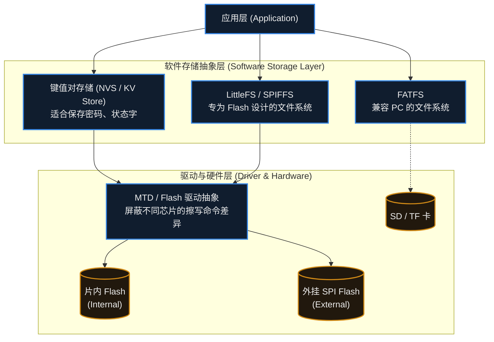

### 1. 键值对存储 (NVS / KV Store)
当只需要保存诸如 `wifi_ssid`、`volume_level` 等散碎参数时，使用完整的文件系统过于笨重。
很多现代 SDK（如 ESP-IDF 的 NVS，Zephyr 的 Settings 子系统）提供了键值对存储。应用层只需调用简单的 `set("key", value)`，底层的 NVS 算法会自动寻找干净的扇区写入，并废弃旧数据，从而对上层掩盖了“擦除而后写”的复杂性。

### 2. FATFS (兼容 PC 的文件系统)
如果你把数据存在 SD 卡或 U 盘里，并希望用户拔下来插在 Windows 电脑上能直接读取，就必须使用 FAT32/exFAT 格式。在嵌入式端，通常移植开源的 **FATFS** 库。
- **缺点**：FAT 系统诞生于磁盘时代，它并没有针对断电保护进行设计。如果在更新文件分配表（FAT 表）的瞬间拔掉电源，整个分区可能彻底损坏。

### 3. LittleFS (专为 Flash 设计的文件系统)
当需要在芯片内部的 Flash 或外挂的 SPI Flash 上存储配置文件、海量传感器日志时，业界常见的选择之一是 **LittleFS**。它从底层设计上解决了 Flash 的两大痛点：
- **磨损均衡 (Wear Leveling)**：它通过树状数据结构动态分配存储块，让 Flash 上的扇区被相对均匀地擦写，避免某几个扇区因为频繁更新而提前损坏，从而延长整片 Flash 的寿命。
- **掉电安全 (Power-loss Resilience)**：它采用了类似写时复制（Copy-on-Write）的机制。在修改文件时，新数据会被写入到一个新的空闲块中；只有当新数据完全写完并校验通过后，才会把文件指针指向新块。因此，即使在写入过程中断电，重启后系统依然能找回原本的旧数据，文件结构通常不会损坏。

## 16.4 工程开发中的存储约束

理解了底层机制后，在实际写代码操作 Flash 时，需要时刻考虑以下系统级约束：

### 约束 1：写入频率需要受控
新手常犯的错误是把 Flash 当作 RAM 使用（例如在主循环中每秒记录一次运行时间）。
如果 Flash 扇区寿命是 10 万次，1 秒写 1 次，**不到 28 个小时**该扇区就会彻底写废。
**工程对策**：高频变化的状态数据应当**缓存在 RAM 中**。仅在状态发生实质改变、用户触发保存，或系统检测到即将掉电（配合硬件掉电检测电路）时，才一次性刷入 Flash。

### 约束 2：片内 Flash 擦写时的总线阻塞
在很多 MCU 架构中，代码是直接在片内 Flash 上运行的（XIP, Execute In Place）。
擦除一个 Flash 扇区是非常耗时的物理过程（通常需要几毫秒到几十毫秒）。当 MCU 向片内 Flash 发出擦除或写入指令时，**Flash 硬件控制器通常会进入“忙碌”状态**。
此时，如果 CPU 想要去 Flash 取下一条指令，总线就会被挂起，导致 CPU 假死（Stall）。如果恰好此时发生了需要极速响应的外部中断，中断也无法执行。
**工程对策**：在硬实时系统中执行片内 Flash 擦写前，如果芯片架构不支持双区（Dual Bank）读写，通常需要暂停一些时间敏感的业务，或者确保关键的中断服务程序（ISR）被预先加载并运行在 **RAM** 中。

### 约束 3：裸写数据的原子性保障
如果不使用 LittleFS，而是直接在应用层裸写 Flash 扇区来保存参数，需要考虑“写到一半掉电”可能造成的严重后果。
**工程对策**：通常采用 **A/B 双区备份策略 (Double Banking)**。准备 A、B 两个扇区存放数据。写入新配置时，总是写入当前未被使用的那个空闲扇区，写完并加上校验和（Checksum）后，再标记该扇区为最新。这样无论何时掉电，系统总能依靠校验和找回最近一次完整有效的数据。

> [!summary] 总结本章
> 1. **EEPROM** 适合小数据字节级读写；**Flash** 容量大，但必须遵循 **“按扇区擦除，按页/字写入”** 的物理限制。
> 2. Flash 的物理特性导致其寿命有限，且不能频繁原地修改数据，这就需要软件算法介入。
> 3. 现代软件栈通过 **NVS (键值对)** 和 **LittleFS 等文件系统** 屏蔽了底层硬件的复杂性，并提供了磨损均衡和掉电安全保障。
> 4. 工程师在操作存储时，需要评估**擦写寿命、总线阻塞时间**以及**断电原子性**，避免将 RAM 的编程思维直接套用在 NVM 上。

## 16.5 常见误区与工程陷阱

**误区 1：把 Flash 当 RAM 用**
在主循环里每秒写一次 Flash 是最典型的错误。扇区寿命通常在 $10^4 \sim 10^5$ 次量级（以 Datasheet 为准），按秒级写入会在几天内写废该扇区。高频变化的数据应当先缓存在 RAM 中。

**误区 2：以为 memcpy 就能改写 Flash 内容**
Flash 的写入受“擦除而后写”约束：只能把 `1` 写成 `0`。要向同一地址写入新值，通常必须先擦除整个扇区，而擦除会连带清掉该扇区里的其他数据。裸写时要走“读出 → 在 RAM 中修改 → 擦除 → 写回”的完整流程。

**误区 3：忽略擦写粒度与芯片差异**
擦除粒度因芯片而异（常见从 4KB 子扇区到 128KB 大扇区），写入粒度可能是页或字而不是字节。换芯片时必须重新确认，不能照搬上一颗芯片的擦写参数。

**误区 4：写到一半掉电**
裸写 Flash 时若中途掉电，可能留下内容不完整的扇区。保存关键参数应当采用 A/B 双区加校验和的策略，或直接使用 LittleFS 这类具备掉电安全的文件系统。

**误区 5：认为文件系统可以随便用**
FATFS 并非为断电保护设计，更新 FAT 表时掉电可能损坏整个分区；LittleFS 通过磨损均衡与写时复制缓解了这些问题，但也有自己的开销与限制。选型取决于数据的性质与掉电风险。

---

# 17. RTOS 与 FreeRTOS

> [!info] 写在前面
> 当一个项目只有“按键开灯”和“读取温度”两个功能时，一个简单的 `while(1)` 循环加上几个中断就能胜任。
> 但当你的系统需要同时处理 Wi-Fi 通信、刷新屏幕 UI、采集多个传感器，并且要求某个控制指令必须在 1 毫秒内得到响应时，传统的裸机代码会迅速膨胀成一团乱麻。
> 这一章，我们将引入嵌入式系统走向复杂化的分水岭技术：**实时操作系统 (RTOS)**。

## 17.1 一句话理解与正式定义

**一句话理解**：
RTOS 是一套软件框架，它通过极快速地切换 CPU 的执行权，让单片机看起来像是在“同时”执行多个独立的任务，并让紧急任务能够优先获得 CPU。

**正式定义**：
**实时操作系统 (Real-Time Operating System, RTOS)** 是一种专为实时应用设计的操作系统软件。
它的核心特征在于**确定性 (Determinism)**：即系统需要在规定的时间限制内响应外部事件。与通用的分时操作系统（如 Windows、Linux，更注重整体吞吐量与公平性）不同，RTOS 通常优先让最高优先级的就绪任务获得 CPU；同等优先级的任务之间常采用时间片轮转，共享资源时还可能出现优先级反转。
**FreeRTOS** 是目前嵌入式领域市场占有率最高、也是众多芯片原厂首选的开源 RTOS 之一（其他常见的还有 RT-Thread、Zephyr、μC/OS 等）。

## 17.2 为什么需要 RTOS？(裸机架构的痛点)

在没有 RTOS 的“裸机 (Bare-metal)”开发中，最经典的架构是**前后台系统 (Super Loop + Interrupts)**：
- **前台 (中断)**：处理紧急的硬件事件。
- **后台 (主循环)**：一个巨大的 `while(1)` 包含一系列函数，轮流执行。

**工程痛点**：
假设主循环里有三个函数：`刷新屏幕()`、`处理网络()`、`控制电机()`。
如果在 `处理网络()` 时由于网络卡顿，函数在内部阻塞等待了 50 毫秒；那么后续的 `控制电机()` 就会被迫延迟 50 毫秒才能执行。
这意味着：**系统不同模块之间产生了严重的相互耦合和时序干扰**。为了解决这个问题，工程师通常要手写复杂的状态机（State Machine）来切碎任务，导致代码极难维护。

引入 RTOS 后，系统被拆分为多个相互独立的 **任务 (Task)**，由 RTOS 的内核接管 CPU 的调度权，从根本上解耦了业务逻辑。

## 17.3 核心机制：任务 (Task) 与状态机

在 RTOS 中，每个业务模块（比如网络、UI、传感器控制）都被封装成一个独立的函数，并交给 RTOS 创建为一个**任务 (Task)**。
在开发者的视角里，每个任务都是一个独立的无限循环，仿佛独占了整个 CPU。

但实际上，任务在 RTOS 内部受到调度器的严格管控，并在几种状态之间流转：

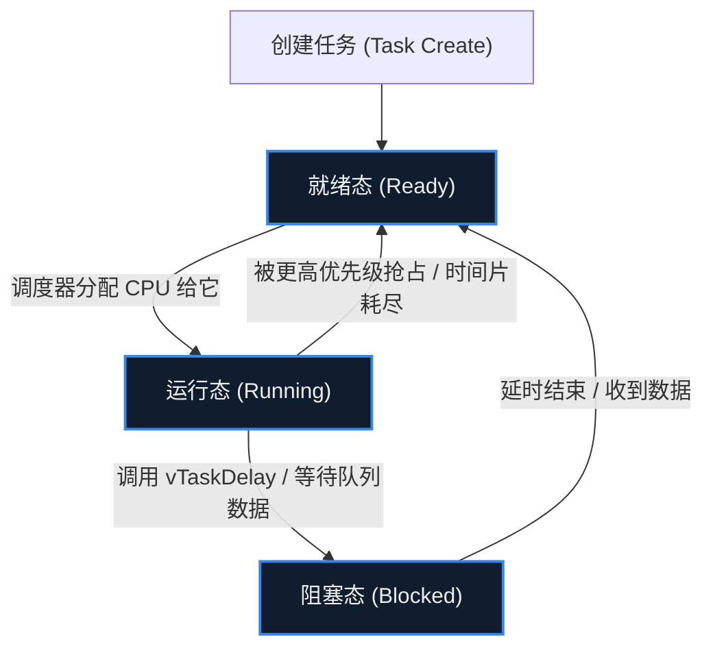

1. **运行态 (Running)**：当前这一瞬间，CPU 真正正在执行的任务（单核 MCU 同一时刻只能有一个任务处于运行态）。
2. **就绪态 (Ready)**：任务已经准备好干活了，但 CPU 正在执行其他优先级更高（或同等）的任务，只能排队等待。
3. **阻塞态 (Blocked)**：任务遇到了需要等待的事件（比如写了延时 10 毫秒、等待用户按键、等待网络回包）。此时，任务会**主动交出 CPU 的使用权**，RTOS 会立刻把 CPU 安排给其他 Ready 的任务去执行，从而充分利用算力。

## 17.4 上下文切换 (Context Switch)

单核 CPU 只有一个，它是如何做到让任务 A 跑到一半，突然去执行任务 B，然后又无缝回到任务 A 继续跑的？
这依赖于 RTOS 最底层的核心技术：**上下文切换**。

在前面讲 RAM 的章节中我们提到过栈（Stack）。在裸机程序中，整个系统通常只有一个大堆栈。
**而在 RTOS 中，创建每一个任务时，RTOS 都会在 RAM 中为该任务分配一块属于它自己的独立内存，称为“任务栈 (Task Stack)”。**

**工作原理：**
当调度器决定暂停任务 A 去执行任务 B 时：
1. **保存现场**：由 RTOS 所用的定时器中断或软件异常触发（在 Cortex-M 上通常是 SysTick 与 PendSV，其他架构使用各自的机制），把当前任务的运行现场保存到**任务 A 的独立栈**中。注意**不同架构自动保存的范围不同**：在 Cortex-M 上，异常进入时硬件只自动压入部分上下文（xPSR、PC、LR、R12、R3–R0），其余通用寄存器由 RTOS 在 PendSV 处理函数中用软件保存；若启用了 FPU，浮点寄存器还涉及延迟压栈 (lazy stacking)。
2. **切换指针**：RTOS 调度器把 CPU 的栈指针 (SP) 强行修改为**任务 B 的独立栈**的地址。
3. **恢复现场**：从任务 B 的栈中弹出上一次保存的寄存器值，恢复到 CPU 中。
4. 退出中断，CPU 继续取指令。由于寄存器（尤其是程序计数器 PC）变成了 B 的，CPU 就浑然不觉地接着上次任务 B 暂停的地方继续运行了。

## 17.5 抢占式调度 (Preemptive Scheduling)

大多数现代 RTOS 默认采用的是**基于优先级的抢占式调度**。
所谓“抢占”，意味着**高优先级的任务一旦进入就绪态（Ready），它不需要等待当前低优先级任务主动让出 CPU，调度器会立刻触发上下文切换，强行剥夺低优先级任务的执行权。**

*工程意义*：如果电机控制任务的优先级高于网络任务，那么无论网络代码正在进行多么复杂的加密计算，只要电机定时器一到，CPU 通常会在微秒量级内切换去执行电机控制（具体延迟取决于主频与内核实现）。这是 RTOS 能够提供**“确定性”**的根本保证。

## 17.6 工程实践中的资源权衡

引入 RTOS 带来了更清晰的代码架构和更好的实时响应能力，但代价是**系统资源的开销显著增加**。在工程项目中需要注意以下两点：

### 实践 1：系统延时的本质改变
在裸机中，我们通常用 `delay()` 忙等，这叫**阻塞 (Spinning)**。
在 RTOS 中，通常应当使用 RTOS 提供的系统延时函数（如 FreeRTOS 的 `vTaskDelay()`；其他 RTOS 有各自对应的 API）。
- 当调用 `vTaskDelay(10)` 时，当前任务会被调度器打上“睡眠 10 毫秒”的标签，并立刻进入**阻塞态 (Blocked)**。
- 这 10 毫秒内，CPU 可以被安排去执行其他任务。直到延时到达，调度器才会将该任务重新放回**就绪态 (Ready)**。

### 实践 2：任务栈大小评估 (Stack Sizing)
因为每个任务都有自己的独立堆栈，**RAM 的消耗会急剧上升**。
如果某个任务内定义了一个极大的局部数组（例如 `char buf[2048];`），或者函数调用层级极深，而创建任务时只分配了 1024 字节的栈，就会在运行时引发 **栈溢出 (Stack Overflow)**，进而触发 HardFault。
因此，在 RTOS 项目开发后期，工程师通常需要开启 RTOS 的栈水位检测功能（如 FreeRTOS 的 `uxTaskGetStackHighWaterMark`），动态微调每个任务的栈大小，在保证不溢出的前提下尽可能释放出多余的 RAM 供系统使用。

## 17.7 常见误区与工程陷阱

**陷阱 1：把任务优先级当成性能旋钮**
把所有任务都设成高优先级，就失去了优先级的意义。抢占式调度的价值来自优先级之间的差异；滥用高优先级会让低优先级任务长期得不到 CPU（饥饿）。

**陷阱 2：优先级反转 (Priority Inversion)**
高优先级任务等待一把被低优先级任务持有的锁时，如果中间优先级的任务抢占了低优先级任务，高优先级任务就会被间接阻塞很长时间。常见解法是让互斥锁支持**优先级继承 (Priority Inheritance)**（FreeRTOS 的 Mutex 支持，二值信号量不支持）；是否支持、如何配置取决于具体 RTOS。

**陷阱 3：在任务里"忙等"而不是阻塞**
用 `while(!flag);` 这类空转代替信号量或任务通知，会把 CPU 占满，让同级或更低优先级的任务得不到执行。任务暂时不需要 CPU 时，应当主动进入阻塞态。

**陷阱 4：低估栈的消耗**
每个任务都有独立的栈，RAM 开销随任务数增长。栈给小了会溢出并触发 HardFault，给大了则挤占其他任务与堆的空间。应当用栈水位检测（如 FreeRTOS 的 `uxTaskGetStackHighWaterMark`）实测后再定。

**陷阱 5：在中断里调用任务级 API**
在 ISR 中调用 FreeRTOS 的 `xSemaphoreGive()`、`vTaskDelay()` 这类任务级接口会导致断言失败或系统崩溃。中断上下文必须使用该 RTOS 提供的 ISR 安全版本（如 FreeRTOS 的 `FromISR` 系列），并注意在退出前处理 `pxHigherPriorityTaskWoken`，以决定是否需要触发一次上下文切换。

> [!summary] 总结本章
> 1. **RTOS** 通过系统调度，将复杂的业务逻辑解耦为多个独立的 **任务 (Task)**，解决了裸机前后台系统中响应时间不确定的痛点。
> 2. 每个任务在生命周期中会在 **运行、就绪、阻塞** 等状态间流转；优秀的任务设计应当在不需要 CPU 时主动进入阻塞态。
> 3. **上下文切换** 是 RTOS 的底层基础，每个任务拥有独立的**任务栈 (Task Stack)** 来保存运行现场。
> 4. **基于优先级的抢占** 使得紧急任务能够优先获得 CPU，提供了系统的实时确定性。
> 5. 使用 RTOS 的代价是 RAM 开销大幅增加，工程师需要谨慎规划和调优任务的数量及每个任务的堆栈大小。

---

# 18. 并发、同步与互斥

> [!info] 写在前面
> 上一章我们引入了 RTOS，让多个任务能够“并发”执行。这看似完美，但当多个任务（或任务与中断）试图在同一时刻访问同一个全局变量、同一个传感器或同一个通信接口时，就可能引发难以复现的故障。
> 这一章，我们将探讨嵌入式系统中最容易引发偶发性死机的核心难题——并发冲突，以及如何利用操作系统提供的机制来保卫数据的安全。

## 18.1 核心概念与正式定义

在多任务或中断驱动的系统中，首先需要理清三个强相关的核心概念：

- **并发 (Concurrency)**：系统中有多个执行流（任务或中断）在宏观时间段内同时推进。
- **互斥 (Mutual Exclusion, Mutex)**：一种保护机制。当一个任务正在访问某个共享资源（如 I2C 总线、全局结构体）时，其他任何任务都**不能同时访问**该资源，必须排队等待。
- **同步 (Synchronization)**：一种协同机制。协调多个任务或中断的执行先后顺序。比如“任务 B 必须等待中断 A 采集完数据后，才能开始处理”。

## 18.2 问题的根源：数据竞争与 R-M-W 效应

为什么两个任务操作同一个变量会引发系统崩溃？
问题的本质在于：**大多数高级语言的语句，在底层硬件上并不是“原子（Atomic）”的。** 所谓原子操作，是指不可被中断打断的一个整体动作。

以最简单的 C 语言自增语句为例：
```c
counter++;
```
在 CPU 的汇编指令层面，这通常会被拆分为典型的 **读-改-写 (Read-Modify-Write, R-M-W)** 三个步骤：
1. **Load (读)**：把 `counter` 的值从 RAM 读入 CPU 内部寄存器。
2. **Add (改)**：在 CPU 寄存器中将数值加 1。
3. **Store (写)**：将寄存器中的新值写回 RAM 中的 `counter`。

如果在步骤 1 和步骤 3 之间，发生了一次**中断**或者**任务抢占**，数据竞争（Race Condition）就会产生：

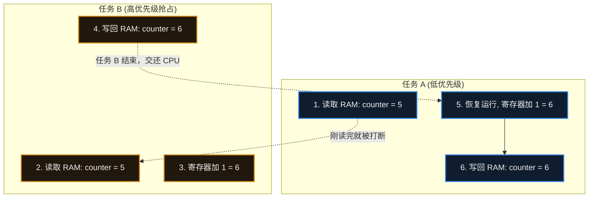

**工程后果**：任务 A 和任务 B 各自执行了一次加 1 操作，预期结果应该是 7，但最终 RAM 中保存的却是 6。一次操作被“吞掉”了。如果这个变量是缓冲区的指针，系统就可能越界崩溃。

## 18.3 解决数据竞争的武器库

为了防止上述惨剧，嵌入式系统中通常提供以下几种工具来保护**临界区 (Critical Section)**（即访问共享资源的那段代码）。

### 1. 关中断 (Disable Interrupts)
最直接的保护方式：在进入临界区前，直接通过硬件指令关闭全局中断；操作完后再打开。
- **优点**：简单、执行极快，能屏蔽任务抢占与可屏蔽中断的干扰。
- **缺点**：会影响系统的实时性。如果关中断的时间过长，系统将无法响应紧急的外部硬件事件。
- **适用场景**：只适用于极短的、微秒级别的变量读写保护。

### 2. 互斥锁 (Mutex)
如果需要保护的资源是一个耗时较长的操作（比如通过 I2C 读写几个传感器的寄存器），关中断就不合适了，此时应使用 RTOS 提供的互斥锁。
- **机制**：互斥锁是一个包含**所有权 (Ownership)** 概念的内核对象。任务 A 必须先“获取（Take）”锁，才能访问 I2C。如果此时任务 B 也想访问 I2C，尝试获取锁时会被调度器**阻塞 (Block)**，进入休眠，直到任务 A 操作完毕并“释放（Give）”锁。
- **工程特性**：互斥锁通常内置了**优先级继承 (Priority Inheritance)** 机制。如果低优先级任务拿了锁，高优先级任务在等锁，RTOS 会临时把低优先级任务的优先级提升，催促它尽快干完活把锁还回来，以此缓解“优先级反转”带来的问题。

## 18.4 同步机制：信号量与消息队列

如果说互斥锁是为了“防止互相打架”，那么同步机制则是为了“协调大家合作”。

### 1. 信号量 (Semaphore)
信号量在概念上类似一个计数器，它主要用于**事件通知**。
- **二值信号量 (Binary Semaphore)**：计数最大为 1。典型用法是：中断服务程序 (ISR) 接收到外部信号后，调用 **ISR 安全版本**的释放接口（例如 FreeRTOS 的 `xSemaphoreGiveFromISR()`，其他 RTOS 有各自的对应 API）；后台任务则用 `Take` 阻塞等待。这样就实现了硬件中断与软件任务的同步。
- **计数信号量 (Counting Semaphore)**：计数可以大于 1。常用于管理多个相同的资源（例如系统里有 3 个可用的网络连接块）。

### 2. 消息队列 (Message Queue)
信号量只能传递“事件发生了”这个信号，无法安全地传递具体的数据（如果你用全局变量传数据，又会绕回数据竞争的老问题）。
**消息队列 (Queue)** 允许任务与任务、中断与任务之间，通过“先进先出 (FIFO)”的方式安全地传递真实的数据块。它是构建松耦合“生产者 - 消费者”模型的标准工程手段。

## 18.5 常见误区与工程陷阱

在多任务并发编程中，新手常常难以分辨各种机制的适用边界。以下是工程实践中最容易引发严重故障的三个陷阱：

### 陷阱 1：混淆互斥锁与二值信号量
由于互斥锁和二值信号量在代码 API 层面看起来非常相似（都是 Take 和 Give），新手经常混用，这会导致极难排查的系统异常。
**工程原则**：
- **互斥锁 (Mutex) = 保护资源**。规则是：**谁获取，必须由谁释放**。你不能任务 A 拿了锁，让任务 B 去解锁。
- **信号量 (Semaphore) = 同步事件**。规则是：**A 发送，B 接收**。典型的设计是让一个任务（或中断）只负责 Give，另一个任务只负责 Take。

### 陷阱 2：死锁 (Deadlock) 的产生
死锁是并发系统中较难排查的一类问题。
假设系统中有两把锁：锁 X 和锁 Y。
- 任务 A 获取了锁 X，准备去获取锁 Y。
- 恰巧在这一瞬间，任务 B 获取了锁 Y，准备去获取锁 X。
此时，任务 A 在等 B 释放 Y，任务 B 在等 A 释放 X。两者互相等待，谁也无法继续执行。
**工程对策**：如果一个任务需要同时获取多把锁，整个软件架构中应当规定**统一的获取顺序**（例如所有人必须先拿 X，再拿 Y），不允许反向申请。

### 陷阱 3：在中断 (ISR) 中使用互斥锁
很多新手为了保护被中断访问的全局变量，习惯性地在 ISR 函数里调用了 Mutex 的 API。系统通常会立刻崩溃或报出底层硬件异常。
**原因分析**：
回顾第 17 章，互斥锁的核心特性是：如果锁被别人占了，当前任务会被调度器挂起并进入**阻塞态 (Blocked)**。
然而，**中断 (ISR) 不是一个可被调度的任务**。ISR 当然有自己的栈（在 Cortex-M 上通常使用 MSP），但它不在 RTOS 的任务调度体系内——如果 ISR 尝试获取一个已被占用的 Mutex，内核没有任何地方可以“停放”这个上下文去等待，所以这类会阻塞的 API 不能在中断上下文中使用。
**工程对策**：
在中断与任务之间共享数据时，不应使用互斥锁这类会阻塞的内核对象。应当根据情况采用：
1. 关中断（极短操作）。
2. RTOS 提供的专用于中断的无阻塞 API（如 FreeRTOS 的 `FromISR` 系列函数配合信号量或队列）。
3. 无锁数据结构（如设计良好的环形缓冲区 Ring Buffer）。

> [!summary] 总结本章
> 1. **并发编程的核心难题** 是由于语句在底层非原子性（R-M-W 过程）导致的**数据竞争**。
> 2. **互斥锁 (Mutex)** 用于保护临界区，防止多个任务同时访问共享资源；具有**优先级继承**机制，且必须“谁获取谁释放”。
> 3. **信号量 (Semaphore)** 用于任务间或中端与任务间的**事件同步**，通常是一方发一方收。
> 4. **消息队列 (Queue)** 用于在并发流之间安全地传递**实际数据块**。
> 5. 中断服务程序 (ISR) 中不应使用具备阻塞特性的互斥锁，通常改用该 RTOS 提供的 ISR 安全机制（如 FreeRTOS 的 FromISR 系列）或无锁设计。

---

# 19. 网络通信

> [!info] 写在前面
> 传统的单片机通常是“孤岛”，它们只与周边的传感器或执行器打交道。但随着物联网 (IoT) 的爆发，越来越多的设备需要连入局域网甚至互联网，与云服务器或其他终端交换数据。
> 这一章，我们将跨出单片机的本地硬件接口，探讨嵌入式设备是如何理解 TCP/IP 协议栈，并安全、高效地接入网络世界的。

## 19.1 一句话理解与正式定义

**一句话理解**：
可以先把网络通信理解为一套“邮政系统”：它规定了数据如何被打包、如何贴上地址标签、如何规划路线，以及到达目的地后如何拆包校验。这只是帮助建立直觉的类比，并不是技术定义。

**正式定义**：
嵌入式网络通信指 MCU / MPU 借助 MAC / PHY 与协议栈，与其他节点按约定协议交换数据的软硬件体系；其分层通常参照 TCP/IP 模型（链路层 / 网络层 / 传输层 / 应用层），而 OSI 七层模型更多作为教学与描述的参照，并不是嵌入式实现必须采用的结构。

在工程实现上，网络通信通常不是单一程序，而是由多个协同工作的层级组成的，这一分层结构即 **TCP/IP 协议栈**。在嵌入式系统（如运行 FreeRTOS 的 ESP32，或使用外置网络芯片的 STM32）中，常见的一种划分是四层模型（不同协议栈与资料的分层命名可能略有差异）：

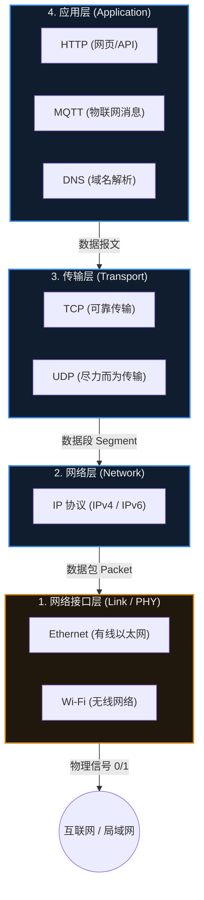

在发送数据时，数据从上往下走，每一层都会给数据套上一个“信封”（添加报头）；接收数据时，从下往上走，每一层剥开属于自己的信封。

## 19.2 寻址机制：MAC、IP 与端口

要让数据在大量设备之间准确送达，网络协议栈通常依赖三个关键的地址信息。下面沿用类比思路，用生活中的快递系统帮助建立直觉（同样只是类比，不是定义）：

1. **MAC 地址 (物理地址)**：
   - **工程定义**：网络接口的硬件标识符（如 `00:1A:2B:3C:4D:5E`），按设计应全局唯一，通常由芯片或模组厂商在出厂时写入（实际也可能被软件改写）。
   - **作用**：只在**同一个局域网（路由器内部）**里有效，用于设备间真实的物理数据传递。（类似你的身份证号，全国唯一，但快递员不看这个送货）。
2. **IP 地址 (逻辑地址)**：
   - **工程定义**：设备在当前网络中的逻辑地址（如 `192.168.1.100` 或公网 IP）。嵌入式设备通常通过 **DHCP** 协议向路由器自动申请获取。
   - **作用**：用于**跨网段/跨国界**的路由寻址。（类似你的家庭住址：某省某市某街道，快递员靠它跨省送货）。
3. **端口号 (Port)**：
   - **工程定义**：一个 16 位的数字（0~65535），用于区分同一台设备上的不同网络应用进程。
   - **作用**：一台单片机可能同时运行着 HTTP 网页服务（占用 80 端口）和 MQTT 客户端（占用 1883 端口）。网络包到达 IP 地址后，靠端口号决定交给哪个软件处理。（类似你家大门上的“几号房间”）。

> [!note] DNS 解析
> 记住服务器的 IP 地址很难，且服务器 IP 可能会变。因此设备通常只记录域名（如 `api.iot.com`）。
> 在建立通信前，协议栈会先使用 **DNS (域名系统)**，将域名翻译成真实的 IP 地址。如果你的单片机连上了 Wi-Fi 却连不上云服务器，检查 DNS 配置通常是排错的第一步。

## 19.3 TCP vs UDP 的工程权衡

传输层提供了两种最核心的协议。在嵌入式系统架构设计时，选择 TCP 还是 UDP 是一个关键的工程权衡。

| 对比维度 | TCP (传输控制协议) | UDP (用户数据报协议) |
| :--- | :--- | :--- |
| **工作方式** | **面向连接**（必须先经历“三次握手”建立连接才能发数据）。 | **无连接**（知道对方 IP 和端口，直接把数据扔出去）。 |
| **可靠性机制** | **极高**。拥有确认应答 (ACK)、超时重传、乱序重排机制。保证数据不丢包、不乱序。 | **无保证 (尽力而为)**。不关心对方是否收到，可能丢包、乱序。 |
| **资源开销** | **大**。需要复杂的代码逻辑，并在 RAM 中维护发送/接收缓冲区以支持重传。 | **极小**。逻辑简单，发完即忘，无需缓存。 |
| **延迟与实时性** | **可能产生较大延迟**。如果网络拥堵，TCP 会为了保证数据完整而反复重传、降速。 | **延迟极低**。网络卡顿最多就是丢弃几帧数据，不会堵塞后续数据。 |
| **嵌入式典型场景**| 固件 OTA 升级、MQTT 物联网控制、HTTPS 通信（不允许错任何一个字节）。 | 音视频流传输、局域网设备广播发现、NTP 网络对时。 |

## 19.4 嵌入式网络栈 (LwIP 与 硬件协议栈)

在通用 PC 或 Linux 系统中，TCP/IP 协议栈通常集成在操作系统内核中。但在资源受限的 MCU 上，处理网络包会占用相当可观的 CPU 算力与 RAM。
工程上通常有两种实现方式：

### 1. 软件协议栈 (如 LwIP)
- **机制**：在 MCU 内部运行一份轻量级的开源 TCP/IP 协议栈代码（常见的有 **LwIP**）。MCU 直接接管 Ethernet 物理层芯片（PHY）或 Wi-Fi 射频模块。
- **优点**：较为灵活，便于支持较多并发连接，成本低（ESP32 采用的即是这种架构，配合 FreeRTOS 运行 LwIP）。
- **缺点**：对 MCU 的片上资源占用较大。一个典型的安全 TCP 连接（带 TLS 加密）可能占用 30KB~50KB 的 RAM。

### 2. 硬件/外部协议栈 (如 W5500 或 AT 模组)
- **机制**：把整个 TCP/IP 协议栈固化在另一颗独立的芯片里（比如著名的以太网芯片 W5500，或者普通的 4G AT 模组）。主控 MCU 只需要通过 SPI 或 UART 发送简单的指令（如“连接服务器”、“发送这段数据”）。
- **优点**：主控 MCU 的负担显著降低。即使主控只是一颗仅有 8KB RAM 的低端单片机，也可以接入网络。
- **缺点**：并发连接数受限于外部芯片的硬件通道数（比如 W5500 最多 8 个 Socket），且通信吞吐量受限于 MCU 与网络芯片之间的 UART/SPI 接口速度。

## 19.5 常见误区与工程排错陷阱

### 陷阱 1：忽视 TLS/SSL 加密带来的资源爆炸
**现象**：程序通过普通 TCP (HTTP) 连接服务器时一切正常，一旦切换到加密的 HTTPS 或 MQTTS，单片机立刻死机或无限重启。
**原因**：现代网络安全要求数据在传输前必须通过 TLS (传输层安全协议) 加密。TLS 的握手过程需要极其复杂的非对称密码学计算（如 RSA/ECC），并交换数字证书。这在瞬间会消耗大量的 CPU 算力，更致命的是，它**需要大量的动态内存 (RAM)**。一个标准的证书链解析可能瞬间需要申请 20KB~40KB 的堆内存（Heap），如果单片机 RAM 不足，就会直接导致分配失败崩溃。
**工程对策**：在评估 IoT 芯片选型时，如果业务需要安全加密，MCU 的可用 RAM 通常不应低于 64KB（最好在 128KB 以上），或者选择内置了硬件加密引擎的芯片以降低计算开销。

### 陷阱 2：阻塞式的 Socket API 导致整个系统假死
**现象**：在一个没有 RTOS 的单片机中，调用 `connect()` 或 `recv()` 函数时，如果网络信号不好，整个板子的按键和屏幕完全卡住十几秒没反应。
**原因**：标准的网络 Socket API（如 `recv` 等待接收数据）默认是**阻塞 (Blocking)** 的。如果数据没来，或者连接没成功，这个函数会忙等到底层的超时（通常长达几秒到几十秒），导致主循环 `while(1)` 被彻底挂起。
**工程对策**：
- **方案 A（推荐，前提是平台支持 RTOS）**：引入 RTOS，将网络处理代码放到一个独立的 Task 中。即使该任务因网络阻塞，调度器通常仍会让其他 UI 任务和控制任务正常运行。
- **方案 B（裸机）**：通常应将 Socket 配置为**非阻塞模式 (Non-blocking)**，配合状态机（State Machine）轮询检查网络状态，避免长时间忙等。

### 陷阱 3：“TCP 连着”不代表“网络通着” (半连接问题)
**现象**：设备显示 TCP 连接正常，但实际上服务器发来的指令设备根本收不到，设备发出的数据也到达不了云端。
**原因**：TCP 的连接状态是在双方的内存里维护的。如果单片机突然被拔掉网线，或者路由器突然断电，没有机会发送 TCP 断开报文（FIN/RST），另一端的内存里会依然认为“连接是好的”，这就形成了死寂的“半打开（Half-Open）”连接。
**工程对策**：不应仅仅依赖底层 Socket 的状态返回值。在长连接应用中，应用层通常需要引入**心跳包 (Keep-Alive) 机制**。例如每隔 30 秒向服务器发一个空的 "Ping" 数据包，如果连续三次没有收到服务器的 "Pong" 响应，单片机应主动关闭底层 Socket 并触发重连逻辑。

> [!summary] 总结本章
> 1. 网络通信由 **TCP/IP 协议栈** 的不同层级分工完成，嵌入式中常通过 MAC（物理）、IP（逻辑路由）、端口（进程区分）进行寻址。
> 2. **TCP** 面向连接并提供可靠性机制，适用于对数据完整性要求较高的场景；**UDP** 开销低、无连接，适用于对延迟敏感或可容忍丢包的场景。
> 3. 嵌入式设备可以通过软件协议栈（如 **LwIP**）或外部硬件协议栈接入网络，前者占用 MCU 资源，后者占用硬件成本。
> 4. 实施网络开发时，需要关注 **TLS 加密对 RAM 的较大消耗**、**阻塞 API 对系统实时性的影响**，并认真设计应用层的 **心跳保活机制**。

---

# 20. MQTT

> [!info] 写在前面
> 在上一章中，我们让单片机学会了通过 TCP/IP 接入网络。在传统的互联网中，设备之间最常用的沟通方式是 HTTP（比如你在浏览器输入网址，获取网页）。
> 但 HTTP 是一种“一问一答（请求-响应）”的沉重协议，对于带宽极小、随时可能掉线、且需要实时接收云端指令的物联网单片机来说，它显得过于臃肿。
> 这一章，我们将介绍目前物联网界最普及的主流标准——**MQTT**，探讨它是如何用极小的开销解决千万级设备并发通信问题的。

## 20.1 一句话理解与正式定义

**一句话理解**：
MQTT 就像是一个高效的“报刊亭”。设备不需要互相知道对方在哪里，它们只需要向报刊亭（Broker）提交或者订阅特定主题（Topic）的“报纸”。报刊亭会自动把新报纸精准推送到所有订阅了该主题的设备手上。

**正式定义**：
**MQTT (Message Queuing Telemetry Transport)** 是一种基于**发布/订阅 (Publish/Subscribe)** 模式的轻量级物联网消息传输协议。
它通常运行在 TCP/IP 协议栈之上，旨在为资源受限的设备（如 MCU）和低带宽、高延迟或不可靠的网络环境提供实时、可靠的双向通信。

## 20.2 核心架构：发布 / 订阅模式

传统的 HTTP 采用的是 **Client-Server (请求/响应)** 架构：手机必须不断去问服务器“有没有我的新消息？”，这叫轮询，会持续消耗电量和带宽。

MQTT 采用了完全解耦的 **Pub/Sub (发布/订阅)** 架构：

```mermaid
graph TD
    subgraph CLIENT_PUB ["发布者 (Publisher)"]
        MCU["温湿度节点 (单片机)"]
    end

    subgraph SERVER ["代理服务器 (Broker)"]
        BROKER{{"MQTT Broker<br/>(负责接收、过滤与分发)"}}
    end

    subgraph CLIENT_SUB ["订阅者 (Subscriber)"]
        APP["手机 APP"]
        DB["后台数据库"]
    end

    MCU -->|1. 发布 (Publish)<br/>主题: home/temp<br/>内容: 25.5| BROKER
    
    BROKER -.->|2. 检查谁订阅了 home/temp| BROKER
    
    BROKER -->|3. 主动推送 (Push)<br/>内容: 25.5| APP
    BROKER -->|3. 主动推送 (Push)<br/>内容: 25.5| DB

    classDef pub fill:#21180d,stroke:#d18a16,stroke-width:2px,color:#eeeeee
    classDef broker fill:#101d2e,stroke:#3687e8,stroke-width:2px,color:#eeeeee
    classDef sub fill:#172a1c,stroke:#4caf50,stroke-width:2px,color:#eeeeee

    class CLIENT_PUB,MCU pub
    class SERVER,BROKER broker
    class CLIENT_SUB,APP,DB sub
```

**工程特性**：
- **空间解耦**：发布者和订阅者完全不知道对方的存在（甚至不在同一个国家），它们只和中央的 Broker 通信。
- **时间解耦**：消息是异步推送的，设备不需要同步等待响应。
- **双向通信**：MCU 既可以作为发布者上报数据，也可以作为订阅者实时接收云端下发的控制指令（无需轮询）。

## 20.3 寻址机制：主题 (Topic)

在 MQTT 中，消息没有直接的“接收者 IP 地址”，它的路由完全依靠**主题 (Topic)**。
主题是一个由斜杠 `/` 分隔的字符串，类似于文件系统的目录结构。

例如：`device/sensor01/temperature`

**通配符 (Wildcards) 机制**：
订阅者可以使用通配符来一次性订阅多个主题，但这**仅限于订阅者**使用，发布者必须发布到具体的确定主题。
- **`+` (单层通配符)**：匹配目录中的一个层级。
  例如订阅 `device/+/temperature`，可以同时收到 `device/sensor01/temperature` 和 `device/sensor02/temperature`，但收不到 `device/sensor01/roomA/temperature`。
- **`#` (多层通配符)**：匹配当前及其之后的所有层级（只能放在最后）。
  例如订阅 `device/#`，可以收到 `device` 开头的所有消息。

## 20.4 QoS：服务质量与可靠性权衡

物联网的网络环境往往极不稳定。为了应对网络抖动，MQTT 提供了三个等级的 **服务质量 (Quality of Service, QoS)**。这是工程师在带宽、耗电与可靠性之间必须做的权衡。

| 级别 | 定义 | 工程机制 | 适用场景 |
| :--- | :--- | :--- | :--- |
| **QoS 0** | **最多一次**<br>(At most once) | **发后即忘 (Fire and forget)**。发送方丢出数据即算完成，不要求对方回复 ACK。消息可能丢失，但绝不会重复。 | 周期性上报的温湿度数据（丢一两笔无所谓，下一笔马上就来）、高频心跳包。 |
| **QoS 1** | **最少一次**<br>(At least once) | **确保到达，可能重复**。接收方必须回复 `PUBACK`。如果发送方超时没收到，会重发。由于网络延迟，接收方可能收到多份重复数据。 | 智能开关的状态上报、重要报警（宁可重复报警，也绝不能漏报）。 |
| **QoS 2** | **确切一次**<br>(Exactly once) | **不丢不重**。依靠四步握手机制确保数据精确送达一次。 | 计费系统、支付指令。**在资源受限的 MCU 中极少使用**，因为其网络交互开销和内存状态维护成本过高。 |

## 20.5 解决不确定性：遗嘱 (LWT) 与心跳 (Keep Alive)

在第 19 章中，我们提到过 TCP 的“半连接”问题：设备突然断电后，服务器无法及时得知它已经离线。MQTT 在应用层通过心跳与遗嘱两个机制来应对这一问题。

### 1. 心跳保活 (Keep Alive)
- 在 MCU 与 Broker 建立连接时，会约定一个 Keep Alive 时间（例如 60 秒）。
- 规定：如果 MCU 在这段时间内没有发送任何业务数据，它必须发送一个极小的 `PINGREQ`（心跳包）。
- 如果 Broker 等待了 1.5 倍的 Keep Alive 时间（即 90 秒）仍未收到该设备的任何报文，Broker 将主动断开底层 TCP 连接，判定设备离线。

### 2. 遗嘱机制 (Last Will and Testament, LWT)
- **机制**：MCU 在最开始连接 Broker 时，可以偷偷留下一份“遗嘱”（指定一个 Topic 和一段消息，例如 `status/device01`，内容为 `offline`）。
- **触发**：只要 MCU 一直正常发心跳，遗嘱就被安全保存在 Broker 内存里。一旦 MCU 遭遇突然断电、断网，导致心跳超时被 Broker 判定为异常掉线，**Broker 就会代为把这份“遗嘱”发布出去**。
- **工程意义**：手机 APP 订阅了这个遗嘱 Topic，就能在界面上将设备图标置灰、显示“设备已离线”。相比服务器定时轮询每台设备的状态，由 Broker 主动推送离线事件的开销更低，状态更新也更及时。

## 20.6 常见误区与工程排错陷阱

在实际的物联网项目开发中，MQTT 是极易出现状态不同步和断连的环节。请重点规避以下工程陷阱：

### 陷阱 1：主循环阻塞导致心跳超时断连
**现象**：设备成功连上 MQTT，但过了一两分钟后，必定触发掉线重连。如此反复。
**原因**：MQTT 的 C 语言客户端（如常见的 Paho MQTT 库）通常依赖一个后台处理函数（如 `MQTTYield` 或 `loop()`）来维持心跳和接收数据。如果你的主程序中有一个长达几秒的 `delay()`，或者阻塞在某个传感器读取上，底层的 MQTT 库就得不到执行机会，无法按时发送 `PINGREQ`，最终被云端 Broker 判定超时并断开连接。
**工程对策**：如果使用裸机编程，必须采用非阻塞状态机，确保主循环极快地运转，高频调用 MQTT 的后台处理函数；如果在 RTOS 中，通常将 MQTT 的收发与心跳维护放置在一个**独立的后台 Task** 中运行，与其他业务逻辑解耦。

### 陷阱 2：滥用通配符导致内存溢出
**现象**：单片机刚连上网络就报出 `Out of Memory` 或触发 HardFault 崩溃。
**原因**：新手为了省事，让 MCU 订阅了根节点通配符 `#`（这意味着接收整个服务器上的所有消息）。当云端消息量稍微增大时，海量的数据瞬间涌入，MCU 有限的 RAM（网络接收缓冲区）被瞬间撑爆。
**工程对策**：在资源受限的嵌入式设备端，应避免订阅过于宽泛的通配符。设备通常应“精准订阅”只属于自己的控制 Topic（如 `cmd/device_id/#`）。

### 陷阱 3：混淆协议本身与数据载荷 (Payload) 格式
**现象**：认为 MQTT 只能发送 JSON 格式的数据。
**技术真相**：MQTT 是一个传输通道，它对数据载荷（Payload）的内容**一无所知，也完全不关心**。你可以发纯文本、JSON 字符串，也可以发 Hex 十六进制裸流，甚至是图片二进制数据。
**工程权衡**：
- **JSON**：可读性极好，与前端/云端对接较为方便；但在 MCU 端解析 JSON 需要占用大量 RAM，且字符串冗长，浪费流量。
- **二进制结构体 / Protobuf**：体积极小，解析极快，非常适合算力极弱的单片机；但在云端调试时需要专门的代码进行反序列化。
- **结论**：具体采用哪种 Payload 格式，取决于你的 MCU 算力余额和整个系统的技术栈约定。

> [!summary] 总结本章
> 1. **MQTT** 是基于 **发布 / 订阅** 架构的轻量级协议，解耦了设备与设备、设备与云端之间的通信逻辑。
> 2. 消息的路由完全依赖 **Topic (主题)**，设备间互不关心 IP 地址。
> 3. **QoS (0, 1, 2)** 提供了不同级别的送达保证；嵌入式系统通常根据数据重要性在带宽与可靠性之间做权衡。
> 4. **Keep Alive 与遗嘱机制 (LWT)** 用于应对物联网设备不可靠掉线时的状态同步问题。
> 5. 必须保证底层 MQTT 库能够周期性运行，防止阻塞导致心跳超时断连。

---

# 21. 嵌入式 Linux

> [!info] 写在前面
> 在之前的章节中，我们一直在一颗资源受限的单片机（MCU）上打磨代码。无论是裸机还是 RTOS，我们的目标都是“精准控制底层的每一微秒和每一个字节”。
> 但如果你的项目需要一个带触摸屏的复杂图形界面、需要处理多个高清摄像头的数据、需要跑深度学习模型，或者需要运行复杂的 Web 服务器，MCU 的算力和内存就会彻底捉襟见肘。
> 这时，我们就需要跨入嵌入式开发的一个庞大分支：**嵌入式 Linux**。这一章，我们将探讨从“控制硬件”走向“管理系统”的思维跃迁。

## 21.1 一句话理解与正式定义

**一句话理解**：
嵌入式 Linux 不再是一个你能在 IDE 里点一下“编译并下载”的单一裸机程序。它是一个完整的操作系统生态，它把底层的复杂硬件统统“屏蔽”起来，为你提供了一个标准化、功能极度丰富的运行环境。

**正式定义**：
**嵌入式 Linux (Embedded Linux)** 是指针对特定嵌入式硬件（通常是带有 MMU 的微处理器 MPU 或片上系统 SoC）进行裁剪、定制和优化后的 Linux 操作系统。
它通常包含了底层的引导程序、操作系统内核、设备驱动、文件系统以及专门为该产品定制的上层应用程序。它具备强大的网络协议栈、丰富的文件系统支持和多进程并发管理能力。

## 21.2 工程架构：嵌入式 Linux 的“四大件”

一个能够在 MCU 上跑起来的固件通常只是一个 `.bin` 或 `.hex` 文件。
但一个完整的嵌入式 Linux 系统，在工程构建和物理存储上，通常由四个界限分明的核心部分组成：

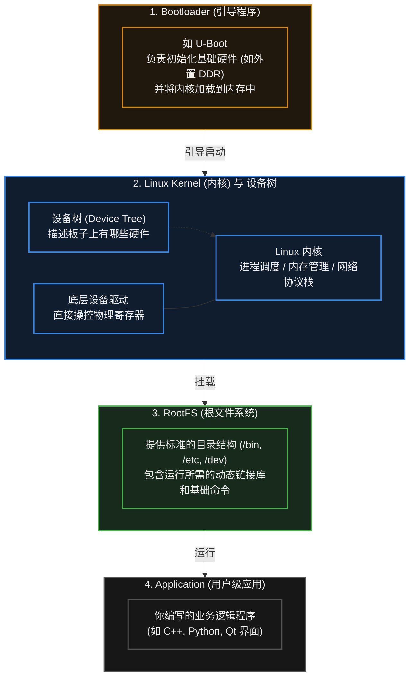

在实际工程中，这四个部分往往是**分别编译、分别烧录**的。你可能需要为它们划分不同的 Flash 分区，或者将它们打包成一个系统镜像（Image）烧录到 eMMC 或 SD 卡中。

## 21.3 核心机制：虚拟内存与进程隔离 (MMU)

为什么我们在基础单片机上通常只跑 RTOS，而在树莓派、工控机等高级板卡上跑 Linux？硬件上的核心分水岭通常是一个叫 **MMU (Memory Management Unit，内存管理单元)** 的部件。

### 在 MCU / RTOS 中（无 MMU）
所有的任务（Task）共享同一个物理地址空间。
- **痛点**：如果任务 A 中出现了一个野指针（Wild Pointer），它可能会不小心改写任务 B 的内存，甚至直接把操作系统的核心代码踩烂，导致**整个系统瞬间崩溃（HardFault）**。

### 在 嵌入式 Linux 中（有 MMU）
Linux 采用了**多进程 (Multi-Process)** 架构，MMU 硬件为每个进程制造了一个**“虚拟内存”**的幻觉。
- 每个应用进程都以为自己独占了一整段连续的虚拟地址空间（例如 32 位 Linux 上典型的 3GB 用户空间；用户空间与内核空间如何划分，取决于具体架构与内核配置）。
- MMU 负责在底层将这些虚拟地址悄悄翻译成真实的物理地址。
- **工程意义（进程隔离）**：如果你的业务应用（进程 A）产生了一个野指针，它试图访问不属于自己的内存，MMU 会拦截并上报给 Linux 内核。内核会终止进程 A（报出著名的 `Segmentation Fault` 段错误），但**整个 Linux 系统和其他进程通常仍能继续正常运行**。

这种隔离机制使得 Linux 系统能够承载庞大且复杂的软件生态，这也是它在高级嵌入式设备中不可替代的原因。

## 21.4 权衡：RTOS vs 嵌入式 Linux

在项目架构选型时，工程师必须在 RTOS 和 Linux 之间做出权衡：

| 对比维度 | RTOS (如 FreeRTOS 运行在 MCU) | 嵌入式 Linux (运行在 MPU/SoC) |
| :--- | :--- | :--- |
| **实时性 (Determinism)** | **极高 (硬实时)**。高优先级任务能以微秒级的确定性延迟抢占 CPU。 | **较弱 (软实时)**。标准 Linux 调度器追求吞吐量和公平，响应外部中断可能存在不可预测的毫秒级延迟。 |
| **硬件成本** | 极低。几十 KB RAM 即可运行。 | 较高。通常需要外挂数十兆甚至 GB 级的 DDR 内存和 eMMC/Flash。 |
| **启动时间** | **极快**。上电几毫秒到几十毫秒内即可输出控制信号。 | **较慢**。加载内核、挂载文件系统通常需要数秒到十几秒。 |
| **软件生态** | 较弱。通常需要使用 C 语言从底层堆砌逻辑。 | **生态成熟**。可以直接运行 Python/Node.js、使用现成的音视频编解码库、AI 框架、成熟的网络服务器等。 |

> [!tip] 现代工程解法：异构架构
> 很多现代产品（如自动驾驶域控制器、工业机器人）不再做非黑即白的单项选择，而是在同一颗芯片内同时集成**应用核心（如 Cortex-A）与实时核心（如 Cortex-M）**：前者运行 Linux，负责网络通信、路径规划、画面处理与 GUI；后者运行 RTOS 或裸机程序，负责要求硬实时的电机控制与安全制动。
> 这种架构的动机、分工与通信方式，见 [[#29.2 为什么需要异构架构？(MCU 与 Linux 的分工)]]。

## 21.5 常见误区与工程排错陷阱

对于从单片机刚刚转向 Linux 开发的新手，往往会遭遇巨大的思维撞墙期：

### 陷阱 1：试图在应用层直接读写物理寄存器
**现象**：新手想要点亮一个 LED，写了一段 C 代码，定义了一个指针指向 `0x40021018`（LED 寄存器的物理地址），运行后直接报 `Segmentation Fault` 崩溃。
**原因**：在 Linux 中，物理硬件和寄存器由**内核态 (Kernel Space)** 管理，用户态代码不能直接访问。你写的应用运行在**用户态 (User Space)**，MMU 不允许它直接触碰物理地址。
**工程对策**：
- **正规做法**：必须编写一份**设备驱动程序 (Device Driver)** 加载到内核中，由驱动去操作物理寄存器；驱动再向用户态暴露一个虚拟的文件接口（如 `/dev/my_led`）。用户程序通过标准的 `open()`、`write()` 系统调用来间接控制硬件。
- **妥协做法**：在某些快速验证场景下，可以通过 `mmap()` 系统调用，向内核申请将物理地址映射到当前进程的虚拟地址空间中，但这通常不符合严格的驱动开发规范。

### 陷阱 2：指望标准 Linux 处理微秒级的中断
**现象**：用 Linux 上的 GPIO 读取一个高频编码器的脉冲，发现读出来的波形残缺不全，转速计算结果错误。
**原因**：标准 Linux 内核的设计目标是“整体效率最高”，它在处理磁盘 I/O 或复杂的内核锁时，可能会临时屏蔽外部中断，导致中断延迟高达几百微秒甚至几毫秒。对于需要微秒级响应的硬件时序，Linux 根本抓不住。
**工程对策**：
如果必须在 Linux 侧处理一定的实时任务，可以为内核打上 **PREEMPT_RT**（实时抢占）补丁来大幅降低延迟抖动；但如果涉及到极高频的纳秒/微秒级严格时序（如软解协议、高速电机控制），通常应将这类任务下放给协处理器 (MCU) 或外接的 FPGA 完成，而不是用软件硬抗。

### 陷阱 3：开发与编译环境的巨大差异 (交叉编译)
**现象**：习惯了在 Keil 里点一下“Build”直接烧录的新手，发现 Linux 的代码根本不能在自己的电脑上直接编译后丢到板子上运行。
**原因**：你的电脑是 x86 架构的 CPU，而嵌入式板卡通常是 ARM 或 RISC-V 架构。在 x86 电脑上生成的二进制机器码，ARM CPU 根本看不懂。
**工程常识**：嵌入式 Linux 开发高度依赖**交叉编译 (Cross-Compilation)**。你必须在 PC（宿主机 Host）上安装一套专门针对目标板架构的**交叉编译工具链 (Cross Toolchain)**，用它编译出 ARM 的可执行文件，再通过网络（SSH/SCP）或优盘拷贝到嵌入式板卡（目标机 Target）上去执行。

---

# 22. Bootloader

> [!info] 写在前面
> 当你给单片机插上电源的那一瞬间，系统到底是从哪一行代码开始执行的？
> 在研发阶段，我们习惯了用专用的调试器（如 JTAG / SWD 烧录器）直接把代码写进芯片。但当产品卖到用户手里，你不可能要求用户拆开机器、插上排线去升级固件。
> 这一章，我们将探讨系统启动的“第一道大门”——**Bootloader**，以及它是如何实现产品的远程无感升级（OTA）的。

## 22.1 一句话理解与正式定义

**一句话理解**：
Bootloader 就像是电脑主板上的 BIOS。它在开机时最先运行，主要职责是检查有没有新的固件需要升级；如果有，就负责搬运和更新；如果没有，就把控制权交给真正的业务主程序。

**正式定义**：
**Bootloader (引导程序)** 是系统上电或复位后执行的第一段软件代码。
它的核心功能通常包括：
1. **基础硬件初始化**（如配置系统时钟、初始化外部 RAM 或必要的通信接口）。
2. **固件完整性校验**（检查主程序是否损坏或被篡改）。
3. **固件升级逻辑 (OTA 支持)**。
4. **引导并跳转**至主应用软件（Application）的入口地址执行。

## 22.2 典型的系统启动链路

单片机的启动过程并不是一蹴而就的，它通常呈现多级引导的阶梯结构。具体实现严重依赖于芯片厂商和架构（如 ARM Cortex-M、RISC-V 等），但宏观的工程模型通常如下：

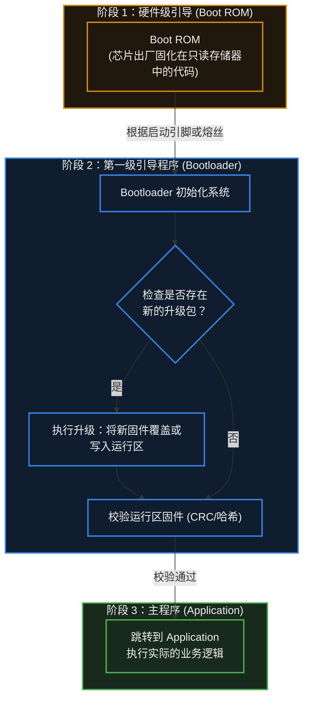

> [!note] Boot ROM 与 Bootloader 的区别
> - **Boot ROM**：由芯片厂商写死在芯片内部的，不可更改。它通常提供最基础的串口/USB下载功能（比如 STM32 的 System Memory 启动，或 ESP32 的出厂下载模式）。
> - **Bootloader**：由开发者自己编写（或使用 SDK 提供的现成框架），固化在 Flash 的起始区域，负责具体产品的升级逻辑。

## 22.3 核心工程实践：OTA 与双区备份 (Dual-Bank)

**OTA (Over-The-Air，空中下载技术)** 在现代物联网设备中十分常见。当单片机通过 Wi-Fi、4G 甚至是蓝牙接收到新固件时，系统是如何安全地“自我更新”的？

如果芯片的 Flash 容量足够大，业界较常见的高可靠性解法是 **A/B 双区备份 (Dual-Bank / A-B Partitioning)**。

**物理内存划分示例：**
- `0x0000 0000`：**Bootloader 分区**
- `0x0001 0000`：**App A 区**（当前正在运行的主程序）
- `0x0005 0000`：**App B 区**（用于下载新固件的备用区）
- `0x0009 0000`：用户数据区

**升级工作流：**
1. **下载阶段**：单片机当前运行在 App A 区中。业务代码从云端下载新固件，并将其悄悄写入到未被使用的 App B 区。此时即使突然断电，也不会影响系统。
2. **标记阶段**：下载完成并校验无误后，App A 在特定的配置扇区写下一个标志：“新固件在 B 区，下次开机请去那里”。
3. **重启跳转**：单片机软复位，**Bootloader 接管系统**。它读到标志，验证 App B 的固件完整性，随后直接跳转到 App B 区运行。
4. **版本回退机制**：如果 App B 的新固件有致命 Bug，导致一直反复死机重启（触发看门狗），Bootloader 在检测到连续启动失败后，会自动把启动目标切回稳妥的 App A 区。这就是所谓的“防变砖 (Anti-Bricking)”机制。

## 22.4 关键技术机制：中断向量表重定向

这是一个非常重要且架构强相关的底层机制（以最常见的 ARM Cortex-M 为例）。

在没有 Bootloader 时，主程序的代码是从 Flash 的最开头开始的。CPU 发生中断时，它会去 Flash 的 `0x00000000` 附近寻找**中断向量表（Interrupt Vector Table，本质上是一堆函数指针的集合）**，从而找到各个 ISR 的入口。

但引入 Bootloader 后，Flash 的开头被 Bootloader 占用了。主程序（App）被向后平移到了（比如）`0x00010000` 的位置。
如果此时 App 里发生了串口中断，硬件仍会按默认映射去 `0x00000000` 处查找中断处理函数，结果找到了 Bootloader 的代码里，系统瞬间跑飞（HardFault）。

**工程解决机制：**
- 主程序被编译时，必须在连接脚本（Linker Script）中修改其 Flash 起始地址。
- 主程序在 `main()` 函数的最开头，**必须首先修改一个底层系统寄存器（如 Cortex-M 的 `VTOR` 寄存器）**，告诉 CPU：“我现在搬家了，以后的中断向量表请去 `0x00010000` 这个新地址找！”

## 22.5 常见误区与工程排错陷阱

在编写或移植 Bootloader 时，因为涉及到底层跳转和硬件状态交接，容易引发难以用仿真器定位的偶发死机。

### 陷阱 1：跳转前未彻底“打扫战场” (中断未清理)
**现象**：Bootloader 运行一切正常，但只要执行了跳转指令进入主应用（App），系统通常在几毫秒内直接崩溃（HardFault）。
**原因分析**：
假设 Bootloader 在运行期间为了计时，开启了一个系统定时器中断（SysTick）。在跳转到 App 时，Bootloader 没有关闭这个定时器，也没有关闭全局中断。
进入 App 后，App 刚开始初始化变量，定时器中断恰好触发。CPU 响应中断，但此时由于某些寄存器状态尚未完全建立，或者 App 还没有来得及重定向 `VTOR` 中断向量表，CPU 找不到正确的处理函数，直接引发异常。
**工程对策**：
在 Bootloader 执行最后一步“跳转（Jump）”之前，**必须恢复芯片的原始状态（De-init）**。这通常包括：
1. 关闭所有使用过的外设（Timer、UART 等）。
2. **关闭全局中断**（Disable Interrupts）。
3. 清除所有挂起（Pending）的中断标志。
4. 将 CPU 的栈指针（SP / MSP）重置为 App 首地址所指示的位置。

### 陷阱 2：固件缺乏校验导致“变砖”
**现象**：设备 OTA 升级到一半网络断开，或者 Flash 写入时部分位翻转。重启后，设备变成一块无法开机、无法操作的“砖头”。
**工程对策**：
不应无条件信任从外部介质（网络、SD 卡、串口）下载进来的固件。
- 在固件打包时，工具链通常会在固件末尾追加一个 **CRC32 校验码**，甚至使用 SHA256 等哈希算法加上数字签名（RSA/ECDSA）。
- Bootloader 在跳转前，**必须对整个 App 分区进行一次完整的校验计算**。只要校验值与末尾存放的预期值不符，Bootloader 必须坚决拒绝跳转，并停留在安全模式等待重传，从而保住系统最后的生命线。

### 陷阱 3：Linker Script（链接脚本）地址重叠
**现象**：编译生成了固件，但烧录后完全不运行；或者 App 运行后某些全局变量的值莫名其妙被破坏。
**原因分析**：
Bootloader 和 App 是两个完全独立的工程，它们分别编译。如果在它们的链接脚本中，分配了重叠的 Flash 地址区域，或者重叠的 RAM 区域（特别是如果在 Bootloader 中遗留了数据在 RAM 中，而 App 未进行彻底清零就使用），就可能发生严重且难以排查的冲突。
**工程对策**：
必须严格在两个工程的链接脚本中划定清晰的界限。例如明确规定 Flash 的 `0~64KB` 归属 Bootloader，`64KB~` 归属 App；RAM 空间的初始化交接必须清晰明确。

> [!summary] 总结本章
> 1. **Bootloader** 是系统复位后第一段接管硬件的代码，负责初始化、固件校验、升级更新以及引导主程序。
> 2. 为了实现安全可靠的 **OTA（空中升级）**，工程上通常采用 **A/B 双区备份 (Dual-Bank)** 机制，以实现无感下载和防变砖回退。
> 3. 从 Bootloader 跳转到 App 时，通常需要处理**中断向量表重定向 (如 Cortex-M 的 VTOR)**，以确保硬件中断能被路由到新地址。
> 4. 跳转前的致命陷阱是**未关闭正在运行的外设和中断**；Bootloader 必须在“彻底打扫战场”后，才能把干净的硬件控制权移交给主程序。

---

# 23. 编译、链接与烧录

> [!info] 写在前面
> 在初学嵌入式开发时，大部分人习惯了在 IDE（如 Keil、IAR 或 VSCode）中按一下“Build（构建）”按钮，然后点一下“Download（下载）”，程序就神奇地在板子上跑起来了。
> 然而，当系统越来越大，遇到“内存溢出 (RAM Overflow)”、“未定义引用 (Undefined Reference)”或者试图划分 Bootloader 与 App 分区时，不懂底层构建流程的人往往会束手无策。
> 这一章，我们将拆解这个“黑盒”，看看你写的英文 C 代码，究竟是如何被一步步翻译、拼装，并最终安置到芯片物理内存中的。

## 23.1 一句话理解与正式定义

**一句话理解**：
这是一条工业流水线。首先把每份图纸（C 文件）单独翻译成零件（编译），然后把所有零件组装成一个完整的机器并分配好具体的摆放位置（链接），最后用集装箱把机器运送到工厂的车间里（烧录）。

**正式定义**：
在嵌入式工程中，这一整套流程由 **交叉编译工具链 (Cross Toolchain)** 完成。
- **交叉编译 (Cross-Compilation)**：因为单片机的算力极弱且没有操作系统，无法在自己身上运行编译器。因此我们必须在 x86 架构的电脑（宿主机 Host）上运行编译器，去生成针对 ARM 或 RISC-V 架构（目标机 Target）的机器码。
- **构建流水线**：通常严格遵循 `预处理 (Preprocessing) -> 编译 (Compilation) -> 汇编 (Assembly) -> 链接 (Linking)` 四个阶段。

## 23.2 构建流水线：从代码到机器码

无论是使用 GCC 命令行，还是点击 IDE 的编译按钮，底层都会经历以下标准的流水线：

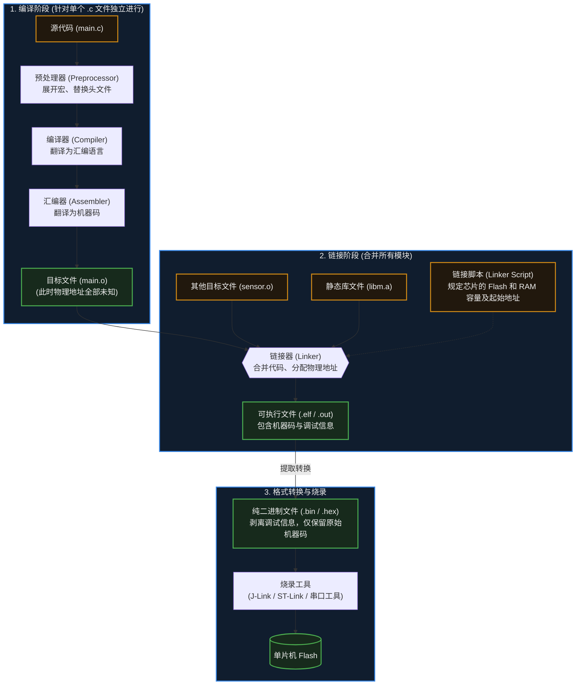

### 关键环节解析：
1. **预处理 (Preprocessing)**：处理所有以 `#` 开头的语句。比如把 `#include <stdio.h>` 里的内容全部复制粘贴过来，把 `#define MAX 100` 里的 `MAX` 全部替换成 `100`。
2. **编译与汇编生成目标文件 (`.o` / `.obj`)**：这是**很重要**的认知。编译器在处理 `main.c` 时，它是“蒙着眼睛”的。如果 `main.c` 里调用了 `sensor_init()` 函数，但这个函数写在 `sensor.c` 里，编译器并不知道这个函数的实际地址。它只会在 `.o` 文件里留下一个“占位符”，等别人来填。
3. **链接 (Linking)**：链接器登场，把所有的 `.o` 文件合并。它负责“填坑”：找到 `sensor_init()` 真正的位置，把对应的物理地址填回到 `main.o` 的占位符里。如果它翻遍了所有 `.o` 文件都没找到这个函数，就会报出著名的**链接错误**。

## 23.3 决定命运的图纸：链接脚本 (Linker Script)

在 Windows 或 Linux 下写应用程序，操作系统会自动在虚拟内存中为你分配地址。
但在嵌入式裸机开发中，芯片的 Flash 从哪个物理地址开始？容量多大？RAM 在哪里？必须由开发者手动告诉链接器。这就是 **链接脚本 (Linker Script，在 GCC 中通常为 `.ld`，在 Keil 中为 `.sct`)** 的作用。

链接脚本不仅划定了物理边界，还负责将程序中的不同数据分类存放到特定的**段 (Section)** 中。理解这些段的分布，是解决内存溢出的前提：

| 段名 (Section) | 存放内容 | 最终物理存放位置 | 占用 Flash 吗？ | 占用 RAM 吗？ |
| :--- | :--- | :--- | :--- | :--- |
| **.text** | 程序的代码逻辑（汇编指令）。 | 通常在 Flash 中（具体由链接脚本与运行方式决定）。 |占用 | 不占用 |
| **.rodata** | 只读数据 (Read-Only)。如 `const int` 和代码里写的字符串 `"Error\n"`。 | 通常在 Flash 中（具体由链接脚本与运行方式决定）。 | 占用 | 不占用 |
| **.data** | 已经初始化，且初值不为 0 的全局变量和静态变量。 | **初始值存在 Flash 中**，系统启动时被复位代码搬运到 **RAM** 中。 | 占用 | 占用 |
| **.bss** | 未初始化，或初始化为 0 的全局变量和静态变量。 | 不需要保存初始值。系统启动时在 **RAM** 中直接清零。 | 不占用 | 占用 |

> [!note] 栈 (Stack) 和堆 (Heap) 在哪里？
> 它们通常不体现为固定的静态段，而是在链接脚本中，利用 `.bss` 段结束后的剩余 RAM 空间，动态划分为堆和栈。

## 23.4 把程序塞进芯片：烧录 (Programming / Flashing)

经过格式转换后生成的 `.bin` (纯二进制) 或 `.hex` (带地址标记的文本) 文件，需要通过特定的硬件接口写入单片机的 Flash 中。常见的工程手段有：

1. **在线调试器接口 (JTAG / SWD)**：
   - 依赖外部硬件工具（如 J-Link、ST-Link、DAPLink）。
   - 它们直接通过芯片底层的调试总线，强行控制 CPU 和内存。不仅能极速烧录固件，还支持在 IDE 中打断点、单步执行、查看寄存器（这是嵌入式开发效率最高的方式）。
2. **Boot ROM 引导 (串口 / USB 下载)**：
   - 如果你手头没有调试器，很多芯片（如 ESP32、部分 STM32）出厂时，在不可擦写的只读存储器（Boot ROM）里固化了一段非常小的程序。
   - 通过将特定的硬件引脚（Boot Pin）拉高或拉低，芯片上电时会优先运行这段 ROM 代码。它能通过普通的串口 (UART) 或 USB 接收电脑发来的数据，并自行烧录到 Flash 中。
3. **用户 Bootloader (OTA)**：
   - 正如第 22 章所述，这是设备量产后，通过 Wi-Fi/4G 从云端下载固件并自行烧录的方式。

## 23.5 常见误区与工程陷阱

在日常开发中，编译与链接报错是新手的最大阻碍。以下是必须理清的工程排错思路：

### 陷阱 1：混淆“编译错误”与“链接错误”
**现象**：新手遇到报错，统称为“编译不过”，然后在网上一顿乱搜，找不到根本原因。
**工程对策**：必须学会分辨报错阶段。
- **编译错误 (Compiler Error)**：通常是语法错误，或者**找不到头文件 (`#include`)**。比如你调用了 `sensor_init()`，但没包含头文件。编译器报错：“隐式声明函数”。
- **链接错误 (Linker Error)**：通常是语法全对，头文件也包含了。但**你没有把 `.c` 文件加入到工程（Makefile / CMakeLists）中**。编译器在编译单个文件时被头文件“骗”过了，但链接器在最后总装时，找不到对应的 `.o` 实现。此时必然报错：**`Undefined reference to 'xxx'` (未定义引用)**。

### 陷阱 2：头文件包含变量定义导致的“多重定义”
**现象**：在 `config.h` 中写了一句 `int device_mode = 0;`。然后有两个 `.c` 文件都 `#include "config.h"`。最后报错：**`Multiple definition of 'device_mode'` (多重定义)**。
**原因机制**：`#include` 的本质是无脑复制粘贴。两个 `.c` 文件各自编译后，生成了两个独立的 `.o` 文件，里面各自拥有一个名为 `device_mode` 的全局变量。链接器合并它们时，发现两个同名的变量，不知道该用哪个，引发冲突。
**工程原则**：头文件 (`.h`) 中只能包含变量的**外部声明 (`extern int device_mode;`)**。真正的定义和初始化必须且只能放在某一个唯一的 `.c` 文件中。

### 陷阱 3：资源溢出却不看 Map 文件
**现象**：报错提示 `region RAM overflowed by 1024 bytes`（RAM 满了），新手只能靠盲猜去删减代码里的数组。
**工程对策**：链接器在工作结束后，除了生成可执行文件，还可以生成一份很重要的“账本”——**`.map` 文件**。
这份文件详细记录了每一个函数、每一个全局变量最终被分配在了哪个物理地址，以及它们究竟占用了多少字节的 Flash 和 RAM。
当遇到内存瓶颈时，**第一件事就是用文本编辑器打开 `.map` 文件（或使用对应的可视化分析工具）**，立刻就能精准定位是哪个庞大的数组或库函数“吃”光了你的单片机资源。

---

# 24. 调试方法

> [!info] 写在前面
> 在纯软件开发中，如果程序崩溃，通常会弹出一个详细的报错窗口告诉你错在哪一行。
> 但在嵌入式系统中，设备往往是一个没有屏幕的“黑盒”：出现异常时可能只是死机，或者外接电机突然异常转动。更棘手的是，问题的根源可能在 C 代码里，也可能来自外部的电磁干扰，或者是电源线上的电压跌落。
> 这一章，我们将建立从软件逻辑到物理电平的系统级排错思维，并介绍工程师手中的核心调试武器。

## 24.1 一句话理解与正式定义

**一句话理解**：
调试就是在程序行为与预期不符时，一步步缩小“可能出错的范围”，最终定位到根本原因的过程。

**正式定义**：
调试 (Debugging) 是通过观测手段（日志、调试器、逻辑分析仪、示波器）与控制手段（断点、单步执行、变量与寄存器读写），定位程序或硬件行为与预期之间偏差的成因，并验证修复措施是否有效的工程过程。

> [!note] 调试不是“试错”
> 调试的典型方法是：提出假设 → 设计能区分不同假设的观测手段 → 根据观测结果收敛结论。漫无目的地反复修改代码属于试错，通常不是高效的调试方式。

## 24.2 软件观测：日志输出 (Logging) 与断言 (Assertion)

最基础也是最普遍的调试方法，是让单片机“主动汇报”它的内部状态。

### 1. 串口日志 (UART Logging)
通过重定向 `printf` 函数，将变量的值、状态机的流转、错误码通过 UART 发送到电脑终端。
- **优点**：不需要特殊的仿真硬件，随时随地可以查看，是生产环境下最核心的排障手段。
- **工程代价与风险**：在第 10 章中我们提到过，串口传输速度相对较慢。如果频繁打印长字符串，或者底层 API 是阻塞式的，日志输出行为本身会**明显改变系统的时序**。

### 2. 断言 (Assertion)
防御性编程的常用工具。在代码中加入 `assert(指针 != NULL);` 或 `assert(数组索引 < 100);`。
- **机制**：当条件为假时（说明发生了在逻辑上不应发生的事情），`assert` 通常会立即触发一个异常或中断，或者打印出出错的文件名和行号，并让系统停在死循环中等待调试。
- **工程意义**：断言能在错误发生的**现场**立即中止程序，把排查范围收敛到断言所在的调用路径上，而不是等到野指针破坏内存、引发难以定位的崩溃之后才去排查。

## 24.3 硬件入侵：在线仿真调试 (In-Circuit Debugging)

当你无法通过日志定位 Bug 时，就需要直接观察芯片内部状态。通过 **JTAG** 或 **SWD** 调试接口，配合硬件仿真器（如 J-Link、ST-Link），我们可以暂停并控制 CPU 的执行。

**核心功能**：
- **断点 (Breakpoint)**：让 CPU 在执行到某一行代码时停下来。
- **单步执行 (Step Over / Step Into)**：让 CPU 一条一条指令地执行，观察代码走向。
- **查看内存与寄存器**：在 CPU 暂停时，直接读取 RAM 中变量的当前值，或者检查外设寄存器的配置是否生效。

> [!warning] 调试器的系统级副作用
> 认为“CPU 暂停了，整个世界就暂停了”是一种危险的错觉。
> 1. **外设可能还在运行**：在大多数默认配置下，虽然 CPU 不再取指令，但外部的电机可能还在依靠惯性转动，**硬件 PWM 也可能还在继续输出高电平**，这在电源或电机控制开发中可能导致硬件损坏。
> 2. **网络连接会断开**：CPU 暂停后无法响应底层网络心跳（Keep-Alive），一段时间后，云端服务器会认为该设备已经掉线。
> 因此，在强实时和涉及大功率输出的场景中，使用断点需要非常谨慎，有时甚至无法使用断点调试。

## 24.4 物理层洞察：逻辑分析仪与示波器

当软件层面的检查没有结果，或者涉及外部传感器通信（I2C / SPI / UART）时，通常应先停止盲目修改代码，转而观察物理引脚上的真实信号。

```mermaid
graph TD
    BUG{"程序不按预期工作"} 
    
    BUG --> SW["1. 软件逻辑排查"]
    SW --> LOG["查看串口日志 / 断言信息"]
    SW --> DBG["挂载调试器 (查看变量/调用栈)"]

    BUG --> HW["2. 物理信号排查"]
    HW --> D_SIG["数字信号异常<br/>(I2C没应答 / SPI乱码)"]
    D_SIG --> LA{{"逻辑分析仪 (Logic Analyzer)"}}
    LA -->|结果| DEC["抓取 0/1 波形并解析协议，看时序是否满足"]

    HW --> A_SIG["模拟/电气异常<br/>(频繁复位 / ADC跳动)"]
    A_SIG --> OSC{{"示波器 (Oscilloscope)"}}
    OSC -->|结果| VOLT["观察上升沿是否平缓、电源纹波是否过大"]

    classDef method fill:#101d2e,stroke:#3687e8,stroke-width:2px,color:#eeeeee
    classDef tool fill:#21180d,stroke:#d18a16,stroke-width:3px,color:#eeeeee
    
    class LOG,DBG,DEC,VOLT method
    class LA,OSC tool
```

### 1. 逻辑分析仪 (Logic Analyzer)
用于观察**数字信号**的主要工具。
- **功能**：它判断引脚是高电平（1）还是低电平（0），同时能记录多个通道的长时间波形，并**自动解析常见通信协议**。
- **场景**：当你发送了 I2C 读命令却收到乱码时，接上逻辑分析仪，通常很快就能看出是从机回了 NACK、地址发错，还是时钟频率配置不对。相比在代码中反复猜测，这种方式效率更高。

### 2. 示波器 (Oscilloscope)
用于观察**真实物理电平（模拟量）**的主要工具。
- **功能**：记录电压随时间变化的真实波形。
- **场景**：逻辑分析仪告诉你引脚是“1”，但在示波器上看，这个“1”可能只有 2.0V（电平不匹配）；或者它本该是较陡的方波，却因为连接线过长、分布电容过大，呈现出上升沿很缓的波形；又或者是电源线上存在较大的电压毛刺，导致单片机频繁复位。这类问题通常需要示波器才能观察到。

## 24.5 终极排错：HardFault 与异常分析

在基于 ARM Cortex-M 的微控制器开发中，比较难排查的一类故障是程序进入了 **HardFault_Handler（硬件错误异常）** 并停在死循环里。
（注：在 RISC-V 等其他架构中，也有类似的 Trap 或 Exception 机制。）

**触发原因**：
CPU 遇到了无法继续执行指令的情况。常见的包括：访问了不存在的内存地址（野指针）、除以零、数组越界破坏了内存、向只读的 Flash 写入数据，以及栈溢出（Stack Overflow）。

**工程化排障链路**：
遇到 HardFault 时不宜直接重启，现场保留了关键的定位线索：
1. **连接调试器**：让程序停在 HardFault 的死循环里。
2. **查看 Call Stack（调用栈）**：现代 IDE 能够回溯 CPU 发生崩溃前经历的函数调用链。这能让你大致定位崩溃发生在哪一个业务模块。
3. **查看特定寄存器**：
   - **PC (Program Counter)**：通常指向引发崩溃的指令，或者崩溃瞬间正在执行的代码。
   - **LR (Link Register)**：记录了当前函数执行完原本应该返回的地址，是追溯现场的关键。
   - **系统故障状态寄存器 (如 Cortex-M 的 CFSR / HFSR)**：硬件会在这些特殊寄存器里打上标记，告诉你具体是因为“总线错误 (Bus Fault)”、“内存管理错误 (MemManage Fault)” 还是 “用法错误 (Usage Fault)” 引起的崩溃。

> [!warning] 崩溃地点不一定是错误源头
> 这是复杂系统中排查内存问题的难点。
> 假设任务 A 因为数组越界改写了任务 B 的指针变量（此时并没有崩溃）；一段时间后，调度器切换到任务 B，任务 B 使用这个已被破坏的指针访问内存，触发了 HardFault。
> 此时 PC 和 Call Stack 都会指向任务 B，但问题的源头在任务 A。定位这类问题通常需要结合代码审查、硬件数据观察点 (Watchpoint) 以及 RTOS 的栈溢出检测功能。

## 24.6 常见误区与工程陷阱

### 陷阱 1：海森堡 Bug (Heisenbug)
**现象**：程序偶尔会出错，但插上调试器，或者加上一句 `printf` 观察变量时，Bug 就不再出现；一旦去掉打印，Bug 又重新出现。
**原因机制**：加入调试动作（如 `printf` 带来的延时）**改变了系统原本的并发时序**。原本两个任务在同一时间窗口内产生的数据竞争，可能因为 `printf` 造成的毫秒级延迟而被错开。
**工程对策**：遇到此类 Bug，可以优先怀疑**未加保护的共享全局变量（数据竞争）**、**中断嵌套时序问题** 或 **栈空间处于临界溢出状态**。

### 陷阱 2：过度怀疑底层编译器或硬件
**现象**：代码行为异常，排查很久没有结果，于是开始怀疑“这颗单片机坏了”或者“GCC 编译器有 Bug”。
**工程常识**：在绝大多数情况下，编译器与 MCU 硬件的行为是符合规范的：编译器经过大规模测试，MCU 的底层逻辑也经过了大量验证。如果怀疑芯片算错了 `1+1`，更常见的原因是变量溢出、指针破坏内存，或者硬件外围环境（电源、接线、信号干扰）存在问题。
**排查顺序建议**：**先检查自己的代码逻辑，再检查硬件接线与供电，最后再考虑工具链或芯片本身的问题。**

---

# 25. 低功耗

> [!info] 写在前面
> 如果你的嵌入式设备是插在 220V 插座上工作的，通常不需要关心低功耗。
> 但如果你的设备（如智能手表、无线传感器、防丢器）由一颗纽扣电池或者小容量锂电池供电，并且要求连续运行一年以上，那么“如何省电”就会成为整个系统软硬件架构设计的核心问题。
> 这一章，我们将探讨 MCU 如何通过电源与时钟管理，把每一微安（μA）量级的功耗都利用起来。

## 25.1 核心机制：MCU 为什么会耗电？

**一句话理解**：
低功耗设计就是在“设备要能及时干活”和“设备要尽量省电”之间做取舍，让有限的电池电量撑得更久。

**正式定义**：
低功耗设计 (Low-Power Design) 是在满足功能需求与实时性约束的前提下，通过硬件选型、电源域划分、时钟管理、工作模式调度与软件策略，降低系统平均功耗的软硬件协同优化过程。这里关注的核心指标通常是**平均功耗**（即一段时间内消耗的能量除以时间），而不是某个瞬间的电流值。

> [!note] “省电”不是单一指标
> 评价一个低功耗方案时，通常需要同时考虑：工作时的动态功耗、休眠时的静态功耗（漏电流）、唤醒所需的时间与能量，以及唤醒频率（占空比）。只看休眠电流的数值往往不够。

在数字电路底层，MCU 绝大部分面积由 CMOS（互补金属氧化物半导体）晶体管构成。它的功耗主要来自两个部分：

1. **动态功耗 (Dynamic Power)**：
   - **原理**：每次数字信号发生 `0` 和 `1` 的翻转时，内部的微小电容就需要充放电，这会消耗能量。
   - **决定因素**：翻转频率和电压。简单来说：**时钟跑得越快（频率越高），动态功耗越大**。
   - **工程对策**：降低工作频率（降频），或者在不需要计算时直接关闭某部分电路的时钟（时钟门控，Clock Gating）。

2. **静态功耗 (Static Power / Leakage)**：
   - **原理**：即使时钟完全停止，晶体管不发生任何翻转，只要芯片通着电，就会有极其微弱的电流“漏”过去，这被称为漏电流（Leakage Current）。
   - **工程对策**：彻底切断某一部分电路的供电（电源门控，Power Gating）。

## 25.2 低功耗模式的通用层级

为了在“响应速度”和“省电”之间取得平衡，MCU 厂商通常会设计多个级别的低功耗模式。
> [!note] 术语预警：各家叫法不一
> 不同的芯片原厂对低功耗模式的命名千差万别（比如有的叫 Stop，有的叫 Deep Sleep，有的叫 Hibernate）。但从宏观架构来看，它们通常遵循以下由浅入深的梯度规律：

| 模式层级 | 典型行为 (具体以 Datasheet 为准) | 内存 (RAM) 数据 | 唤醒时间 | 典型功耗 | 适用场景 |
| :--- | :--- | :--- | :--- | :--- | :--- |
| **正常运行 (Active)** | CPU 全速执行指令，所有外设时钟开启。 | 保持 | 无延迟 | 毫安级 (mA) | 正常处理数据、复杂计算。 |
| **空闲/睡眠 (Idle / Sleep)** | **CPU 停止工作**，但总线和大部分外设（UART、Timer、DMA）继续运行。 | 保持 | 极快（几个时钟周期）| 较低 (mA ~百 μA) | CPU 在两次中断之间短暂休息，随时准备恢复干活。 |
| **深度睡眠 (Deep Sleep / Stop)** | 高速时钟发生器（PLL / 外部高速晶振）关闭。保留低速时钟（RTC）。大部分外设停止。 | 保持（或部分保持）| 中等（微秒级，需等待高速时钟重新起振）| 微安级 (μA) | 智能手表的日常待机，按键或定时器唤醒。 |
| **关机/待机 (Hibernate / Standby)** | 芯片内部的供电域几乎全部切断，仅保留唤醒引脚和极简电路。 | **全部丢失** (相当于重启) | 极慢（毫秒级，等同于冷启动）| 极低（纳安级 nA，具体值以 Datasheet 为准） | 电视遥控器，按一次键发一次信号，其余时间长期处于睡眠状态。 |

## 25.3 唤醒机制与周期性任务

当 MCU 进入低功耗模式（尤其是深度睡眠）后，CPU 已经停止取指令。要让它醒过来，必须依赖**硬件触发**。典型的唤醒源有：

1. **外部中断（在 STM32 中为 EXTI，其他厂商的命名与配置方式不同）**：例如用户按下物理按键，引脚电平跳变触发唤醒。
2. **实时时钟 (RTC)**：即使在深度睡眠中，MCU 内部通常会保留一个由 32.768kHz 低速晶振驱动的 RTC 电路。它可以在指定时间触发唤醒（相当于内部闹钟）。
3. **低功耗通信外设**：某些 MCU 允许在深度睡眠时保持特定的低功耗 UART 或 I2C 监听，当收到特定的“唤醒包（Wake-up Frame）”时才唤醒系统。

**工程上的经典架构（占空比运行）：**
电池设备通常采用低占空比（Duty Cycle）的工作模式：**绝大部分时间处于睡眠状态，短时间唤醒完成工作，然后尽快回到睡眠**。

```mermaid
graph TD
    SLEEP["深度睡眠 (例如耗时 999 毫秒，耗电 2μA)"]
    WAKE{"RTC 定时到达 / 外部按键"}
    ACTIVE["运行态 (例如耗时 1 毫秒，耗电 10mA)<br/>采集传感器 -> 处理数据 -> 发送无线包"]
    
    SLEEP --> WAKE
    WAKE -->|触发中断| ACTIVE
    ACTIVE -->|代码主动请求| SLEEP

    classDef sleep fill:#171717,stroke:#555555,stroke-width:2px,color:#eeeeee
    classDef wake fill:#21180d,stroke:#d18a16,stroke-width:2px,color:#eeeeee
    classDef active fill:#101d2e,stroke:#3687e8,stroke-width:2px,color:#eeeeee

    class SLEEP sleep
    class WAKE wake
    class ACTIVE active
```

## 25.4 软硬协同：不只是调一个 API

一个常见的误解是：低功耗开发就是调用一个 `HAL_PWR_EnterSLEEPMode()`（STM32 HAL 示例）函数，然后功耗就能降到 Datasheet 宣称的 1μA。但实测结果往往高达几 mA。
在真实的工程中，**低功耗是系统级工程，需要软硬件配合**。

### 硬件设计的底线约束
如果电路板上有一颗始终常亮的电源指示灯（耗电约 2mA），或者使用了一个静态功耗较高的 LDO（稳压器自身耗电几百 μA），那么 MCU 无论进入多深的睡眠模式，整个设备的功耗也难以降下来。低功耗硬件设计通常会加入电源开关电路（如负载开关、MOS 管），让 MCU 能够切断高功耗外围传感器或通信模组的供电。

### 软件层的清理工作 (De-init)
在进入深度睡眠前，软件通常需要完成这些清理工作：
- 关闭不需要的外设时钟。
- 切断外部模组供电。
- **其中很重要的一步：妥善配置各个 GPIO 的状态。**

## 25.5 常见误区与工程陷阱

在低功耗项目的调试中，下面三类问题比较常见：

### 陷阱 1：GPIO 漏电流 (Leakage Current)
**现象**：MCU 已经进入最深的 Standby 模式，但依然存在几百微安的异常功耗。
**原因与机制**：
我们在第 3 章和第 7 章提到过引脚的**悬空（Floating）**状态。在进入睡眠模式时，如果某些没有外部连接的 GPIO 被配置为数字输入且悬空，外部微小的干扰会使 CMOS 输入缓冲器内部的门电路处于中间状态，产生“贯通电流（Shoot-through current）”。
如果有外部设备与 MCU 连接，而 MCU 进入睡眠后外部设备未断电，电流还可能通过 GPIO 引脚“倒灌”进 MCU。
**工程对策**：
进入深度睡眠前，通常需要逐一配置 GPIO：
1. 没有使用的引脚，通常配置为**模拟输入 (Analog Input)**（关闭数字输入缓冲器），或者配置为带上/下拉的输入。
2. 连接了外部设备的引脚，需要根据外部设备的电平状态进行匹配配置，避免产生电位差导致电流经引脚流入或流出。

### 陷阱 2：调试器 (Debugger) 阻碍了休眠
**现象**：插着 J-Link / ST-Link 仿真器测量功耗，会发现无论怎么改代码，功耗都降不下去。
**工程常识**：
调试接口（SWD / JTAG）通常属于一个独立的硬件电源域。只要调试器插着，甚至只在软件里开启了调试功能，MCU 内部的调试模块时钟就可能保持开启，阻止芯片进入真正的深度休眠。
**工程对策**：
测量最终功耗时，通常需要**拔掉调试器与串口线**，改用电池或独立直流电源供电后再测量。

### 陷阱 3：用普通万用表测量动态电流导致的复位
**现象**：为了测量几十微安的睡眠电流，把万用表打到微安（μA）档串联进电路。结果 MCU 一醒来准备发送无线数据，设备就复位重启了。
**机制原因**：
万用表测量电流的原理是串联一个采样电阻（Burden Voltage）。当你打到微安档时，内部串联的电阻较大。
当 MCU 睡眠时电流极小，分压不明显；但当 MCU 醒来瞬间需要 50mA 的大电流时，万用表的内阻上会产生明显的电压降。MCU 供电端实际得到的电压可能跌落到工作电压以下，触发硬件的掉电复位（Brown-out Reset, BOR）。
此外，普通万用表的采样频率较低，难以捕捉仅持续几毫秒的大电流脉冲，测出来的平均功耗参考价值有限。
**工程对策**：
在严格的低功耗工程中，普通万用表通常不适合做这类测量，需要使用专用的 **功耗分析仪 (Power Profiler)**，或者使用带宽与分辨率足够的示波器配合专用微小电流探头，来观察瞬态电流的波形和积分平均值。

---

# 26. 设备驱动

> [!info] 写在前面
> 当你第一次成功用 I2C 读取出一个温度传感器的数值时，你可能会直接在 `main()` 函数的 `while(1)` 里写上一连串的 `I2C_Start()`、`I2C_SendAddress()` 和 `I2C_Read()`。
> 这种写法在做点灯实验时没问题，但在包含几十万行代码的真实商业项目中，如果硬件改版换了一颗 MCU，或者换了一个型号的传感器，这种与底层强绑定的代码往往需要大规模重构。
> 这一章，我们将探讨如何通过**设备驱动 (Device Driver)** 和**分层架构**，写出优雅、可复用、易移植的工程代码。

## 26.1 一句话理解与正式定义

**一句话理解**：
设备驱动就像是硬件的“翻译官”和“代理人”。它对上层应用隐藏了繁琐的物理时序和寄存器地址，只暴露简单易懂的业务接口（比如“获取温度”）。

**正式定义**：
**设备驱动 (Device Driver)** 是一种特定于某种硬件设备的软件模块。
它的核心职责是**硬件抽象 (Hardware Abstraction)**，即将对底层物理设备（外设、传感器、执行器）的控制细节封装起来，向上层应用程序（Application）或操作系统提供标准化的应用程序编程接口 (API)。

> [!note] 概念边界：MCU 驱动 vs Linux 驱动
> 在裸机或 RTOS 上的 MCU 开发中，驱动通常是一组普通的 C 函数集合，属于应用软件的一部分；
> 而在嵌入式 Linux 等具有 MMU 的复杂系统中，设备驱动通常运行在受严格保护的**内核态 (Kernel Space)**，遵循极其严格的驱动框架（如字符设备、块设备模型），应用层必须通过系统调用（如 `open`, `read`, `write`）才能与驱动交互。本章主要聚焦于 MCU 级别的驱动架构。

## 26.2 为什么要写驱动？(裸奔代码的痛点)

我们来看一个典型的“新手级”代码与“工程师级”代码的对比。

**反面教材（业务逻辑与底层硬件严重耦合）：**
```c
void monitor_temperature() {
    // 业务逻辑里直接掺杂了 I2C 总线的物理时序和设备地址
    I2C_Start();
    I2C_SendByte(0x44 << 1); // 发送传感器 I2C 地址
    I2C_WaitAck();
    I2C_SendByte(0x2C);      // 发送特定的寄存器命令
    // ... 还要处理大量底层时序
    int temp = (high_byte << 8) | low_byte; 
    
    if (temp > 30) {
        GPIO_SetPin(GPIOA, PIN_5); // 直接操作 GPIO 开风扇
    }
}
```

**上述代码的工程问题：**
如果公司要求把这个项目从 STM32 移植到 ESP32 上，或者温度传感器因为缺货从 SHT30 换成了 DHT11。你必须把整个业务逻辑拆开，在一堆乱如麻的 `I2C` 和 `GPIO` 操作中逐行修改。

**合理的驱动封装应该长这样：**
```c
void monitor_temperature() {
    // 上层应用只关心“业务”，完全不需要知道底层是用 I2C 还是 SPI
    float temp = sht30_read_temperature();
    
    if (temp > 30.0f) {
        fan_turn_on();
    }
}
```
此时，`sht30_read_temperature()` 和 `fan_turn_on()` 就是所谓的**设备驱动接口**。移植时，业务代码一行都不用改，只需重写底层的驱动实现即可。

## 26.3 驱动的分层架构 (BSP 与 HAL)

为了实现彻底的解耦，正规的嵌入式工程通常会采用层次化的架构设计，数据请求自应用层逐级向下传递：应用层调用**设备驱动层**（如 `sht30_read()`、`fan_on()`），驱动层再调用**硬件抽象层**提供的通用接口（如 `hal_i2c_read()`、`hal_gpio_write()`），最终由 HAL 操作 MCU 寄存器、产生真实的电平信号。这样，业务逻辑、具体器件与芯片寄存器之间被两层接口隔开，更换器件或芯片时只需改动着对应的那一层。

完整的系统级分层视图（含中间件层与 RTOS）见 [[#27.2 分层架构 (Layered Architecture)]]。

在很多原厂 SDK 中：
- **HAL (硬件抽象层)**：由芯片厂商提供（如 STM32 HAL 库），它屏蔽了该厂 MCU 底层寄存器的差异。
- **BSP (Board Support Package, 板级支持包)**：通常包含该电路板上特有外设（如某款特定的屏幕、外部 Flash、LED 矩阵）的设备驱动层。

## 26.4 优秀驱动的进阶特征：面向对象思维

在 C 语言这种面向过程的语言中，我们如何写出一个“高级”的驱动？
假设你的板子上有**两个完全相同的温度传感器**，分别测室内和室外。如果驱动里大量使用全局变量，代码就会互相冲突。

优秀的嵌入式驱动通常会借鉴“面向对象”的思想，引入**上下文句柄 (Handle / Context)** 的概念。

**工程实践示例：**
```c
// 1. 定义一个传感器的“结构体句柄” (类似于面向对象里的类)
typedef struct {
    uint8_t i2c_address;          // 记录当前传感器的 I2C 地址
    void (*i2c_write)(...);       // 挂载底层的通信函数指针 (回调)
    void (*i2c_read)(...);
} SHT30_Device_t;

// 2. 初始化时，传入具体的硬件接口
SHT30_Device_t sensor_indoor;
sensor_indoor.i2c_address = 0x44;
sensor_indoor.i2c_read = my_mcu_i2c_read_func; // 绑定当前 MCU 的硬件接口

// 3. 读取时，把句柄传给驱动函数
float temp = sht30_read_temp(&sensor_indoor);
```
**这种设计的巨大优势**：
传感器驱动代码 (`sht30.c`) 内部没有任何特定 MCU 的 API（比如没有 `HAL_I2C_Master_Receive`）。底层读写能力是通过**函数指针**在初始化时从外部“注入”进来的。
这使得这个驱动文件变成了一个**纯逻辑文件**，你可以把它移植到其他单片机项目中复用，只需重新绑定底层的读写函数。

## 26.5 常见误区与工程陷阱

在编写或移植设备驱动时，新手往往容易忽略异常处理，导致驱动成为拖垮整个系统的罪魁祸首。

### 陷阱 1：无超时的底层忙等 (Blocking without Timeout)
**现象**：传感器损坏或接线松动时，整个系统突然死机。
**机制原因**：驱动代码在等待硬件状态（如等待 I2C 应答或等待 ADC 转换完成）时，使用了一个纯粹的 `while (硬件标志位 == 0)`。一旦硬件出现异常，标志位就一直不会改变，CPU 会陷入死循环，最终触发看门狗复位。
**工程对策**：在驱动底层的每一个 `while` 循环中，**必须强制加入超时机制 (Timeout)**。例如使用一个软件计数器，或者读取系统时钟滴答 (SysTick)。超时后立即跳出循环，并向上层返回错误码（如 `ERR_TIMEOUT`）。

### 陷阱 2：在驱动底层滥用延时函数
**现象**：调用了某个传感器的初始化或读取函数后，RTOS 里的其他实时任务出现了严重的迟滞。
**原因**：有些传感器（如 DHT11 或某些需要长转换时间的 ADC）在通信协议中规定需要等待几十毫秒。如果驱动直接调用裸机的 CPU 忙等延时（`delay_ms`），会把整个系统挂起。
**工程对策**：
- **方案 A（非阻塞状态机）**：将驱动的“请求”和“获取”分为两个函数。应用层请求后先去干别的，过一会儿再来查状态。
- **方案 B（适配 RTOS）**：驱动层通过宏定义或函数指针，将裸机的 `delay()` 替换为 RTOS 提供的阻塞延时（如 `vTaskDelay()`），从而在等待期间主动交出 CPU 使用权。

### 陷阱 3：吞没错误码 (Swallowing Errors)
**现象**：传感器其实已经坏了，但业务层毫无察觉，依然在根据错误的“0 度”执行控制逻辑。
**原因**：驱动内部读取硬件失败，却只是用 `printf` 打印了一句错误，然后依然向业务层返回了一个默认值（如 `return 0;`），导致业务层误以为当前温度就是 0 度。
**工程对策**：驱动层必须提供严谨的错误返回机制。
通常使用函数返回值来表示运行状态（如 `OK`, `ERROR`, `BUSY`），而真正的数据通过传入的**指针引用**（如 `float *out_temp`）来获取。业务层必须先判断驱动的返回值，确认为 `OK` 后，才允许使用读出的数据。

---

# 27. 嵌入式软件架构

> [!info] 写在前面
> 在学习阶段，我们习惯将点灯、读传感器、打印串口的代码全塞进 `main()` 函数的 `while(1)` 里。
> 但当你的代码从几百行膨胀到几万行，当你需要多人协作开发，或者当底层芯片因为缺货需要临时替换时，这种“面条式代码”的维护成本会急剧上升。
> 这一章，我们将探讨如何从宏观上组织代码，介绍几种嵌入式行业中被反复验证的经典软件架构模型。

## 27.1 一句话理解与正式定义

**一句话理解**：
软件架构就是给整个系统的代码“划定部门”和“修筑马路”。它决定了哪些代码负责底层通信，哪些代码负责业务逻辑，以及它们之间如何安全地传递数据，而不至于互相干扰。

**正式定义**：
**嵌入式软件架构 (Embedded Software Architecture)** 是对软件系统高层结构的抽象描述。
它定义了系统由哪些软件组件（Components）构成、各个组件的职责边界，以及组件之间交互（通信与同步）的机制与原则。良好的架构能够显著提升代码的**可移植性、可测试性、可维护性**以及系统运行的**时间确定性**。

## 27.2 分层架构 (Layered Architecture)

无论是裸机还是 RTOS，现代正规嵌入式工程几乎都会采用**分层架构**。其核心理念是：**上层依赖下层，下层不感知上层的存在；通常不允许反向或跨层直接调用。**

```mermaid
graph TD
    subgraph L4 ["应用层 (Application Layer)"]
        APP_LOGIC["核心业务逻辑<br/>(例如：温度报警、电机速度计算)"]
        APP_UI["用户界面<br/>(例如：菜单显示、按键响应)"]
    end

    subgraph L3 ["中间件层 (Middleware Layer)"]
        RTOS["RTOS 调度器"]
        FATFS["文件系统"]
        LWIP["TCP/IP 网络栈"]
    end

    subgraph L2 ["设备驱动层 (Device Drivers)"]
        SENSOR["传感器驱动<br/>(如 SHT30, MPU6050)"]
        MOTOR["执行器驱动<br/>(如 步进电机驱动)"]
    end

    subgraph L1 ["硬件抽象层 (HAL) 与 芯片支持包 (BSP)"]
        HAL["芯片厂商提供的 HAL 库<br/>(GPIO, I2C, SPI 接口)"]
    end

    L4 --> L3
    L4 --> L2
    L3 --> L1
    L2 --> L1

    classDef l4 fill:#101d2e,stroke:#3687e8,stroke-width:2px,color:#eeeeee
    classDef l3 fill:#172a1c,stroke:#4caf50,stroke-width:2px,color:#eeeeee
    classDef l2 fill:#3d2b1f,stroke:#a66d33,stroke-width:2px,color:#eeeeee
    classDef l1 fill:#21180d,stroke:#d18a16,stroke-width:2px,color:#eeeeee

    class L4,APP_LOGIC,APP_UI l4
    class L3,RTOS,FATFS,LWIP l3
    class L2,SENSOR,MOTOR l2
    class L1,HAL l1
```

**工程意义**：
当由于成本原因需要将主控芯片从 STM32 换成国产单片机时，**应用层和中间件层往往不需要修改**，通常只需替换底层的 HAL 库，并适当调整设备驱动层即可。这就是分层架构带来的巨大商业价值。

## 27.3 常见的执行架构模型

在划定了层级之后，代码在 CPU 上具体是按照什么顺序和逻辑执行的？工程中常见的有以下三种执行架构：

### 1. 轮询架构 (Super Loop / 前后台系统)
- **机制**：后台是一个死循环 `while(1)`，轮流调用各个业务函数；前台是中断（ISR），负责处理紧急硬件事件。
- **优点**：最简单，没有上下文切换的开销，不需要复杂的堆栈管理。
- **缺点**：任何一个函数的阻塞（如等待 I2C 应答），都会导致整个循环停滞，其他任务无法得到及时响应。
- **适用场景**：逻辑简单、无严格并发要求的小型设备（如简单的电动牙刷）。

### 2. 时间触发架构 (Time-Triggered Architecture, TTA)
- **机制**：依赖一个核心的硬件定时器（通常是 SysTick），产生固定的系统节拍（如 1 毫秒）。系统维护一个任务列表，严格规定“任务 A 每 10ms 执行一次，任务 B 每 50ms 执行一次”。
- **优点**：**可预测性高、时间确定性强**。在执行时间评估准确的前提下，系统行为完全可控，调试极其方便。
- **缺点**：难以应对突发的大量异步事件，且要求所有任务的单次执行时间必须极短，严禁阻塞。
- **适用场景**：汽车 ECU、航空航天、硬实时电机控制等安全关键（Safety-critical）系统。

### 3. 多任务抢占式架构 (RTOS 架构)
- **机制**：依赖 RTOS 调度器，将系统拆分为多个拥有独立堆栈的 Task。高优先级任务可以随时打断低优先级任务。
- **优点**：较好地解耦了时间相关的阻塞逻辑，网络通信、UI 刷新和后台计算可以“并行”开发。
- **缺点**：引入了数据竞争、死锁等并发难题，且 RAM 开销显著增加。
- **适用场景**：包含复杂协议栈（TCP/IP、Bluetooth）、GUI 界面或物联网 IoT 网关设备。

## 27.4 解决非阻塞的核心：有限状态机 (FSM)

在轮询架构或时间触发架构中，**不应使用忙等延时**。那么，如果我们需要“让电机转动 2 秒后再停止”，该怎么写代码？
这就必须引入嵌入式工程师的必修课：**有限状态机 (Finite State Machine, FSM)**。

**工作原理**：
把一个长耗时的动作，拆解成多个离散的“状态”。每次主循环执行到这里时，只检查时间或条件是否满足；满足则切换到下一个状态，不满足则立刻退出（`return`），把 CPU 交给别人。

**工程实践示例（非阻塞延时机制）：**
```c
// 定义电机的各种状态
typedef enum {
    MOTOR_IDLE,
    MOTOR_START,
    MOTOR_WAITING,
    MOTOR_STOP
} MotorState_t;

void motor_task_process(void) {
    static MotorState_t state = MOTOR_IDLE; // 静态变量，保存当前状态
    static uint32_t start_time = 0;         // 记录起始时间

    switch (state) {
        case MOTOR_IDLE:
            if (get_button_pressed()) {
                state = MOTOR_START;
            }
            break;
            
        case MOTOR_START:
            turn_on_motor();
            start_time = get_system_tick(); // 获取当前系统毫秒数
            state = MOTOR_WAITING;
            break;
            
        case MOTOR_WAITING:
            // 非阻塞检查：当前时间 - 起始时间 >= 2000ms
            if (get_system_tick() - start_time >= 2000) {
                state = MOTOR_STOP;
            }
            // 如果没到 2 秒，立刻退出 switch，不阻塞 CPU！
            break;
            
        case MOTOR_STOP:
            turn_off_motor();
            state = MOTOR_IDLE;
            break;
    }
}
```
> **工程意义**：状态机是替代 `delay()` 的终极解法。它不仅用于时序控制，在解析串口协议帧、处理复杂 UI 菜单时，状态机也是标准的代码组织范式。

## 27.5 常见误区与工程陷阱

在系统级架构设计中，以下几个陷阱通常会导致项目在后期彻底失控：

### 陷阱 1：全局变量满天飞 (Spaghetti Code)
**现象**：为了让网络任务拿到传感器任务的数据，直接定义了一个全局变量 `float global_temp;`，并且在代码的各个文件里随意使用 `extern float global_temp;` 进行读写。
**工程隐患**：
1. 引发极难排查的数据竞争（参考第 18 章）。
2. 模块间的耦合度极高，修改一个模块可能导致其他模块崩溃。
**工程对策**：
遵守“数据隐藏”原则。数据应该被封装在对应的模块内部，通过提供标准的接口（如 `float Sensor_GetTemp(void)`）供外部读取。如果在 RTOS 环境下，应优先使用**消息队列 (Message Queue)** 进行模块间的数据传递。

### 陷阱 2：过度使用 RTOS (Over-engineering)
**现象**：无论做什么项目，哪怕只是读一个 I2C 温度传感器并每秒通过串口打印一次，也要强行跑一个 FreeRTOS，并创建三四个任务。
**工程隐患**：RTOS 本身需要消耗数 KB 的 Flash 和 RAM，并带来几十微秒的调度开销。在资源非常受限（如仅有 8KB RAM）的 MCU 上强上 RTOS，会导致 RAM 瞬间捉襟见肘，后续连定义稍微大一点的数组都会栈溢出。
**工程对策**：架构没有优劣，只有合适与否。在业务逻辑线性、没有复杂阻塞需求的场景下，一个带有良好状态机设计的“超级循环（Super Loop）”往往是最稳定、开销最小的最优解。

### 陷阱 3：RTOS 任务划分不合理
**现象**：在 RTOS 中，按照“硬件设备”来划分任务。比如写一个 `Task_LED`，一个 `Task_ADC`，一个 `Task_Key`。
**工程隐患**：这种划分方式往往会导致任务数量爆炸，且大量任务其实处于空闲状态，白白浪费堆栈内存；更糟糕的是，如果某个控制流程需要按键触发 ADC 再亮灯，逻辑会被打碎在三个任务中，互相通过队列发消息，导致通信开销大于实际业务执行的开销。
**工程对策**：
任务的划分应当基于**阻塞特性和执行周期**，而不是外设。
通常的做法是：将所有极快速的轮询逻辑放在一个公共的控制任务中，将需要阻塞等待外设响应的操作（如网络通信、慢速 I2C 存储）独立为单独的任务。

> [!summary] 总结本章
> 1. **分层架构** 将代码划分为应用、中间件、驱动和 HAL 层，是实现代码可复用和硬件易移植的核心前提。
> 2. 执行架构的选择取决于业务复杂度：简单逻辑用**前后台轮询**，高可靠性控制用**时间触发 (TTA)**，复杂网络与 UI 交互引入 **RTOS 多任务**。
> 3. **有限状态机 (FSM)** 是非阻塞编程的核心手段，通过拆解动作状态并利用系统时间戳，通常可以替代裸机中的忙等 `delay`。
> 4. 优秀的架构应当**拒绝滥用全局变量**，通过提供 API 或使用 RTOS 的消息机制来管理模块间的数据流转。
> 5. 架构设计应避免**过度设计**；在 RTOS 中，应基于阻塞特性而非外设种类来合理划分任务。

---

# 28. 常见传感器

> [!info] 写在前面
> 单片机本身是一个封闭的数字逻辑系统。要让它具备感知物理世界的能力，就必须借助于传感器（Sensor）。
> 在初学阶段，很多开发者误以为“读传感器”就是调用一个 I2C 的读取函数，拿到几个数字就结束了。但在真实的工程应用中，读取数据只是第一步；如何处理噪声、如何将无意义的原始 ADC 值转化为物理单位、如何融合多个传感器的数据，才是传感器应用的核心。
> 本章将以几种最经典的传感器为例，探讨嵌入式系统中的数据采集与处理思维。

## 28.1 一句话理解与正式定义

**一句话理解**：
传感器相当于嵌入式系统的感官：它把温度、加速度、光照这类物理世界的量，转换成单片机能够读取的电信号。

**正式定义**：
传感器 (Sensor) 是一种能把某种物理量（如温度、压力、加速度、光强、气体浓度）转换为可测量电信号（电压、电流、频率或数字码）的器件或装置。

**MEMS 的正式定义**：
MEMS (Micro-Electro-Mechanical Systems，微机电系统) 是指用微加工工艺（光刻、刻蚀、键合等）在硅片等衬底上制造的、特征尺寸在微米量级的微型机电结构，通常与信号处理电路集成在同一芯片或同一封装内。

> [!note] 类比只是入口
> 把传感器理解为“感官”只是帮助建立直觉的类比。工程上真正需要关注的是：它测量的是什么物理量、以什么电气形式输出（模拟电压还是数字总线）、量程与灵敏度是多少、精度与噪声水平如何，这些都需要查阅对应的 Datasheet。

## 28.2 现代微型传感器的工程形态：MEMS

在现代嵌入式设备（如智能手机、可穿戴设备、无人机）中，我们大量使用的是 **MEMS（Micro-Electro-Mechanical Systems，微机电系统）** 传感器。

**工作机制**：
MEMS 技术利用半导体制造工艺，将微米级的机械结构（如微小的悬臂梁、振动质量块）与电子电路集成在同一颗硅芯片上。
当外部物理量（如加速度、气压）发生变化时，微机械结构会产生形变或位移，导致电容或电阻发生极其微弱的改变。芯片内部的高精度 ADC 采集这些微小变化，并通过内置的 DSP（数字信号处理器）进行初步的校准和补偿，最后通过 I2C 或 SPI 总线向外输出数字化的结果。

这种高度集成的形态大幅简化了系统侧的模拟电路设计，让 MCU 可以更专注于数字总线通信与上层算法。

## 28.3 惯性传感器 (IMU)：以 MPU6050 为例

**IMU (Inertial Measurement Unit，惯性测量单元)** 是机器人、无人机和姿态识别领域的基础。MPU6050 是一颗经典的 6 轴 IMU，它内部集成了一个 3 轴加速度计和一个 3 轴陀螺仪。

理解 IMU 的核心在于明白这两个传感器**究竟在测量什么，以及它们各自存在哪些局限**。

### 1. 加速度计 (Accelerometer)
- **测量原理**：它测量的是传感器受到的**整体受力（包括重力）**。单位通常是 $g$（重力加速度，约 $9.8 m/s^2$）。
- **工程特性**：当设备静止放置在桌面上时，它的 Z 轴会输出 $1g$，X 和 Y 轴输出 $0g$。我们可以利用重力在三个轴上的分量，通过反三角函数计算出设备当前的**倾斜角度（Pitch 和 Roll）**。
- **主要局限**：**高频噪声大、容易受震动干扰**。如果在行走或设备受到碰撞时，加速度计的读数会明显跳动，此时算出的角度可信度很低。

### 2. 陀螺仪 (Gyroscope)
- **测量原理**：它测量的是设备绕着三个轴的**旋转角速度**。单位通常是度每秒（$^\circ/s$ 或 $dps$）。
- **工程特性**：当设备静止时，无论怎么倾斜，输出都接近 0，只有在转动的过程中才有数值。要得到当前的角度，需要对角速度在时间上进行**积分**。
- **主要局限**：**低频漂移 (Drift)**。由于积分运算会不断累加误差，即使静止时陀螺仪存在很小的零点偏移，经过几分钟的积分后，算出的角度也会显著偏离真实角度。

### 3. 工程解法：传感器融合 (Sensor Fusion)
既然加速度计短期受震动干扰明显，而陀螺仪长期会漂移，工程上常见的做法是将两者结合起来，这被称为**传感器融合**。
最基础的融合算法是 **互补滤波 (Complementary Filter)**：

```c
// 互补滤波算法示例 (概念演示)
// 相信短期的陀螺仪积分，同时用长期的加速度计数据来纠正漂移
// alpha 通常是一个接近 1 的系数，如 0.98

float angle = alpha * (angle + gyro_rate * dt) + (1.0f - alpha) * accel_angle;
```
> 高级系统中，通常会使用计算量更大的 **卡尔曼滤波 (Kalman Filter)** 或 **Mahony 姿态解算算法**（常用于四轴飞行器）。

## 28.4 光学与生物传感器：以 MAX30102 为例

在智能手表和健康监测设备中，比较常用的是基于 **PPG (光电容积脉搏波描记法)** 的生物传感器，例如 MAX30102。

**工作原理**：
它包含了发光二极管 (LED，通常是红光和红外光) 和光电探测器 (Photodiode)。
LED 向皮肤发射光线，血液在心脏跳动（泵血）时，血管的容积会发生周期性的微小改变，这导致被吸收和反射的光量也发生周期性变化。光电探测器将反射回来的光强度转化为数字 ADC 值，MCU 通过分析这个周期性的波形，就可以计算出**心率 (Heart Rate)** 和**血氧饱和度 (SpO2)**。

**工程挑战与约束**：
如果把 MAX30102 直接接上单片机并打印原始数据，通常会看到明显的跳动，很难直接看出心跳波形。PPG 传感器在实际工程中面临几类较严苛的约束：
1. **环境光干扰**：日光灯的 50Hz 频闪、阳光直射都会明显污染光电探测器的读数。
2. **运动伪影 (Motion Artifact)**：只要手指稍有移动，皮肤与传感器相对位移导致的光线泄漏误差，就可能淹没微弱的心跳信号。
3. **接触压力**：按得太轻会漏光，按得太重会阻断毛细血管的血液流动，两种情况都可能测不到有效信号。

> **工程对策**：
> MAX30102 芯片输出的是**光强度的原始 ADC 数组**，而不是最终的心率值。
> 在实际产品中，通常需要配合 **加速度计** 评估运动状态以抑制运动伪影，并在 MCU 内部运行 **数字信号处理 (DSP)** 算法（如 FIR 带通滤波、峰值检测或 FFT 频域分析），才能提取出较可靠的心跳频率。

## 28.5 数据处理与基础滤波算法

如前文所述，真实世界的传感器数据总是伴随电子噪声和机械干扰。在进入业务逻辑处理前，**数字滤波 (Digital Filtering)** 通常是必要的环节。

以下是嵌入式开发中最常用的两种轻量级滤波算法：

### 1. 滑动平均滤波 (Moving Average)
- **机制**：开辟一个固定长度的数组缓存（如存放最近 10 次的采样值），每次有新数据进来时，剔除最老的数据，把新数据加进去，然后求当前数组的平均值。
- **优点**：能够平滑随机的高频毛刺，对周期性干扰有良好的抑制作用。
- **缺点**：缓存的数据越多，系统的响应**延迟 (Latency)** 就越大。会消耗一定的 RAM，且数组移位有计算开销（通常用环形缓冲区 Ring Buffer 优化）。

### 2. 一阶低通滤波 (IIR 滤波)
- **机制**：不需要数组缓存，只需要保存上一次的滤波结果即可。基于当前采样值和历史权重进行加权平均。
- **代码实现**：
```c
// alpha 为滤波系数，取值范围 (0, 1)。
// alpha 越小，滤波越平滑，但响应越迟钝；alpha 越大，对新数据越敏感。
float low_pass_filter(float new_value, float prev_result, float alpha) {
    return (alpha * new_value) + ((1.0f - alpha) * prev_result);
}
```
- **优点**：占用 RAM 极少，计算开销很小。

## 28.6 提取特征：信号向量模 (SVM)

在跌倒检测、计步器等应用中，我们并不关心设备具体的倾斜角度，而是关心设备是否产生了**较大的运动加速度**。
此时，我们会对加速度计的三个轴 (Ax, Ay, Az) 提取一个综合特征——**信号向量模 (Signal Vector Magnitude, SVM)**。

$$ SVM = \sqrt{Ax^2 + Ay^2 + Az^2} $$

**物理意义**：它代表了设备在三维空间中受到的**总合力大小**。
- 静止时，$SVM \approx 1g$（仅受重力）。
- 发生剧烈碰撞或跌倒时，SVM 会迅速增大到几个 $g$，随后在落地瞬间可能出现接近 $0g$（失重）的状态。我们可以通过设定阈值（Threshold）和时间窗，写出简单的运动识别状态机。

> [!warning] 术语区分
> 这里的 SVM 指的是物理信号处理中的 **Signal Vector Magnitude (信号向量模)**。
> 在后续的人工智能和 TinyML 章节中，也会出现缩写为 SVM 的词汇，那里通常指 **Support Vector Machine (支持向量机)**，是一种机器学习分类算法。请注意结合上下文区分。

## 28.7 常见误区与工程陷阱

在操作传感器时，以下几类认知误区常常导致项目在数据处理阶段出问题：

### 陷阱 1：把寄存器原始值直接当成物理单位
**现象**：从 MPU6050 读出加速度计的 Z 轴数据为 `16384`，直接拿这个数值参与姿态计算，结果明显错乱。
**工程常识**：传感器输出的通常是 ADC 裸数据（Raw Data），例如 16-bit 带符号整数（$-32768 \sim 32767$）。
需要查阅 Datasheet 中的 **灵敏度比例因子 (Sensitivity Scale Factor)** 进行量纲转换。
例如当配置量程为 $\pm 2g$ 时，手册给出的比例因子为 $16384 LSB/g$。
那么真实加速度 = `原始读数 / 16384.0f`，读数 `16384` 对应的就是 $1g$。

### 陷阱 2：忽视采样频率与混叠效应 (Aliasing)
**现象**：程序中每隔 100 毫秒（10Hz）通过 I2C 读取一次振动传感器的数据，试图分析一个频率高达 50Hz 的马达振动，结果分析出的数据看不出规律。
**技术真相**：根据**奈奎斯特采样定理 (Nyquist Theorem)**，要不失真地还原一个带限信号，采样频率需要大于该信号最高频率的两倍。
如果马达以 50Hz 振动，采样频率至少要在 100Hz 以上（工程中通常取 5~10 倍）。采样率过低会使高频信号在离散域中“折叠”成低频信号，得到完全错误的观测结果（混叠效应）。

### 陷阱 3：在中断中执行耗时的 I2C 传感器读取
**现象**：传感器有一个 INT 引脚，当数据准备好时会产生外部中断。如果在对应的 ISR (中断服务程序) 中直接调用 `I2C_Read()` 读出数据，系统可能出现死机或丢包。
**原因分析**：I2C 通信速度相对较慢（在 400kHz 下读取几个字节可能需要几十到上百微秒），而且很多 I2C 驱动库内部含有阻塞式的状态查询逻辑。在 ISR 中执行这类阻塞操作，与第 8 章提到的 ISR 原则（尽可能短、确定、非阻塞）相冲突。
**工程对策**：在 ISR 中通常只设置一个标志位（Flag），或者向 RTOS 发送一个信号量（Semaphore）；随后在主循环或专门的传感器读取任务中，再由后台代码通过 I2C 读取数据。

> [!summary] 总结本章
> 1. 现代嵌入式开发大量使用 **MEMS 传感器**，MCU 通过数字总线读取其内置 ADC 转换后的原始数据。
> 2. **加速度计**反映受力（受震动干扰明显），**陀螺仪**反映角速度（存在长期积分漂移）；工程上通常需要通过**传感器融合算法**（如互补滤波）才能得到较稳定的空间姿态。
> 3. 生物/光学传感器（如 PPG）输出的仅是光强变化，容易受运动和环境干扰，通常需要依靠 **DSP 滤波算法** 提取特征。
> 4. 在应用业务逻辑前，通常需要使用**滑动平均**或**一阶低通滤波**对传感器的原始毛刺数据进行平滑处理。
> 5. 工程师需要明确传感器的**灵敏度换算比例**，并依据**采样定理**设定合理的采样周期。

---

# 29. 机器人与嵌入式

> [!info] 写在前面
> 到目前为止，我们学习的都还是单一维度的技术：如何读取传感器、如何输出 PWM 控制电机、如何通过操作系统调度任务。
> 当我们把这些技术组合起来，加上复杂的环境感知和决策算法，这就演变成了一个现代机器人系统。
> 这一章，我们将跨出单片机的范畴，探讨在工业和商用机器人中，MCU（单片机）与 MPU/SoC（微处理器/系统芯片）是如何通过异构计算架构分工协作的。

## 29.1 一句话理解与正式定义

**一句话理解**：
现代机器人通常是一个“双脑系统”：高级处理器（大脑）负责思考“去哪里”，微控制器（小脑）负责精确控制肌肉（电机）“怎么走”。

**正式定义**：
**机器人控制架构**通常采用分层与异构计算（Heterogeneous Computing）模型。
它结合了运行通用操作系统（如 Linux + ROS）的高性能 SoC/MPU 以处理环境感知、SLAM（同步定位与建图）和全局路径规划，以及运行 RTOS 或裸机的 MCU 以执行严格硬实时的闭环电机控制和底层传感器高频采集。两者通过高速局部总线（如 CAN、SPI、UART）进行协同通信。

## 29.2 为什么需要异构架构？(MCU 与 Linux 的分工)

初学者常问：既然树莓派或 Jetson Nano（跑 Linux）算力这么强，为什么还要在板子上外挂一个 STM32 这种算力极弱的单片机来控制电机？为什么不直接让 Linux 输出 PWM？

这是由于 **软实时 (Soft Real-Time)** 与 **硬实时 (Hard Real-Time)** 的根本冲突决定的：

### 1. 为什么 Linux 不能直接控电机？
控制电机（尤其是闭环 PID 或 FOC 算法）需要严格的时间确定性。假设要求每隔恰好 1.00 毫秒（误差不能超过几微秒）读取一次编码器并更新一次 PWM 占空比。
- 无论 Linux 处理器的频率高达几 GHz，标准 Linux 的内核调度器可能会因为突然到来的一阵高吞吐网络数据包，或者一次系统页表切换，将电机控制进程挂起 2 毫秒。
- 这种毫秒级的调度抖动（Jitter），在电机高速运转时会导致严重的电流波动、震动异响，甚至烧毁驱动电路。

### 2. 为什么 MCU 不能做全套？
- MCU 没有足够的 RAM 和算力来运行激光雷达点云处理、机器视觉神经网络，以及庞大繁荣的 **ROS / ROS2 (机器人操作系统)** 软件生态。

### 3. 工程解法：主从异构架构
工程界较常见的解法是**各司其职**：

| 角色 | 硬件载体 | 软件环境 | 核心职责 | 典型周期要求 |
| :--- | :--- | :--- | :--- | :--- |
| **“大脑”** | MPU / SoC<br>(如 Jetson, i.MX8) | Ubuntu Linux + ROS2 | 视觉识别、SLAM 激光建图、全局路径规划、发送宏观指令（如“以 1.5m/s 前进”）。 | 百毫秒级 (10Hz) |
| **“小脑”** | MCU (单片机)<br>(如 STM32, ESP32) | FreeRTOS 或裸机状态机 | 接收宏观指令，进行运动学逆解，运行 PID 算法闭环控制各个车轮的精确转速；高频采集 IMU 姿态。 | 微秒/毫秒级 (1kHz+) |

## 29.3 机器人的系统级通信图景

这套主从架构在物理和软件上通常是这样联结的：

```mermaid
graph TD
    subgraph BRAIN ["大脑 (高级计算层 / Linux SoC)"]
        ROS_NAV["ROS2 导航与规划节点"]
        ROS_VIS["ROS2 视觉/雷达节点"]
        ROS_DRV["串口/CAN 通信节点"]
        
        ROS_NAV -.-> ROS_DRV
        ROS_VIS -.-> ROS_NAV
    end

    subgraph BUS ["板级 / 车内通信总线"]
        CAN_UART[["UART / SPI / CAN 总线"]]
    end

    subgraph CEREBELLUM ["小脑 (底层控制层 / MCU)"]
        MCU_COMM["报文解析与校验"]
        MCU_CTRL["运动学解算 & PID 控制器"]
        MCU_PWM["定时器 / PWM 生成"]
        MCU_ADC["定时器 / 编码器读取 (Encoder)"]
        
        MCU_COMM --> MCU_CTRL
        MCU_ADC --> MCU_CTRL
        MCU_CTRL --> MCU_PWM
    end

    subgraph WORLD ["物理世界"]
        MOTOR(("电机与驱动器"))
        ENC["车轮编码器"]
    end

    ROS_DRV === CAN_UART
    CAN_UART === MCU_COMM
    
    MCU_PWM -->|PWM / 方向| MOTOR
    ENC -->|脉冲信号| MCU_ADC

    classDef brain fill:#101d2e,stroke:#3687e8,stroke-width:2px,color:#eeeeee
    classDef bus fill:#171717,stroke:#555555,stroke-width:2px,color:#eeeeee
    classDef mcu fill:#21180d,stroke:#d18a16,stroke-width:2px,color:#eeeeee
    classDef hw fill:#172a1c,stroke:#4caf50,stroke-width:2px,color:#eeeeee

    class BRAIN,ROS_NAV,ROS_VIS,ROS_DRV brain
    class BUS,CAN_UART bus
    class CEREBELLUM,MCU_COMM,MCU_CTRL,MCU_PWM,MCU_ADC mcu
    class WORLD,MOTOR,ENC hw
```

## 29.4 底层控制核心：PID 算法

如果说通信协议是连接两个大脑的神经，那么 **PID (Proportional-Integral-Derivative)** 算法就是底层闭环控制的核心。

在实际物理世界中，如果你直接给电机输出 50% 占空比的 PWM，它并不会刚好以一半的最高速度运行。摩擦力、地面坡度、电池电压的下降都会改变电机的真实转速。
为了让车轮严格按照主板下发的“1.5m/s”运行，MCU 必须引入**闭环控制 (Closed-Loop Control)**。

**PID 算法的基本原理：**
算法的核心驱动力是 **误差 (Error)**：`误差 = 目标速度 - 当前真实速度`。
MCU 通过读取车轮上的编码器计算出当前真实速度，然后计算出三个调整量，最后加在一起修改 PWM 占空比：

1. **P (比例, Proportional)**：当前误差有多大，就施加多大比例的推力。误差大，推力猛；误差小，推力弱。
2. **I (积分, Integral)**：过去一段时间内误差的累积。如果遇到上坡，P 推力不够导致一直达不到目标速度，I 就会随着时间逐渐累加变大，最终爆发出足够的力量冲上坡。它负责消除**静态误差**。
3. **D (微分, Derivative)**：误差变化的速度。如果速度增加得太快即将超过目标值，D 会产生一个反向的阻力，防止“刹不住车（超调，Overshoot）”。它起的是**阻尼和预测**作用。

**工程上的经典代码实现框架：**
```c
// 伪代码示例：在定时器中断 (如 1ms 触发一次) 中被严格周期性调用
float calculate_pid(float target, float current) {
    static float integral = 0.0f;
    static float prev_error = 0.0f;
    
    // 1. 计算当前误差
    float error = target - current;
    
    // 2. 积分项累加 (通常需要做积分限幅，防止 Windup)
    integral += error;
    
    // 3. 微分项 (当前误差与上次误差的差值)
    float derivative = error - prev_error;
    prev_error = error; // 更新历史值
    
    // 4. 计算最终输出的控制量 (Kp, Ki, Kd 为需要调试的工程参数)
    float output = (Kp * error) + (Ki * integral) + (Kd * derivative);
    
    return output;
}
```

## 29.5 常见误区与工程陷阱

在构建这种复杂的“异构机器人系统”时，系统的脆弱性往往不体现在单一节点上，而是出在节点间的通信与调度上。

### 陷阱 1：缺少心跳机制导致“失控疯跑”
**现象**：高级 Linux 上的导航程序突然崩溃卡死，结果机器人并没有停下来，而是以崩溃前最后的指令速度，撞上了墙壁甚至伤到人。
**原因与机制**：如果 MCU（小脑）只在收到指令时更新目标速度，那么当 Linux（大脑）宕机不再下发新指令时，MCU 的 PID 闭环控制器会非常忠诚地将电机维持在最后一次收到的速度上运行。
**工程对策**：在异构架构中，主从机之间必须引入严格的**双向看门狗 / 心跳包机制 (Heartbeat)**。MCU 必须监控通信总线，如果超过设定时间（例如 500 毫秒）没有收到来自 Linux 的有效控制指令，MCU 必须立即主动将目标速度设为 0，甚至断开电机驱动器的使能信号触发安全急停。

### 陷阱 2：PID 控制周期抖动 (Jitter)
**现象**：将 PID 算法代码写在主循环 `while(1)` 里，发现电机运转非常粗糙，甚至参数根本调不出来（一会震荡一会没力气）。
**原因机制**：PID 算法的积分（I）和微分（D）项，在数学上高度依赖于**严格固定且均匀的时间间隔 ($\Delta t$)**。如果放在主循环中，系统处理其他任务（如解析串口数据）耗时的长短变化，会导致两次计算 PID 的时间间隔一会是 1ms，一会是 5ms。时间 $\Delta t$ 变了，累加出来的积分值就失去了真实的物理意义。
**工程对策**：闭环控制算法**通常必须放在硬件定时器中断 (ISR)** 或者 RTOS 中**极高优先级的周期性 Task** 中执行，以保证极低的执行时间抖动（Jitter控制在微秒级）。

### 陷阱 3：通信带宽与实时性错配
**现象**：Linux 尝试以 100Hz 的频率向 MCU 发送 6 个电机的控制指令，并要求回传 6 个编码器数据，结果发现通信出现严重的延迟和丢包。
**原因分析**：工程师在两者之间随便选了一个波特率为 115200 的 UART 串口。算一笔账：115200 bps 大约每秒能传 11.5 KB 数据。如果协议包含了包头、校验和数据载荷，一帧可能长达 30 字节；双向通信在 100Hz 下的吞吐量可能接近甚至超出了 UART 的物理极限，且 UART 缺乏硬件级的防冲突机制。
**工程对策**：在机器人系统内部，如果涉及多节点或高频实时控制数据交互，**CAN 总线 (Controller Area Network)** 往往是首选（其具备硬件级仲裁与校验，可靠性较高）；如果只是板对板的点对点高频大量数据传输，则应选择 **SPI** 或 USB，而不是传统的低速 UART。

> [!summary] 总结本章
> 1. 现代机器人普遍采用 **MPU(Linux) + MCU(RTOS/裸机)** 的异构双脑架构。
> 2. MPU 提供强大生态负责**高层感知与规划 (软实时)**；MCU 负责精确控制底层的电机执行与传感采集** (硬实时)**。
> 3. **PID 算法** 是基于误差消除的闭环控制核心，它的工程实现高度依赖于执行周期的严格固定。
> 4. 在异构通信中，必须引入**心跳检测与断联急停机制**以保障物理安全。
> 5. 控制算法不能随意放置在主循环中，必须依靠**硬件定时器中断或 RTOS 严格周期调度**，消除执行抖动 (Jitter)。

---

# 30. AI + 嵌入式 / TinyML

> [!info] 写在前面
> 在传统的嵌入式开发中，我们依靠编写明确的“规则”来控制设备：比如“如果温度大于 30 度，就打开风扇”。这种基于 `if-else` 的逻辑在面对明确的物理量时非常有效。
> 但是，如果需求变成“如果麦克风听到有人喊‘开灯’，就打开灯”或者“如果摄像头看到跌倒动作，就报警”呢？声音和图像充满了无数的特征变量，靠人脑写 `if-else` 根本无法穷举。
> 这一章，我们将探讨嵌入式系统的前沿方向——**TinyML（微型机器学习）**，看看如何在资源非常受限的单片机上，运行原本需要庞大服务器支撑的人工智能模型。

## 30.1 一句话理解与正式定义

**一句话理解**：
TinyML 就是让单片机“学”会认东西，而不是由你手把手“教”它怎么认。我们在云端用海量数据训练出一个“经验模型”，把它压缩后塞进单片机里，让单片机在离线状态下利用这个模型进行预测。

**正式定义**：
**TinyML (Tiny Machine Learning)** 是机器学习的一个分支，专注于在资源非常受限的边缘设备（通常指拥有几百 KB 甚至更少 RAM 和 Flash 的微控制器 MCU）上，部署和运行机器学习模型。
它的核心特征是：**超低功耗、低延迟、断网可用、以及高度注重隐私保护**（数据在本地处理，无需上传云端）。

## 30.2 逻辑范式的转变：规则驱动 vs 数据驱动

引入 TinyML 后，嵌入式系统的核心处理架构发生了根本性的变化。

```mermaid
graph TD
    subgraph TRADITIONAL ["传统控制架构 (规则驱动)"]
        T_IN["传感器输入<br/>(如：振动值)"] --> T_DSP["信号处理<br/>(如：滤波、求均值)"]
        T_DSP --> T_RULE{"硬编码规则<br/>(if 振动 > 10)"}
        T_RULE -->|触发| T_OUT["输出动作<br/>(报警)"]
    end

    subgraph TINYML ["TinyML 架构 (数据驱动)"]
        M_IN["传感器输入<br/>(如：语音波形)"] --> M_FEAT["特征提取<br/>(如：转为梅尔频谱)"]
        M_FEAT --> M_NN{{"神经网络推理<br/>(Neural Network Inference)"}}
        M_NN -->|输出概率| M_PRED["后处理逻辑<br/>(如：概率 > 80% 则判定为关键词)"]
        M_PRED --> M_OUT["输出动作<br/>(开灯)"]
    end

    classDef old fill:#21180d,stroke:#d18a16,stroke-width:2px,color:#eeeeee
    classDef new fill:#101d2e,stroke:#3687e8,stroke-width:2px,color:#eeeeee

    class TRADITIONAL,T_IN,T_DSP,T_RULE,T_OUT old
    class TINYML,M_IN,M_FEAT,M_NN,M_PRED,M_OUT new
```

**工程意义**：
神经网络取代了复杂的 `if-else`。这意味着，当你想要增加识别一个新单词（比如从“开灯”增加“关门”）时，你不需要修改核心的 C 语言逻辑代码，而是需要**收集新数据，重新训练一个模型，并更新到单片机的 Flash 中**。

## 30.3 核心工程挑战与模型压缩技术

将机器学习模型塞进 MCU 是一项极具挑战的工程。
在 PC 上，一个普通的模型动辄几十 MB 到几个 GB，而在 STM32 或 ESP32 这种芯片上，留给模型的 Flash 空间可能只有 200KB，运行时能用的 RAM 可能只有 50KB。
因此，在部署前通常需要对模型进行**大幅压缩**：

### 1. 模型量化 (Quantization)
- **机制**：在 PC 上训练模型时，参数（权重和偏置）通常使用 32 位浮点数（`float32`）保存。量化技术将这些数值映射并截断为 8 位整数（`int8`）。
- **工程收益**：
  1. **存储减小 75%**：一个 1MB 的模型可以直接压缩到 256KB。
  2. **推理速度显著提升**：很多普通的 MCU 处理浮点数非常慢（甚至没有硬件 FPU），但它们处理 8 位整数的加法和乘法极快。而且，某些架构（如 ARM Cortex-M4/M7/M33）内置了 DSP 扩展指令集（如 SIMD 指令），可以在一个时钟周期内同时计算多个 `int8` 乘法。
- **代价**：模型的预测精度会有轻微的下降。

### 2. 网络剪枝 (Pruning)
- **机制**：在训练好的神经网络中，有很多神经元之间的连接权重非常接近于 0，它们对最终的决策几乎没有影响。剪枝就是用算法找出这些“无用”的连接，并强行将其置零或删掉。
- **工程收益**：让网络变“稀疏”，从而进一步压缩模型的体积并减少计算量。

## 30.4 TinyML 的典型开发工作流

初学者常误以为“单片机正在自己学习”。在实际工程中，**学习（训练）和应用（推理）是彻底物理分离的**。

1. **数据采集 (Data Collection)**：用单片机和传感器在实际环境中录制数据（如音频、震动波形），打上标签，并上传到 PC 或云端。
2. **模型训练 (Training)**：在拥有高性能 GPU 的 PC 或云端上（通常使用 Python、TensorFlow、PyTorch）进行训练。
3. **模型转换与压缩 (Conversion)**：使用专门的工具（如 TensorFlow Lite 转换器），将庞大的模型进行量化，并转换为一个巨大的 **C 语言数组**（通常是一个包含十六进制数的 `.h` 头文件）。
4. **边缘部署与推理 (Inference)**：把这个包含了权重的 `.h` 文件编译进单片机的 Flash 中。单片机依靠轻量级的推理引擎（如 TensorFlow Lite for Microcontrollers），使用采集到的新传感器数据进行实时的前向计算。

## 30.5 常见误区与工程陷阱

在将 AI 模型落地到嵌入式硬件的过程中，通常会遇到以下瓶颈和陷阱：

### 陷阱 1：混淆“训练”与“推理”的算力需求
**现象**：新手担心单片机算力太弱，根本不可能“跑人工智能”。
**技术真相**：单片机**不负责训练 (Training)**。训练涉及海量的矩阵反向传播和梯度下降更新，确实需要 GPU。而单片机只负责**推理 (Inference)**，它仅仅是利用已经固定好的乘数（模型权重），把当前的传感器数据做一遍“乘法和加法”（前向传播），这通常只需要毫秒级的时间，即便是几十 MHz 的 Cortex-M0 也能勉强应付。

### 陷阱 2：内存分配导致的 HardFault (Tensor Arena 溢出)
**现象**：模型编译通过并烧录进单片机，但只要一调用 `invoke()`（开始推理），系统立刻崩溃死机。
**机制原因**：推理引擎在计算中间层数据时，需要一块称为 **Tensor Arena（张量内存池）** 的 RAM 空间。在很多轻量级框架中，为了在资源受限且强调时间确定性的嵌入式环境中避开运行期的动态内存分配 (`malloc`)，这块内存池通常需要你在 C 代码中**静态声明**一个巨大的全局数组（比如 `uint8_t tensor_arena[20 * 1024];`）。
如果你分配的数组大小，小于该模型实际推理时需要的最小内存量，引擎在运行时就会发生数组越界，直接引发内存损坏和 HardFault。
**工程对策**：在模型设计和转换阶段，仔细评估模型的激活内存占用（Activation Memory）。通常需要通过微调网络结构（如减小输入分辨率或网络层宽），将内存需求严格控制在单片机可用 RAM 的物理上限以内。

### 陷阱 3：忽视预处理（特征提取）的开销
**现象**：发现运行语音唤醒模型时，单片机根本来不及响应，或者识别率极低。
**原因分析**：工程师往往把目光全盯在了神经网络的耗时上，却忽视了：**原始传感器数据通常不能直接丢进神经网络**。例如，录音得到的原始 PCM 音频波形，必须先经过复杂的 DSP 数学运算（傅里叶变换 FFT、计算梅尔倒谱系数 MFCC 等）转换成声学特征图，才能喂给模型。如果单片机没有硬件 FPU 支持，这部分**特征提取**的时间可能比神经网络推理本身还要长。
**工程对策**：TinyML 工程绝不仅仅是搞深度学习模型。必须结合传统的数字信号处理（DSP）知识，优化特征提取阶段的代码，或者在硬件选型时选择带有 DSP 扩展指令集甚至专用音频加速器的 MCU 芯片。

> [!summary] 总结本章
> 1. **TinyML** 的核心是将云端的复杂 AI 模型，经过大幅压缩后，部署到资源非常受限的边缘单片机上运行。
> 2. 传统嵌入式基于 **硬编码规则** 驱动，而 TinyML 基于 **数据和神经网络权重** 驱动。
> 3. 模型必须经过 **量化 (通常转换为 int8)** 和 **剪枝**，以同时满足 Flash 存储限制和 RAM 运行限制。
> 4. 单片机通常只进行 **推理 (Inference)**（正向乘加运算），耗费大量算力的 **训练 (Training)** 仍留在 PC 或云端进行。
> 5. 实施落地时，必须严格评估特征提取开销（DSP计算），以及推理过程中对 RAM（Tensor Arena）的需求边界。

---

# 31. 项目开发方法

> [!info] 写在前面
> 当你学习完了前面的三十个章节，你已经掌握了点灯、总线、中断、RTOS、网络甚至轻量级 AI 的核心机制。
> 但真正的商业项目开发，并不是把这些代码随意拼凑在一起。不少新手在独立做项目时，单个模块都能跑通，一上电却直接“变砖”，面对几千行代码和复杂的电路板，不知道从何查起。
> 这一章不讲具体的硬件技术，而是探讨软件工程的通用思维：如何通过科学的**开发流**，将复杂问题拆解，并稳扎稳打地构建出一个高可靠性的嵌入式系统。

## 31.1 一句话理解与正式定义

**一句话理解**：
嵌入式项目开发中风险较高的一种做法，是把所有代码一次性写完，再一次性烧录到新打样的板子上电调试——一旦系统没有反应，就同时面对电源、时钟、驱动、RTOS、网络等多个未知变量，排查范围很宽。

**正式定义**：
嵌入式项目开发方法指在软硬件高度耦合、难以回退的约束下，用增量、可验证的工程流程，把系统从原型推进到可维护产品的实践集合。

在纯软件开发中，你写完一千行代码点击运行，如果报错了，通常只是逻辑问题。
但在嵌入式开发中，系统通常由**物理硬件、底层驱动、操作系统内核、网络栈和业务逻辑**紧密耦合而成。

如果一次性把所有代码写完，然后烧录进一块新打样的电路板中，上电后发现系统毫无反应，就会面临排查范围过宽的局面（工程上把这种一次性集成方式称为**“大爆炸集成，Big Bang Integration”**）：
- 是电源芯片虚焊了？
- 是晶振没有起振？
- 是 I2C 的上拉电阻忘了贴？
- 是 RTOS 的任务堆栈溢出了？
- 还是 MQTT 的初始化死锁了？

变量太多，很难快速定位问题。因此，嵌入式工程中常见的开发方法是：**自底向上的增量验证 (Bottom-Up Validation)**。

## 31.2 最小可行程序 (MVP) 与增量迭代

面对复杂的软硬件系统时，一种较为稳妥的策略是：**每次只引入一个未知变量**。
我们将整个项目拆分为多个具有明确里程碑意义的**最小可行程序 (Minimum Viable Program, MVP)**，逐步向上构建：

```mermaid
graph TD
    subgraph STAGE1 ["阶段 1：硬件最小系统验证"]
        S1["1. 测电压：确认 3.3V 正常<br/>2. 连调试器：确认能读到芯片 ID<br/>3. 点亮 LED：确认系统时钟和启动流程正常"]
    end

    subgraph STAGE2 ["阶段 2：通信与驱动验证 (裸机环境)"]
        S2["4. 调通 UART：搭建日志打印通道 (printf)<br/>5. 调通 I2C/SPI：能读出传感器的原始数据或 ID"]
    end

    subgraph STAGE3 ["阶段 3：中间件与 RTOS 引入"]
        S3["6. 启动 RTOS：确认调度器正常切换<br/>7. 驱动适配：将裸机传感器代码封装为独立 Task"]
    end

    subgraph STAGE4 ["阶段 4：业务逻辑与全量集成"]
        S4["8. 联调网络与上云<br/>9. 加入复杂的业务状态机与异常处理"]
    end

    STAGE1 --> STAGE2
    STAGE2 --> STAGE3
    STAGE3 --> STAGE4

    classDef stage fill:#101d2e,stroke:#3687e8,stroke-width:2px,color:#eeeeee
    class STAGE1,STAGE2,STAGE3,STAGE4 stage
```

**工程实践说明**：
在“阶段 2”测试传感器时，**先不要引入 RTOS**，只写一个最简单的 `while(1)` 轮询。如果读不出数据，就可以把问题范围基本锁定在 I2C 硬件接线或底层驱动寄存器上，而不必怀疑是不是 RTOS 任务优先级配置错了。
只有当底层的每一个基石都被证明是坚固的，才能在上面砌下一块砖。

## 31.3 工程化目录结构与解耦

为了配合增量开发以及第 27 章提到的“分层架构”，我们必须在物理文件层面对项目进行严格的模块化组织。
一个良好的、适合团队协作的 C 语言嵌入式项目目录通常如下所示：

```text
my_project/
├── CMakeLists.txt        # 构建脚本 (或 Makefile)
├── README.md             # 项目说明与编译指南
├── src/                  # 源代码目录
│   ├── main.c            # 程序入口，仅负责调用各模块初始化并启动调度器
│   ├── app/              # 应用层业务逻辑 (如 task_ui.c, task_motor.c)
│   ├── bsp/              # 板级支持包 (Board Support Package)，包含电路板特定外设驱动
│   │   ├── sensor_sht30.c
│   │   └── motor_driver.c
│   └── hal/              # 硬件抽象层接口的适配实现
├── inc/                  # 供外部调用的公共头文件目录 (.h)
├── third_party/          # 第三方库 (如 FreeRTOS, LwIP, FatFS)
│   └── FreeRTOS/
└── build/                # 编译生成的中间文件和最终固件 (应被 git 忽略)
```

**工程规则**：
- `main.c` 通常不应长达几千行。它可以被理解为一个“总装车间”（类比）：只负责组装，不负责生产细节。
- `app/` 里的业务逻辑文件，如果要获取温度，应调用 `bsp/` 暴露出来的接口，**不应在 `app/` 中直接操作寄存器**。
- `third_party/` 里的外部库代码，**原则上不建议直接修改**。如果需要定制，应通过外部的 `Config.h` 调整宏定义。这样可以确保将来底层库升级时，代码的迁移成本较低。

## 31.4 版本控制：Git 的工程意义

当项目从阶段 1 推进到阶段 4 时，不可避免会发生“改了网络功能，结果导致本来正常的显示屏不亮了”的情况。
如果没有版本控制系统，就只能靠 `Ctrl+Z` 或注释代码反复试探，排查代价很高。

在正式的嵌入式工程中，通常使用 **Git** 这类版本控制系统：
1. **原子性提交 (Atomic Commit)**：每调通一个传感器、每完成一个功能块，就进行一次 Commit。确保代码仓库里的每一个节点，都是一个“可编译、可运行、可验证”的健康状态。
2. **分支开发 (Branching)**：当要引入一个风险较大的变更（比如引入文件系统或大规模重构）时，拉出一个独立的 `feature` 分支进行开发。如果方案失败，可以直接删除该分支，主分支（`main` / `master`）仍然保持稳定。
3. **二分查找定位 Bug**：如果发现一个隐藏了很久的 Bug，可以利用 Git 的历史记录，通过二分法（如 `git bisect` 功能）快速锁定是哪一次改动引入了这个致命问题。

## 31.5 常见误区与工程陷阱

### 陷阱 1：无视编译器的警告 (Warnings)
**现象**：点击编译后，IDE 输出了 0 个 Error，但带有大量 Warnings。新手觉得“反正能生成固件”，直接烧录，结果运行中系统崩溃。
**工程常识**：在 C/C++ 嵌入式开发中，**相当一部分 Warning 背后是严重的隐患**。
例如“隐式声明函数（Implicit declaration of function）”或“指针类型不匹配（Incompatible pointer type）”，这往往意味着函数参数传递的栈结构已经被破坏，或者数据被截断。
**工程对策**：在构建系统（如 CMake 或 Makefile）中，开启 `-Wall`（启用常用的警告集），必要时再开启 `-Werror`（将警告视为错误）。**工程上通常把 “0 Error、0 Warning” 作为构建门禁**，而不是等看到警告后再逐个判断是否要紧。

### 陷阱 2：面向“偶然正确”编程
**现象**：某个 I2C 传感器读不到数据，新手在代码里随便加了一句 `delay(10)`，发现居然读到数据了。于是认为问题解决，继续开发后续功能。
**危害机制**：这种被称为“迷信式编程（Voodoo Programming）”。为什么加 10 毫秒能好？是不是因为前面的硬件复位时序没满足？或者是总线上有干扰需要时间稳定？如果不查清根本原因，这个 10 毫秒在不同的温度下、或者 RTOS 加入更高优先级任务后，可能就会变成 20 毫秒，Bug 很可能再次出现。
**工程对策**：嵌入式系统建立在物理约束和确定性逻辑之上。**对大多数 Bug 而言，如果不能从代码机制或 Datasheet 的时序图中找到根本原因，通常只能算暂时掩盖了现象，而不能算真正修复。**

### 陷阱 3：盲目重构与过早优化
**现象**：为了让代码看起来更“高级”，项目刚开始就设计了过度复杂的函数指针回调、层层嵌套的抽象结构体，甚至为了省几十个字节的内存，写出晦涩难懂的指针位操作。
**工程对策**：
遵循 **“Make it work, Make it right, Make it fast” (先让它跑起来，再让它结构合理，最后再优化性能)** 的原则。
在资源没有成为瓶颈之前，代码的**可读性和可维护性**通常优先于幅度很小的性能优化。过度抽象会导致在调试时，通过 Call Stack 很难追踪底层实际发生的物理事件。

> [!summary] 总结本章
> 1. 嵌入式项目开发通常应避免“大爆炸集成”，遵循 **MVP（最小可行程序）与自底向上的增量验证**。
> 2. 使用清晰的 **目录结构和分层架构**，尽量解耦业务逻辑与底层硬件操作。
> 3. 利用 **Git 版本控制系统** 保障每一次增量功能的稳定性，隔离试错风险。
> 4. 严谨的工程态度要求：**把编译警告纳入构建门禁**、**拒绝只看表象不查根因的“偶然正确”**，以及**避免过早的底层优化**。

---

# 32. 常见问题排查

> [!info] 写在前面
> 嵌入式开发中最令人挫败的环节，莫过于代码编译通过、烧录成功，但板子却毫无反应，或者在运行几小时后莫名其妙地死机。
> 由于嵌入式系统是软硬件高度耦合的实体，排错（Debugging）不能仅仅停留在阅读 C 代码的层面。
> 本章将梳理嵌入式工程中最常见的几种故障场景，并提供一套从物理层到软件层的系统化排查方法论。

## 32.1 排查方法论：自底向上的漏斗模型

**一句话理解**：排查嵌入式故障，通常先确认最底层的“电”，再一层层往上找代码，而不是一上来就盯着 `main.c`。

**正式定义**：嵌入式问题排查，指在软硬件耦合、无法仅靠阅读源码定位的前提下，按“物理与电气层 → 硬件启动层 → 总线与外设层 → 软件逻辑层”的依赖顺序逐层排除故障的系统化方法。

面对一个未知的故障，很多新手习惯直接打开 `main.c` 开始盯着代码看。在工程实践中，这种做法效率极低。
专业的排查逻辑通常是一个**“自底向上的漏斗模型”**：一般需要先确认底层基石稳固，再向上排查软件逻辑。

```mermaid
graph TD
    subgraph L1 ["1. 物理与电气层 (Physical & Electrical)"]
        P1["万用表测量 VCC 与 GND<br/>检查电压是否达标、纹波是否过大"]
    end

    subgraph L2 ["2. 芯片启动层 (Boot & Reset)"]
        P2["示波器观察 Reset 引脚与晶振<br/>确认 Boot 引脚电平配置正确"]
    end

    subgraph L3 ["3. 底层驱动与总线层 (Drivers & Bus)"]
        P3["逻辑分析仪抓取通信波形<br/>确认 I2C/SPI/UART 物理时序无误"]
    end

    subgraph L4 ["4. 操作系统与并发层 (RTOS & Concurrency)"]
        P4["检查任务栈溢出、死锁<br/>确认中断优先级配置正确"]
    end

    subgraph L5 ["5. 应用逻辑层 (Application Logic)"]
        P5["检查业务状态机流转<br/>确认算法逻辑"]
    end

    L1 --> L2
    L2 --> L3
    L3 --> L4
    L4 --> L5

    classDef stage fill:#101d2e,stroke:#3687e8,stroke-width:2px,color:#eeeeee
    class L1,L2,L3,L4,L5 stage
```

## 32.2 场景 1：系统完全不运行或无限复位

**现象**：板子上电后没有任何预期反应（LED 不亮，串口无输出），或者能看到现象在以固定频率不断重启。

**工程排查链路**：
1. **电源系统检查**：单片机引脚上实际测量到的电压是多少？如果使用了大功率外设（如 Wi-Fi 模组、电机），瞬态电流是否拉低了 VCC 触发了芯片的**掉电复位 (Brown-out Reset, BOR)**？
2. **Boot 引脚状态**：查阅 Reference Manual。很多 MCU（如 STM32 的 BOOT0/1，ESP32 的 GPIO0）在复位释放的瞬间会采样特定引脚的电平。如果因为外部连线错误导致电平不对，芯片可能进入了专门的“串口下载模式”而根本没有执行你的 Flash 代码。
3. **看门狗 (Watchdog) 误杀**：程序初始化时间过长，或者在初始化阶段使用了忙等循环，导致在进入主循环前看门狗超时复位。
4. **时钟配置死机**：在 `main` 函数的最开头，通常会配置 PLL（锁相环）来提高系统时钟频率。如果外部晶振未起振，或者倍频参数超出该芯片 PLL 的支持范围（需参考 Datasheet 与 Reference Manual），系统可能在切换时钟源的瞬间直接死机。

## 32.3 场景 2：总线与外设通信失败

**现象**：UART 打印出乱码、I2C 读出全 `0xFF`、SPI 读回的数据出现规律性移位。

**工程排查链路**：
1. **共地 (GND)**：两块电路板之间通信，如果没有连接统一的 GND，所有的电平信号都是无意义的。这是排查通信问题时经常遇到的低级错误。
2. **引脚复用映射**：检查代码中是否正确启用了 GPIO 的**复用功能 (Alternate Function)**，以及是否使能了对应外设和 GPIO 端口的硬件时钟。
3. **逻辑分析仪介入**：
   - 对于 **UART**：观察单个位的宽度，计算真实波特率，检查是否与预期匹配。
   - 对于 **I2C**：观察 SCL 时钟是否产生？SDA 是否被拉低产生了 ACK？如果没有波形，大概率是**缺失上拉电阻**。
   - 对于 **SPI**：对比 Datasheet，检查时钟的空闲电平与采样边沿（CPOL / CPHA 模式配置）是否与从机手册描述的一致。

## 32.4 场景 3：随机崩溃与偶发性 HardFault

**现象**：程序运行大部分时间正常，但每隔几小时或在特定密集操作时，系统突然挂起，或者陷入了硬件错误异常（如 Cortex-M 的 HardFault）。这是嵌入式开发中较棘手的一类问题。

**工程排查链路**：
1. **栈溢出 (Stack Overflow)**：
   - 检查 ISR 或 RTOS 任务内部，是否定义了占用内存极大的局部数组。
   - 检查是否存在没有终止条件的递归函数调用。
   - 调试手段：填充栈内存为特定魔数（如 `0xDEADBEEF`），运行一段时间后通过调试器检查这些标识是否被覆盖（高水位标记法）。
2. **野指针与数组越界 (Memory Corruption)**：
   - 使用未初始化的指针，或者向数组写入了超过其容量的数据，默默覆盖了相邻的全局变量甚至覆盖了返回地址。
   - 这种破坏往往潜伏很深，直到系统尝试使用被破坏的数据时才触发崩溃。这类问题通常需要借助代码审查（Code Review）和静态分析工具排查。
3. **并发导致的数据竞争 (Race Condition)**：
   - 回顾第 18 章。主程序与中断（或两个 RTOS 任务）之间共享了同一个全局结构体，却没有使用关中断或互斥锁进行保护。由于中断触发的时机是随机的，数据的部分修改可能导致逻辑状态混乱。
4. **中断配置异常**：
   - 在高优先级中断中调用了阻塞型 API（如某些 RTOS 的 `TakeSemaphore`），或者未按该外设规定的方式清除中断标志位，导致中断被反复触发。中断标志的清除方式（例如写 1 清除、写 0 清除、读寄存器后清除、硬件自动清除）取决于具体外设设计，需参考 Reference Manual。

## 32.5 常见误区与工程陷阱

在排查上述问题时，新手往往容易陷入以下不科学的调试习惯：

### 陷阱 1：盲目修改代码碰运气 (Shotgun Debugging)
**现象**：遇到程序崩溃，不借助任何调试器或日志，随意在代码中加 `delay()`、去掉某些函数调用、或者反复调换语句的执行顺序，直到程序“碰巧”不崩溃了，就认为 Bug 修好了。
**工程危害**：这种被称为“霰弹枪调试法”。如果在未找到根本原因（Root Cause）的情况下掩盖了现象，这个 Bug 很可能在系统负载升高或代码轻微改动时再次爆发。
**工程规范**：工程实践中，修改通常应当建立在通过数据（寄存器状态、波形、调用栈）准确定位问题的基础上。

### 陷阱 2：过度依赖软件调试，忽略电气现象
**现象**：单片机 ADC 读数剧烈跳动，工程师花了几天时间在代码里编写过于复杂的卡尔曼滤波算法试图平滑数据，却无济于事。
**技术真相**：最终发现是模拟电源（VDDA）走线过细，且旁边紧挨着高频开关电源，物理电平本身的噪声高达几百毫伏。
**工程规范**：软硬件是一个整体。如果底层输入的物理信号本质上是垃圾（Garbage In），上层软件再怎么处理，输出的也只能是垃圾（Garbage Out）。遇到数据异常，通常应当先用示波器或逻辑分析仪观察物理引脚的真实状态。

### 陷阱 3：把编译器警告当作噪声
**说明**：编译警告常常直接指向故障根因。例如 `Warning: implicit declaration of function` 可能意味着参数传递方式与声明不一致，`Warning: passing argument from incompatible pointer type` 则可能意味着读写了错误的内存地址。排查时忽略这些提示，等于主动放弃了编译器免费提供的线索。
**工程规范**：构建阶段如何用 `-Wall` / `-Werror` 把警告纳入工程约束，见 [[#31.5 常见误区与工程陷阱]] 的陷阱 1；在排查阶段同样不应把它们当作噪声略过。

> [!summary] 总结本章
> 1. 故障排查通常遵循**从物理层、硬件启动层，逐步向上追溯至软件逻辑层**的漏斗模型。
> 2. 系统不启动通常是因为**供电不稳定、Boot 引脚配置错误**或**时钟配置死机**。
> 3. 总线无数据优先排查**共地 (GND)、上拉电阻**和**时序配置 (CPOL/CPHA)**。
> 4. 偶发性死机与 HardFault 的元凶通常是 **栈溢出、数组越界** 或 **未受保护的并发数据竞争**。
> 5. 优秀的嵌入式工程师拒绝盲目试错，应当善用逻辑分析仪、示波器与硬件调试器，从根本上定位并解决问题。

---

# 33. 学习路线

> [!info] 写在前面
> 当你读到这里时，我们已经共同走过了从最底层的二进制电平，到中间层的芯片外设与 RTOS 调度，再到最上层的网络通信与边缘 AI 的完整技术栈。
> 面对如此庞杂的知识体系，初学者往往会感到迷茫：“我到底应该先学什么？学到什么程度才算可以去找工作或独立做项目？”
> 本章将为你梳理一份结构化的嵌入式系统学习路线图，帮助你从“跟着教程敲代码的初学者”成长为“具备系统级架构思维的嵌入式工程师”。

## 33.1 一句话理解与正式定义

**一句话理解**：嵌入式知识是**螺旋式上升**的——先建立最小闭环，再在被具体问题卡住时回头深挖底层。

**正式定义**：嵌入式学习路线，指按知识依赖关系排序、每个阶段都有可自验证产出的学习路径。其排序依据是“抽象层次”与“依赖关系”，而不是话题热度。

在通用软件开发（如 Web 前端）中，知识往往是线性的：学完 HTML，再学 CSS，最后学 JavaScript。
但在嵌入式开发中，知识是**高度交叉且螺旋式上升**的。通常不会先花三年把 C 语言学到非常透彻，再去学单片机。

**真实的工程学习规律是：**
1. 掌握一点基础 C 语言 $\rightarrow$ 尝试点亮一个 LED。
2. 为了让 LED 闪烁 $\rightarrow$ 学习硬件定时器和中断机制。
3. 为了在中断里传递数据 $\rightarrow$ 重新深入学习 C 语言的 `volatile` 和指针。
4. 为了解耦复杂的闪烁逻辑 $\rightarrow$ 引入 RTOS 任务和信号量。

因此，**通常不建议在某一个阶段停留太久以追求“完美掌握”**。先建立最小可行闭环（MVP），在实践中遇到问题，再回过头来深挖底层原理，通常是效率较高的学习方式。

## 33.2 阶段划分：从底层基石到系统架构

为了便于规划，我们将嵌入式工程师的成长路径划分为五个递进的典型层级。请注意，这并非绝对的硬性标准，具体技术栈取决于你的行业方向（如偏向底层硬件驱动，或偏向应用层物联网算法）。

> [!note] 与开篇目录的关系
> 本节的 Level 0–4 描述的是**能力层级**（你应当具备什么能力）；本文档开篇目录的 Stage 1–9 描述的是**知识模块分组**（内容按主题编排，便于查阅）。两者视角与粒度都不同，因此并不一一对应，也不存在包含关系：例如 Flash 与文件系统在目录中属于 Stage 6，在本节则归入 Level 3 的工程实践。阅读时按需选择即可。

```mermaid
graph TD
    subgraph LEVEL_4 ["Level 4: 复杂系统与异构架构 (高级/架构)"]
        L4["Embedded Linux / ROS2 / TinyML<br/>系统级性能调优、多核通信、复杂驱动栈"]
    end

    subgraph LEVEL_3 ["Level 3: 连网与系统工程 (中级/工程)"]
        L3["TCP/IP, MQTT, OTA, Bootloader, 文件系统<br/>掌握 CMake, Git 团队协作与架构分层"]
    end

    subgraph LEVEL_2 ["Level 2: 实时并发与内核 (初中级)"]
        L2["RTOS (FreeRTOS等)<br/>Task 调度、互斥锁、信号量、内存管理、避免死锁"]
    end

    subgraph LEVEL_1 ["Level 1: 裸机驱动与总线 (初级)"]
        L1["中断、Timer、PWM、ADC、DMA<br/>UART、I2C、SPI 及传感器 Datasheet 阅读"]
    end

    subgraph LEVEL_0 ["Level 0: 计算机与电子基础 (基石)"]
        L0["C 语言核心 (指针/结构体/位运算)<br/>数字电路基础 (高低电平/上下拉/示波器)"]
    end

    L0 --> L1
    L1 --> L2
    L2 --> L3
    L3 --> L4

    classDef l0 fill:#21180d,stroke:#d18a16,stroke-width:2px,color:#eeeeee
    classDef l1 fill:#3d2b1f,stroke:#a66d33,stroke-width:2px,color:#eeeeee
    classDef l2 fill:#172a1c,stroke:#4caf50,stroke-width:2px,color:#eeeeee
    classDef l3 fill:#101d2e,stroke:#3687e8,stroke-width:2px,color:#eeeeee
    classDef l4 fill:#171717,stroke:#555555,stroke-width:2px,color:#eeeeee

    class LEVEL_0,L0 l0
    class LEVEL_1,L1 l1
    class LEVEL_2,L2 l2
    class LEVEL_3,L3 l3
    class LEVEL_4,L4 l4
```

### Level 0：基石构建 (计算机与电子基础)
- **目标**：能够看懂基础电路原理图，并熟练使用 C 语言操作内存。
- **核心知识**：
  - **C 语言**：熟练掌握宏定义、位运算（置1、清0、翻转）、指针、结构体对齐、函数指针。
  - **电子基础**：理解 VCC/GND、高阻态、上/下拉电阻、开漏/推挽输出的概念。能使用万用表测量基本的电压和通断。

### Level 1：裸机与外设驱动 (MCU 基础)
- **目标**：能够独立控制 MCU 的主流片上外设，并能看懂外围传感器的手册。
- **核心知识**：
  - **基础外设**：GPIO（输入输出）、NVIC（中断优先级配置）、Timer（定时与 PWM）、ADC。
  - **通信总线**：熟练使用 UART、I2C、SPI。了解波特率、设备地址、时钟极性（CPOL/CPHA）的物理意义。
  - **高级搬运**：学会配置 DMA 来解放 CPU 算力。
- **工程检验**：不要只停留在厂商封装好的易用模块。尝试查阅一款陌生传感器的 Datasheet，手动通过 I2C 读取它的内部寄存器并进行数据解析。

### Level 2：实时系统与并发 (RTOS 引入)
- **目标**：从单线思维跃迁到多任务并发思维，解决复杂系统的时间耦合问题。
- **核心知识**：
  - **任务管理**：Task 的创建、删除、挂起与恢复；合理分配 Task 栈大小。
  - **并发保护**：深刻理解并在代码中正确使用临界区（Critical Section）、互斥锁（Mutex）。
  - **任务同步**：使用二值信号量（Semaphore）实现中断与任务的同步，使用消息队列（Queue）在任务间安全传递数据。

### Level 3：物联网与系统级工程
- **目标**：让设备接入互联网，并掌握正规的商业项目构建与维护方法。
- **核心知识**：
  - **网络栈**：理解 TCP/UDP 差异，掌握 MQTT 协议的核心（Pub/Sub、QoS、Keep-Alive）。
  - **存储与安全**：掌握 Flash 擦写机制、键值对存储（NVS）、LittleFS 文件系统原理。
  - **OTA 与启动**：理解 Bootloader 的工作机制、中断向量表重定向与双区备份。
  - **现代构建**：不必局限于单一 IDE，学习使用 Git 进行版本控制，了解 CMake 构建系统的基本逻辑。

### Level 4：复杂系统与异构计算
- **目标**：迈向资深工程师，能够主导复杂机器人、智能中控或边缘 AI 产品的架构设计。
- **发展分支**：
  - **分支 A（嵌入式 Linux）**：学习 U-Boot、Device Tree、Linux 内核裁剪与设备驱动（Character Device）开发。
  - **分支 B（边缘 AI / 信号处理）**：学习 DSP 数字滤波算法，使用 TensorFlow Lite for Microcontrollers 部署 TinyML 模型。
  - **分支 C（工业/汽车电子）**：深入学习 CAN/CAN FD 总线、EtherCAT 协议、AUTOSAR 架构以及 ISO 26262 功能安全标准。

## 33.3 常见误区与学习陷阱

在沿着上述路线前行的过程中，很多学习者容易陷入以下几个影响职业发展的瓶颈：

### 陷阱 1：“API 包装工”的错觉
**现象**：能够熟练调用 STM32 HAL 的 `HAL_I2C_Master_Transmit()` 读取数据，就认为自己已经“精通 I2C 通信”。然而一旦换了一款没有 HAL 库的芯片，或者遇到总线死锁，往往就束手无策。
**工程对策**：库函数（如 STM32 的 HAL/LL 库，或其他原厂的同类驱动库）是为了提高开发效率，而不是为了掩盖底层机制。学习外设时，**应当结合 Reference Manual（参考手册）**去对照 API 的源码，看看它底层操作了哪些寄存器、等待了哪些标志位。理解底层机制，是跨平台移植与排查偶发故障的基础。

### 陷阱 2：企图用软件解决硬件问题
**现象**：发现 ADC 采样数据剧烈跳动，第一反应是去网上抄各种复杂的卡尔曼滤波代码，而不是拿示波器去看看是不是电源线上引入了 500mV 的开关噪声。
**工程对策**：嵌入式工程师通常需要具备**“软硬协同”**的排查思维。遇到反常的数字逻辑，通常应当先用万用表、逻辑分析仪或示波器确认物理信号的完整性（Signal Integrity）。

### 陷阱 3：沉溺于“看视频”而拒绝“看文档”
**现象**：遇到报错或新芯片，习惯性地去 B 站搜视频教程；如果搜不到视频，就认为这个技术无法学习。对几百页的英文 Datasheet 感到恐惧并本能地排斥。
**工程对策**：视频教程适合入门和构建第一印象，但**第一手的技术资料通常存在于官方数据手册、参考手册和 Errata（勘误表）中**。在实际工作中，你经常会面对刚流片出来、连搜索引擎都搜不到资料的全新国产芯片。克服阅读英文技术文档的恐惧，是走向资深工程师的必经之路。

> [!summary] 总结本章
> 1. 嵌入式学习是一个**螺旋式上升**的过程，通常不应在单一知识点上过度停留，而应以实现“最小可行程序（MVP）”为阶段性目标。
> 2. 学习路径通常遵循：**C语言与电路基础 $\rightarrow$ 裸机外设驱动 $\rightarrow$ RTOS 并发管理 $\rightarrow$ 物联网与系统工程 $\rightarrow$ 嵌入式 Linux 或边缘算法**。
> 3. 避免成为只会调包的“API 包装工”，必须建立**结合 Reference Manual 剖析底层寄存器**的习惯。
> 4. 优秀的嵌入式工程师应当具备跨越软硬件边界的排障能力，并拥有独立阅读原厂英文文档的专业素养。

---

# 34. 常用术语表

> [!info] 写在前面
> 嵌入式开发的世界里充斥着海量的英文缩写。在阅读芯片厂商的纯英文 Datasheet 或与资深工程师交流时，这些缩写往往是新手听懂对话的最大障碍。
> 本章不是对前面章节的简单重复，而是一份分类归纳的**工程术语速查表**。建议在通读知识库或查阅官方手册遇到盲区时，将此页作为快速参考。

> [!note] 正式定义
> **术语表 (Glossary)** 是对某一领域内缩写、专有名词及其含义的集中解释，用于降低跨文档、跨团队沟通时的理解成本。本章条目按“芯片与核心硬件 / 通信总线与外围接口 / 系统架构与底层软件 / 开发、编译与调试工具”四类组织。
> 需要说明的是，术语表给出的是这些缩写在本领域内的**工程含义**，并非其在所有领域中的唯一含义；同一缩写在其它领域可能指代完全不同的概念，具体含义应结合上下文与相应规范判断。

## 34.1 芯片与核心硬件概念

| 缩写 | 英文全称 | 中文译名 | 工程含义与上下文 |
| :--- | :--- | :--- | :--- |
| **MCU** | Microcontroller Unit | 微控制单元 / 单片机 | 将 CPU、RAM、Flash 和各种外设（定时器、串口等）高度集成在一颗芯片上的微型计算机。通常用于低功耗、硬实时控制。 |
| **MPU** | Microprocessor Unit | 微处理器 | 侧重于强大算力的处理器。一般带有 MMU 和 Cache，通常需要外挂 DDR 内存，常用于运行 Linux 等复杂操作系统。 |
| **SoC** | System on Chip | 片上系统 | 将 CPU 核心与 GPU、内存控制器、各类外设乃至专用加速器等一个完整计算系统的大部分功能集成到单颗芯片上的集成电路。手机主控芯片与树莓派主控通常被归入 SoC 范畴（广义上高度集成的 MCU 也可看作 SoC，但工程实践中通常分开讨论）。 |
| **MMU** | Memory Management Unit | 内存管理单元 | 位于 CPU 内的硬件部件，负责将虚拟内存地址映射为物理内存地址。它是 Linux 等系统实现虚拟内存与多进程隔离的硬件基础。 |
| **FPU** | Floating-Point Unit | 浮点运算单元 | CPU 内部专门用于处理浮点数（如 `float`, `double`）加减乘除的硬件模块。不带 FPU 的 MCU 需要用软件例程模拟浮点运算，速度明显较低，且代码体积更大。 |
| **DSP** | Digital Signal Processor | 数字信号处理器 | 面向数字信号处理运算（如滤波、FFT、卷积）优化的处理器架构或指令集扩展。现代部分高级 Cortex-M 芯片内置了 DSP 扩展指令。 |
| **NVM** | Non-Volatile Memory | 非易失性存储器 | 断电后数据不会丢失的存储器的统称。在嵌入式中具体通常指代 Flash 或 EEPROM。 |

## 34.2 通信总线与外围接口

| 缩写 | 英文全称 | 中文译名 | 工程含义与上下文 |
| :--- | :--- | :--- | :--- |
| **GPIO** | General Purpose Input/Output | 通用输入输出 | 可由软件配置为数字输入或数字输出的通用引脚。其方向、输出类型（推挽/开漏）、上下拉与复用功能等具体能力取决于芯片型号，需查阅对应 Datasheet。 |
| **UART** | Universal Asynchronous Receiver/Transmitter | 通用异步收发器 | 最常用的两线制（TX/RX）异步串行通信接口。常用于打印调试日志或连接低速模块（如 GPS、蓝牙）。 |
| **I2C** | Inter-Integrated Circuit | 集成电路内置总线 | 两线制（SCL/SDA）半双工同步总线。通过设备地址寻址，依赖开漏输出与上拉电阻，常用于连接低速传感器。 |
| **SPI** | Serial Peripheral Interface | 串行外设接口 | 四线制（SCLK/MOSI/MISO/CS）全双工同步总线。速率通常高于 I2C 与 UART，常用于连接屏幕、外部 Flash 等需要高速吞吐的设备。 |
| **CAN** | Controller Area Network | 控制器局域网络 | 在汽车与工业自动化领域应用广泛的高可靠性总线。内置硬件级差错检测与非破坏性仲裁机制。 |
| **PWM** | Pulse Width Modulation | 脉冲宽度调制 | 通过周期性改变数字信号中高电平所占的时间比例（占空比），使一段时间内的平均电压/功率与占空比成正比，从而得到等效的模拟量输出；常用于电机调速与 LED 调光。 |
| **ADC/DAC** | Analog-to-Digital / Digital-to-Analog Converter | 模数/数模转换器 | 实现模拟量与数字量相互转换的器件：ADC 把连续的模拟电压/电流量化为数字码，DAC 把数字码转换为模拟电压/电流输出。 |

## 34.3 系统架构与底层软件

| 缩写 | 英文全称 | 中文译名 | 工程含义与上下文 |
| :--- | :--- | :--- | :--- |
| **RTOS** | Real-Time Operating System | 实时操作系统 | 以任务调度为核心、强调响应时间确定性的一类操作系统。它通常保证高优先级任务能在确定的时限内抢占 CPU（如 FreeRTOS、Zephyr）。 |
| **ISR** | Interrupt Service Routine | 中断服务程序 | 中断请求被响应后，CPU 转去执行的那段处理函数。为控制中断延迟，通常要求它尽可能短小、确定且非阻塞。 |
| **DMA** | Direct Memory Access | 直接内存访问 | 一种可不经过 CPU 内核、在外设与内存之间直接转移数据的硬件控制器。它把数据搬移工作从 CPU 卸载到专用硬件，从而降低 CPU 开销。 |
| **WDT** | Watchdog Timer | 看门狗定时器 | 一种倒计时硬件。若软件未能在超时前将其清零（“喂狗”），它会强制复位系统，用于把失控的程序拉回已知状态。 |
| **HAL** | Hardware Abstraction Layer | 硬件抽象层 | 芯片原厂提供的底层驱动库。它向上层屏蔽了底层物理寄存器的地址和位操作细节，提供标准 API。 |
| **BSP** | Board Support Package | 板级支持包 | 针对某一块特定的电路板，将芯片 HAL 库与板载外设（如特定的屏幕、传感器）结合后形成的综合驱动包。 |
| **OTA** | Over-The-Air | 空中下载技术 | 设备通过 Wi-Fi 或蜂窝网络，从云端下载新固件并自行覆盖升级的技术。通常依赖 Bootloader 和双区备份实现。 |

## 34.4 开发、编译与调试工具

| 缩写 | 英文全称 | 中文译名 | 工程含义与上下文 |
| :--- | :--- | :--- | :--- |
| **IDE** | Integrated Development Environment | 集成开发环境 | 集成了代码编辑、编译调度、烧录和调试界面的大型软件（如 Keil MDK, IAR, VSCode 等）。 |
| **GCC** | GNU Compiler Collection | GNU 编译器套件 | 嵌入式界最常用的开源 C/C++ 编译器。通常以交叉编译工具链（如 `arm-none-eabi-gcc`）的形式存在。 |
| **JTAG / SWD** | Joint Test Action Group / Serial Wire Debug | 调试接口标准 | 连接电脑调试器与 MCU 内部核心的物理通道。SWD 是 ARM 专门推出的两线制精简调试接口，占用引脚更少。 |
| **OOM** | Out Of Memory | 内存耗尽 | 系统在动态申请内存（如 `malloc` 或 RTOS 创建任务）时，由于堆区已满或碎片化导致申请失败的严重错误。 |
| **FSM** | Finite State Machine | 有限状态机 | 嵌入式非阻塞编程的核心思想。将复杂的长耗时流程拆解为多个离散状态，在主循环中分步执行。 |

## 34.5 常见误区与工程陷阱

在工程师的日常沟通中，乱用术语往往会导致团队协作中的严重误解。请警惕以下概念混淆：

### 陷阱 1：将 IDE 与 Toolchain (工具链) 混为一谈
**现象**：新手常问“我是用 Keil 语言开发还是用 GCC 语言开发？”。
**技术真相**：Keil 只是一个带界面的文本编辑器（IDE）。真正把 C 语言变成机器码的，是它背后调用的 **编译器工具链 (Toolchain)**。比如 Keil 默认调用的是 ARMCC/ARMCLANG 工具链，而很多基于 VSCode 的环境调用的是 GCC 工具链。不同工具链对 C 标准的支持、编译优化行为甚至链接脚本格式都有差异。
**工程素养**：当代码在两台电脑上编译结果不一致时，首先要对齐的不是 IDE 版本，而是背后使用的 Toolchain 版本。

### 陷阱 2：认为 JTAG / SWD 只是用来“下载程序”的
**现象**：部分开发者用 J-Link 烧录完固件后立刻拔掉，遇到 Bug 时只会反复加 `printf` 看串口输出。
**技术真相**：JTAG 和 SWD 的核心价值在于**在线仿真调试 (In-Circuit Debugging)**。它们直接深入 CPU 核心，能够在任意代码行打断点、暂停 CPU、单步执行，并直接查看物理内存与外设寄存器的状态。把这类调试器仅当作下载器使用，是明显的资源浪费。

### 陷阱 3：认为 HAL 层是跨平台的通用标准
**现象**：开发者以为学会了 STM32 的 HAL 库，就能将这份代码无缝复制到 NXP 或兆易创新的 MCU 上运行。
**工程真相**：**HAL 仅仅是“当前芯片原厂自己定义的硬件抽象”**。STM32 的 `HAL_I2C_Master_Transmit` 和 ESP32 的 `i2c_master_write_to_device` 在参数定义、底层逻辑和错误处理上完全不同。
**工程对策**：为了实现真正的跨平台，成熟的系统（如 Zephyr 或 Linux）会在各家厂商的 HAL 之上，再抽象出一层通用的“操作系统级驱动框架”。在裸机工程中，开发者也应当在 HAL 层之上，再自己封装一层面向业务逻辑的抽象接口。

> [!summary] 总结本章
> 1. 嵌入式世界充满缩写，但它们都可以归类为**芯片架构、通信总线、系统软件**和**工程工具**四大类。
> 2. 理解术语不仅仅是知道全拼，更重要的是理解它在系统架构中**承担的功能与边界**（例如 DMA 负责数据搬移，WDT 负责在软件失效时强制复位）。
> 3. 在工程沟通中，务必准确区分**物理机制与软件实现**的边界（如 IDE 与工具链的区别，HAL 库非通用标准的特性）。